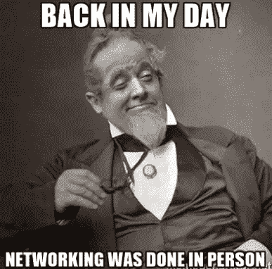

# 进入一个网络人的大脑

> 原文：<https://medium.com/hackernoon/into-the-mind-of-a-networker-b8df6a4b4c61>

作为一个内向的人，我设法以自己的方式建立了人际关系网，这既令人愉快，也为拓展业务带来了价值。那么我该怎么做呢？ ***在文章中读到*** *…*

网络是两种思想的互动和活动。你心态的好坏真的会对你的事业产生影响。扩大你的 [**LinkedIn**](http://linkedin.com/in/jan-lopusek) [网络](https://hackernoon.com/tagged/network)听起来像是一个选择，但是没有什么比亲自见人更有效的了。然而，对于内向的人来说，参加社交聚会通常被认为是一种痛苦，尤其令人沮丧。

你可能已经经历过很多次了。
你要么是一家[初创企业的创始人、业务开发人员，要么是一名销售经理。无论你的职位是什么，你都很有可能需要获得新的联系来拓展你的业务。](https://hackernoon.com/tagged/startup)

我放弃了网络工作者的工作，但老实说，这更像是一个关于我“在网络上”工作的笑话。

> 我讨厌网络。

但是我真的很喜欢认识新的人，当这很自然并且双方都感兴趣的时候。或许更准确地说，我讨厌有目的地交往。我讨厌推销，你的 ICO 的笨拙先令，卖东西，以及任何其他形式的人为自我展示。

然而，作为一个内向的人，我设法以我自己的方式建立了关系网，这既令人愉快，也为拓展业务带来了价值。那么我该怎么做呢？

**快速回答:我会在活动前冥想。**

low picture quality, but high quality experience

在参加活动之前，我遵循几个原则:

*   我想成为 100%真实的自己
*   我想要诚实和冷静
*   我不想预先带任何偏见
*   我不想期待什么
*   我只想进行精彩的对话
*   &我喜欢当事情发生时感到惊讶

今天，我们中的许多人都面临着不断扩大或维持业务的压力。这可能是来自高层的压力，特别是如果你在一个公司或其他等级结构中，带来新的客户和完成 KPI。或者这可能是你内心的压力，也许你的报酬是基于你的结果。或者也许你只是想成功，以证明自己，源于深刻的家庭，社会或文化压力。

不管怎样，摆脱这些诱惑真的很重要。他们只会阻止你变得真实。如果你不真实，很容易进入错误的圈子，进行错误的对话，和错误的人呆在一起。

你只有一次生命，所以好好过吧。

# 那我该怎么做呢？:

**我理清思绪。**

当我为一个事件做准备而冥想时，我想摆脱所有的期望和我脑海中预先绘制的图像——比如:谁会在那里，我应该如何穿着，打扮，举止，如何放下我的开场白，或者让自己进入某个圈子。停下来，放手。我试着关注一些完全不同的东西——活在当下，接受一个人的存在。

## 帮助引导你的意识的小贴士:

# 如果你相信上帝..

…相信她对你有一个计划。她必须知道你，你的原因和你的目的，而所有这些都在她的保护之下。因此，如果你诚实可靠，你就永远不会做错事。自信地参加活动。要么一切都是这样计划的，要么如果你不相信决定论，你至少有一个纯洁的指引。你越真实，你得到的指导就越多，最终的商业结果就越好。

# b)如果你什么都不相信

…你知道宇宙很大，很少事情会发生。这就是生活。这是没有目的的，我们的意识可能只是进化的副产品。因此，我们只是在这片土地上游荡的神奇生物，我们真正拥有的只是当下和我们的存在。没别的了。其他的都不是真的。其他的一切都只是我们的大脑创造的幻觉，错误的预言，或者只是编造的东西。除了纯粹的瞬间，其他一切都是一种内心幻觉，我们的期望，我们的信仰，对未来的想法，过去，或任何随机的想法。没有来自任何东西的压力，除了我们的生物存在。是时候放松一下了。让你自己变得真实，让你天生的魅力找到你喜欢的人。

# 接近事件

一旦我准备好了，平静了，没有了期望，我就能培养出一个好心情。这是自然而然的。当你摆脱了你的担忧，你就会意识到我们都是多么的脆弱，这个事件中的每个人都被相似的想象和担忧所追逐。然后你就可以开始对其他追逐自己尾巴的人产生共鸣和同情。仔细想想，这是个有趣的概念。所以这让我对那里的每个人都感到同情，我摆脱了任何期望和偏见。我只是去看看他们在做什么，他们感觉如何，他们的行为如何。我不做评判。虽然提供一个轻微的微笑，我只是观察。

我接受发生的一切。我保持冷静，经常保持安静，直到我有足够的自信去接近某人。**我们的身体非常聪明。情绪会给你一个非常强烈的信号，如果你觉得你想和某人说话或者不想。**你的直觉会挑选一个很适合你的人，自然会把你带到他/她身边。

因为你会保持冷静，所以你可以选择谈话的强度。你不是在推销什么，你主要是在倾听，真诚地对这个人感兴趣。当你处于倾听模式时，你拥有所有的优势。如果你对一个人的直觉是错误的，你可以在几句话后轻易地退出对话。或者，如果你确信这个人真的适合你，你可以展现你的全部魅力来建立一个有意义的联系。

只有当我觉得谈话是相互愉快的，人们也很放松时，我才可以问他/她是否需要我做些什么来支持他们的业务或在某些方面提供帮助。

保持冷静，倾听。

> 这种方法确实有所不同。