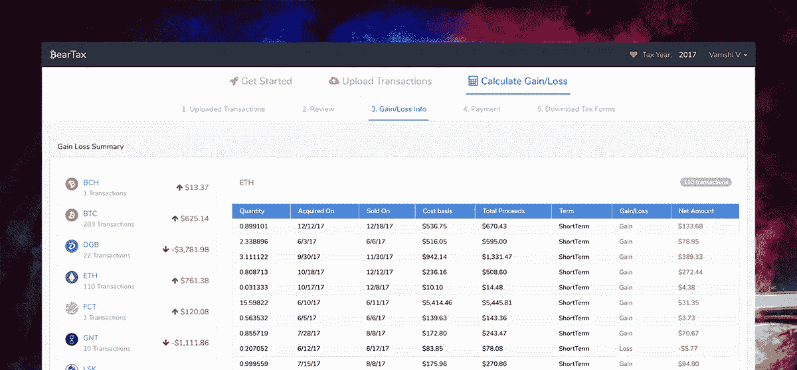

# [到野外]熊税是活的

> 原文：<https://medium.com/hackernoon/into-the-wild-beartax-is-live-c93f1b22e405>

## 计算纳税年度的投资组合业绩并报告收益或损失是一项单调乏味的工作。有了 [BearTax](https://bear.tax) ，您只需三步之遥！连接你的交易所，让熊搅动你的交易，给你盈亏信息，你或你的注册会计师可以用它来报税。

> 我们已经正式把我们的熊放到野外了！
> 
> 耶！！[熊税](https://bear.tax/)上线。

> 我们很高兴地宣布，我们的平台 [BearTax](https://bear.tax/) 已经上线，可以随时处理您的交易，并为您提供 2017 纳税年度最准确的业绩信息。

BearTax 与不同的交易所无缝集成，在交易所之间匹配您的存款和取款，因此您可以避免手动操作的麻烦。

下面是仪表板的快照，您可以通过硬币查看损益信息。一切都是根据你的交易自动计算的。你一定想知道我们是如何得出得失的，是的，我们的数据库中有超过 1000 枚硬币的历史数据，并且每天都在增长。

多说一句，我现在就让你玩 app。来吧，试一试！

 [## BearTax -您的加密税务助理

### 易于使用的平台，密码交易员进口交易，计算收益和文件税。

熊税](https://bear.tax) 

与您的朋友分享一些❤，赚取一些“奖励积分”！

我刚才提到奖励积分了吗？很抱歉这么说，但你必须等待了解推荐奖金以及奖励积分如何兑换一些绿色($$$)。

在推特[上关注贝尔塔什](https://twitter.com/bear_tax)、[脸书](http://facebook.com/beartaxapp)的公告和更新。