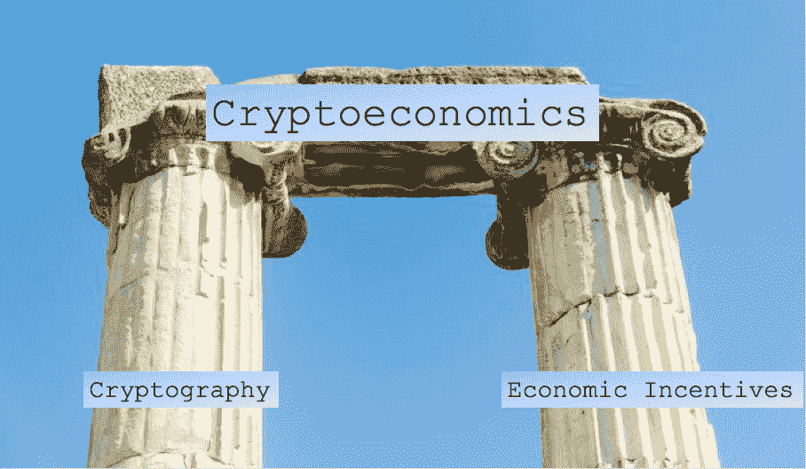

# 密码经济学简介

> 原文：<https://medium.com/hackernoon/intro-to-cryptoeconomics-c984b020d186>

**概要**

1.为什么你应该关心密码经济学
2。用例以及我们为什么需要密码经济学
3。社会契约&密码
4。目标
5。安全型号
6。密码经济学的两大支柱。加密工具:哈希、数字签名
8。经济工具:代币、集体奖励、共识机制。可能的攻击
10。总结
11。进一步阅读

# 为什么你应该关注加密经济学

我们常常想象比特币和其他加密货币像狂野的西部一样:没有规则，没有社会规范，只有贪婪，自私和挖矿。这种法律和秩序的缺失让许多人对秘密世界感到恐惧。然而，在现实中，有*个*规则管理着去中心化的点对点(p2p)网络，比如比特币。这些规则被编码成协议，并为网络参与者之间的交互提供了框架。它们帮助我们创建一个安全、可信和有价值的系统，就像法律为一个更好的社会提供一个框架一样。密码经济学提出了这样一个问题:我们如何设计这些规则和激励机制，以便网络保持安全，并为每个人创造价值。密码经济学使用密码工具、博弈论和经济激励来实现这一目标。

为了理解这些去中心化的 p2p 网络有多复杂和有价值，我们需要理解它们背后的一些基本的密码经济学。如果你对基本的加密经济学有更好的理解，你就会明白为什么加密货币的出现不仅仅是炒作。

## 我为什么要写这个

虽然密码学和经济学都是成熟的学科，但密码经济学是一个新领域。有人可能会说它还不到 10 岁(自比特币诞生以来)。因为这是一个新兴领域，它在不断发展，没有一个坚实的学位可以让你更好地理解密码经济学。我写这篇文章是因为我自己想了解更多关于比特币和其他加密网络的设计过程。有许多很棒的文章甚至在线课程，但是浏览它们并把信息拼凑在一起需要一些时间，所以我为自己和你写了一篇介绍。下面我会链接进一步的阅读推荐。

## 为什么加密经济学如此重要，它有哪些用例，为什么我们甚至需要它？

即使你从未听说过“分散式 p2p 网络”这个术语，你也可能使用过，或者至少在以前的文件共享网站中听说过，比如 Napster 或 BitTorrent。一般来说，它们是人类相互交流和交换价值的系统。价值可以是我们共同认为有价值的任何东西，比如一件物品或一项服务。大多数人可能会认为法定货币是有价值的，因为它被广泛接受，因为我们相信它的稳定性和持久性。如今，甚至像比特币这样的加密货币也在一定程度上扮演了这一角色。

这些系统很像我们的民族国家、政府和民主国家，是通过制定和执行法律来设计的。与我们的民族国家不同，分散式 p2p 网络是通过将代码写入协议来设计的。不像我们的民族国家，我们相信法典而不是政府。

我们如何设计这些协议会影响我们在这些系统中如何相互交流，从而影响我们能够创造和分享多少价值。最终，密码经济学为分散式 p2p 网络中发生的一切奠定了基础。

在设计这些协议时，我们会做出某些假设，并从理论上解释这些协议将如何被使用以及它们可能如何被误用。我们试图使用这些假设来最大化系统对参与者的价值。

# 社会契约和密码

**The Triumph of Death** (Bruegel) illustrates how I imagine the Original State of Nature to be like.

想象一下:我们的社会没有任何规则，每个人都只是做他们想做的事情。我想我们都同意，如果你可以杀人或抢劫而不承担后果，我们的社会就不会运转良好。这就像每天都有*大清洗*。托马斯·霍布斯将这种所谓的原始自然状态下的生活描述为“*孤独、贫穷、肮脏、野蛮和短暂”*，然后继续对[社会契约](https://en.wikipedia.org/wiki/Social_contract)进行理论化。

就像在现实生活中一样，我们希望我们的数字网络能够提供价值和安全性，并帮助我们作为一个集体繁荣发展。所以，一个去中心化的 p2p 网络的最基本的目标不仅是增加价值，而且是安全和长寿。我们希望最大限度地提高我们网络的安全性，就像我们希望在自己的国家做到这一点一样。

在民族国家，国家通过警察和军队对暴力的垄断来保证安全。这种暴力被用来保持安全，从而保持我们的社会对我们的价值(至少在理论上……)。例如，国家通过他们惩罚你的能力来执行法律，这是通过他们对你使用暴力的能力来实现的(例如，给你戴上手铐或监禁你)。因此，作为社会的一部分，你放弃了一些权力，以便为一个更好的社会而努力。你这样做是因为你相信政府和系统确实会提供安全和附加值，而不是独自在森林里。显然，这都是理论上的，因为在现实中，我们大多数人并没有主动决定我们想要生活在一个民族国家，我们生来就是这样。我们也不明确同意放弃我们的权利，我们也不总是相信我们的政府会保护我们。

在加密领域，编程协议在分散的 p2p 网络中执行规则，从而确保价值和安全性。与我们更大的国家相比，分散式 p2p 网络的好处在于:

*   没有人能强迫你参加。
*   没有一个中央权力机构(比如政府)可以滥用他们的垄断权力(想想腐败和不道德的政府做过的可怕的事情，比如种族灭绝、奴隶制、歧视。)
*   没有使用身体暴力让参与者遵守规则。
*   您相信开源代码可以为您提供安全性。

接下来的问题是，什么样的规则和激励有助于创建和维持一个有价值和安全的网络？这正是密码经济学试图回答的问题。

既然我们已经为理解密码经济学为什么重要、为什么它存在以及为什么你应该关心它奠定了基础，那么让我们深入实际的主题。

首先，我们需要理解我们试图通过加密经济学实现的更具体的目标。

# 目标

在很高的层面上，分散式 p2p 数字网络的目标是安全和提供价值。更具体地说:

**我们想要鼓励的事情:**

*   可信执行(您可以相信您的事务将被执行)
*   开放访问(每个人都可以访问和阅读代码，没有什么是锁定的，只有少数特权者可以查看)
*   快速终结(交易快速且不可逆地执行)
*   分散控制(没有控制协议和网络的中央机构)
*   不昂贵(鼓励许多交易)

**我们要避免的事情:**

*   安全故障(例如，有人偷了您的代币)
*   审查制度(例如，有人决定某个群体不应该被允许交易)
*   缓慢终结(与快速终结相反)
*   集中控制(相反的分散控制)
*   昂贵(咄)

**在更深层次上，这些目标可以通过以下方式实现:**

*   收敛(一个块放在另一个块的上面，从而在[区块链](https://hackernoon.com/tagged/blockchain)中保持正确的顺序)
*   数据可用性(开放访问有助于权力下放)
*   有效性(每笔交易都*有效*，有助于避免重复消费)
*   网络对所有人开放，这相当于抵制审查
*   时间戳(帮助我们确定块序列、事务有效性等等)
*   在*几种密码经济安全模式下的高性能*

# 安全模型

最后一点，*密码经济安全模型，*是一个重要的基本概念。这些*安全模型*是分散式 p2p 网络设计的基础。

安全模型是对网络及其参与者状态的假设。它们也带来了更多的技术挑战，这些挑战来自网络的分散性。安全模型可以推测百分之多少的参与者是诚实的或者他们是否单独行动，他们是否可以勾结，或者他们是否可以被贿赂。

我不会对它们做太多的阐述，但这里有一个基本的忽略和进一步的阅读建议。

**拜占庭容错**:如果一个分散式网络在拜占庭将军的问题中描述了几种故障模式(例如，一定比例的参与者不诚实，对系统安全构成威胁)的情况下仍能运行，则该网络具有拜占庭容错。)在[圣乔治·孔斯坦托普洛斯](/@gakonst)文章[这里](/loom-network/understanding-blockchain-fundamentals-part-1-byzantine-fault-tolerance-245f46fe8419)阅读更多关于拜占庭容错的内容。

**不协调选择模型:**不协调选择模型假设参与者独立决策，且小于一定规模。

在不协调选择模型中，我们可以假设一个**诚实多数模型**，其中没有参与者拥有超过 50%的散列能力。当有人获得超过 50%的散列能力时，安全性就会受到损害。这将使他们能够分叉区块链，并包括错误的交易。(这个 50%在现实中更加细致入微。诚实多数模型是一个非常乐观的假设，因此在面对现实世界的困难时并不具有很强的弹性。

更现实的是，已经证明，如果一个攻击者只拥有略多于 1/3 的哈希能力，比特币区块链的安全性就会受到损害。(在艾敏·冈·西勒的[康乃尔论文](https://www.cs.cornell.edu/~ie53/publications/btcProcFC.pdf)中了解更多信息。)

总的来说，假设根本不存在共谋，并且可以通过共谋来损害安全性，这是越来越不现实的。

**协调选择模型:**不协调选择模型的对立面。它假设大多数或所有行为者都通过某个代理人或联盟进行勾结。

**贿赂攻击者模型:**贿赂攻击者模型假设网络参与者之间没有协作。他们接受贿赂，单独做出决定，最终危及整个网络的安全。维塔利克·布特林在大约 20 分 24 秒的视频[中对此做了进一步解释。](https://youtu.be/pKqdjaH1dRo?t=20m24s)

可以想象，这些模型是我们网络设计背后的基本假设。如果你假设一个诚实的多数模型，你不需要像假设一个协调选择模型或贿赂攻击者模型那样考虑那么多的因素和可能的攻击。我认为，随着时间的推移，我们会开发出越来越多的这种产品。

**密码经济学的两大支柱**

如上所述，加密经济学分为两大支柱:

1.  密码术:保证信息安全的技术
2.  经济激励:鼓励你为网络增值的规则和奖励

# 加密工具

如上所述，加密[工具](https://hackernoon.com/tagged/tools)是保持消息安全和不可改变的技术。它们是比特币和其他区块链的重要组成部分，因此也是加密经济学的重要组成部分。一些最基本的密码工具(称为*密码原语*)是哈希函数和数字签名。我将展示这两个密码原语的基础知识，因为它们对区块链来说非常重要。

## 哈希函数

哈希函数是一个接受任意大小的输入并给出固定大小的输出的函数。比特币使用哈希函数 SHA-256，这是由美国国家安全局在 Merkle-Damgard 函数的基础上设计的。

它满足三个重要的品质:

*   **1。抗冲突性:**如果很难找到两个不同的输入散列到同一个输出，那么散列函数就是抗冲突的。也就是说，我们希望避免这种情况:H(x) = H(y)而 x≠ y.
    在没有冲突抵抗的情况下，如果攻击者能够产生相同的散列 H(a) = H(b)，那么他可能能够用一个假消息“b”来替换一个原始消息“a”。
*   **2。隐藏**:如果没有可行的方法来推导 H(x)中的原始输入 x，那么散列函数就是隐藏的。问题是，如果输入来自一个非常小的范围，例如，它是两个可能值中的一个，有人可能只是散列这两个可能值，并很容易猜出原始输入 x 是什么。因此，如果我们可以通过将输入 x 与来自一个很大范围的另一个输入连接起来来隐藏它，那么找出 x 是不可行的，H (r||x)隐藏在其中，r 是一个随机值。
*   **3。迷惑友好:**如果我们知道输入的随机部分，并且知道散列 H(x)，那么散列函数是迷惑友好的，但是很难找到输入的其余部分。我们必须随机尝试每一种可能性来找到输入的其余部分。这种属性对于比特币的开采是必要的——矿工试图解决密码难题，以决定下一个区块。

想要了解更多关于散列函数的信息，你可以阅读一篇由苏撰写的简单易懂的博客文章。

Notice how the smallest difference in the input string generates a completely different hash?

## 数字签名

数字签名模仿模拟手写签名。签名将我们的身份与信息绑定在一起(例如，它表明确实是我，Anami Nguyen，给你开了一张支票)。数字签名在分布式 p2p 网络中实际上具有相同的功能。它帮助我们识别某些消息(事务)确实来自某个身份。数字签名满足这三个要求:

1)只有*你*可以签名。
(现实生活类比:当我以某种方式写下自己的名字时，我希望没有人能以同样的方式写下。)

2) *任何人*都可以验证你的签名。
(现实生活中的类比:一个随机的银行职员应该能够验证签名确实来自 Anami Nguyen。如果他们不能这样做，那么签名实际上是无用的。)

3)签名与特定文档相关联。
(现实生活类比:我的签名不能从我写好并粘贴到另一个文档的支票上切掉。)

**数字签名由三种算法组成:**

***1。(sk，PK):= generate keys(keysize)*** *generate keys*方法取一个密钥大小，生成一个密钥对:
- sk 是你私下保存的用来签署消息的秘密密钥。
- pk 是用于验证任何人签名的公钥。
应用:公钥就是你的公共身份(或者，你在比特币中的*地址*)。要想有人以身份 *pk* 的名义发言，必须知道对应的密钥，sk。这很像用户名和密码。这样我们就避免了有人冒用他人的身份并代表他们发送消息(和进行交易)。

**②*。sig := sign( sk，message)***
*sign*方法将一条消息和一个密钥 sk 作为其输入。然后在 sk 下输出消息的签名。
应用:如上所述，你的签名应该只对某个文件有效。*符号*方法确保了这一点。

***3。isValid := verify( pk，message，SIG)***
*verify*方法将一个*消息*、一个*签名*和一个公钥 *pk* 作为其输入。它返回一个布尔值(真/假值)， *isValid* ，如果 *sig* 是公钥 *pk* 下消息的有效签名，则为真，否则为假。
应用:该方法结合了上述成分。任何人都应该能够验证某个消息(例如交易)是否确实由您的公钥签名。

因此，一个有效的签名必须表明:
*verify(pk，message，sig(sk，message))== true*

关于哈希函数和数字签名的更多细节，请查看普林斯顿的《比特币》一书的第一章。还有其他的加密工具可以帮助我们保证区块链的安全，但是它们超出了本文的范围。如果你想学习更多关于密码学的知识，斯坦福大学有一个免费的在线课程密码学 I。

# 经济工具

现在，我们已经了解了一些基本的加密工具，让我们进入加密经济学的第二部分。经济工具是在网络参与者中鼓励和阻止某些行为的激励。

最基本的经济工具是使用代币和共识机制。

## 代币

令牌是分散式 p2p 网络中可交换的商品。加密领域最著名的代币是比特币。

除了比特币，代币还可以兑换各种商品和服务。例如，你可以通过[假人网络](https://golem.network/)出租多余的 CPU/GPU 周期，并通过 GNT(假人网络令牌)获得报酬。令牌的存在在网络参与者之间创造了共享的价值，这使得分散的 p2p 网络更像是独立的经济或生态系统。

现在让我们来看看在比特币网络中，代币是如何被用来激励理想行为的。

## 阻止奖励

假设你是一个节点，创建了一个新的区块，包含在比特币区块链中。你的工作得到了回报，你被允许包含一个特殊的交易( *coinbase* 交易)。该交易允许您向自己的地址发送*奖励*。目前(2018 年 6 月)矿工获得 12.5 比特币的块奖励。(格挡奖励以设定的速率递减，你可以在这里探索[。稍后我可能会写更多关于通货紧缩/通货膨胀的文章，敬请关注！)](https://www.bitcoinblockhalf.com/)

只有当新的块被网络的其余部分接受时，你才能获得回报。其他节点通过在它们创建的下一个块中包含新块的散列来表示接受。这激励他们只包括具有有效事务的块。因为你相信如果你包括错误的交易，他们不会接受你的新交易，如果你想得到交易奖励，你会被激励只包括有效的交易。

## 交易费用

正如我上面提到的，创建新块的块奖励以固定的速率减少，这意味着比特币的数量是有限的。但是，如果参与者不能通过挖掘新的比特币获得回报，是什么激励他们继续建设比特币区块链并执行交易呢？很简单:他们从每笔交易中收取交易费。

交易费也不利于参与者通过向自己的账户发送交易来降低网络速度。

## 共识机制

分散式 p2p 网络的参与者需要就网络的状态以及区块链上应该包括哪些区块和交易达成一致——他们需要达成共识。我们需要一种机制来帮助消除因权力下放和可能存在的对手而产生的问题。

共识机制是区块链之上的协议，它将每个节点提出的块作为输入，并选择一个*有效的*块作为输出。

我们来看看比特币的**工作证明**共识机制。简而言之，矿商必须花费大量的计算能力来证明他们“参与其中”，然后他们才被允许提出新的区块。他们通过解决基于我前面提到的哈希函数的属性的哈希难题来扩展这种计算能力。我不打算深入这些哈希难题的技术细节，但你可以在[普林斯顿比特币书籍](https://d28rh4a8wq0iu5.cloudfront.net/bitcointech/readings/princeton_bitcoin_book.pdf)的第 64-67 页上阅读更多内容。从加密经济学的角度来看，值得注意的是，矿商必须花费法定货币来购买计算能力(如今以高度专业化和高性能 ASIC 芯片的形式)。因此，他们花费了大量资源，如果他们的区块不被列入区块链，他们就会失去这些资源。

另一个流行的共识机制是**利益证明**。一般来说，这种共识机制的工作原理是让一组验证者轮流对下一个区块进行提议和投票，每个验证者的投票权重取决于他们的赌注存款的大小。如果区块不包括在区块链中，他们将失去他们的股份，因此他们有动机对只包括有效交易的区块进行投票。如果你想了解更多关于利害关系证明的内容，我建议你仔细阅读 Vlad Zamfir 和 Vitalik Buterin 的著作，他们是以太坊 PoS(目前在 PoW 上运行)的倡导者。

# 对网络的可能攻击

什么是攻击？当有人通过试图包含错误交易(例如，重复消费交易)来威胁区块链的安全性、可信度和价值时，就会发生对区块链的攻击。或者，有人可能出于纯粹的恶意或政治原因试图攻击区块链。我将简要概述对比特币区块链的一些假想攻击。

## 51%的攻击(诚实多数水平)

允许重复花费或错误交易的最直接的方法之一是分叉区块链，然后包括或排除某些交易。为此，节点必须接受包含错误事务的新块，并在其上构建。分叉的链必须通过增长得更快和变得更长来超越当前的链，因为节点通常会在最长的区块链之上放置新的块。如果某人拥有多数(超过 50%)的哈希能力，就会发生这种攻击。我们假设比特币区块链是安全的，因为我们假设了一个诚实多数模型，其中超过 50%的参与者是诚实的。这是对比特币区块链最著名的理论攻击。现实中有很多细微差别需要考虑。首先，即使攻击者只有不到 50%的散列能力，攻击也可能成功。

理论上，纯粹为了经济利益的攻击者应该被阻止执行 51%的攻击，因为网络价值(比特币/菲亚特汇率)会在攻击后立即崩溃。攻击者基本上会搬起石头砸自己的脚。然而，有人可能出于意识形态或政治原因摧毁比特币区块链。或者，他们可以做空比特币，然后发动攻击，从比特币崩盘中获利。还有许多其他因素需要考虑和分析…不幸的是，它们超出了本文的范围。

## p+ε攻击

事实是，拥有比特币的人不应该希望区块链受到攻击，因为这会伤害他们。然而，如果每个人都按照自己的自私动机行事并接受贿赂，就会发生典型的公地悲剧，最终导致所有网络参与者的长期损失。悲剧在于，没有人*希望*损害网络，但它还是发生了。

在 P+ε攻击中，有人可以免费贿赂网络参与者。假设每个人都需要投票决定 2+2=4 是否为真，那么他们会选择是或否。当然，诚实的投票是肯定的。如果你像大多数参与者一样投票，你会得到奖励 p。如果你的投票是少数，你会得到 0。每个人都认为对方会投赞成票，因此每个人都会投赞成票。我们正在经历一个所谓的[纳什均衡](https://www.investopedia.com/terms/n/nash-equilibrium.asp)，在这个均衡中，每个人都得到自己想要的。

然而，假设一个攻击者想要你投反对票。你这样做是愚蠢的，因为其他人都会投赞成票，所以你的投票将是少数，你不会获得奖励 P。但是，攻击者可信地承诺(例如通过以太坊合同)如果你投反对票*和*如果你是少数，攻击者将支付你价值 P+ε(原始奖励加上一点额外奖励)的奖励。突然，投反对票对你最有利:如果你是多数派，你会赢得 P，如果你是少数派，你会赢得 P+ε。另一方面，如果你投赞成票，只有当你是多数派时你才会赢，但如果你是少数派，你就会输。现在，因为贿赂，每个人都会投反对票。突然，反对票的人占了大多数，攻击者甚至不用付钱给任何反对票的人，因为他们占了大多数。

在维护区块链的分散式 p2p 网络中，投票涉及是否包含错误交易。参与者不应该希望包含错误的交易或重复消费，但可能会被贿赂这样做。

你可以在 Vitalik Buterin 的博客文章[中找到一些减轻这种风险的可能方法。](https://blog.ethereum.org/2015/01/28/p-epsilon-attack/)

或许您已经注意到，我所描述的大多数问题都可能是技术性和/或经济性的。由理性的人类贪婪引起的问题(例如，公地悲剧)可以用密码学来解决。拜占庭容错是一个技术问题，可以通过经济激励来解决。我发现技术和经济的交叉尤其具有挑战性和吸引力。

# 摘要

我们已经了解到密码经济学是分散的 p2p 网络的中枢。密码经济学将密码学与经济激励相结合，以保持网络安全并激励参与。我们已经了解到，在设计加密网络时，我们会对世界现状做出一些假设，这些假设被称为安全模型(例如，不协调选择模型、诚实多数模型等)。一些最基本的加密概念是哈希函数和数字签名，它们有助于防止其他函数中的安全攻击。在经济激励方面，我们可以使用令牌和共识机制(如工作证明)来保护网络，并激励参与者为网络做出贡献，例如通过在计算能力上花费美元来挖掘比特币。有很多攻击分散的 p2p 网络的可能性，比如 51%攻击和 P+ε攻击。作为密码社区中一个新的基本上非学术的领域，密码经济学正在不断发展，并且依赖于密码社区中每个人的理论和解决问题的技能。密码学和经济激励的结合使得分散的 p2p 网络安全、有价值且值得信赖。

## 等等。有更多的东西要阅读和学习…

*   Vitalik Buterin 关于密码经济学的 [1hr 演讲](https://www.youtube.com/watch?v=pKqdjaH1dRo)进一步讨论了我在这里没有提到的密码经济学。
*   普林斯顿的 [300 页比特币书](https://d28rh4a8wq0iu5.cloudfront.net/bitcointech/readings/princeton_bitcoin_book.pdf?)
*   未被束缚: [1hr 播客](http://unchained.forbes.libsynpro.com/all-things-cryptoeconomics-pt-1-with-olaf-carlson-wee-and-ryan-zurrer-of-polychain-capital)关于奥拉夫·卡尔森·威和瑞安·祖瑞尔的密码经济学
*   本文例 2、例 3 关于密码经济学
*   弗拉德·扎姆菲尔的“卡斯帕历史”[系列文章](/@Vlad_Zamfir)——卡斯帕是一种 PoS 共识机制，目前正在进行中
*   我错过了其他精彩的进一步阅读吗？让我知道！

> 非常感谢[雅各布·埃利奥索夫](https://twitter.com/JaEsf)、特里斯坦·奈特&伊戈尔·克劳祖克的反馈！
> 
> 如果你的加密创业或投资团队正在寻找在金融和创业方面有激情、动力和经验的人，请发电子邮件到 gmail 的 anami.nguyen。让我们在 LinkedIn 上联系吧(请说明你联系的原因。)