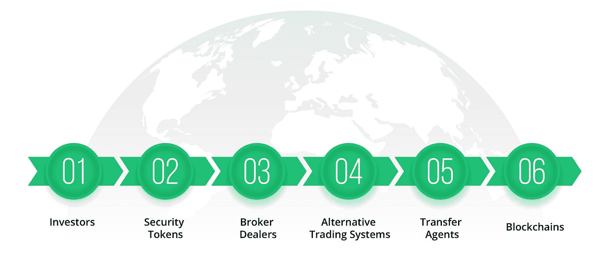

# 介绍数字股票证书的新标准:ERC-1450

> 原文：<https://medium.com/hackernoon/introducing-a-new-standard-for-digital-stock-certificates-erc-1450-c7ec917258c>

现在很明显，区块链技术带来的最重要的革命之一将是世界的数字化:将资产转化为代表价值数万亿美元的证券和房地产所有权的令牌。然而，为了使这种转变成为可能，需要将分散的应用和监管结合起来。为什么要监管？

事实证明，当你将资产分割成小块并出售给投资者时，资产的这些小块马上就变成了证券。证券受到证券交易委员会(SEC)和 50 个州政府的高度监管。进行证券交易要求中间人是经纪人。

在过去几年中，随着 2012 年《就业法案》的签署，美国企业获得了巨大的胜利。有了这一法案，普通投资者现在可以购买创业公司的股票，向更多的人开放了私人证券市场，而不仅仅是少数富有的合格投资者。

将就业法案与令牌化结合起来，现在有机会彻底改革证券市场。

StartEngine 已经撰写了一份白皮书来解释生态系统如何发行和交易安全令牌。

## ERC-1450:令牌化证券的诞生

宣布 [ERC-1450](https://github.com/ethereum/EIPs/pull/1450) ，这个新的开放标准第一次将分散和不信任的区块链与规则世界合并。您可以将 ERC-1450 视为创建数字股票证书的标准。

## 它是如何工作的？

通过以太坊区块链，智能合约可以在分散的同时拥有可信来源。ERC-1450 使用注册转让代理作为维护和更新证券所有权的来源，同时允许区块链公开显示所有令牌化证券的所有权。所有权的转让可以在买方或卖方之间直接进行，或者通过 SEC 注册的经纪交易商进行(第二种选择更常见)。

## 什么是注册过户代理？

这是一家在美国证券交易委员会(SEC)注册的公司，被证券发行人聘请为记录保管人。例如，当一家公司使用监管 A+、监管 D 或监管众筹发行股票时，每个股东的记录由该公司保存或委托给注册转让代理人。

转让代理人负责保存每个股东的记录，同时也代表公司记录买卖双方之间的所有权转让。简而言之，过户代理不是券商，也不是交易平台；它只是记录保持者。为了使 ERC-1450 符合证券法规，ERC-1450 发行的每一个代币都有一个股东详细信息的记录，由过户代理人保存。

第一个与 ERC-1450 兼容的 SEC 注册转账代理是 StartEngine Secure，由 StartEngine Secure LLC 所有，StartEngine Crowdfunding Inc .的全资子公司。

## 什么是经纪自营商？

它是一家在 SEC 注册的公司，也是 FINRA 的成员，FINRA 是经纪自营商的主要监管机构。在向投资者出售证券时，为了遵守法律，有数以千计的规则必须遵守。这些规则中的大部分是在 1934 年制定的，当时国会投票通过了 1934 年证券法，证券交易委员会成立了。

## 什么是另类交易系统？

这是一项相对较新的法规，旨在帮助消除纳斯达克和纽约证券交易所等全国性市场对证券交易的垄断。替代交易系统(ATS)允许买卖双方在主要交易所之外进行国内市场证券交易。ATS 是经纪交易商的一部分，由 FINRA 监管，不像交易所那样实行自我监管。

## 公司如何发行令牌化证券？

转让代理人从公司或代表公司发行或完成交易的经纪交易商处接收新股东名单及其个人信息和股份持有情况。转帐代理将它们记录在它的安全数据库中，然后执行 ERC-1450 代码来为发行者建立新的智能合同。每一类证券都有一份智能合约，代表股东名单及其持股情况。新投资者收到的以太坊地址包含了他们所有的证券，因为 ERC-1450 是 ERC-20 的衍生产品，任何钱包或冷钱包设备都可以显示它们。

## 一个股东如何向另一个投资者出售股份？

这是由经营自动交易系统的经纪自营商来完成的，该系统允许买卖双方见面并进行交易。如果卖方想要过账股票，ATS 将向转让代理发送消息，询问股票是否可供交易。如果过户代理人同意，那么 ATS 将对股票进行临时冻结，以避免双重出售。

当在 ATS 上匹配到买家时，经纪自营商将完成交易，并将交易细节发送给转账代理进行记录。然后，转移代理将更新安全数据库中的卖方和买方记录，然后执行发行者的 ERC-1450 智能合同，以将代币从卖方转移到买方。如果没有匹配，那么 ATS 将删除它之前放置在共享上的块。

## 如果投资者被黑客攻击或丢失了私钥，会发生什么？

投资者只需向转账代理发送一份经过公证的损失宣誓书。转账代理将取消被黑客攻击或丢失的代币，并发行新的代币。投资者和他们的投资现在又完整了。这一点至关重要，因为正常发行的证券不会丢失或无法获得。这些是拥有者的真实资产。你不能只是“失去”证券。

## ERC-1450 被采用了吗？

StartEngine 是 ERC-1450 的开发者，并使用它来发行数万只最初在 StartEngine 上出售的令牌化证券。如果 StartEngine 的经纪交易商在美国证券交易委员会注册，并且其 ATS(称为 Secondary)可用，它也将使用 ERC-1450 进行证券交易。StartEngine 正在与其他注册转运代理和 ATS 运营商讨论，以支持该标准。

## 以太坊的可扩展性是个问题吗？

不，因为 ERC-1450 不使用以太坊来匹配买家和卖家，也不使用它来完成交易。ERC-1450 仅在交易完成后使用以太坊区块链展示数字化证券。这允许令牌化证券以非常高的速度进行交易，同时以较慢的速度记录令牌化证券，而不损害交易。速度对于最佳执行和向投资者提供最佳价格至关重要。

## 谁使用 ERC-1450？

到目前为止，我们已经向所有 3，500 名 StartEngine 股东发放了 ERC-1450 令牌，还有 165 家符合条件的公司使用 StartEngine Secure，预计将在 ERC-1450 智能合约中上市。

StartEngine 是一个领先的股权众筹平台，已经帮助 250 多家公司筹集了超过 8000 万美元。我们目前也在筹集资金。加入已经投资我们的近 3500 名 StartEngine 所有者。 [*这里投资 start engine*](https://www.startengine.com/own?utm_source=Medium)*。*

*欲了解更多信息，请查看我们的* [*发行通告*](https://www.sec.gov/Archives/edgar/data/1661779/000114420419013344/tv515967_253g2.htm) *。*