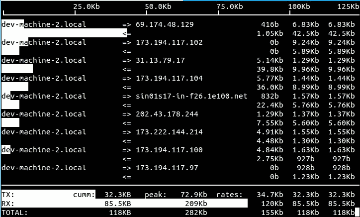

# iftop 的 RESTful API

> 原文：<https://medium.com/hackernoon/introducing-a-rest-api-to-iftop-542545ff73bc>

如果您曾经在 Linux 上使用过 [iftop](http://www.ex-parrot.com/pdw/iftop/) 或[任何其他](http://www.binarytides.com/linux-commands-monitor-network/)[可用网络监控工具，那么您至少会对通过它们可以查看/总结的详细信息留下一点印象。](https://blog.serverdensity.com/80-linux-monitoring-tools-know/)

这些工具大多使用 [libpcap](http://www.tcpdump.org/) 来实时检查数据包，并汇总/存储它们的详细信息；现在问题来了:如果我想用 webservice API 来读取这些信息呢？

# iftop 微服务

事实证明，这是一个小型 iftop 微服务的完美用例。使用这个 API，我们可以根据 IP 地址、协议类型和发送/接收的字节数来检索网络使用统计数据。

我继续向 iftop 添加了一个最小的 RESTful API 这是对`/iftop/history`的调用的(经过美化的)输出:

很好，不是吗？还有一个用于`/iftop/version`的方法允许读取当前版本。

您可以使用以下命令运行它:

`iftop -S 8080`

默认情况下，它会将 root 权限授予用户`nobody`和组`nogroup`(可配置)。

启用 web 服务将禁用 curses 或基于文本的输出，iftop 日志记录输出(关于标准错误)将变得更类似于 web 服务:

您可以从以下网址获得我的 iftop 补丁的最新版本:

 [## gdm85/iftop

### 带有 webservice API 补丁的当前 iftop git 存储库的镜像](https://github.com/gdm85/iftop) 

# 上游

事后看来，我很高兴选择 iftop，因为代码注释非常有趣。我的[最佳选择](https://github.com/gdm85/iftop/blob/949ed0f7e2c54c598868c270b82c2d702131a339/stringmap.c#L5):

`Also, I haven't implemented removal of items from the tree. So sue me.`

补丁已经上传了，但是我还没有收到维护者的任何回复。我对它们被接受不抱太大希望，但是不管怎样，你已经可以通过克隆 [GitHub 库](https://github.com/gdm85/iftop)和构建 iftop 来使用它们和 webservice API 特性了。