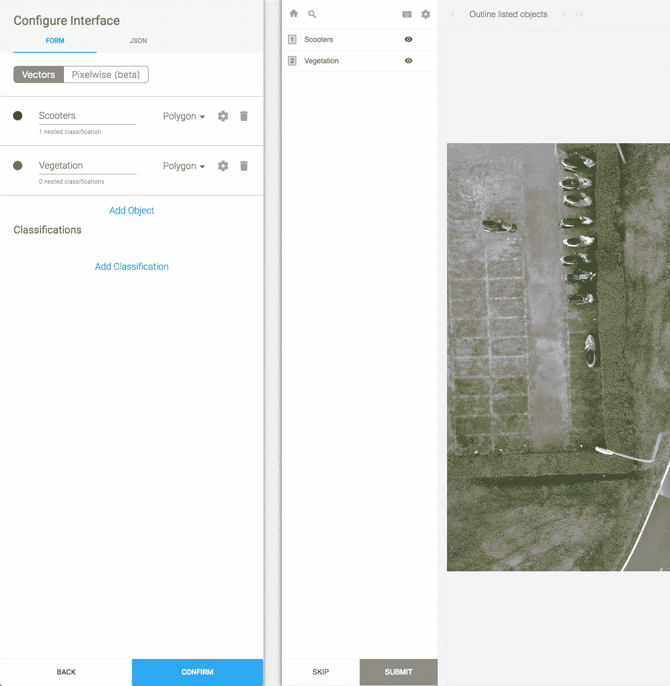
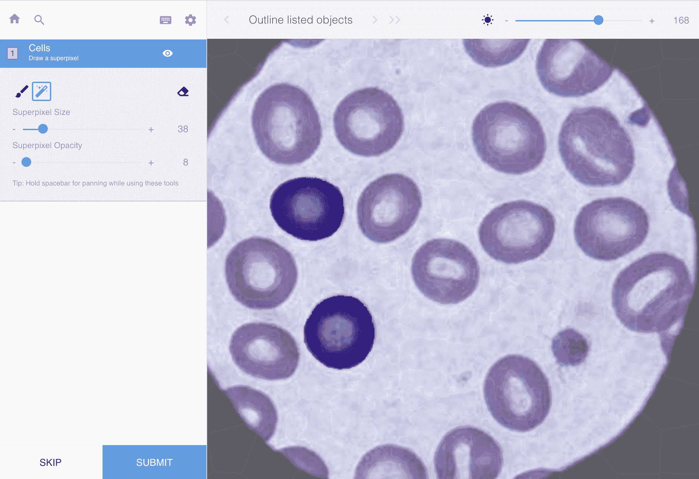
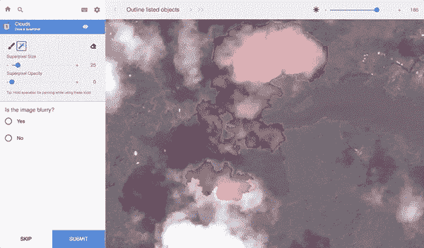
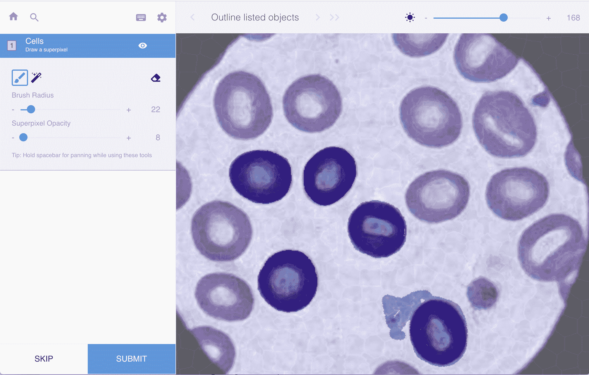
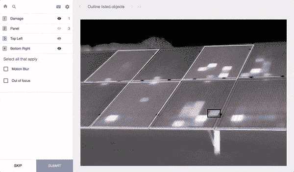

# 介绍适用于计算机视觉应用的一流图像注释工具

> 原文：<https://medium.com/hackernoon/introducing-best-in-class-image-annotation-tool-for-computer-vision-applications-276116cfc500>

九月份为 Labelbox 带来了许多新功能和更新。但最值得注意的是，图像注释界面进行了大规模升级。

## **快速&直观的界面配置**

我们为您添加了一种更简单的方式来定制图像标签界面。介绍基于表单的界面配置工具。有了这个新的界面配置器，您可以使用所有可用的分段和分类工具，使用直观的 web 表单而不是编码 JSON，轻松设置您的标签任务。还是更喜欢 JSON？通过将配置屏幕从顶部的“表单”切换到“JSON ”,就可以使用它。

## **以像素级精度标注图像**

有时你需要像素完美的注释。Labelbox 现在提供了先进的基于像素的注释工具，包括速度极快的(和浏览器端！)超像素工具。还提供免费的画笔和橡皮擦工具。使用 Labelbox 同类最佳的像素式注释工具包，增强您的注释团队的能力。

**笔刷**
一个像素精确的笔刷工具也可以使用。它的机制与当今创意软件中的大多数数字画笔工具是一致的。笔刷工具通常用于在使用超像素工具后进行最后的润色。

**超像素**
对于许多像素级注释任务，目标是标记同质的像素分组。这方面的一个例子是在卫星图像中探测云。对于这些任务，超像素工具通常是非常有效的注记方法。超像素是像素的计算分组，在 Labelbox 的情况下是在浏览器中计算的，因此您可以在您的私人数据上无缝地使用该工具。为了获得 superpixel 的最佳性能，我们建议使用 Google Chrome 浏览器。

**橡皮擦**

## 边界框、多边形、线、点和嵌套分类

# Labelbox 入门

访问[www.labelbox.com](http://labelbox.com)免费探索 Labelbox，或者[与我们的团队成员之一](http://labelbox.com/enterprise)谈论适合您业务的企业解决方案。