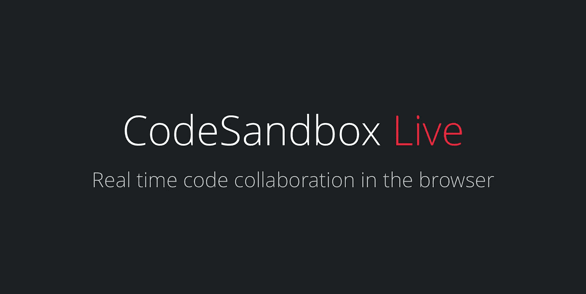
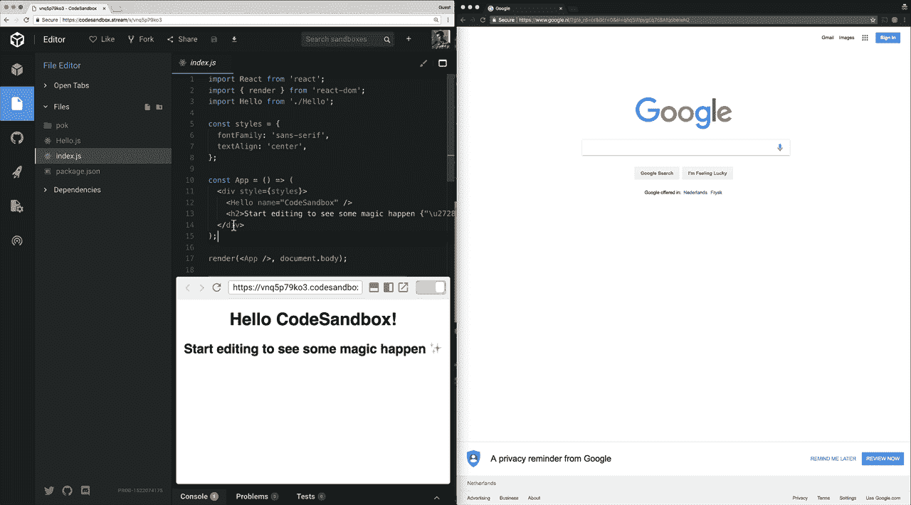
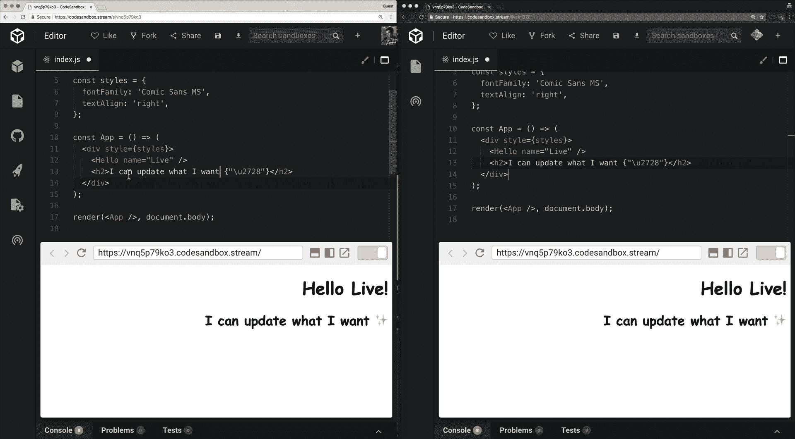
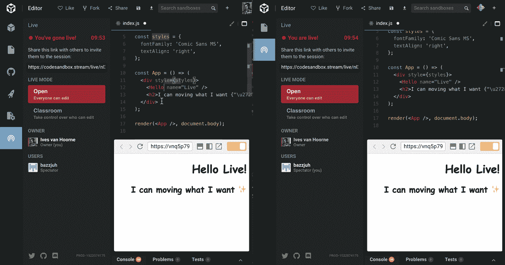

# CodeSandbox Live 简介—浏览器中的实时代码协作

> 原文：<https://medium.com/hackernoon/introducing-codesandbox-live-real-time-code-collaboration-in-the-browser-6d508cfc70c9>

我开始 [CodeSandbox](https://codesandbox.io) 的目标是让网络应用程序的共享和协作变得更容易、更容易。如今，它被用于文档、工作面试、原型制作、故障排除、错误报告、研讨会等等。

今天，我们想宣布一个改进所有现有用例的功能，而且将进一步改进协作，并允许使用 CodeSandbox 的新方法。叫 CodeSandbox Live(原名！).

你可以在这里看到 CodeSandbox 的介绍视频:

## 实时协作

从现在开始，你可以打开你的沙箱进行实时协作。点击“上线”按钮，您将获得一个可以与其他人共享的 URL。然后，他们可以加入您的会话，并与您在同一个沙盒中进行无缝协作。他们将能够创建文件、删除文件、移动文件、编写代码，等等。您将看到他们的光标、选择和他们正在查看的文件，同时仍然保留您自己的编辑器功能，如 Intellisense。

每个人都可以同时在同一个文档中更改代码，或者选择编辑其他文件。我们根据其他人的输入动态更新选择、光标和代码，使用[操作转换](https://en.wikipedia.org/wiki/Operational_transformation)来解决任何潜在的冲突。

## 选择可以编辑的人

CodeSandbox Live 有两种模式:'*开放模式'*和' *课堂模式*'。默认模式是开放模式，允许所有人编辑。课堂模式允许您选择谁可以编辑。这对于 30 个学生可以看着同一个沙盒的讲座和研讨会特别有用。您将只能看到可以编辑的人(即“编辑者”)的光标和选择。

## 随时开叉

如果有人想继续使用他们自己版本的沙盒，他们可以随时按下“Fork”键。如果他们愿意，以后可以再次加入会话。

## 它处于测试阶段

事实证明，这类特性很难由你自己或与朋友一起测试😅。我测试了很长时间，没有发现错误，但我们可能错过了一些东西。这就是为什么我们要暂时将它标记为测试版。如果您发现任何问题，您可以在我们的 [GitHub 资源库](https://github.com/CompuIves/codesandbox-client)上提出问题。为了测试负载，我们将该功能标记为仅顾客使用:只有当你是[顾客](https://codesandbox.io/patron)时才能创建一个直播间，每个人都可以加入创建的房间。

## 测试会话

对于有多少用户可以连接到一个实时会话没有限制，但是我们还没有测试更大的人群。在接下来的几周里，我将在我的 Twitter 上分享现场测试会议和视频流，鼓励每个人都加入进来！

## 它是如何工作的

我真的很满意这个系统的实施。在前端，我们使用了部分 [ot.js](https://github.com/Operational-Transformation/ot.js) 。在后端，我们有 Elixir (Phoenix)服务器，它与 [ot_ex](https://github.com/jclem/ot_ex) 一起运行一个定制的 OT 实现。每个直播间都是一个独立的 Elixir 进程，所有状态都存储在 Redis 中，以允许临时服务器断开连接或滚动更新。我会**肯定**写一个关于这个的更详细的帖子。有一些非常有趣的挑战，还有许多比赛条件。这是迄今为止最有趣的功能之一。

这一特性的构建和测试非常成功。我希望你在使用 CodeSandbox Live 时会像我测试它时一样开心！请在 [CodeSandbox Twitter](https://twitter.com/codesandboxapp) 或 [my Twitter](https://twitter.com/CompuIves) 上告诉我们您的想法。

## 我们是开源的

如果您对前端的源代码感兴趣，可以在这里找到:

 [## 强制/代码沙盒-客户端

### codesandbox-client -一个为 web 应用程序开发定制的在线代码编辑器🏖️

github.com](https://github.com/CompuIves/codesandbox-client) 

我们最近还为希望支持我们开源工作的公司开放了一个[开放集体](https://opencollective.com/codesandbox)。