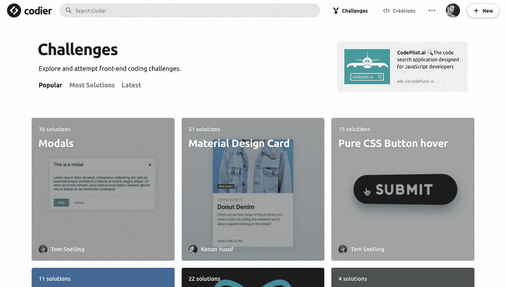
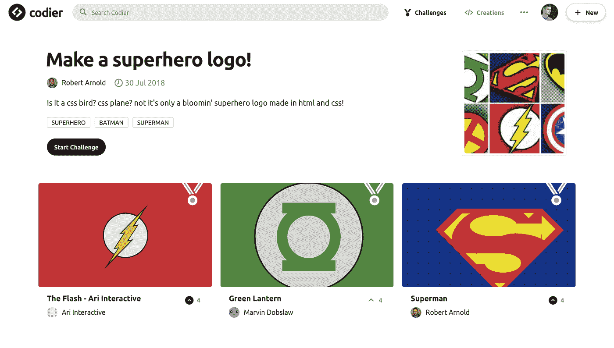
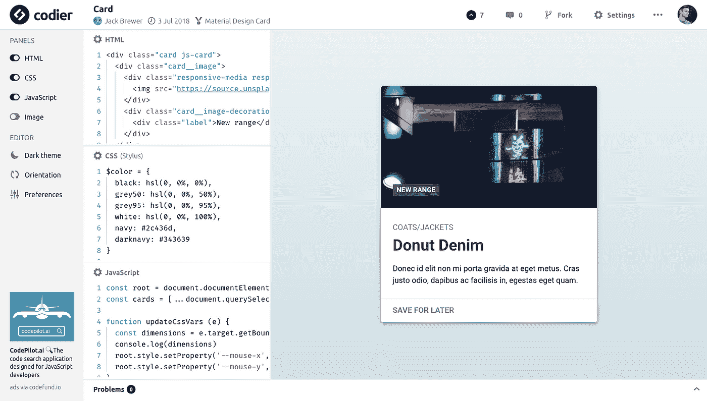
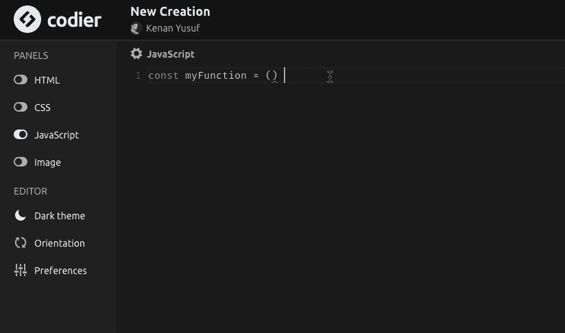
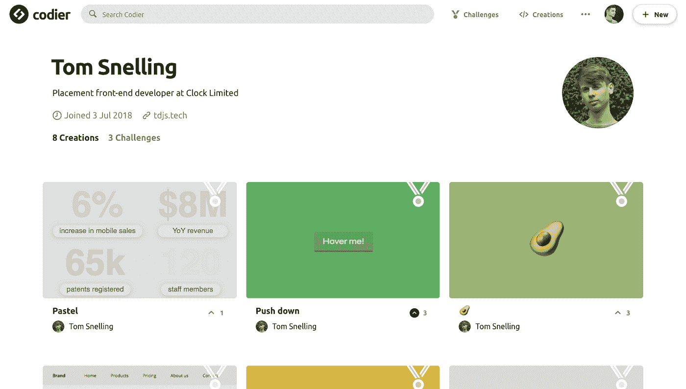

# 介绍 Codier——前端编码挑战和创造

> 原文：<https://medium.com/hackernoon/introducing-codier-front-end-coding-challenges-and-creations-1ea5df79dd36>

大约两年前，我开始了数字设计学位的最后一年，必须为我的论文/主要项目提出一个想法。当时，我有一年的前端开发经验，我最大的爱好之一就是编码。

我花了很多时间在 CodePen 这样的网站上，创作钢笔，偶尔在我的个人网站上用它们作为博客素材。我创作更多内容的唯一障碍是我无法想出构建内容的主意。

分散在互联网上的是编码挑战，通常只是由知名开发人员发布在 Twitter 上——发现这些挑战给了我一个想法，即创建一个平台，前端开发人员可以从中获得构建东西的灵感，并与社区分享他们的代码创作。

[对 Codier 的挑战](https://codier.io)

我开始把 Codier 作为一个大学项目来开发，一旦我开始向外界展示这个环境，我清楚地意识到人们对这个想法有着真正的兴趣。毕业后不久，我开始和我的雇主 [Clock](https://clock.co.uk) 讨论如何帮助我实现 Codier。

时钟同意帮助支持我的边项目财政(托管等)。)通过他们，我成功说服了两位令人难以置信的软件工程师 Bala Clark 和 Jack Burgess 帮助重建 Codier。他们会在幕后处理所有的事情，而我会做设计和前端。重建是必要的，因为我在大学建造的更多的是原型，不适合使用。

我们一起把这个想法缩小到今天的 Codier:

*   挑战:用户提交的编码挑战。
*   创建:用户提交的代码创建。
*   个人资料:包含用户所有挑战和创造的页面。

# 挑战

Codier 上的挑战可以是挑战者想要的任何东西；如果是纯 CSS 复选框挑战，创建挑战的用户可以在挑战规则中指定。他们还可以添加一个模板来帮助创建者入门——模板可以是挑战的基本 HTML 结构，甚至只是 React 这样的框架。

'制作一个超级英雄标志！'挑战编码器

一旦发布了挑战，任何注册用户都可以发布解决方案。挑战的解决方案直接列在挑战的标题和描述下。解决方案是通过 [Codier 的编辑器](https://codier.io/creation)创建的，可以根据用户的感觉简单或复杂。

# 创作

Codier 上的创作可以在编辑器中通过 HTML、CSS 和 JavaScript 的组合来构建。用户也可以使用预处理器来编写他们的作品，甚至包括外部资源。

[材料设计卡挑战的解决方案](https://codier.io/creation/ry5QybKf7)

编辑器的设计让用户感觉很熟悉；使用过类似在线编辑器如 CodePen 和 JSFiddle 的人使用 Codier 编辑器应该没有问题。它在许多方面也是可定制的；用户可以设置编辑器为深色主题，移动和隐藏窗格，改变编辑器字体系列和大小等等。

VS 代码的用户会很高兴知道 Codier 使用[摩纳哥编辑器](https://microsoft.github.io/monaco-editor/)来处理代码输入。Monaco 有一些令人难以置信的功能，让我们的编辑器感觉更像一个本地 IDE，比如代码建议、自动完成、搜索和替换。

创作可以被投票和评论，这两个功能都可以帮助我们决定哪个功能受欢迎；如果一项创造是对挑战的解决方案，票数将决定它的排名。用户还可以命名、描述和标记他们的作品，以帮助提高他们在搜索结果中的排名。

# 轮廓

注册用户有一个独特的个人资料页面来存放他们的内容；个人资料显示用户的所有挑战和创造。如果用户愿意，他们也可以添加个人资料，地点和网站。

# 最后的话

Codier 不仅仅是一个让人们寻找挑战的平台。我们相信这是一个学习的好地方，也是灵感的源泉。

我强烈建议大家尝试一下 Codier 上的[挑战，你可能会惊讶于它有多有趣！或者，如果你是个老手，不需要任何练习，那么下次你需要快速演示一些代码时，试试 Codier 的编辑器。](https://codier.io)

我很乐意听到你对 Codier 的评论，如果你对当前的新功能或改进有任何建议，请告诉我！