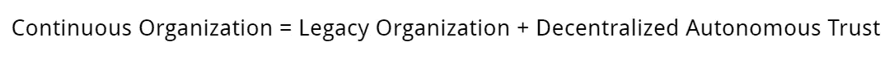
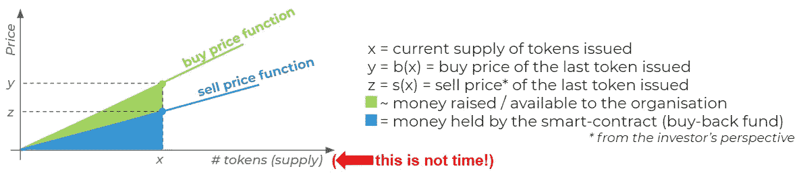
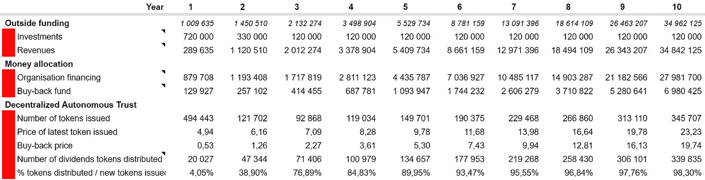
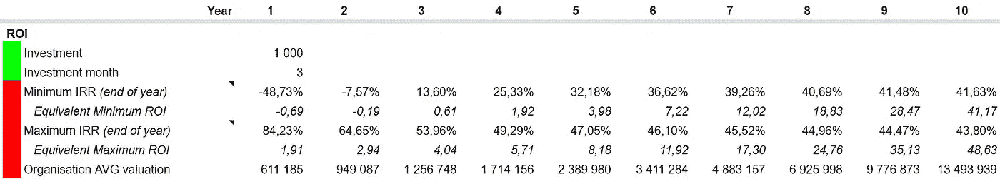
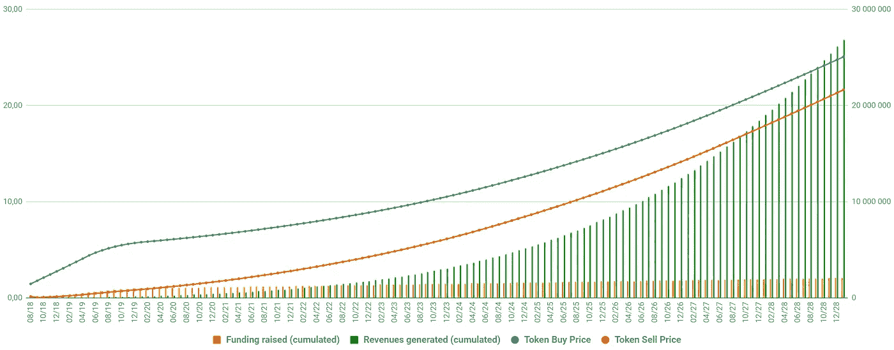
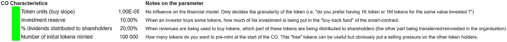
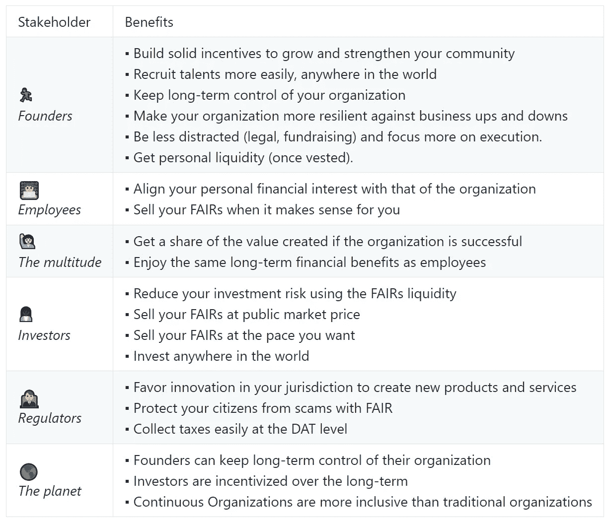
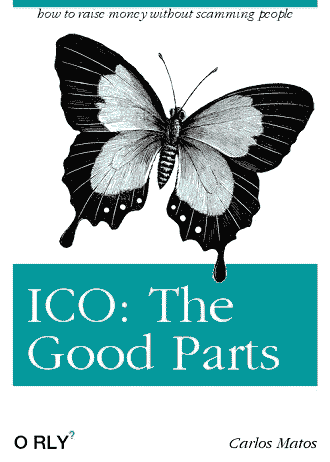
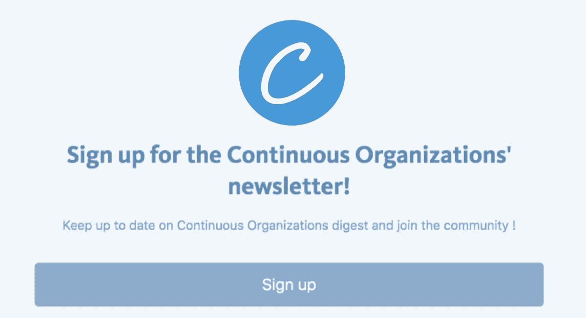

# 引入连续组织

> 原文：<https://medium.com/hackernoon/introducing-continuous-organizations-22ad9d1f63b7>

## 利用结合曲线重塑组织的财务激励

> 这份白皮书写于 2018 年。从那时起，我们创建了 Fairmint，将我们对更容易获得、对社区友好的公平的愿景带入生活。当我们开始实施这份白皮书时，我们学到了很多东西，并进行了多次迭代，最终[这一部分](https://blog.fairmint.co/a-new-era-of-high-resolution-fundraising-the-rolling-safe-1fb67eee68ab#context),了解有关当今组织存在的[问题的更多背景信息](https://github.com/C-ORG/whitepaper/#context)。
> 
> # 什么是持续的组织？
> 
> *持续组织*是指建立*分散自主信托* ( *DAT* )并通过向其输送部分或全部当前或未来现金流来赋予其价值的组织。
> 
> 
> 
> *分散自主信托* (DAT *)* 是一个特定的不可变智能契约，它实现了一个[结合曲线契约](/@justingoro/token-bonding-curves-explained-7a9332198e0e)和[赞助燃烧](/@avsa/sponsored-burning-for-tcr-c0ab08eef9d4)来自动铸造、燃烧和分发完全数字安全令牌，我们称之为*公平证券* (FAIRs)。这些交易代表了对 DAT 处理的未来现金流的要求。
> 
> 值得注意的是，DAT 不是组织；像不可撤销的信托一样，它是组织外部的合同。
> 
> 
> 
> Click on the image for an explanation of the bonding curve contract model used in Continuous Organization
> 
> 在白皮书的[这一节中，详细描述了 DAT 的内部工作方式以及它所实现的具体功能(*购买*、*出售*、*支付*、&、*分红*)，但逻辑是这样的:](https://github.com/C-ORG/whitepaper/#the-decentralized-autonomous-trust)
> 
> 1.  当投资者**购买**展会时，DAT 会创造新的展会，从而提高展会的价格。投资的一部分进入组织，一部分由 DAT 保留在回购准备金中。
> 2.  当投资者**出售**集市时，所出售的集市被 DAT 烧掉，这降低了集市的价格，DAT 使用其回购准备金向投资者返还 ETH。
> 3.  当 DAT 收到一笔**付款**时，该付款的一部分被 DAT 用来创造新的交易会(增加交易会的价格和回购储备)。那些新造的集市被分发给当前的集市持有者。剩余的付款被转移到该组织。
> 4.  当 DAT 收到组织支付的红利时，这笔钱被用来创造新的交易会(增加交易会的价格和回购准备金)。那些新造的集市被分发给当前的集市持有者。
> 
> # 具体的例子
> 
> 一个团队正在开发一个去中心化的社交网络，姑且称之为“Peepith”(与 Peepeth 的任何相似之处纯属巧合😉).Peepith 需要筹集资金并引导其社区(鸡和蛋的问题)。他们除了阿拉贡道之外没有其他法律实体。
> 
> 他们决定 Peepith 的商业模式不是广告，而是 1 美元的一次性费用(以 ETH 支付)。他们创建一个 DAT，将 Peepith 的支付地址指向 DAT 的地址，将 DAT 的受益人地址指向他们的 Aragon DAO 钱包地址。
> 
> Peepith 购买或预铸第一批 10 万个 Peepith 集市(姑且称之为 pith)。10%的髓分给团队，剩下的 90%用来奖励邀请朋友来 Peepith 的人。
> 
> 从现在开始，Peepith 社区可以通过 Peepith DAT 的专用页面投资 Peepith 来支持该项目。每当新用户向 Peepith 支付价值 1 美元的 ETH 时，髓的价格就会略微上涨，一些髓会被分发给当前的髓持有者。
> 
> 出于示例的目的，让我们使用一个简单的模型对 Peepith 的财务绩效指标进行建模，该模型具有以下简单的假设:
> 
> DAT 的参数:
> 
> *   **投资**。当投资者购买髓时，投资金额的 10%由回购准备金持有
> *   **支付**。当用户向 Peepith 支付 1 美元时，DAT 会保留 20%(0.20 美元)来铸造新髓，并分发给当前的髓持有者。
> 
> 商业假设:
> 
> *   **投资**。Peepith 在第一个月筹集了$10K，然后每个月增加$10K，直到第 10 个月(第 10 个月筹集了 10 万美元)。然后投资开始以每月-10K 美元的速度减少，在第 20 个月，投资永远停滞在每月 10K 美元。
> *   **收入**。Peepith 第一个月产生 0 美元，第二个月产生 1，000 美元，然后第 3 个月的收入逐月增长 100%，第 4 个月增长 90%，第 5 个月增长 80%，依此类推，直到从第 13 个月开始增长永远稳定在 5%。
> 
> 根据这些假设，10 年后:
> 
> *   皮斯通过筹款已经筹集了 100 万美元 2M
> *   Peepith 拥有 1.34 亿用户，总收入为 1.34 亿美元
> *   为激励社区而分发的 90，000 个木髓的价值:约 1000 万美元
> *   投资者 A 在第三个月购买了 1000 美元的髓，现在持有约 45000 美元的髓，IRR 约为 42%，ROI 约为 45 倍。
> *   一个投资者 B 在第 13 个月购买了$10K 的髓，现在持有约 140，000 美元的髓，IRR 约为 32%，ROI 约为 14 倍。
> 
> 
> 
> KPIs of the Peepith Continuous Organization
> 
> 
> 
> Performance of an investor who invested $1000 in the 3rd month
> 
> 总的来说，这里是一个图表，显示了随着时间的推移髓买入和卖出价格(在 DAT 水平)以及累计筹集的资金和累计产生的收入。
> 
> 
> 
> Peepith’s PITH buy and sell price over time
> 
> 先说清楚:
> 
> *   代币买入价显示了投资者可以从 DAT 中购买髓的价格(这发生在第二市场需求大于供给的时候)。
> *   代币卖价显示了投资者可以将髓出售给 DAT 的价格(这发生在第二市场上供给大于需求的时候)。
> 
> ## 结论
> 
> 以今天的标准来看，这是一个非常便宜的商业模式(终身服务接入 1 美元)，Peepith 的 DAT 能够筹集资金并为其投资者提供稳定的回报，同时为 Peepith 提供证明对促进他们的社区建设工作非常有用的精髓。不错😎
> 
> 当然，上述数字不能全信，因为该模型假设没有人出售股票，例如，这就是为什么代币价格总是随着时间“向右上方”上涨。在现实生活中，这不会是一帆风顺的，因为 Peepith 在其生命周期内很可能会经历动荡(增长将会停滞，错误将会出现等)，这将使投资者失去信心，并决定出售。
> 
> 此外，Peepith 可以创建一个具有完全不同参数的 DAT(预先铸造的髓，投入储备的投资百分比，作为象征性股息分配的付款百分比…)，这也会改变这个图表。该模型使用的参数如下:
> 
> 
> 
> 最后，上面的例子是基于一个纯粹的加密项目，但是通过简单地用您选择的组织替换 Aragon DAO，可以很容易地使该模型适应传统的组织，无论它是盈利性的还是非营利性的，初创公司还是财富 500 强。主要的区别在于组织决定放入 DAT 的资产和/或现金流，以及交易会将从中获得其价值。
> 
> # 为什么持续的组织是更好的模式？
> 
> 持续组织模型展示了许多有趣的特性,使其更加符合数字经济中组织的需求(如果你还没有，我鼓励你阅读尼古拉斯·科林的《T2 对冲》,这是持续组织模型的灵感源泉)。
> 
> 1.  ️📈**不断筹款**。DAT 提供了一个持续开放的初级市场，每当需求超过供应时，就在那里铸造代币，从而提供持续的资金，使该组织不那么脆弱。
> 2.  🏄🏻‍ **完全液态**。债券曲线保证投资者总是能够购买或出售他们的商品(尽管不一定是他们想要的价格)，即使没有在公开市场上市。
> 3.  🌳**对长期投资者有吸引力**。从结构上看，DAT 限制了短期投机者，吸引了长期投资者。
> 4.  💲**证券**。公平是对 DAT 处理的未来现金流的主张，并应如此估价。
> 5.  🤗**无许可、无摩擦&超国家**。任何人都可以很容易地在世界任何地方买卖任何数量的商品，而不需要征得任何人的同意。
> 6.  💬**治理不可知**。集市不提供治理权。DAT 是不可变的，并且没有对组织强制任何特定类型的治理:它是 BYOG，“带来你自己的治理”。
> 
> # 对利益相关者有什么好处？
> 
> 
> 
> Benefits stakeholders gain from the Continuous Organizations
> 
> # 房间里的大象:监管
> 
> 不清楚博览会是否是证券，似乎这个问题的答案是非常具体的司法管辖区。风险在于，如果一个司法管辖区要求 DAT 遵守当前的证券法，它很可能会通过增加摩擦、约束和限制来改变连续组织模式，而这些都是不可能的。以下是我们目前对此的想法:
> 
> 首先，DAT 属于哪个司法管辖区？DAT 不是组织。像信托一样，DAT 只是一个契约，它没有法律实体，一旦建立，组织就没有权力控制它(受托人是代码)。因此，人们可以合理地认为它属于以太坊的管辖范围。在这种情况下，它应该遵守以太坊管辖区的证券法…
> 
> 那么，研究集市是否是证券将会很有趣。这需要逐国研究。另一种选择是与一个支持创新、具有前瞻性的国家/监管机构合作，为分散自主信托制定具体的监管规定。这显然是长期目标。
> 
> 
> 
> 如你所知，我们仍处于监管方面的探索阶段，但我们认为，持续组织不是监管机构的问题，而是一个解决方案。
> 
> 到目前为止，大多数监管者都面临着如何监管 ico(或如何不监管)的两难境地。一方面，他们显然希望吸引创新者和投资者，但另一方面，他们也需要为投资者提供一定程度的保护，以防欺诈。这就是为什么持续组织模式可能是一个解决方案:它保留了 ico 的“好的部分”,同时极大地限制了它们的坏的部分。我们相信，监管 dat 将非常有益，不仅可以释放大规模创新，还可以通过税收和投资成为司法管辖区的重要收入来源。
> 
> # 结论
> 
> 持续组织模式还处于婴儿期，但我们相信它很可能成为下一个杀手级加密应用。如果我们能够创建比现在更好地协调利益相关者的组织，而且设置更简单，运营更便宜，那么在启动新企业时，我们有可能成为企业家事实上的标准。
> 
> 通过将治理与财务利益脱钩，并通过更具包容性，我们希望持续的组织模式将有助于组织变得比现在更注重长期发展。
> 
> 如果你想了解更多，请[阅读白皮书](https://github.com/C-ORG/whitepaper/)，并[让我们知道你的想法](https://chat.c-org.co/t/continous-organization-white-paper-v1-0-is-online/75)。获得尽可能多的建设性反馈非常重要，这样我们才能改进和完善模型。您可以在我们的论坛上加入关于持续组织的讨论:
> 
>  [## 连续组织
> 
> ### 讨论与持续组织相关的一切的合适场所
> 
> chat.c-org.co](https://chat.c-org.co/) 
> 
> 最后，非常感谢迄今为止为这个新概念做出贡献的每一个人。首先也是最重要的[赞助这项研究的家庭](https://www.thefamily.co/)，还有花时间帮助我完成他们的代码、讨论、评论和反馈的每一个人，最值得一提的是:[乔里斯·德拉诺](https://twitter.com/Joris_Paris)、[皮埃尔-路易·古胡尔](https://twitter.com/pierrelouisg)、[玛丽·埃克兰德](https://twitter.com/bibicheri)、[通杰·康巴](https://twitter.com/Tonjebakang)、[所罗门·海克斯](https://twitter.com/solomonstre)、[安德里亚·卢扎迪](https://twitter.com/aluzzardi)、[蒂博尔·瓦斯](https://twitter.com/tiborvass)、  [亚历山大·奥巴迪亚](https://twitter.com/ObadiaAlex)、[大卫·福希耶](https://twitter.com/dfauchier)、[明·哈扬](https://twitter.com/HaDuong_)、[弗洛朗·阿尔托](https://twitter.com/flowartd)、[威利·布劳恩](https://twitter.com/WillyBraun)、[弗兰克·勒瓦伊](https://twitter.com/fleouay)、[杜克·哈扬](https://twitter.com/OffyVN)、[迪米特里·德·容格](https://twitter.com/DimitriDeJonghe)、[杰罗姆·德·蒂切](https://twitter.com/jdetychey)、[凯尔·霍尔](https://twitter.com/kmhall82)
> 
> 