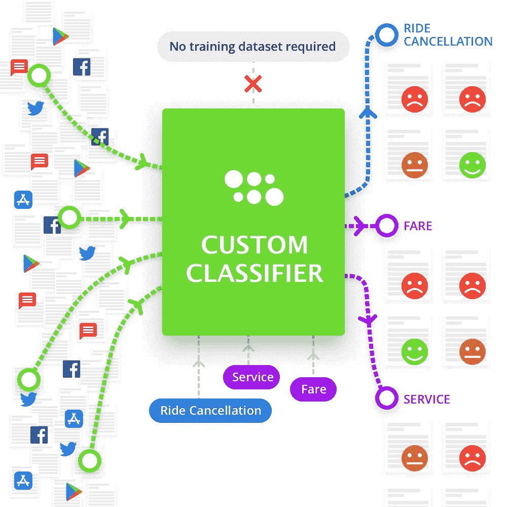
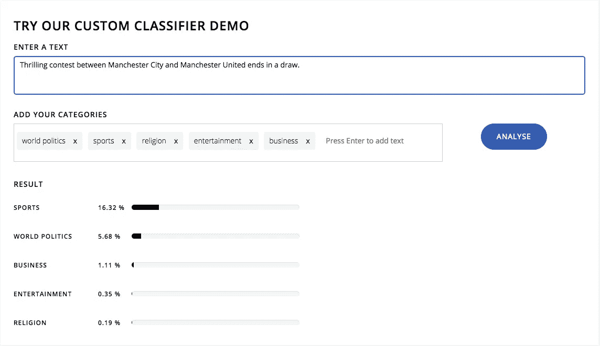
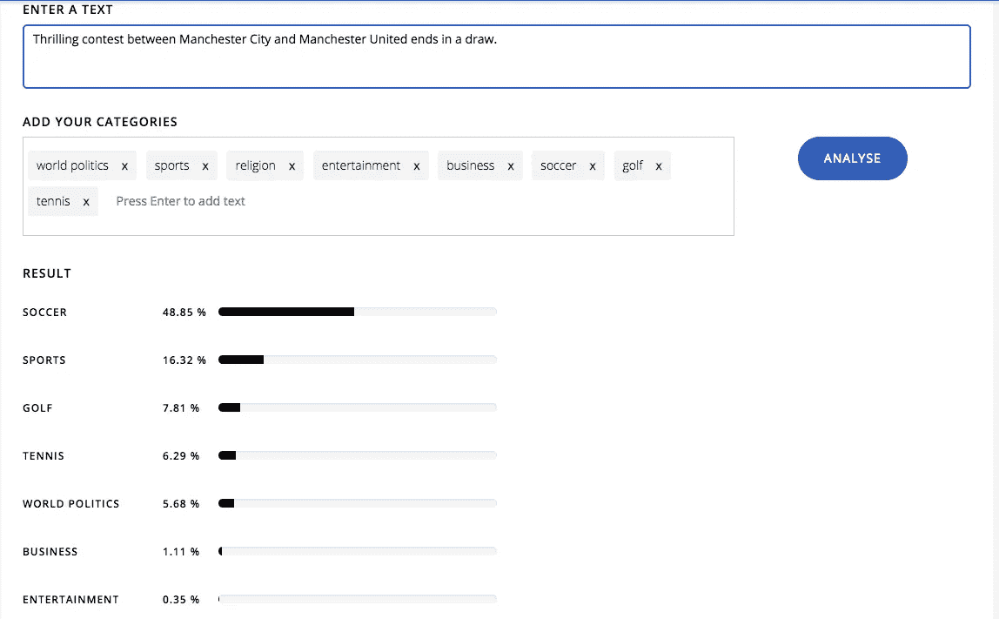
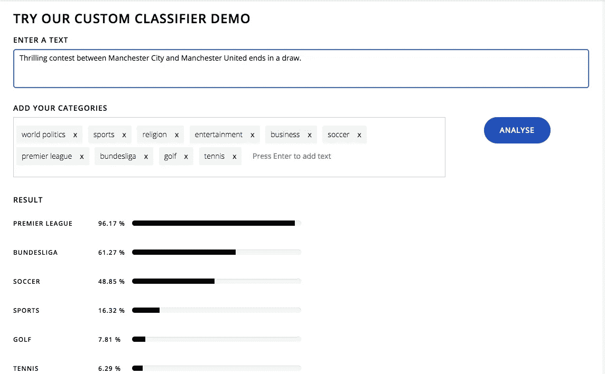
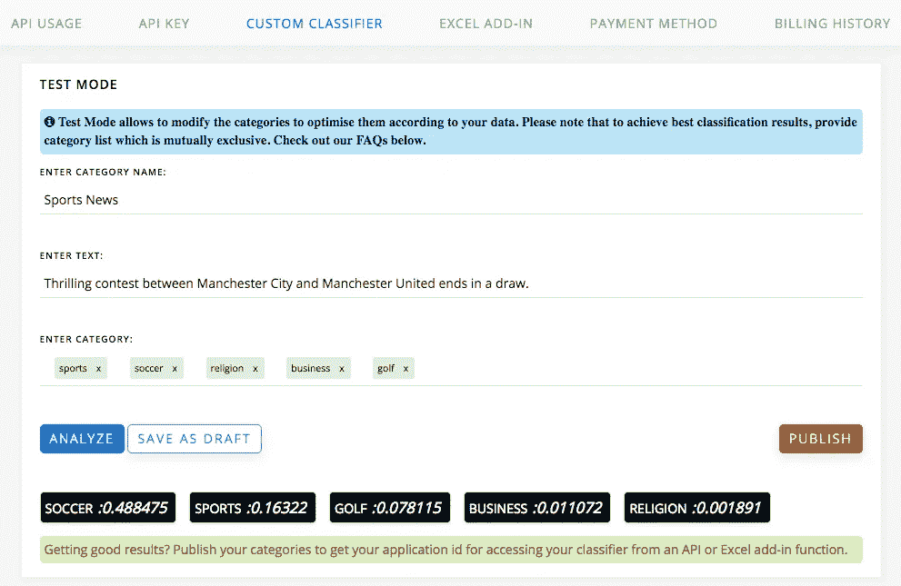

# 引入自定义分类器—构建您自己的文本分类模型，无需任何训练数据

> 原文：<https://medium.com/hackernoon/introducing-custom-classifier-build-your-own-text-classification-model-without-any-training-data-5eca0b3a32f9>

# 介绍

机器学习最成功的范例之一是监督学习，它让你通过从大量训练样本中学习来建立一个泛化模型。监督学习广泛用于自然语言处理中，以构建多类或多标签文本分类器，用于解决各种用例，如垃圾邮件检测、情感分析、情感分析、客户意图分析等..任何熟悉构建文本分类模型的过程的人都知道它包括下面列出的三个步骤:

**准备训练数据**:训练数据，也称为标记数据，是特定领域案例的语料库，这些案例用分类器期望分类的标签进行人工注释。

**训练文本分类模型:**然后选择合适的机器学习算法，在标注数据集上训练模型。我们已经在[之前的博客](https://blog.paralleldots.com/data-science/breakthrough-research-papers-and-models-for-sentiment-analysis/)中介绍了一些建立情感分析模型的技术。

**测试和验证:**标记数据集的一部分被留出，用于测试和验证训练好的模型，以评估其泛化能力。

当我们没有足够的标记数据来完成任务**训练一个可靠的模型**时，传统的监督学习范式就会崩溃。现实世界中的文本分类项目经常面临最大的障碍，即访问大量数据并手动注释它们。因此，大多数现实世界的项目都陷入了第一步。那些跨越了第一个障碍的人通常会发现他们的数据要么不充分，要么偏向某些类别，导致最终的人工智能模型中出现**偏差**。

# 什么是自定义分类器？

深度学习中的许多研究都是针对从更少的数据中学习更好的表示，其中一个令人兴奋的领域是零射击学习。引用 Ian Goodfellow 在他的 Quora 回答中的话——“零射击学习是指尽管没有收到任何关于任务的训练样本，却能够解决一项任务。”换句话说，想象一下预测一条推文的情绪，而不提供任何带有该情绪标签的推文的训练示例。
ParallelDots 的内部研究团队提出了他们自己的文本分类零镜头学习范式，并发布了一篇题为“一次训练，随处测试:文本分类零镜头学习”的研究论文。你可以在这里看论文[。](https://paralleldots.xyz/Zero-Shot-Learning-for-Text-Classification)

此外，为了兑现我们让人工智能触手可及的承诺，我们决定将这项令人兴奋的研究成果转化为商业应用，因此推出了一个新的 API，让您可以利用零触发学习的全部功能来进行文本分类用例。我们称之为自定义分类器，因为它可以让你建立自己的文本分类器的定义，自定义类别。这是我们在开发前沿人工智能解决方案的过程中迈出的革命性一步，让用户在不需要建立任何训练数据的情况下开发和集成自定义文本分类模型。

# 通过示例学习—构建样本文本分类模型

由于不需要训练数据，这也降低了建立文本分类模型的成本和时间。有了所有的背景知识，让我们试着看看自定义分类器的运行情况。
在下面的截图中，我们从我们网站上的自定义分类器[演示](https://www.paralleldots.com/custom-classifier)页面中截取了一个体育标题，并定义了五个类别，我们希望将这个标题分为世界政治、体育、宗教、娱乐和商业。

正如您从结果中看到的，体育类别在所有类别中具有最高的概率得分，因此是我们输入文本中最有可能的类别。请注意，我们在测试时定义了类别，底层的人工智能模型并没有在这些类别上进行明确的训练。
接下来，我们尝试将运动类别进一步细分为不同的类别，如足球、高尔夫等。看看我们的分类器能否理解它们。

我们再次看到，分类器准确地识别了体育类别，而没有对它们进行明确的训练。我希望现在您已经开始了解这项技术的潜力。
最后一步，让我们试着将我们的足球类别进一步细分为全球不同类型的联赛，看看我们的分类器是否能正确预测。

确实神奇！我们的分类器也正确地选择了联盟。

总之，自定义分类器让您对文本分类的未来有所了解，在这种情况下，将一段文本可靠地分类到自定义类别中只需要很少或不需要训练示例。这种能力将开启无限的可能性，并赋予众多休眠的文本分析项目新的生命，这些项目由于缺乏训练数据或训练资源而永远不会看到光明的一天。

# 设置自定义分类器

设置自定义分类器非常简单，可以通过下面提到的三个简单步骤来完成:

1.  [注册](https://www.paralleldots.com/sign-up)免费的 ParallelDots API 账户，[登录](https://user.apis.paralleldots.com/user_dashboard)到你的仪表盘。
2.  导航到仪表板中的自定义分类器部分，提供一个示例文本并定义一些类别来分析您的文本。默认情况下，你将处于测试模式，让你调整你的类别列表多次，你想免费。
3.  一旦您对分类准确性感到满意，单击 Publish 部署您的分类器以供生产使用，并获取分类器 id。一旦发布，您将能够通过 API 端点访问您的自定义分类器。

自定义分类器的 API 文档可以在[这里](https://www.paralleldots.com/docs)获得。一个 Excel 加载项功能将很快可用，以便从 MS Excel 中使用它。

在这篇博文中，我们介绍了一种新的文本分类模式，我们希望我们的用户能够从中受益匪浅。我们已经看到一些令人兴奋的用例被我们的用户通过自定义分类器解决，比如对招聘信息进行分类、对新闻文章进行分类、处理开放式调查反馈等。通常，分析原始数据的第一步是将它分类到您关心的类别中，并监控一段时间内的趋势，以获得可操作的见解。

# 自定义分类相对于标准文本分类的优势

在分析客户之声等非结构化数据时，情感分析等标准文本分类模型并不总是足以获得整体视图。另一方面，自定义分类器可以让您将这些数据分类到我们关心的更细微的类别中。例如，使用自定义分类器，快餐连锁店老板可以将通过社交媒体从客户那里收到的反馈分类为价格、氛围、员工行为、食品质量等类别。更好地了解她需要改进业务的哪些方面。使用简单的情绪分析，她可能知道她的业务总体情况如何，但可能会错过一些关键趋势，如员工行为和客流量之间的关系。自定义分类器的潜力是对文本进行分类，而不仅仅是情绪标签(正面、负面或中性)，这样你不仅可以知道你的产品得到了多少负面反馈，还可以知道用户在这些负面陈述中谈论了什么。

我们相信定制分类器可以使没有数据科学背景的用户能够构建和部署他们自己的分类器，并获得相对于竞争对手的优势。它还将帮助企业从根本上转变为数据驱动的组织，并将最终加速人工智能和机器学习的产业化。你也可以在这里探索更多文本分类博客[。](https://blog.paralleldots.com/category/product/text-analytics/)

[parallel dots AI API](https://www.paralleldots.com/)，是由 [ParallelDots Inc](https://paralleldots.xyz/) 提供的深度学习支持的 web 服务，可以理解大量的非结构化文本和视觉内容，为您的产品提供支持。你可以查看我们的一些文本分析应用程序接口(API )( T7 ),在这里填写表格(T8 )( T9)或者给我们 apis@paralleldots.com 写信。