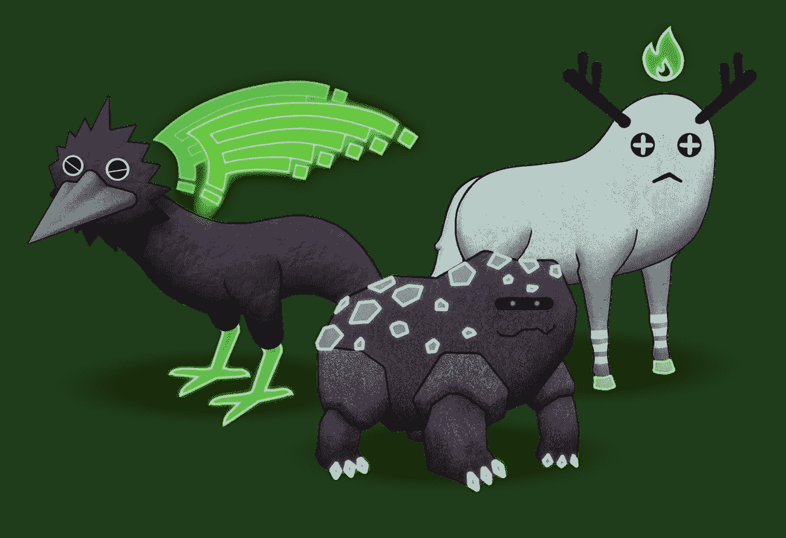
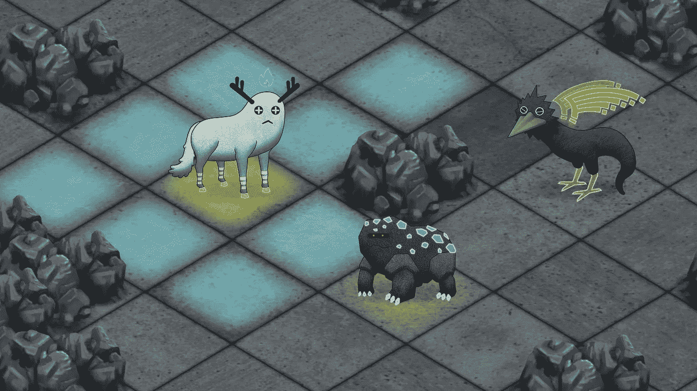
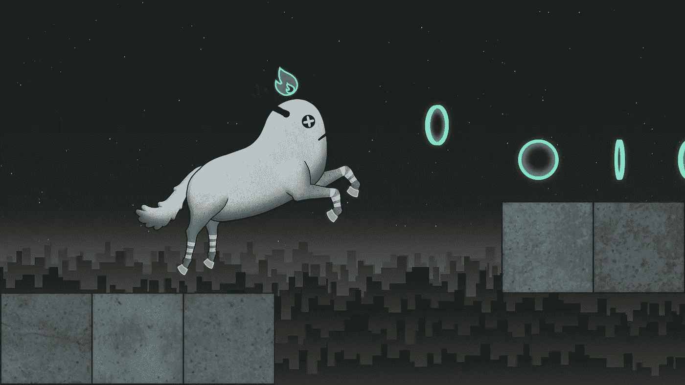

# 介绍以太火花:区块链游戏的下一代

> 原文：<https://medium.com/hackernoon/introducing-ethersparks-the-next-generation-in-blockchain-gaming-3db02aa9b688>

ERC-721 代币的引入使区块链博彩成为现实。然而，到目前为止，基于区块链的游戏都遭受了长延迟时间和高成本的困扰，因为所有游戏进程都使用区块链。

介绍 EtherSparks，这是一个基于区块链的新游戏体验。以太火花不受之前游戏的限制。现在，您可以玩迷你游戏，并与其他玩家实时战斗，而不必支付汽油费，同时仍然通过区块链安全维护游戏物品的所有权。真是两全其美。

# 它是如何工作的？

作为加密爱好者和第一批区块链游戏的早期采用者，我们很快注意到它们缺少了一些东西。虽然在区块链上拥有不可替代代币的能力是革命性的，但分散网络的局限性使得真正吸引人的游戏体验具有挑战性。

那么是什么让区块链游戏成功呢？在以太坊网络上养猫或者和机器人打架，人们最喜欢和最不喜欢的是什么？从这些问题中，我们发现了以下几点:

*   **区块链游戏是关于在区块链上拥有东西。**听起来很明显，但很关键。任何基于密码的游戏体验都必须让玩家真正拥有自己的资产。一旦在区块链获得安全，即使是开发者也不能在未经许可的情况下改变玩家的收藏。不仅如此，区块链允许每个人追踪每件物品的来源，以确保没有作弊行为发生。
*   **拥有可证明公平的随机战利品是很重要的。在区块链上产生战利品可以确保每个玩家都遵循相同的随机参数。当产生的物品有潜在的实际价值时，这种信任程度对玩家来说很重要。**
*   玩家不喜欢不断地支付油钱。当每一个动作都需要玩家付油钱时，费用就迅速堆积起来。不仅如此，还必须不断支付汽油费，这限制了游戏机制中的决策数量。高昂的油价最终会耗尽任何加密游戏的经济效益。它本质上是一种游戏费用，不能再投资到游戏或玩家身上。由于不得不支付这些费用，目前大多数游戏都在努力维持平衡的经济。
*   **玩家正在寻求更快节奏的游戏体验。现有的区块链游戏要求玩家等待网络对每个动作的确认。根据他们使用的气体量，这可能需要几个小时。因此，实时游戏是不可能的，即使是回合制游戏机制也必须受到限制。**

当我们考虑这些观察时，我们得到一个认识:玩家玩区块链游戏是因为代币所有权是公平和安全的。然而，区块链并不是一个创造引人入胜的游戏的好环境。

于是以太火花诞生了！为了解决这些问题，我们决定创建一个游戏，在这个游戏中，游戏元素将在专用服务器上处理，而战利品生成和物品所有权仍然可以在区块链上得到保证。玩家只需要支付汽油并等待确认就可以执行一个动作来修改他们的收藏。玩游戏和其他不需要区块链安全的活动可以单独进行。这允许以半分散的方式整合结果和奖励。

# 火花:它们是什么？

在以太火花的世界里，火花是你的宠物和化身。你可以照顾他们，装备他们，训练他们，甚至把他们融合在一起。他们在你玩迷你游戏时代表你，在战斗中为你而战。与其他玩家竞争，收集和提高最稀有和最强的火花。

# **战斗！**

以太坊网络上出现的第一批游戏中有许多只是简单的收藏品。除了繁殖更多的品种或者卖掉它们，你没有什么可以做的。后来开发的游戏推进了这个概念，包括与你的收藏品战斗。然而，将所有游戏逻辑整合到区块链的本质严重限制了游戏机制的数量。当前区块链游戏中的战斗系统通常过于简单，战略供应有限，更不用说甚至在战斗中也经常需要高昂的汽油费用。

这一切都随着 EtherSparks 而改变。因为游戏逻辑不在区块链上处理，所以其他游戏的所有缺点都不是问题。你不必像其他区块链游戏要求的那样一次发送你所有的动作，你也不必为你的每一个动作向网络支付汽油。进行一场快节奏的对抗，你的火花的力量，你的策略的合理性，以及一点点运气都有助于胜利。然而，在一天结束时，胜利者的战利品仍然可以在区块链上得到保护

# **小游戏！**

EtherSparks 不是一个你必须支付大量 ETH 才能入门的游戏。玩家可以通过玩迷你游戏开始赚取火花和物品。这是以太火花和其他区块链游戏的关键区别之一。免费玩各种迷你游戏并赚取奖励，您可以使用战利品箱来开始或增加您的收藏。不需要任何前期的 ETH 投资，甚至连汽油都不需要，就可以开始玩并赚钱！

# **核心节点:成为 EtherSpark 发展的一部分**

除了完全革命性的游戏体验，我们还为玩家提供了一些特别的东西。核心节点是早期投资者以及特殊活动的获胜者和锦标赛冠军分享 EtherSparks 成功的一种方式。核心节点代表市场交易产生的收入的百分比。随着 EtherSparks 变得越来越流行，市场上的交易数量增加，核心节点的价值也增加了。作为对您支持的回报，参与预售可以为您赢得随着游戏增长而增长的永久收入来源。

# 如何支持 EtherSparks？

支持 EtherSparks 最好的方式就是参与预售！预售期间，玩家可以获得包含稀有物品和火花的特殊战利品盒。这些出售前的战利品盒子是独一无二的，并且比之后的任何战利品盒子更有可能包含稀有物品。不仅如此，几个核心节点还会随机分散在预售的战利品箱中。这是从战利品盒中打开核心节点的唯一机会。

如果您不喜欢预售，那么您还有一种方式可以支持我们。在发布阶段，您可以使用您的电子邮件和以太坊钱包 ID 注册一个推荐链接。对于通过您的推荐链接产生的每一笔售前购买，您都有资格获得奖励，这些奖励将在游戏启动后发送到您的钱包中！

**想留在圈子里吗？** ***在***[***【http://ethersparks.io/***](http://ethersparks.io/)注册更新并查看我们

查看 [***白皮书***](http://ethersparks.io/wp-content/uploads/2018/05/EtherSparks_WhitePaper-1.pdf) 了解 EtherSparks 的完整概念，并随时向我们提供想法和反馈。这款游戏正处于开发的早期阶段，我们很高兴能在您的支持下推进这个项目。