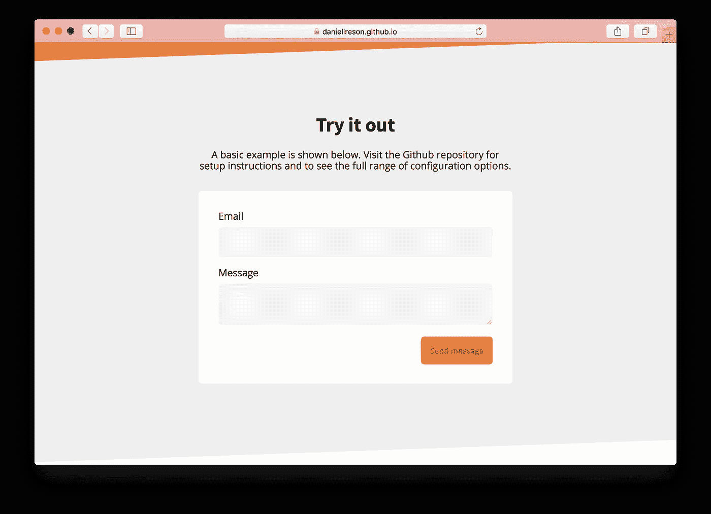
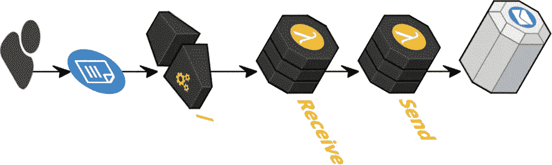
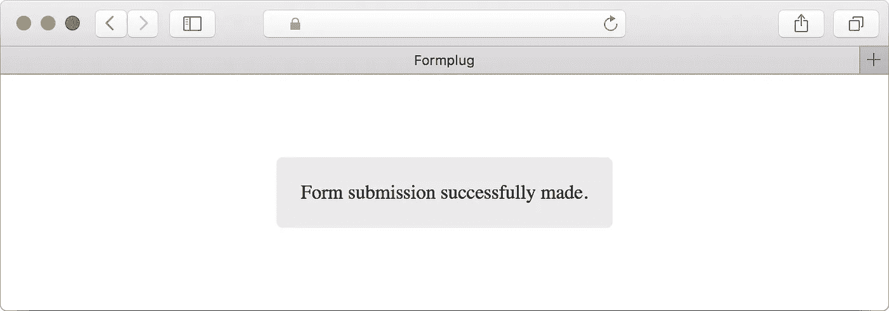

# 介绍 Formplug v1，这是一种用于 AWS Lambda 的表单转发服务

> 原文：<https://medium.com/hackernoon/introducing-formplug-v1-a-form-forwarding-service-for-aws-lambda-2c125dfe608e>


Using graphics from [SAP Scenes Pack](https://experience.sap.com/designservices/approach/scenes)

据估计，每天大约有 2690 亿封电子邮件被发送到 T2。当你读到前面那句话的时候，已经有超过 1000 万笔汇款被寄出。即使在 2018 年，在电子邮件诞生 40 多年后，它仍然是[互联网](https://hackernoon.com/tagged/internet)上最可靠和最通用的沟通方式之一。

在这篇博文中，我将提供一个最新发布的 Formplug 的技术演示，这是一个我一直在开发的开源表单转发服务。通过电子邮件接收表单提交变得非常简单。通常，您会在无法执行服务器端代码的环境中使用 Formplug，例如 Github 页面。

## [在 GitHub 上查看项目](https://github.com/danielireson/formplug-serverless)

## [尝试演示](https://danielireson.github.io/formplug-serverless/)



# 它是如何工作的

将 Formplug 服务部署到 AWS 后，您将获得一个 API 网关端点 URL。这应该设置为您希望通过电子邮件接收的任何表单的表单操作。然后可以使用以下划线为前缀的隐藏表单输入来自定义行为。例如，要设置接收者，您可以使用恰当命名的`_to`输入。

```
<form action="https://apigatewayurl.com" method="post">
    <input type="hidden" name="_to" value="johndoe@example.com">
    <input type="text" name="message">
    <input type="submit" value="send">
</form>
```

在其他功能中，有对加密电子邮件地址，垃圾邮件预防和 URL 重定向的支持。参见[自述文件](https://github.com/danielireson/formplug-serverless)了解全部配置选项。

# 体系结构

AWS 环境中的 Lambda 可以被认为是一个基于预定义事件调用的函数。

Formplug 由两个 Lambdas 组成:

1.  一个*接收* Lambda —用于解析表单提交。
2.  a*send*Lambda——用于创建和发送电子邮件。

在 *receive* Lambda 的情况下，事件是从提交到我们的 API 网关端点(在第一次部署时生成的公共 URL)的表单中生成的。在*发送*λ的情况下，事件由来自*接收*λ的 API 调用生成。



## 配置

这两个 Lambdas 都在`serverless.yml`配置文件中定义，它描述了所需的 AWS 基础设施。基础设施将在部署时使用 [CloudFormation](https://aws.amazon.com/cloudformation/) 自动实例化。

```
functions:
  receive:
    handler: src/receive/handler.handle
    events:
      - http:
          path: /
          method: post
          request:
            parameters:
              querystrings:
                format: true
  send:
    handler: src/send/handler.handle
```

对于每个 Lambda，我们将导出的 [JavaScript](https://hackernoon.com/tagged/javascript) 函数定义为处理程序。这将在每次 Lambda 的事件被触发时被调用。处理程序本身只是一个带三个参数的箭头函数，第一个参数是`event`，它在我们的*接收*处理程序中保存表单数据本身。

```
module.exports.handle = (event, context, callback) => {}
```

每当一个表单被发送到我们的端点时，这个函数就会被调用。为了返回一个响应，我们需要使用提供的`callback`参数。这是一个[错误优先的回调](http://fredkschott.com/post/2014/03/understanding-error-first-callbacks-in-node-js/)，所以我们应该将`null`作为成功形成的响应的第一个参数传递。第二个参数应该是包含状态代码和响应正文的对象。回调默认为`application/json`内容类型。

```
callback(null, {statusCode: 200, body: 'Email sent'})
```

# 验证表单提交

在 Formplug *receive* 处理程序的顶部，创建了一个新的`request`实例，并将`event`传递给构造函数。`Request`类负责验证。在`Request`构造函数中定义的是需要从`event`中提取的所有内容。这主要只是要转发的电子邮件和表单输入的收件人。

```
class Request {
  constructor (event) {
    this.singleEmailFields = ['_to']
    this.delimeteredEmailFields = ['_cc', '_bcc', '_replyTo']
    this.recipients = {
      to: '',
      cc: [],
      bcc: [],
      replyTo: []
    } this.responseFormat = 'html'
    this.redirectUrl = null this.pathParameters = event.pathParameters || {}
    this.queryStringParameters = event.queryStringParameters || {}
    this.userParameters = querystring.parse(event.body)
  }
}
```

我们[在构造函数中不做任何真正的工作](http://www.daedtech.com/beware-the-bloated-constructor/)。还要注意我们如何使用 [Node.js querystring 模块](https://nodejs.org/api/querystring.html)来设置`userParamters`。这将包含编码为`application/x-www-form-urlencoded`的表单数据的请求主体转换成一个 JavaScript 对象。

## 使用承诺验证

在`Request`上有一个`validate`方法负责解析事件。它利用了顺序链接承诺的能力，以便一个承诺的解析成为下一个承诺的成功处理程序参数。链式承诺序列中的每个成功处理程序用于验证表单提交的不同方面。被拒绝的承诺会上升到它们的顶级父级，因此我们可以在处理程序中定义一个由所有验证方法共享的`catch`方法。

```
validate () {
  return Promise.resolve()
    .then(() => this._validateResponseFormat())
    .then(() => this._validateNoHoneyPot())
    .then(() => this._validateSingleEmails())
    .then(() => this._validateDelimiteredEmails())
    .then(() => this._validateToRecipient())
    .then(() => this._validateRedirect())
}
```

如果您想知道这些特定的验证方法看起来像什么，让我们看看负责设置`_to`接收者的`_validateSingleEmails`。它检查`userParameters`中是否提供了任何`singleEmailFields`，如果验证成功，则解析承诺，如果有错误，则拒绝承诺。

```
_validateSingleEmails () {
  return new Promise((resolve, reject) => {
    this.singleEmailFields
      .filter((field) => field in this.userParameters)
      .forEach((field) => {
        let input = this.userParameters[field]
        if (!this._parseEmail(input, field)) {
          let msg = `Invalid email in '${field}' field`
          let err = new HttpError().unprocessableEntity(msg)
          return reject(err)
        }
      }) return resolve()
  })
}
```

## HTTP 错误被拒绝

不是在承诺中直接拒绝一个 JavaScript 错误，而是从一个`HttpError`方法中生成一个错误。创建这个类是为了提供一个友好的 API 来生成常见的 HTTP 响应错误。该类包含每个受支持的错误响应的公共方法。下面是一个只有 [422 不可处理实体](https://httpstatuses.com/422)响应的类的例子。

```
class HttpError {
  unprocessableEntity (message) {
    return this._buildError(422, message)
  } _buildError (statusCode, message) {
    const error = new Error(message)
    error.statusCode = statusCode
    return error
  }
}
```

您可能会认为不值得像这样构建错误处理，因为需要更多的前期工作。当您考虑到*接收*处理器可以变得多干净时，好处就变得更加明显了。我们可以拒绝来自承诺链中任何地方的`HttpError`错误，并在顶级的`catch`方法中捕获它。在这一点上，然后可以构建适当的响应以显示给用户。

# 生成响应

要生成响应，并不像向`callback`提供状态代码和消息那么简单。JSON 和 HTML 内容类型都受支持，它们都需要设置不同的头，并具有不同的主体格式。还支持通过`_redirect`表单输入重定向响应，这同样有不同的要求。

已经创建了一个类，它可以构建不同的响应对象，这些对象可以传递给`callback`。

```
class Response {
  constructor (statusCode, message) {
    this.statusCode = statusCode
    this.message = message
  } buildJson () {
    return {
      statusCode: this.statusCode,
      headers: {
        'Access-Control-Allow-Origin': '*',
        'Content-Type': 'application/json'
      },
      body: JSON.stringify({
        statusCode: this.statusCode,
        message: this.message
      })
    }
  } buildHtml (template) {
    return {
      statusCode: this.statusCode,
      headers: {
        'Content-Type': 'text/html'
      },
      body: template.replace('{{ message }}', this.message)
    }
  } buildRedirect (redirectUrl) {
    return {
      statusCode: this.statusCode,
      headers: {
        'Content-Type': 'text/plain',
        'Location': redirectUrl
      },
      body: this.message
    }
  }
}
```

要使用上面的类，首先要通过传入状态代码和消息来创建它的一个实例，因为这在所有响应类型中都很常见。然后根据期望的响应调用三个公共方法中的一个。

例如，要构建一个 JSON 响应，您需要执行以下操作。

```
const statusCode = 200
const message = 'Form submission successfully made'
const response = new Response(statusCode, message)
callback(null, response.buildJson())
```

默认情况下，HTML 响应由显示，并带有一条通用的成功消息。



这个页面是通过加载一个本地 HTML 模板文件并对一个`{{ message }}`变量进行查找和替换而生成的。使用 [Node.js fs 模块](https://nodejs.org/api/fs.html)将模板加载到处理程序中。

```
const path = path.resolve(__dirname, 'template.html')
const template = fs.readFileSync().toString()const message = 'Form submission successfully made'
const html = template.replace('{{ message }}', message)
```

## 确定响应类型

`Response`类负责构建响应，但是它不知道什么是合适的响应。响应的选择由一系列条件语句决定，这些条件语句查看先前在*接收*处理程序中创建的经过验证的`request`。

```
if (request.redirectUrl) {
  callback(null, response.buildRedirect(request.redirectUrl))
  return
}
if (request.responseFormat === 'json') {
  callback(null, response.buildJson())
  return
}
if (request.responseFormat === 'html') {
  const path = path.resolve(__dirname, 'template.html')
  const template = fs.readFileSync(path).toString()
  callback(null, response.buildHtml(template))
  return
}
```

如果你不知道，你可以在 JavaScript 中通过不指定返回值来返回`undefined`。在上面的代码块中，我们用它来停止脚本执行，这样`callback`就只被调用一次。

# 构建接收处理程序

再次基于顺序链接 [JavaScript 承诺](https://developer.mozilla.org/en-US/docs/Web/JavaScript/Reference/Global_Objects/Promise)的能力，*接收*处理程序采用以下格式。

```
module.exports.handle = (event, context, callback) => {
  const request = new Request(event) request.validate()
    .then(function () {
      // send email
    })
    .then(function () {
      // build success response
    })
    .catch(function (error) {
      // build error response
    })
    .then(function (response) {
      // response callback
    })
}
```

使用`Response`构建的对象被传递给`callback`，以便在这个顶级承诺链的最终成功处理程序中返回一个 HTTP 响应。这个响应对象可能是从前面的`then()`或`catch()`方法中解析出来的。用实现代码替换上面的注释，我们得到了最终的处理程序。

```
module.exports.handle = (event, context, callback) => {
  const request = new Request(event)
  request.validate()
    .then(function () {
      const payload = {
         recipients: request.recipients, 
         userParameters: request.userParameters
      }
      return aws.invokeLambda('formplug', 'dev', 'send', payload)
    })
    .then(function () {
      const statusCode = request.redirectUrl ? 302 : 200
      const message = 'Form submission successfully made'
      const respnse = new Response(statusCode, message)
      return Promise.resolve(response)
    })
    .catch(function (error) {
      const response = new Response(error.statusCode, error.message)
      return Promise.resolve(response)
    })
    .then(function (response) {
      if (request.redirectUrl) {
        callback(null, response.buildRedirect(request.redirectUrl))
        return
      }
      if (request.responseFormat === 'json') {
        callback(null, response.buildJson())
        return
      }
      if (request.responseFormat === 'html') {
        const path = path.resolve(__dirname, 'template.html')
        const template = fs.readFileSync(path).toString()
        callback(null, response.buildHtml(template))
        return
      }
    })
}
```

## 调用发送 Lambda

没有讨论电子邮件实际上是如何发送的。使用 *send* Lambda 中的[Amazon Simple Email Service(SES)](https://aws.amazon.com/ses/)发送电子邮件，该服务在 *receive* Lambda 中的第一个 promise success 处理程序中调用。它由包含接收者和表单输入的有效负载调用。

```
const payload = {
 recipients: request.recipients, 
 userParameters: request.userParameters
}return aws.invokeLambda('formplug', 'dev', 'send', payload)
```

Lambda 是使用 NPM 上可用的 [AWS SDK](https://www.npmjs.com/package/aws-sdk) 调用的。尽管看起来我们好像是在直接调用 AWS SDK，但事实并非如此。我们实际上是在包装类的[单例](https://en.wikipedia.org/wiki/Singleton_pattern)实例上调用一个方法。它提供了库的代理，在一个更简单的 API 中只公开相关的方法。

```
const aws = require('aws-sdk')class AwsService {
  constructor (aws) {
    this.aws = aws
  } invokeLambda (serviceName, stage, functionName, payload) {
    let event = {
      FunctionName: `${serviceName}-${stage}-${functionName}`,
      InvocationType: 'Event',
      Payload: JSON.stringify(payload)
    }
    return new this.aws.Lambda().invoke(event).promise()
  } sendEmail (email) {
    return new this.aws.SES().sendEmail(email).promise()
  }
}module.exports = new AwsService(aws)
```

# 发送电子邮件

*send* Lambda 首先创建一个`Email`的实例，然后调用前面描述的`AwsService`类上的`sendEmail`方法。在这个处理程序中，`event`参数只是来自`receive` Lambda 的有效载荷。

```
module.exports.handle = (event, context, callback) => {
  const email = new Email(config.SENDER_ARN, config.MSG_SUBJECT)
  email.build(event.recipients, event.userParameters)
    .then(function (email) {
      return aws.sendEmail(email)
    })
    .catch(function (error) {
      callback(error)
    })
}
```

配置变量从本地 JSON 文件加载。`SENDER_ARN`变量是发送邮件地址的 [Amazon 资源名称](https://docs.aws.amazon.com/general/latest/gr/aws-arns-and-namespaces.html)(SES 只从验证过的邮件地址发送邮件)。

```
const config = require('./config.json')
```

`Email`类上的`build`方法创建一个 SES 兼容的对象，并将其传递给 AWS SDK。它首先检查`SENDER_ARN`是否有效，然后返回 SES 对象。

```
build (recipients, userParameters) {
  return this._validateArn()
    .then(() => {
      let email = {
        Source: this._buildSenderSource(),
        ReplyToAddresses: recipients.replyTo,
        Destination: {
          ToAddresses: [recipients.to],
          CcAddresses: recipients.cc,
          BccAddresses: recipients.bcc
        },
        Message: {
          Subject: {
            Data: this.subject
          },
          Body: {
            Text: {
              Data: this._buildMessage(userParameters)
            }
          }
        }
      } return Promise.resolve(email)
    })
}
```

邮件正文是通过循环作为`event`的一部分发送的用户参数构建的。以下划线为前缀的 Formplug 配置变量将被忽略。

```
_buildMessage (userParameters) {
  return Object.keys(userParameters)
    .filter(function (param) {
      // don't send private variables
      return param.substring(0, 1) !== '_'
    })
    .reduce(function (message, param) {
      // uppercase the field names and add each parameter value
      message += param.toUpperCase()
      message += ': ' 
      message += userParameters[param]
      message += '\r\n'
      return message
    }, '')
}
```

# 包扎

我希望您对这个高级代码库演练感兴趣。要了解更多信息和部署说明，您应该查看 Github 上的[库。如果您有任何意见或建议，请在下面留下您的回复，我会很乐意回复您。](https://github.com/danielireson/formplug-serverless)

## [在 GitHub 上查看项目](https://github.com/danielireson/formplug-serverless)

## [尝试演示](https://danielireson.github.io/formplug-serverless/)

[](https://github.com/danielireson/formplug-serverless) [## Daniel reson/form plug-无服务器

### 用于 AWS Lambda 的表单插件-无服务器表单转发服务

github.com](https://github.com/danielireson/formplug-serverless) 

如果你喜欢这篇博文，你可能也会喜欢之前的媒体教程，在那里我使用 AWS Lambda 和 S3 构建了一个无服务器的 URL 缩短器。

[](https://medium.freecodecamp.org/how-to-build-a-serverless-url-shortener-using-aws-lambda-and-s3-4fbdf70cbf5c) [## 如何使用 AWS Lambda 和 S3 构建一个无服务器的 URL 缩短器

### 在这篇文章中，我们将使用亚马逊网络服务(AWS) Lambda 和 S3 构建一个无服务器的 URL 缩短器。同时…

medium.freecodecamp.org](https://medium.freecodecamp.org/how-to-build-a-serverless-url-shortener-using-aws-lambda-and-s3-4fbdf70cbf5c)