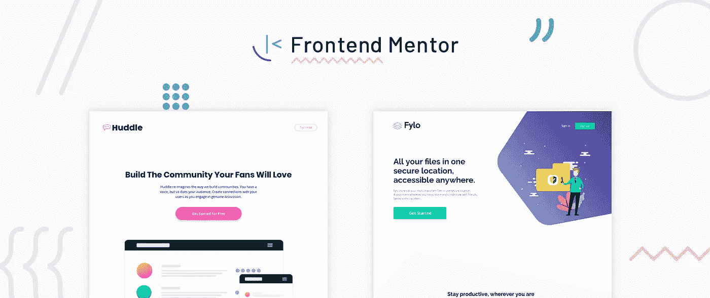
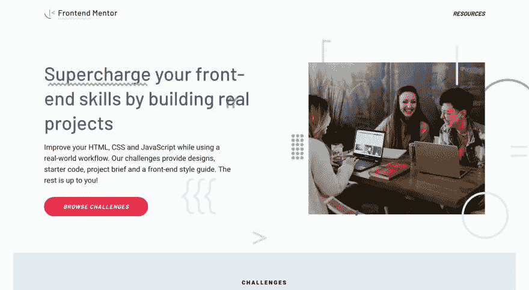
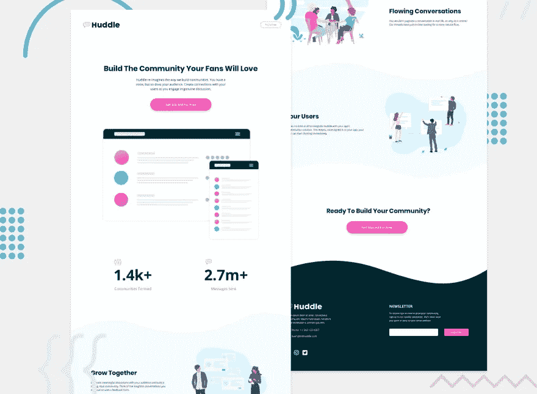
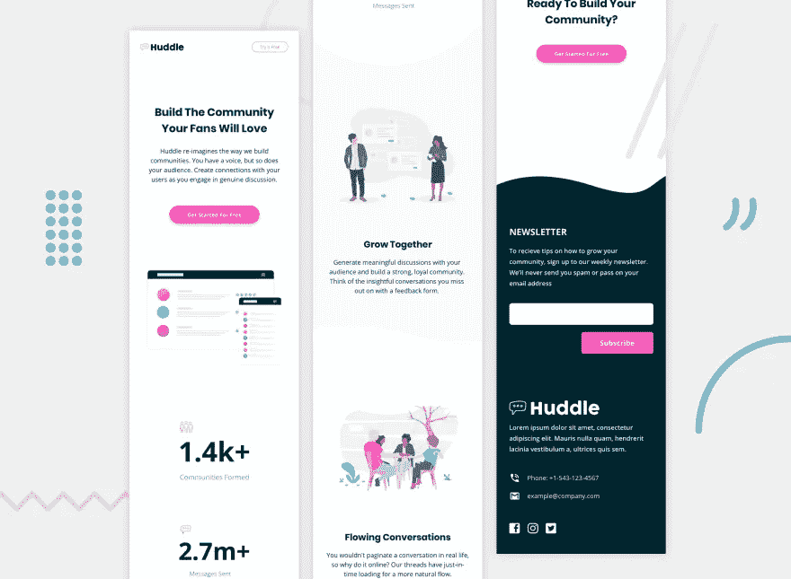

# 介绍前端导师——通过构建真实的项目来增强您的前端技能

> 原文：<https://medium.com/hackernoon/introducing-frontend-mentor-supercharge-your-front-end-skills-by-building-real-projects-35be51902e3f>

今年夏天，我有了一个想法，我认为它可以帮助人们提高他们的前端技能。

有这么多令人难以置信的网站和服务来帮助人们学习编码。像我在伦敦教书的 General Assembly 这样的公司，以及像 T2 freeCodeCamp 这样的网站，在从底层教人方面做得非常出色。

但是，我想为已经知道一些 HTML、CSS 和 [JavaScript](https://hackernoon.com/tagged/javascript) 的人创建一个资源。不是一步一步的课程或代码，而是一个不干涉的、基于项目的资源，尽可能模拟现实生活中的工作流程。

所以，我要向你们介绍[前端导师](https://www.frontendmentor.io/)。

几个月来，我建立了一个小型网站来测试这个想法并获得反馈。但是现在它正全速前进，有了一个新的品牌和网站的全面重新设计。

# 前端导师面临的挑战

为了迎接挑战，我创造了虚构的品牌来构建设计。这有助于每个挑战模拟现实生活中的工作流程。这就像为一个真实的客户建立一个网站！

挑战包括移动和桌面设计、起始代码(包括优化的资产)。前端风格指南也提供了，其中包括颜色，字体等。

这是其中一项挑战的桌面预览截图:

和移动预览:

如果你想接受挑战，只需从网站上下载一个入门代码，你就可以开始了。我决定保留下载的起始代码，而不是使用基于浏览器的编辑器。这是因为我希望人们使用他们最熟悉的文本编辑器和工具。

# 未来的计划

我在考虑前端导师提供的不同类型的挑战。我喜欢为更快的挑战提供更小的组件，甚至为想要真正挑战的人提供多页面网站的想法。

我还会添加一些涉及到 JavaScript 的挑战。我的目标之一是提供“自带前端”(BYOF)的挑战。对于这些挑战，Frontend Mentor 将提供设计和文档化的公共 API。然后人们可以选择用哪个 JavaScript 库/框架来练习。

# 请给出您的反馈并与他人分享

这是前端导师的绝对开始，所以请让我知道你的想法。有这么多不同的方向，我可以采取这一点，我很想听听你的想法。

欢迎加入 Slack 社区，获得挑战方面的帮助，并帮助其他人。

另外，[在 Twitter](https://twitter.com/frontendmentor) 上关注前端导师(@frontendmentor)了解最新更新。

期待听到大家的反馈！请与任何你认为可能有帮助的人分享这个网站🙌