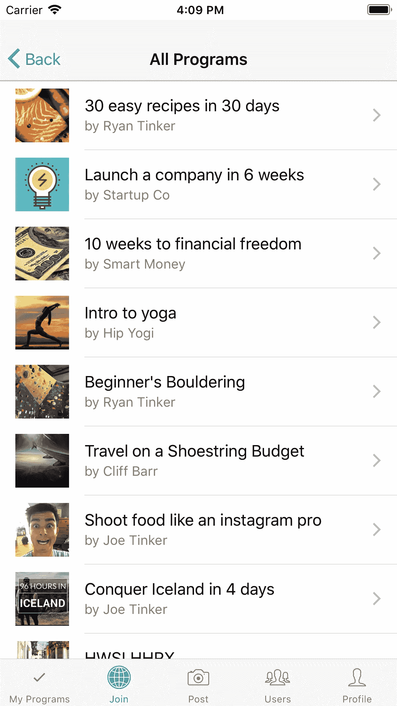

# 介绍 Guidable(专家应用程序)

> 原文：<https://medium.com/hackernoon/introducing-guidable-an-app-for-experts-be9f4b77c96c>

嘿，世界，在过去的一年里，我一直在业余时间开发一个应用程序: [Guidable](http://guidable.org) 。

Guidable 帮助专家创建和销售指导节目。

假设你是烹饪简单健康食物的专家。有了 Guidable，你可以创建一个有指导的循序渐进的程序，教别人如何“在 30 天内烹饪 30 个简单的食谱”——然后卖几块钱。

Guidable 给你一个简单的界面来创建程序，应用程序处理所有的账单(iOS 和 Android 应用程序内支付)——你只需提供内容。

也许你已经在博客或 YouTube 频道上有了内容。太棒了。只要将这些内容复制并粘贴到一个可引导的程序中，你就有了一种新的方法来教导你的追随者。

这是早期的第一个版本。我希望找到一些早期采用者，他们可以测试应用程序，并给我一些反馈，告诉我他们希望看到什么改进。

就是这样。如果你(或你认识的人)可以使用这个应用程序，请下载它，[让我知道](http://twitter.com/ryantinker)它如何进行。

在 [iOS](https://itunes.apple.com/us/app/guidable/id1262838897?mt=8) 和 [Android](https://play.google.com/store/apps/details?id=com.guidable.guidable) 上下载。