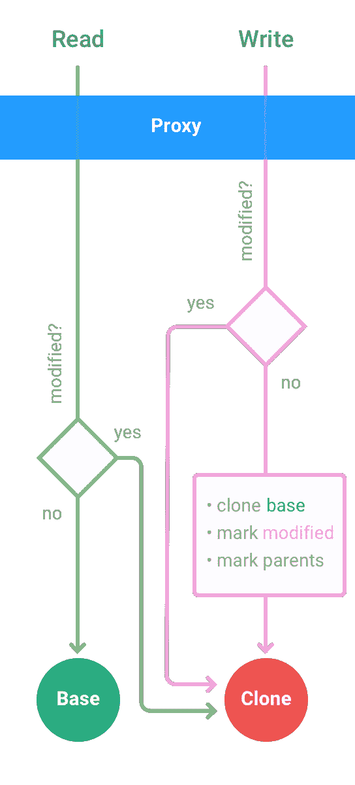
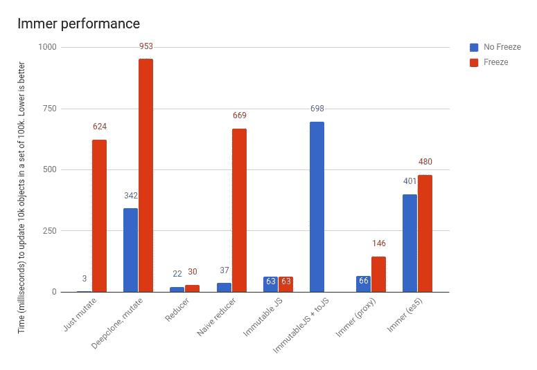

# Immer 简介:不变性是最简单的方法

> 原文：<https://medium.com/hackernoon/introducing-immer-immutability-the-easy-way-9d73d8f71cb3>

不可变的、结构上共享的数据结构是存储状态的一个很好的范例。尤其是在与事件源架构结合使用时。然而，这是要付出代价的。在像 [JavaScript](https://hackernoon.com/tagged/javascript) 这样没有内置不变性的语言中，从以前的状态产生一个新的状态是一项枯燥乏味的任务。为了证明这一点:仅[Redux-生态系统链接](https://github.com/markerikson/redux-ecosystem-links/blob/master/immutable-data.md#immutable-update-utilities)页面就列出了 67 个(！)包来帮助您处理 Redux 中不可变的数据结构。

而且还是；大部分都没有解决根本问题:缺乏语言支持。例如，在 ClojureScript 这样的语言中,`update-in`是一个优雅的概念，任何对应的 JavaScript 基本上都依赖于难看的字符串路径。这些函数容易出错，很难进行类型检查，并且需要记住另一组 API 函数才能提高效率。

那么，如果我们停止反对这种语言，而是拥抱它呢？而不放弃持久数据结构所提供的优雅。这正是`immer`所做的。

*提示:如果不喜欢阅读，也可以看 immer* 的 [*egghead 教程*](https://egghead.io/lessons/redux-simplify-creating-immutable-data-trees-with-immer)

# *生产者*

*Immer 通过编写生产者来工作，最简单的生产者可能是这样的:*

*A minimal (empty) producer will return the original state*

**产生*函数有两个参数。*当前状态*和*生产者*功能。当前状态决定了我们的起点，生产者表达了需要发生在它身上的事情。生产者函数接收一个参数，即*草案*，它是您传入的当前状态的代理。您对草稿所做的任何修改都将被记录下来，并用于生成*下一状态*。在此过程中，*当前状态*将保持不变。*

*因为 immer 使用的是**结构共享**，而我们上面的例子生产者没有修改任何东西，上面的下一个状态就是我们开始时的状态。*

*让我们看看当我们开始在我们的生成器中修改草稿时会发生什么。请注意，producer 函数不返回任何内容，唯一重要的是我们所做的更改。*

*A real producer. All changes to draft are reflected in the next state, which structurally shares untouched items with the previous state*

*在这里，我们实际上看到了*生产*的过程。我们创建了一个新的状态树，其中包含一个额外的 todo 项。此外，第二个待办事项的状态已更改。这些是我们应用到草稿中的更改，它们很好地反映在产生的下一个状态中。*

*但是还有更多。清单中最后的语句很好地显示了在草稿中被修改的状态部分产生了新的对象。但是，未更改的部分在结构上与先前的状态共享。这种情况下的第一个待办事项。*

# *带有生产者的减速器*

*现在我们学习了产生一个新国家的基础知识。让我们在一个示例性 Redux 减少器中利用这一点。下一个要点是基于官方的购物车示例，并加载该州的一批(可能)新产品。产品作为一个数组被接收，使用 reduce 进行转换，然后以它们的 *id* 作为键存储在一个 map 中。*

*A typical Redux reducer*

*这里的样板部分是:*

1.  *我们必须构造一个新的 state 对象，在这个对象中，基本状态被保留，新产品映射被混合进来。在这个简单的例子中，这还不算太坏，但是这个过程必须对每个动作重复，并且在我们想要修改某些东西的每个层次上重复。*
2.  *如果缩减器不做任何事情，我们必须确保返回到现有状态*

*有了 Immer，我们只需要思考相对于当前状态我们想要做出的改变。而不需要努力实际产生下一个状态。因此，当我们在 reducer 中使用 produce 时，我们的代码就变成了:*

*Simplifying the reducer by using Immer*

*注意到掌握`RECEIVE_PRODUCTS`实际上在做什么变得容易多了吗？噪音已经基本消除了。还要注意，我们不处理默认情况。不改变草稿就等于返回基本状态。原减速器和新减速器的性能完全相同。*

# *无附加条件*

*通过修改临时草稿来产生下一个不可变状态的想法并不新鲜。例如 immutableJS 提供了一个类似的机制: [withMutations](https://facebook.github.io/immutable-js/docs/#/Map/withMutations) 。然而，Immer 的最大优势在于，您不必为您的数据结构学习(或加载)一个全新的库。Immer 对普通的 JavaScript 对象和数组进行操作。*

*优势还不止于此。为了减少样板文件，ImmutableJS 和许多其他方法允许您用专用方法表达深层更新(和许多其他操作)。然而，这些路径是原始字符串，不能被类型检查器验证。它们很容易出错。例如，在下面的清单中，在 ImmutableJS 的情况下不能推断出`list`的类型。其他库甚至更进一步，甚至将自己的 DSL 融入到这些路径查询中，支持更复杂的命令，如拼接。代价是在语言中引入一种迷你语言。*

*Immer remains typed doing deep updates*

*Immer 没有遭受这些；它在内置的 JavaScript 结构上运行。任何类型检查者都能完全理解。并且修改数据是通过你已经熟悉的 API 来完成的；语言中固有的东西。*

# *自动冻结*

*另一个酷([😒](https://apps.timwhitlock.info/emoji/tables/unicode#emoji-modal))Immer 的特点是它会自动[冻结](https://developer.mozilla.org/nl/docs/Web/JavaScript/Reference/Global_Objects/Object/freeze)你用`produce`创建的任何数据结构。(在开发模式下)。这样你就能得到真正不变的数据。冻结整个状态会非常昂贵，事实上 Immer 可以冻结更改的部分，这使得它非常有效。而且，如果你的所有状态都是由`produce`函数产生的，那么实际结果将是你的整个状态总是被冻结的。这意味着当你试图以任何方式修改状态时，你将得到一个异常。*

# *Currying*

*好的。最后一个特性:到目前为止，我们总是用两个参数调用`produce`,`baseState`和`producer`函数。但是，在某些情况下，使用部分应用程序会很方便。可以只用生产者函数调用`produce`。这将创建一个新的函数，当它在一个状态中被传递时，该函数将执行生产者。这个新函数还接受任意数量的附加参数，并将它们传递给生成器。*

*如果你不能解析最后的句子，不要担心。归根结底，您可以通过利用 currying 来进一步减少 reducer 的样板文件:*

*A curried producer (also see the earlier listing for comparison)*

**好了，基本上就有了*[*Immer*](https://github.com/mweststrate/immer)*。请随时开始使用它。但是，此时你可能想知道:这是如何工作的？那么，请继续读下去**

# *Immer 是如何工作的？*

*嗯，两个字；1) [写入时复制](https://en.wikipedia.org/wiki/Copy-on-write)。2).代理人。让我画一幅画。*

**

*The producer’s source tree and the draft tree shadowing it*

*绿色的树是原始状态树。你会注意到绿树中的一些圆圈周围有蓝色边框。这些被称为*代理。*最初，当生产者开始时，只有一个这样的代理。get 传递给函数的是`draft`对象。每当您从第一个代理读取任何非原始值时，它将依次为该值创建一个代理。这意味着你最终会得到一棵代理树，它覆盖(或遮蔽)了原始的基础树。然而，到目前为止，只有您在制作程序中访问过的部分。*

**

*High level overview of the internal decisions in a proxy. Delegating to either the base tree or a cloned node of the base tree.*

*现在，只要您试图更改代理上的某些内容(直接或通过任何 API)，它就会立即在与之相关的源树中创建一个节点的浅层副本，并设置一个标志“modified”。从现在开始，对该代理的任何读写都不会在源树中结束，而是在副本中结束。此外，到目前为止任何未修改的父对象都将被标记为“已修改”。*

*当生产者最终结束时，它将遍历代理树，并且，如果代理被修改，获取副本；或者，如果没有修改，只需返回原始节点。这个过程产生一个与先前状态在结构上共享的树。这基本上就是全部了。*

# *没有代理？*

*所有最新的浏览器都有代理。但仍然不是所有地方。最值得注意的例外是微软的 ie 浏览器和安卓系统的 React T5。对于这些目标，Immer 提供了纯 ES5 实现。语义相同，只是慢了一点。用`import produce from "immer/es5"`就可以用了。*

# *性能？*

*从性能角度来看，没有真正的理由不使用 Immer。如[基准](https://github.com/mweststrate/immer#performance)中所指出的；Immer 大约和 ImmutableJS 一样快，比高效的手工减速器慢一倍。这是一个微不足道的差别。但是 ES5 的实现要慢得多，所以对于那些目标上非常昂贵的 reducer(处理成千上万个对象的 reducer)，你可能想要跳过 Immer。幸运的是，Immer 是完全选择加入的，你可以决定是否要使用它。*

**

*通常的口头禅在这里成立:优化开发者体验总是比优化运行时性能更好，除非*通过测量*证明你需要做其他事情。*

# *结束语*

*Immer 在 Mendix 的一个研究日开始时只是一个玩代理的小实验。(在 Mendix，所有开发人员都被期望每月两天提高技能，以任何他们认为合适的方式。听起来很酷？我们正在[招聘](https://www.mendix.com/careers/)。无论如何，它证明了当给开发者一点自由时，作为一个公司为 OSS 做贡献是多么容易。Immer 在第一周已经收集了一千多颗 github 星星，在此之前没有任何官方声明。*

# *TL；速度三角形定位法(dead reckoning)*

*当使用 JavaScript 处理不可变数据时，Immer 提供了一些非常独特的特性。基本上是因为它不对抗语言，而是拥抱语言。*

1.  *Immer 使您能够使用标准的 JavaScript 数据结构和 API 来产生不可变的状态*
2.  *强类型；如果你的状态对象有一个类型，你将得到基于它的全部帮助*
3.  *开箱即用的结构共享*
4.  *开箱后冻结的对象*
5.  *显著减少样板文件。噪音更少，代码更简洁*

*所以， [✨](https://apps.timwhitlock.info/emoji/tables/unicode#emoji-modal) [明星吧](https://github.com/mweststrate/immer) [✨](https://apps.timwhitlock.info/emoji/tables/unicode#emoji-modal) ！玩弄它，并利用它为你服务。而且，因为已经有 67 个以上的 JavaScript 不变性库…*

**鸣谢:感谢* [*亚光红宝石*](https://medium.com/u/1bbc91942d0b?source=post_page-----9d73d8f71cb3--------------------------------) *的校对，感谢* [*贾斯汀·赫达尼*](https://github.com/jkhedani) *的精彩插图**