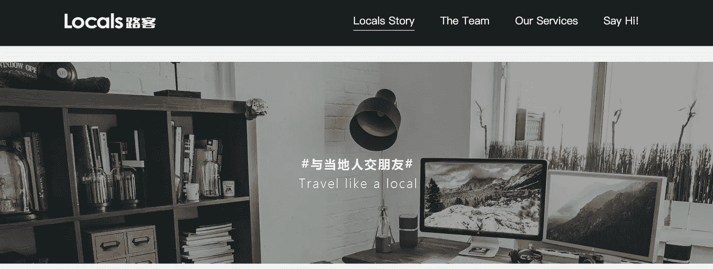
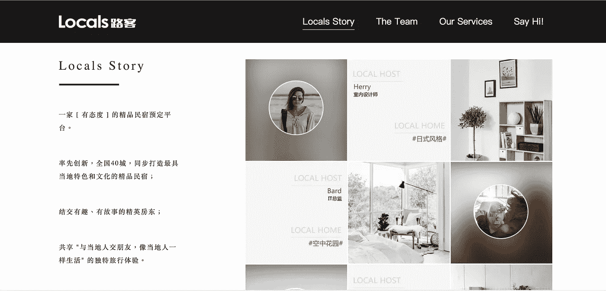

# 中国更高端的 Airbnb。

> 原文：<https://medium.com/hackernoon/introducing-locals-the-higher-end-airbnb-in-china-airbnb-can-you-try-this-too-bd313516a588>

## Airbnb 你也可以试试这个吗？

这是我的回归视频。最后我附上了我的视频。如果你喜欢看到我谈论我对这家公司的看法，请在最后单击我的视频。但是对于没有时间的人来说。只是读… 2 分钟。

Locals 是一家来自中国的初创公司，它提供的服务类似于高端的 T2 Airbnb T3 服务。我分享这个故事是因为我认为也许企业或企业家可以利用这个想法？或者也许 airbnb 可以用这个来搞个测试群。他们提供的服务对主人帮助很大。

1.  为了列出你的房间，你必须满足更高的设计标准，化妆品或床上用品的质量，甚至室内设计也必须很好，但他们也有设计师或承包商。作为东道主，你可以利用所有这些服务。我很确定你必须付费，但是如果他们已经有了一定的标准就好了，而且你可能会少付费，比如特许经营权。
2.  更高的标准意味着更高的价格。他们平均每晚收费 550 元人民币，是一般竞争对手的两倍。但据他们说，入住率是 70%。那就有不错的收入了。
3.  他们给每台主机分配一名助理，其中一名助理将负责 5 台主机或类似的事情。我对这个功能感觉非常好，我不得不说，随着 airbnb 的发展，主机得到的支持越来越少。如果我知道作为一个主人，我可以向某些人寻求帮助，我会很高兴。

4.他们的投资者包括:真基金、顺为资本、洪泰基金。相当大的投资者。而顺为在小米之下。

这还是个小公司，但是嘿！让我们成为早期采用者。我还没有真正尝试过，但我想至少分享一下这个想法。