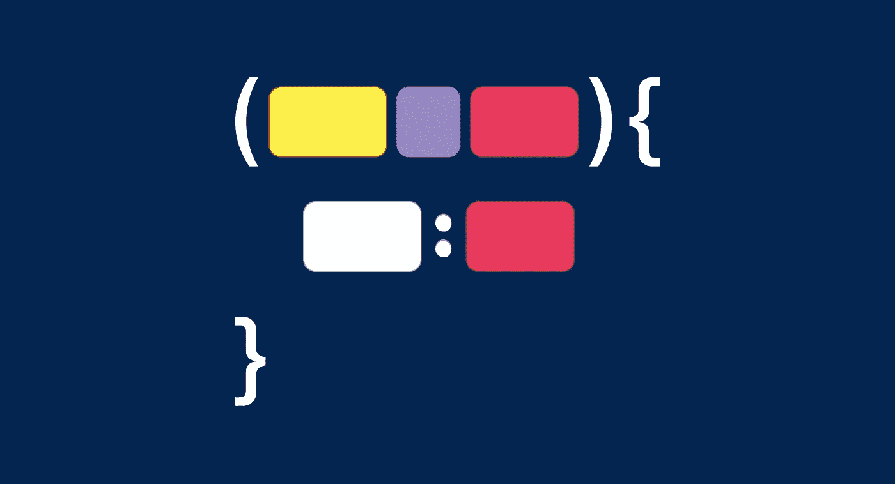
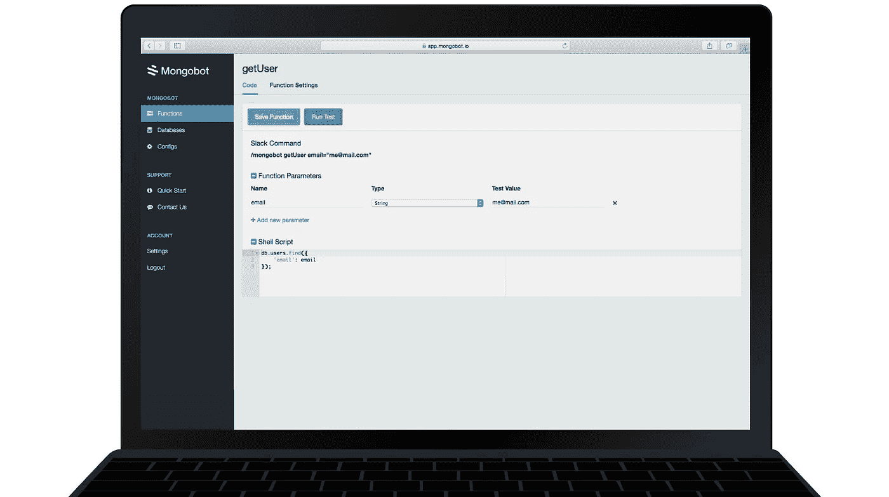
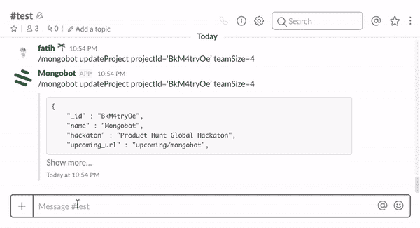

# 介绍 Mongobot:一个可以运行 MongoDB 查询的 Slackbot

> 原文：<https://medium.com/hackernoon/introducing-mongobot-a-slackbot-that-can-run-mongodb-queries-8dda660fa17e>

难道您的后台应用程序中没有解决重复性任务的方案吗，比如更改用户输入或查询一个 [MongoDB](https://www.mongodb.com/) 集合？即使您的开发人员习惯于编写 MongoDB 查询，所有团队成员的感受也可能不同。这可能会让你的团队更加依赖你的开发人员。

我们的目标是简化您的工作流程，并很高兴地宣布 Mongobot 是从 Slack 查询 MongoDB 的唯一方式。

我们在推出 Mongobot 时有两个主要目标:

*   给开发人员更多的自由，让他们能够在 Slack 上查询 MongoDB。🤖
*   让非开发人员也能方便地查询 MongoDB。

## Mongobot 功能

Mongobot 函数是可重用的 MongoDB 查询，可以从 Slack 调用。

像所有函数一样，它们也可以带参数，这些参数可以在您的 shell 脚本中使用。这样，每次调用函数时，都可以根据给定的参数定制查询。

## 松弛查询

要从 Slack 调用一个函数，您唯一需要的就是一个函数名和它的参数。让我们看看下面的例子。简单对吗？

## 获得测试版访问权限

我们一直在努力构建功能，但 Mongobot 现在处于测试阶段！我们会不时发送邀请。

为了获得你的测试版，你可以[从 Mongobot 的网页上订阅。](https://mongobot.io)

—

干杯🥂

蒙古机器人船员