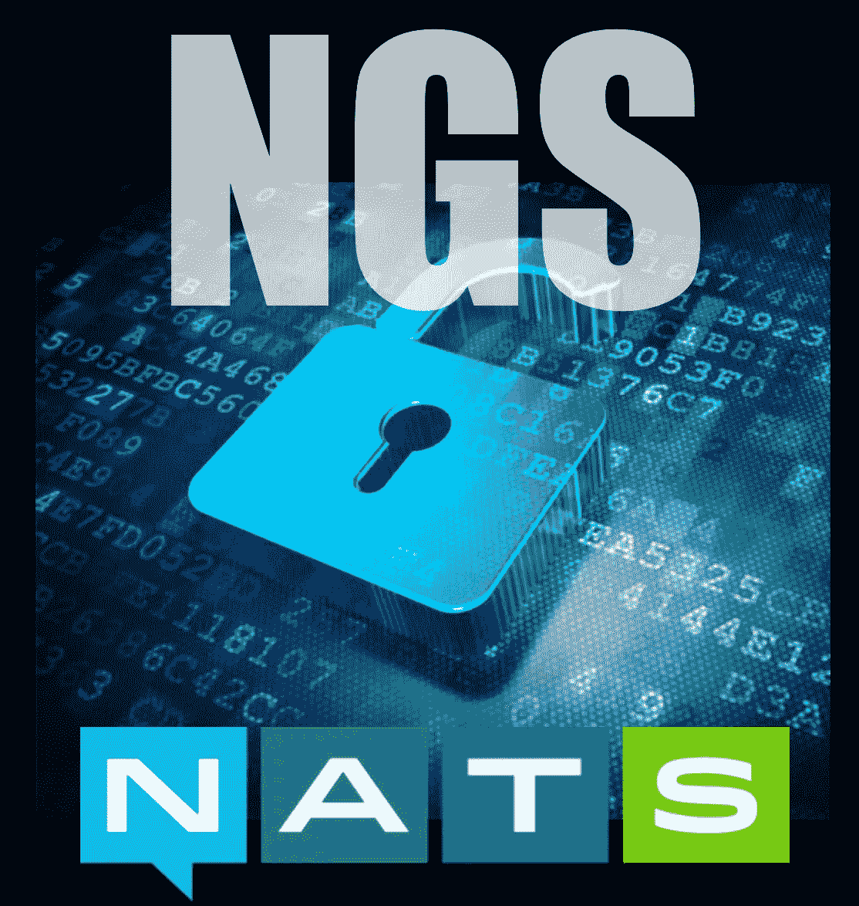

# 介绍 NGS

> 原文：<https://medium.com/hackernoon/introducing-ngs-d3d216d0daef>

## 世界上第一个安全、多云、边缘就绪的全球消息传递系统。

我们生活在一个高度互联的世界，这个世界彻底改变了我们的生活方式。互联网和全球蜂窝网络的兴起改变了人们相互交流的方式。很少有人能看到自 90 年代初以来我们已经走了多远。我们现在有超过 42 亿的人通过互联网连接，甚至更多的人通过全球移动网络连接。我们预计来自发展中国家的巨大增长将继续推动这些数字和机会不断攀升。

大多数人没有意识到的是，世界上的数字系统、服务和设备也存在同样的机会。到 2022 年，预计[将有 500 亿台设备和系统](https://www.statista.com/statistics/471264/iot-number-of-connected-devices-worldwide/)尝试连接。所有这些高度互联的事物所带来的机遇将会使我们从互联网和全球蜂窝网络中所看到的人类相形见绌。

然而，挑战是存在的。让系统进行通信并不是一个新问题，这个问题以前就已经解决了。有许多技术可供选择，这些技术在特性和功能上差别很大，但是一旦选择了，它们通常存在于组织内部的小仓库中。我花了超过 25 年的时间来构建这些类型的系统，我总是对它们能解决的问题感到惊讶。但是世界已经变了。有了云、边缘和物联网，许多系统根本不是为这个新的超互联世界而构建的。

2010 年，我为自己建了一个信息系统[【NATs . io](https://nats.io)。它做的正是我想要的，没有我不想做的。它有一些简单的模式可供选择，请求/回复、发布/订阅和负载平衡队列。它很简单，非常快，并且易于使用和操作。它会不惜一切代价保护自己，因此非常适合分布式、基于微服务的云原生世界，其中通信结构需要始终可用。

早期我们在安全方面做得不多。我们使用 NATS 构建的系统将在其上构建安全层，而不依赖于传输。从技术上讲，我仍然相信这种方法，但是这个世界需要具有下一代身份验证和授权的安全传输。

2016 年，该团队开始努力寻找我们可以做些什么来将安全性引入 NATS 生态系统。我们希望解决方案在理念上与 NATS 保持一致，也就是说，它必须简单，而且必须可行。我们在这方面取得了一些不错的进展，但我相信我们可以做得更多，我只是当时没有解决方案。

2018 年初，我们决定围绕 NATS 技术组建一家公司，让 NATS 加入 [CNCF](https://cncf.io) 。这家名为 [Synadia](https://synadia.com) 的公司是由一个了不起的、才华横溢的团队组成的，他们对通信和信息系统有着深刻的了解。我们的团队知道如何构建大规模可伸缩和有弹性的系统。我们这样做已经有 100 多年了！然而，我敏锐地意识到创业公司将开源软件商业化所面临的挑战。世界需要开放源码软件，但初创公司需要生存和发展，目前的商业模式无法胜任这项任务。我坚信未来只有三种模式。

1.  *将 OSS 作为服务运行*
2.  *将操作系统与硬件捆绑在一起*
3.  *为 OSS 增加服务。*

当您构建像 NATS 这样简单易行的东西时，选项 1 就成了一个挑战。我们真的需要跳出框框思考。这又把我们带回了机遇号和 ngs 号。

我们的想法是推出世界上第一个全球可用、始终在线且安全的消息和通信技术。面向全球所有数字系统、服务和设备的全球通信工具。该系统建立在 NATS 技术基础上，将在一个单一的 URL 下全球可用，默认情况下是安全的，并允许通信域之间安全和方便的数据共享。这些域可以是组织、公司、城市、州，甚至是国家和政府之间的域。这是一个全球性的工具。该系统将在每个云提供商中可用，可轻松扩展到家庭、办公室或汽车中的边缘计算，以及 IOT 设备。根据设计，它将以联合的方式运作，多家公司参与该系统的成功。它将培育一个由安全和高度互联的系统、服务和设备组成的生态系统，以促进安全共享。我们相信这将带来前所未有的难以置信的机遇。

经过一年的发展，基于 NATS 8 年多的生产质量技术和 100 多年的综合经验，我们自豪地宣布 NGS。在接下来的几周里，我们将会更多地讨论这个系统的细节。有一个免费层，使它很容易开始。您可以在不到 5 分钟的时间内建立连接并向全球发送消息。

提前在 https://synadia.com/ngs[报名。我们将于 12 月 11 日至 15 日在西雅图举行的 KubeCon + CloudNativeCon 大会期间开放该系统。](https://synadia.com/ngs)

*今天你想连接什么？*