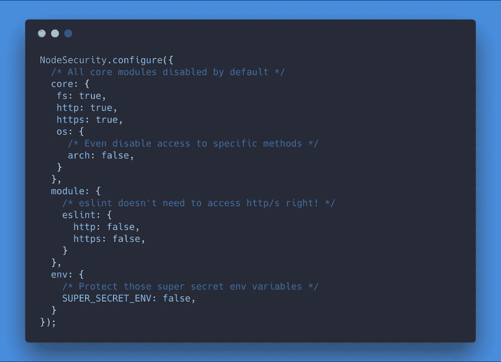
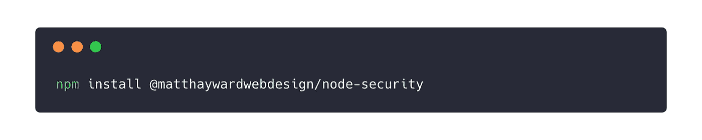
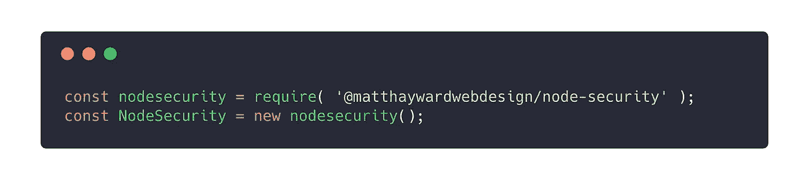
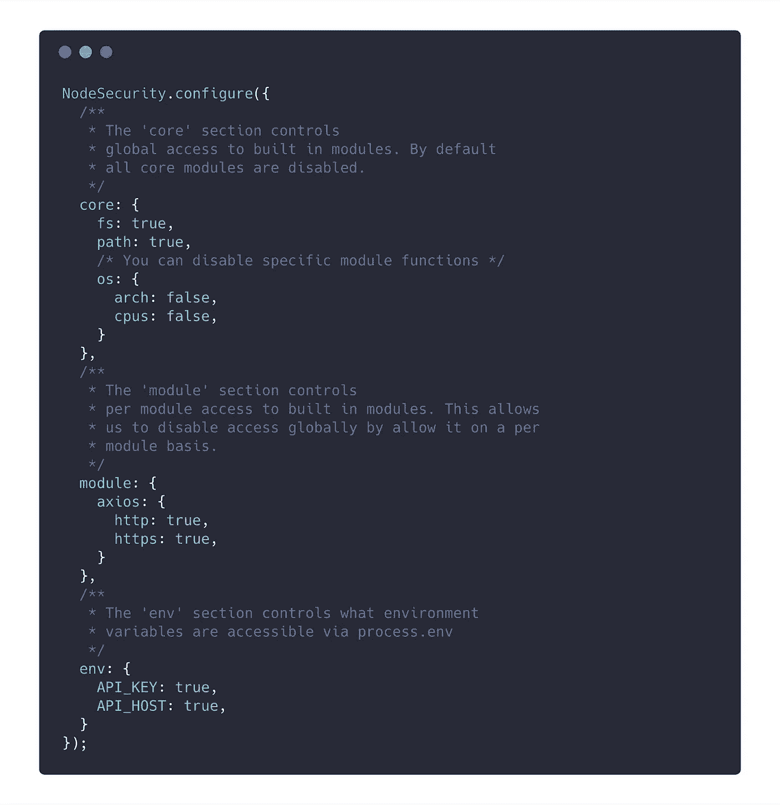

# 介绍 NodeSecurity:控制模块访问的更好方法！

> 原文：<https://medium.com/hackernoon/introducing-nodesecurity-a-better-way-to-control-module-access-498a9493c35f>

受[大卫·吉尔伯森](https://medium.com/u/f735d3b0f2f3?source=post_page-----498a9493c35f--------------------------------)最近的帖子([https://hacker noon . com/npm-package-permissions-an-idea-441 a 02902d 9 b](https://hackernoon.com/npm-package-permissions-an-idea-441a02902d9b))和最近 NPM 包被劫持的一些问题的启发，我刚刚在 GitHub 上发布了第一版 [NodeSecurity。](https://github.com/matthaywardwebdesign/node-security)

大卫在他的帖子中写道…

> [*想象一下*](https://hackernoon.com/tagged/imagine) *一个包，由 npm(或者同样值得信赖和有远见的人)创建和维护。姑且称之为@npm/permissions 吧。*
> 
> *您可以将此@npm/permissions 包作为第一个导入文件包含在您的应用程序中，或者像 node -r @npm/permissions index.js 一样运行您的应用程序。*
> 
> *这将覆盖 require()来执行包的 package.json 权限属性中声明的权限。*

所以我让它发生了！

# 它是如何工作的

NodeSecurity 通过覆盖节点来工作。JS `require()`函数，允许我们实施访问约束。

# 使用

首先将 NodeSecurity 包含在项目中应用程序入口点的最顶端(在任何其他要求之前),并创建一个新实例。

注意:如果你使用 ES6 导入，你需要创建一个单独的文件，在应用程序的入口点导入。如果不这样做，就不可能在加载任何其他模块之前配置 NodeSecurity。

**配置节点安全性**

🎉**大功告成！**🎉

从这一点开始，我们的配置必须允许所有必需/导入的模块。

# 我需要你的帮助

NodeSecurity 还没有接近完成，毫无疑问有办法绕过它的[安全](https://hackernoon.com/tagged/security)！如果您有任何反馈、建议或想要投稿，请联系我们或提交您的简历！

您可以通过 GitHub repo 访问:

 [## matthaywardwebdesign/节点安全性

### key:控制哪些 npm 模块可以访问的最简单方法-matthaywardwebdesign/node-security

github.com](https://github.com/matthaywardwebdesign/node-security)