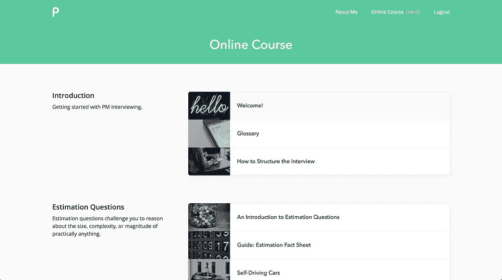
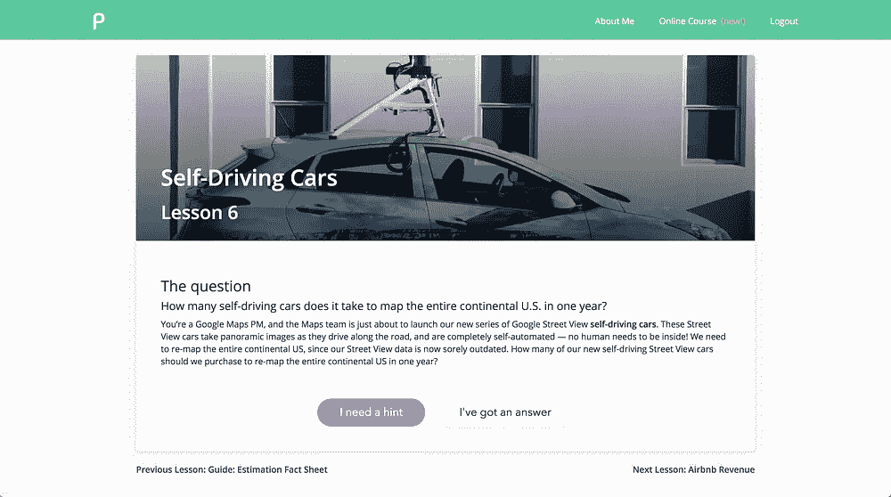

# 介绍 PMLesson，动态产品管理面试准备

> 原文：<https://medium.com/hackernoon/introducing-pmlesson-dynamic-product-management-interview-prep-9a88b9957706>

## 通过 PMLesson，让您的产品管理面试准备更上一层楼。

产品管理是一个不可思议的职业机会。很少有职业能让员工涉足这么多不同的领域。在谷歌，我和营销、工程、设计、数据分析、公共关系、用户研究、法律、商业、质量保证等等团队一起工作。

有机会领导团队，与许多不同的专业领域合作，并创造惊人的产品。有什么不喜欢的？

但是，有一个条件。

产品管理面试真的是****难**。事实上，像谷歌和脸书这样的大多数公司的接受率都在 1%以下。申请时，我每周花几个小时准备产品管理面试，但很多时候，我感到失落、沮丧和困惑。**

# **PMLesson 简介**

**今天，我们很高兴地宣布 [PMLesson](http://pmlesson.com) ，这是一门针对产品管理面试准备的交互式动态在线课程。**

**我们创建了 PMLesson，因为我们认为准备产品管理面试不应该如此困难。我们已经创建了一个教练课程，我们真的相信它可以让每个人都能通过 PM 面试，获得他们梦想的工作。**

********

**Screenshots of PMLesson’s online course.**

**PMLesson 基础课程包括赢得 PM 面试所需的核心要素。有一些很棒的预防性维护书籍，但没有什么能打败实际的实践，这就是为什么我们的课程包括超过 25 节课和动态问题来测试你的产品管理面试。**

# **课程**

**重要的是，该课程仍然包括重要的人的因素。该课程包括:**

*   **25 节产品管理课，包括动态面试问题**
*   **方便的指南，如我们的评估概况表和面试结构模型**
*   **全面的简历审查**
*   **访问我们的 Slack Channel 社区**
*   **直接一对一联系我，询问问题、反馈和指导**
*   **提前独家获得免费预防性维护课程和博客帖子**

# **现在就买，六折**

**该课程的基本版本对公众完全免费，可以在 PMLesson.com 找到。对于我们的发布，我们正在为**前 50 名订户**提供 60%的特别折扣。您可以通过点击下面的特殊链接获得折扣:**

**[**特别链接:获得 PMLesson 在线课程六折优惠，前 50 名订阅者！**](http://pmlesson.com/upgrade?promo_code=PMLAUNCH)**

**我希望你喜欢 PMLesson，我渴望看到你加入我们的 Slack 社区，在那里你可以直接与我、[尼哈尔](https://medium.com/u/63cee77917bb?source=post_page-----9a88b9957706--------------------------------)和[雅各布](https://medium.com/u/3f60bfdca3bf?source=post_page-----9a88b9957706--------------------------------)(pm lesson 的创始人)互动。请在[脸书](http://facebook.com/pmlesson)和[推特](http://twitter.com/pmlesson)上关注我们，下周将有更多独家交易！**