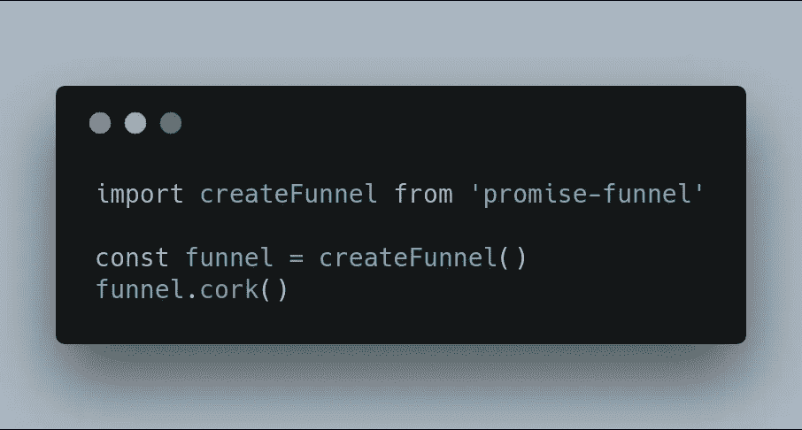

# 引入承诺漏斗

> 原文：<https://medium.com/hackernoon/introducing-promise-funnel-93e7d46ceb31>

今天，我将简要介绍一个新的库，它可以帮助您管理应用流程。

这个用例的灵感来自我最近遇到的两个特殊问题。

在第一个问题中，我有一个 React 应用程序，它可以立即并定期对两者进行身份验证。在每次身份验证期间，检索数据的请求需要等待。在此期间，我不想收到或显示未经验证的响应错误。

在第二个问题中，我有一个数据库微服务，它立即调用发送查询的函数，但是它需要在实际发送任何查询之前完成到数据库的连接。

这个问题似乎有些普遍。这就是`promise-funnel`的用武之地！你可以在 NPM 上查看[。](https://www.npmjs.com/package/promise-funnel)

## 概念

promise-漏斗是一个非常小的(4kb)和非常简单的库。它导出三个函数。

**Wrap:** 任何想要被漏斗化的函数都必须被包装。

**塞住:**要暂停执行功能，您可以塞住漏斗。所有函数执行都将被收集，以便以后运行。

**开启:**要再次开始执行，并执行漏斗堵塞时应该运行的每个函数，您可以开启漏斗。

当结合这些简单的概念时，我们能够为我们的应用程序创建一个强大的控制流！

## 如何使用它

下面是如何将它用于需要在发送任何查询之前进行连接的数据库应用程序。

您可以看到查询立即被阻塞，只有当数据库连接成功时才被解除阻塞。这意味着服务可以立即接受请求，但是在数据库连接发生之前它不会执行任何查询！

现在让我们看一下我前面提到的认证例子。

每隔五分钟，用户再次登录。当登录发生时，每个用户请求都会失败。因此，我们没有让这种情况发生，而是阻塞了获取请求，直到登录完成。现在用户不会被身份验证阻止..虽然他们可能会延迟！

如果您想知道，`createFunnel`每次都会创建一个新的漏斗实例。这意味着您可以安全地将不同的操作分开。

## **用自己的承诺**

并不是每个环境天生都有承诺。如果你想通过`promise-funnel`使用像蓝鸟这样的库，你可以！

## 承诺的部分

到目前为止，我们还没有真正看到这个库如何使用 Promise。当函数被包装且漏斗被堵塞时，函数不会立即执行。而是返回一个`Promise`。只有当漏斗打开时，它才会溶解或剔除。

上面的代码片段应该显示，打开漏斗将解析包装函数返回的承诺。

这意味着任何在包装函数上使用`await`或在包装函数上使用`.then().catch()`的函数都不会继续，直到漏斗打开。

你有它！`promise-funnel`是一个很小的图书馆，但我希望你们都能发现它的用处。

要安装它，您可以使用以下命令:

`npm install promise-funnel --save`

你也可以在这里查看源代码:【https://github.com/JustinDFuller/promise-funne】T4l

## 反馈

这是一个全新的库，显然还可以改进。有什么建议吗？例如，它可能会受益于选择性地只开放一定量的并发性，以避免大的突发。也可能有其他方法来完成承诺漏斗应该做的事情。欢迎在评论中分享建议和替代工具！

嗨，我是贾斯汀·富勒。很高兴你看了我的帖子！我需要让你知道，我在这里写的一切都是我自己的观点，并不代表我的雇主。所有代码样本都是我自己的，与美国银行的代码完全无关。

我也很乐意收到您的来信，请随时通过 [LinkedIn](https://www.linkedin.com/in/justin-fuller-8726b2b1/) 、 [Github](https://github.com/justindfuller) 或 [Medium](/@justindanielfuller) 与我联系。再次感谢阅读！