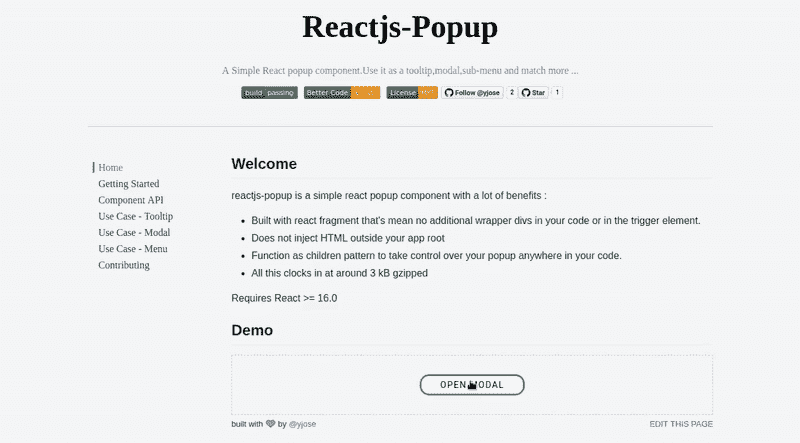

# reactjs-popup 简介🎉(3kb)—反应弹出窗口、模态、工具提示和菜单—集于一身

> 原文：<https://medium.com/hackernoon/introducing-reactjs-popup-modals-tooltips-and-menus-all-in-one-227de37766fa>



reactjs-popup Home page [https://react-popup.elazizi.com/](https://react-popup.elazizi.com/)

> 本文将向您简要介绍使用 reactjs-popup 可以做什么，以及如何有效地使用它。

今天，我们很高兴地宣布 reactjs-popup 1.0。

eactjs-popup 是一个简单且非常小(3 kb)的 react 弹出组件，有多个用例。
我们创建了 reactjs-popup 来为我们的项目创建一个颜色选择器 [picsrush](https://picsrush.com/) 一个新的在线图像编辑器。过了一段时间，我们决定让 GitHub 和 npm 库中的每个人都可以使用它。

**为什么您需要选择 reactjs-popup 而不是其他所有实现？**

*   使用 react 片段构建，这意味着在您的代码或触发器元素中没有额外的包装 div。😮
*   不要在应用程序根之外注入 HTML。📦
*   函数作为子模式来控制代码中任何地方的弹出窗口。💪
*   模态、工具提示、菜单、吐司(即将推出) :都在一个组件中🏋️
*   全风格定制。👌
*   好用。🚀
*   所有这些时钟都压缩了大约 3 kB。⚡️
*   动画(即将推出)。

reactjs-popup 对你的下一个 react 项目有什么帮助？

如果你需要创建一个简单的模态，工具提示或者嵌套菜单，这个组件是你最好的选择。但是首先让我们从组件开始。

# 入门指南

此软件包在 npm 存储库中以 reactjs-popup 的形式提供。它可以在所有流行的捆扎机上正常工作。

[](https://github.com/yjose/reactjs-popup) [## yjose/reactjs-popup

### reactjs-popup - React Popup 组件-模态，工具提示和菜单-都在一个

github.com](https://github.com/yjose/reactjs-popup) 

```
npm install reactjs-popup --save
#using yarn
yarn add reactjs-popup -S
```

现在您可以导入组件并开始使用它了:

```
import React from "react";
import Popup from "reactjs-popup";

export default () => (
  <Popup trigger={<button> Trigger</button>} position="right center">
    <div>Popup content here !!</div>
  </Popup>
);
```

您也可以将它与 function as children 模式一起使用。

```
import React from "react";
import Popup from "reactjs-popup";

export default () => (
  <Popup trigger={<button>Trigger</button>} position="top left">
    {close => (
      <div>
        Content here
        <a className="close" onClick={close}>
          &times;
        </a>
      </div>
    )}
  </Popup>
);
```

完整组件 API:[react js-弹出组件 API](https://react-popup.elazizi.com/component-api/)

# 用例🙌

*   [工具提示用例](https://react-popup.elazizi.com/use-case---tooltip/)
*   [模态用例](https://react-popup.elazizi.com/use-case---modal/)
*   [菜单用例](https://react-popup.netlify.com/use-case---menu/)

> 一次演示


reactjs-popup demo (Modal,tooltip,Menu)

## reactjs-popup 的下一步是什么？

reactjs-popup 的下一个版本将支持创建完全定制的简单 Toast，但我们的重点是将动画 API 添加到组件中，因此如果您有任何想法，请随意💪。

感谢阅读！如果你认为其他人应该阅读这篇文章并使用这个组件，请为我鼓掌，发微博并分享这篇文章。

记得在 Medium 上关注我，这样你就可以得到关于我未来帖子的通知。

> 现在轮到你尝试了！！！

# 表示支持！

就这些，谢谢大家的关注，请明星 [**回购**](https://github.com/yjose/reactjs-popup) 以示支持…

> 【https://elazizi.com/】*阅读更多故事*[](https://elazizi.com/)

**