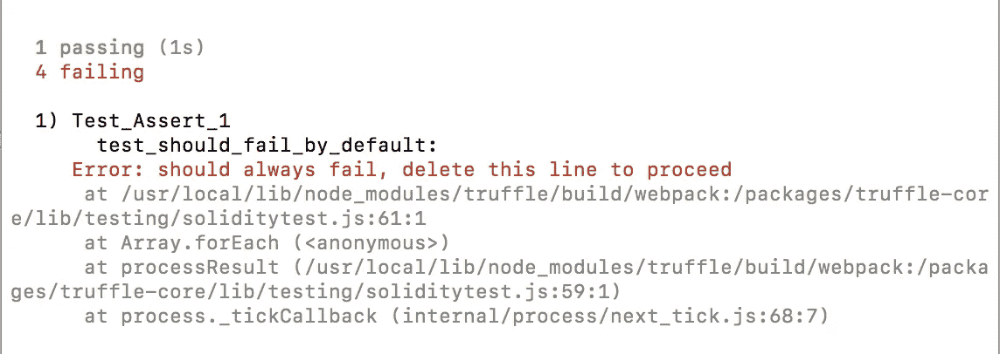
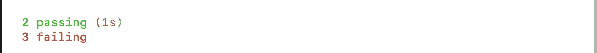

# 介绍 Solidity Koans

> 原文：<https://medium.com/hackernoon/introducing-solidity-koans-cf51a5bc25e5>


## 通过测试学习以太坊编程

受 [Ruby Koans](http://rubykoans.com/) 、[的启发，Solidity Koans](https://soliditykoans.org/) 通过简单的、一口大小的编程练习来引导你以温和的方式学习 Solidity。目标是学习 Solidity 语言、语法、结构，以及如何创建安全、高效的智能合同。它从基础开始，通过汇编代码和安全考虑事项，慢慢地引导您了解 EVM 的内部工作原理。

[](http://soliditykoans.org) [## 坚固性 Koans

### 通过测试驱动开发学习 Etherem 编程。Koans 带你沿着开悟的道路，为了…

soliditykoans.org](http://soliditykoans.org) 

通过测试和练习，我希望让你思考区块链和[分布式系统](https://www.ethos.io/understand-blockchains-from-a-distributed-computing-perspective)的边缘案例和内在属性。你的目标是解决每个难题并通过测试，测试驱动开发风格。

# 如何开始

1.  克隆 [Solidity Koans](https://soliditykoans.org/) repo:

```
git clone [https://github.com/nczhu/solidity-koans.git](https://github.com/nczhu/solidity-koans.git)
```

2.安装依赖项:

```
npm install -g truffle ganache-cli
```

3.使用命令`ganache-cli`启动 Ganache

4.在新的选项卡中，检查`/test`目录，其中每个测试代表一个 koan。要开始使用最简单的(也是第一个)Koan，请运行:

```
truffle test **./test/Test_assert_1.sol**
```

您应该会看到失败的测试:



5.为了通过测试，在每个文件中用期望值填充下划线`__`:

```
// You can test if a condition returns true
function test_should_return_true() public {
    Assert.isTrue(__, “should return true”);
}
```

应该是…

```
// You should fill in "true"
function test_should_return_true() public {
    Assert.isTrue(true, “should return true”);
}
```

6.通过所有测试以完成关卡。



你可以通过查看`/test`目录找到后续级别。我建议按顺序解决这些问题:

```
truffle test ./test/<**Koan_subject**>_<**koan_order**>.sol
```

# 期待什么

Solidity Koans 使用 [Ganache](https://truffleframework.com/ganache) 在您的本地机器上运行个人以太坊区块链，并使用 [Truffle](https://truffleframework.com/) 作为其测试框架。每个 Koan 都是一个包含失败测试的实际智能契约，您需要解决它。我已经加入了有用的内联评论，为你指出正确的方向。还提供了相关文档和文章的链接，帮助您了解更多信息。

目前，Solidity Koans 拥有 [7 个基本级别](https://soliditykoans.org/)，涵盖了 Solidity 最重要的方面，比如[原语](https://github.com/nczhu/solidity-koans/blob/master/test/Test_Bits_Bytes_3.sol)和[复杂](https://github.com/nczhu/solidity-koans/blob/master/test/Test_Arrays_4.sol) [数据](https://github.com/nczhu/solidity-koans/blob/master/test/Test_Mappings_5.sol) [类型](https://github.com/nczhu/solidity-koans/blob/master/test/Test_Structs_6.sol)，以及[内存和存储](https://github.com/nczhu/solidity-koans/blob/master/test/Test_Storage_7.sol)的区别等重要概念。

例如，[级别 7](https://github.com/nczhu/solidity-koans/blob/master/test/Test_Storage_7.sol) 看起来是这样的:

## **有助于巩固公案**

Solidity Koans 是 Github 上的一个[开源项目，对任何拉取请求或改进意见开放。](https://github.com/nczhu/solidity-koans)

以太坊白皮书概述了更多值得在 Koans 中探索的技术细节。我目前正致力于围绕编码模式、常见的安全隐患和揭开 EVM 的神秘面纱来发展未来的水平。

要做出贡献，只需:

1.  [**叉本回购**](https://github.com/nczhu/soliditykoans)
2.  [**Examine assert . sol**](https://github.com/nczhu/solidity-koans/blob/master/contracts/Assert.sol):我修改了松露测试框架，提供了 UX 增强功能，比如处理双下划线`__`。欢迎重构建议。

3.提交问题，设计自己的关卡，然后发出[拉动请求](https://yangsu.github.io/pull-request-tutorial/)！

# **感谢:**

*   [edge case Ruby Koans](http://rubykoans.com/)寻找灵感
*   [阿格曼](https://github.com/agemanning)，[翁滚号](https://github.com/onggunhao)反馈和审核本帖草稿