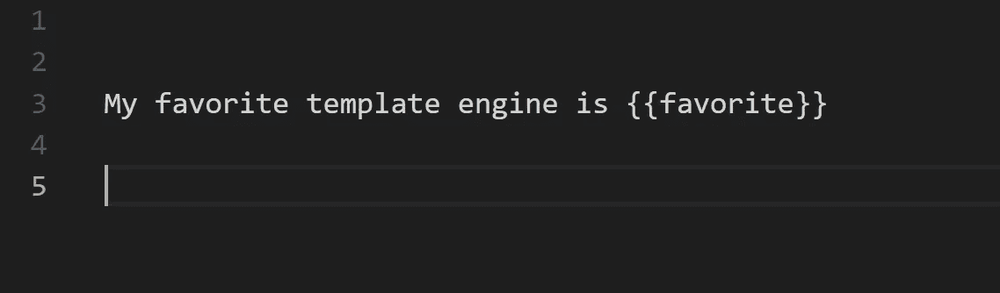

# Squirrelly 简介:一个快速、轻量、简单的 JS 模板引擎

> 原文：<https://medium.com/hackernoon/introducing-squirrelly-a-fast-lightweight-and-simple-js-template-engine-70a873d765c9>

*如果你赶时间，可以到 Github Repo* [*这里*](https://github.com/nebrelbug/squirrelly) *或者浏览一下 https://squirrelly.js.org**的文档。或者，在这里查看性能对比*[](https://github.com/nebrelbug/squirrelly-benchmarks)**。[提示:古怪是最快的]**

**

*The ‘hello world’ of template engines*

# *对新模板引擎的需求*

*不久前，我开始寻找完美的 JavaScript 模板引擎。它必须简单、高性能、灵活、**和轻量级。问题是，没有一个模板引擎真的符合要求。***

*其中一个主要问题是大小和功能之间的权衡——大多数流行且灵活的模板引擎都会增加很多开销。根据 [Bundlephobia](https://bundlephobia.com/) 的说法，这里是一些著名的模板引擎的捆绑成本(gzipped 和 minified)。*

*   *努恩朱克斯: **23.3KB***
*   *帕格: **231.8KB***
*   *车把: **21KB***
*   *Swig: **10.2KB***

*相比之下，一些更轻量级的模板引擎——如 doT 或 Mustache——缺少预编译、助手、过滤器、自定义分隔符或运行本机代码等功能。*

# *松鼠来救援了！*

*Squirrelly 的重量只有 **2.6KB** ，但它仍然具有难以置信的灵活性和高性能——事实上，在 MarkoJS 开发的基准测试中，Squirrelly 几乎每次都在速度方面胜过其他模板引擎！*

*是什么让 Squirrelly 这么快*

*   *古怪地不使用令牌解析器。相反，它使用一个主正则表达式来查找标签之间的内容。*
*   *默认情况下，Squirrelly 预编译。没错，再也不需要运行比较预编译和编译的基准测试了！Squirrelly 接受一个字符串作为输入，返回一个函数作为输出。*

***功能:***

*   *助手，类似车把。助手也可以有助手块，作为助手内容的子类(例如`{{#else}}`)*
*   *本机助手(直接编译成 JavaScript 代码的助手。)*
*   *自定义分隔符(对于用 LaTek 之类的语言编写很有用)*
*   *分音*
*   *过滤器(如 Nunjucks 或 Swig)*
*   *仅**2.6 kb gzip***
*   ***对空白不敏感***
*   *自动退出*
*   ***适用于任何语言，不仅仅是 HTML***
*   *评论*
*   *支持快速开箱即用*
*   *贮藏*

# *例子*

***评论***

```
*{{!--This is a comment--}}*
```

***参考文献***

```
*{{title}}*
```

***过滤器***

```
*{{title|filter}}*
```

***助手(类似函数，但在模板中)***

```
*{{helpername(parameters)}}Some content{{#helperblock}}Other content{{/helpername}}*
```

***条件句(一种助词)***

```
*{{if(options.value==="hello")}}
Hi!
{{#else}}
How are you?
{{/if}}*
```

***分音***

```
*{{include(mypartial)/}}*
```

# *与其他模板引擎相比很奇怪*

*性能基准就在这里，使用来自马科斯的测试运行:[https://github.com/nebrelbug/squirrelly-benchmarks](https://github.com/nebrelbug/squirrelly-benchmarks)。Squirrelly 几乎总是最快的，通常也是编译后最小的。*

# *下一步怎么样*

*更多信息，请阅读 squirrelly.js.org[的文档。如果你喜欢这篇文章，给它一些掌声，或者开始 Github Repo](https://squirrelly.js.org) ！*

*Squirrelly 也可以使用合作者。通过前往存储库并创建问题或拉式请求来加入团队。*