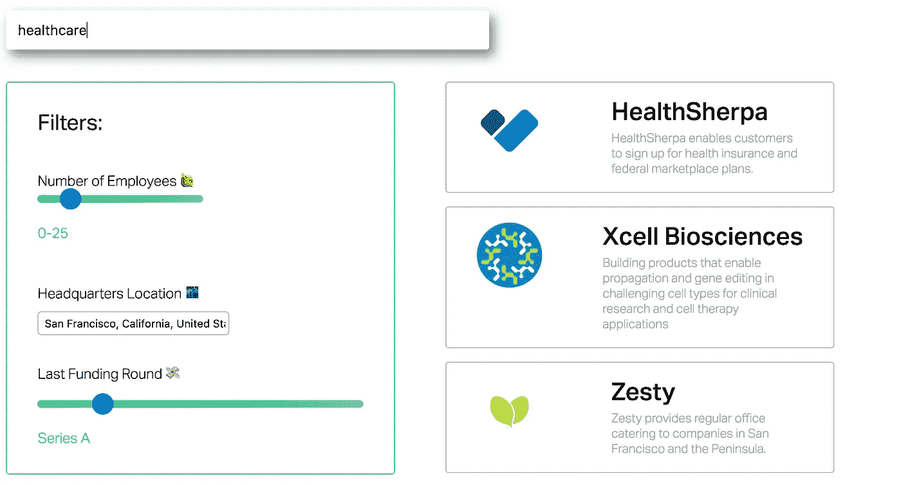

# 介绍 StartupSift

> 原文：<https://medium.com/hackernoon/introducing-startupsift-5571c74ed240>

## 一个针对突破性创业的搜索引擎

闯入技术世界感觉就像独自坐在中学的午餐桌上试图结交新朋友。整个过程令人焦虑和困惑。

我从朋友、导师和同龄人那里听到的最常见的建议是简单地“走出我的舒适区，去接触新的人。”然而，我们都知道，说起来容易做起来难。

除了令人生畏，我还发现，对于那些之前在社区中没有人脉的人来说，甚至不知道从哪里开始都极具挑战性。

> 我应该在哪里申请工作？什么类型的公司应该考虑加入？机会在哪里，有没有适合我的角色？

我们都知道找工作/实习的艰难。我们打开了 100 个标签，20 个不同的职业页面，花了几个小时研究，发邮件和填表。

都是为了找一份完美的工作！我们认为…

然而，问题并不在于缺少开放头寸。在谷歌上快速搜索一下乔布斯，你会看到成千上万的列表。

相反，在高层次上，挑战在于找到符合你特定标准的职业机会，并为你的短期和长期发展做好准备。

正是因为这个原因，以及其他原因，当被问及“我应该去哪里工作”的问题时，系列技术专家通常会回答:“一个突破性的公司。”你想加入火箭飞船。

> 如果你年轻，想要有影响力，你会希望进入一个有很多成长、变化、流动和机会的行业。
> 
> — [马克·安德森](https://medium.com/u/fa65e64cf273?source=post_page-----5571c74ed240--------------------------------)

[阿拉尼(罗恩)](https://medium.com/u/9c88883e8ba?source=post_page-----5571c74ed240--------------------------------)，[雅各布·沙因](https://medium.com/u/7f3be0538147?source=post_page-----5571c74ed240--------------------------------)，[萨钦·凯西拉朱](https://medium.com/u/6b8170565911?source=post_page-----5571c74ed240--------------------------------)，[贾里德·佐内莱奇](https://medium.com/u/ea1af4ddc17b?source=post_page-----5571c74ed240--------------------------------)我和我认为一定有更好的方法来帮助有抱负的专业人士查询世界上的创业数据——让这些数据更相关、更有用。

例如， [Breakout List](https://breakoutlist.com/) 的团队在提供一份正在崛起的“突破”公司名单方面做得很好。

受他们列表的启发，我们决定建立一个搜索引擎来筛选高潜力的创业公司。你可以根据一些标准(地点、最近一轮融资、员工数量等)进行筛选。)去寻找完美的公司。

搜索数千家高成长公司，寻找特定领域/行业的高潜力职业机会。

对于“闯入”科技世界的人们来说，这无疑是我们所认为的超级强大/有趣的资源的早期版本。

# 我们在[产品搜索](https://medium.com/u/b8b4445269d0?source=post_page-----5571c74ed240--------------------------------)上直播，希望得到您的支持。

# 如果您有任何反馈，请联系我们，并与您认为会从中获益的任何人分享！