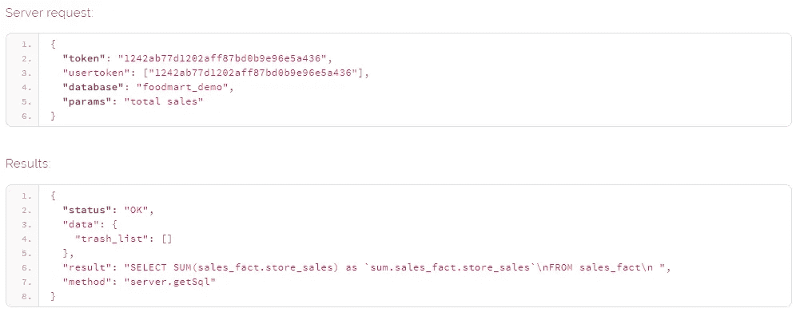
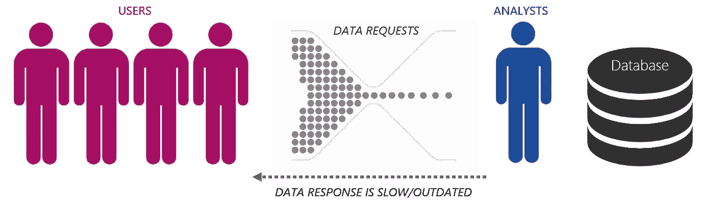
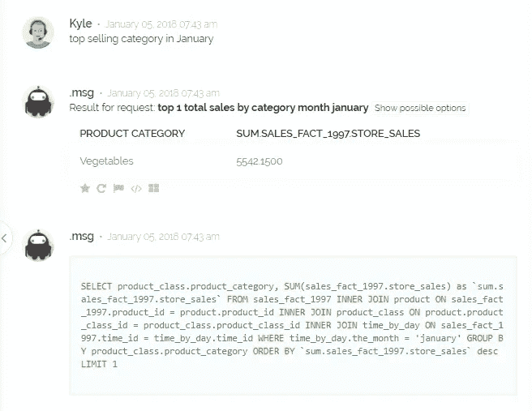
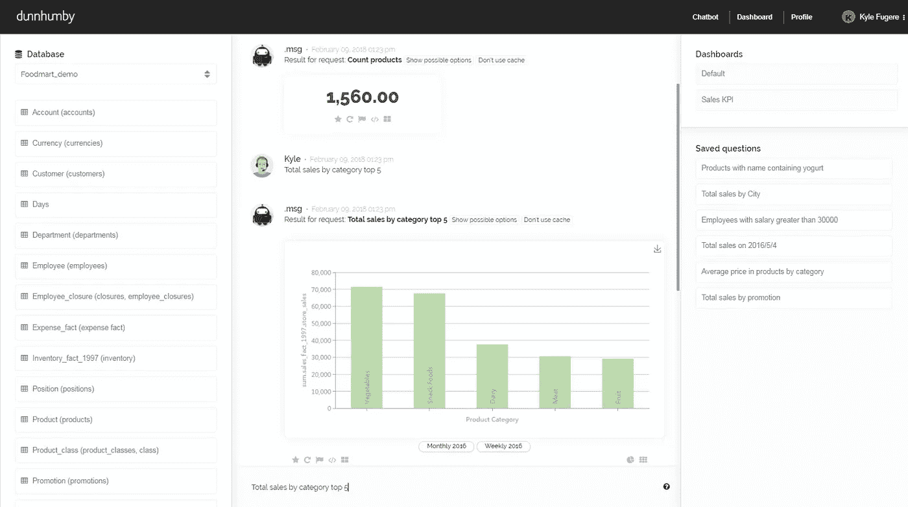

# 向 SQL API 介绍第一种自然语言

> 原文：<https://medium.com/hackernoon/introducing-the-first-natural-language-to-sql-api-8429229301ce>

## 和你的数据说话！



You can view the API documentation here: [http://docs.dhignite.com/](http://docs.dhignite.com/)

如果不运行复杂的 SQL 脚本，而是简单地问数据库一个问题，会怎么样？我昨天的销售额是多少？6 月份我最畅销的产品是什么？

随着 ThoughtSpot、Salesforce 和 Tableau 等公司都在开发类似的技术，这种自然搜索功能在过去一年变得越来越普遍。这种“数据民主化”的趋势迫使我们以新的方式利用现有技术。

我们的新期望是，普通最终用户应该能够访问数据，而不是局限于数据分析师，或者被迫通过复杂的排队系统，在这个系统中，时间和便利往往主宰一切。



除了仪表板和分析师之外，数据应该是可访问的。这就是为什么我们开发了 SQL API 和接口的自然语言。

我们利用自然语言处理和机器学习的最新技术将问题转换成结构化的 SQL 查询。

下面你可以看到我们已经利用 API 作为聊天界面的一部分。



您可以看到用户提出了一个问题，引擎将问题与数据库元数据进行对比，然后返回一个答案。您还可以看到作为响应的一部分而生成的 SQL。

我们现在准备公开这个 API，这样其他人也可以在他们自己的产品中构建类似的自然搜索功能。不再需要生成报告的表单，而是使用自然搜索让用户能够提出新的问题。

**您可以在这里查看 API 文档:**[](http://docs.dhignite.com/)

**基于自然语言问题发送 SQL 查询请求很简单。**

```
{"token": "1242ab77d1202aff87bd0b9e96e5a436","usertoken": ["1242ab77d1202aff87bd0b9e96e5a436"],"database": "foodmart_demo","params": "total sales"}
```

**此请求将生成以下响应；首先，它评估“foodmart_demo”数据库元数据，然后生成 SQL 响应。**

```
{
  "status": "OK",
  "data": {
    "trash_list": []
  },
  "result": "**SELECT SUM(sales_fact.store_sales) as `sum.sales_fact.store_sales`\nFROM sales_fact\n** ",
  "method": "server.getSql"
}
```

# **用户凭据**

**在 API v1 中，我们使用简单的基于令牌的认证和授权。**

**要访问引擎 API，您需要主令牌和附加用户组令牌。如果您想要创建几个具有不同访问级别的用户组，您将需要额外的令牌。默认情况下，管理组存在，并且管理令牌等于主令牌。每个令牌都是一个字符串(32 字节长)，例如“1242 ab 77d 1202 af 87 BD 0 b 9 e 96 e5a 436”。如果你是我们的客户，那么你已经有这样一个令牌。否则，使用字符串“demo”代替标记。在这种情况下，您只能对“foodmart_demo”数据库配置进行只读访问。**

# **引擎服务器端点**

**要访问引擎 API，您需要引擎服务器端点 URL。对大多数用户来说是:**

**[https://msg.dhignite.com/api/1.1/nlq](https://msg.dhignite.com/api/1.1/nlq)**

**1.1 是 API 版本号。**

# **数据库配置**

**为了响应用户请求，服务器需要有数据库元数据。它是基于 JSON 的文件。“演示”用户可以访问“foodmart_demo”配置(通常，另一个用户也可以访问该配置)。您需要将数据库配置文件放在。Msg 云处理服务器(我们会为您完成)。您可以放置完成的文件，否则管理员会为您创建一个“空”文件，您可以使用 API 或站点来更改它。在本手册中，所有示例都将使用“foodmart_demo”数据库配置。**

# **API 运行演示**

**你可以注册一个模拟账户，这样你就可以在这里使用 API 作为聊天界面的一部分:[http://docs.dhignite.com/demo/](http://docs.dhignite.com/demo/)**

****

**如有任何关于系统的问题，请直接联系或通过网站联系。**