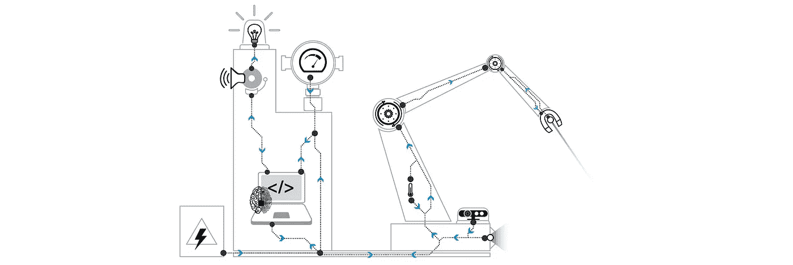
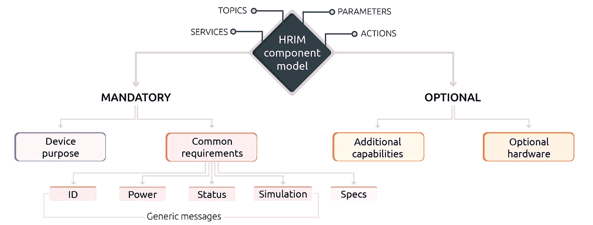
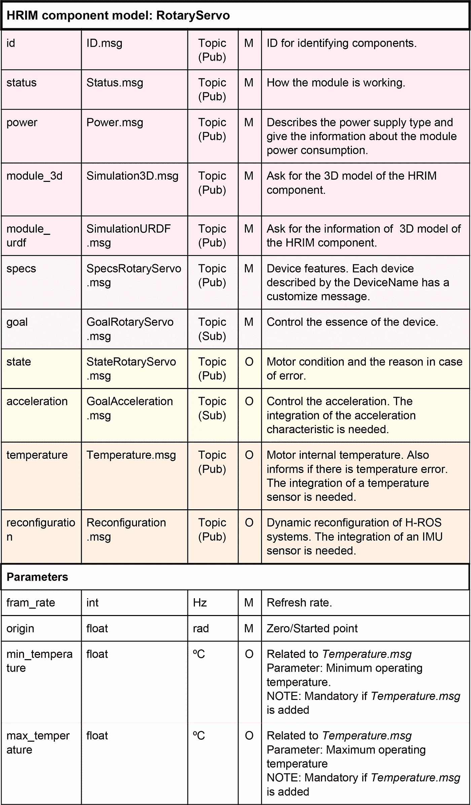

# 介绍硬件机器人信息模型(HRIM)

> 原文：<https://medium.com/hackernoon/introducing-the-hardware-robot-information-model-hrim-8f0da3f22f67>

## 机器人模块的标准接口。

*本文是“模块化机器人的信息模型:硬件机器人信息模型(HRIM)”的书面报告，可在 https://arxiv.org/abs/1802.01459**获得。*

*同行的写有* [*伊拉提·扎马罗亚·乌加特*](https://medium.com/u/e9b73593e3f?source=post_page-----8f0da3f22f67--------------------------------)*[*亚历杭德罗·埃尔南德斯*](https://medium.com/u/4a4a58486f6?source=post_page-----8f0da3f22f67--------------------------------)*[*伊尼戈·穆古鲁扎*](https://medium.com/u/a439c706aec0?source=post_page-----8f0da3f22f67--------------------------------) *和* [*里斯托·科伊切夫*](https://medium.com/u/56ec4c1789e5?source=post_page-----8f0da3f22f67--------------------------------) :**

****

**Representation of the connection map of an exemplary robot in a workspace. Components are interconnected through buses and the information flows in a distributed way.**

**今天的机器人领域由垂直整合主导，单一供应商开发最终产品导致进展缓慢、产品昂贵和客户锁定。与此相反，横向整合将导致具有成本效益的大众市场产品的快速发展，并赋予消费者额外的权力。一个行业从垂直整合到水平整合的转变通常是由事实上的行业标准推动的，这些标准能够实现产品的简化和无缝整合。然而，在机器人领域，目前还没有一个全球即插即用标准的领先候选人。**

> **一个行业从垂直整合到水平整合的转变通常是由事实上的行业标准推动的，这些标准能够实现产品的简化和无缝整合。然而，在机器人领域，目前还没有一个全球即插即用标准的领先候选人。**

**以下内容介绍了我们在机器人模块标准接口背后的工作:*硬件机器人信息模型* ( **HRIM** )，一个创建即插即用机器人硬件组件的模型。**

# **动机**

**现有的和新兴的机器人技术有可能迅速颠覆许多领域，但我们仍处于机器人革命的早期。在 2011 年，m . jn del[1]描述了机器人转型的主要障碍之一是缺乏综合标准。jn del 表示，即插即用机器人的全球标准将有助于转变行业结构，大幅降低成本，从而促进机器人技术在现代社会所有领域的应用。总之，简化机器人互操作性和可重用性的即插即用标准将大大有助于相关硬件和软件的开发，这些硬件和软件可以快速组装以解决手头的任务。**

**Mayoral 等人[2]也强调了机器人技术中可重用性和互操作性的重要性，他们介绍了由不同子组件或零件组成的机器人的集成工作如何取代许多其他任务。在那篇论文中，介绍了[硬件机器人操作系统(H-ROS)](http://h-ros.com) 。一个通用的基础设施，通过创建一个组件可以简单连接和无缝互操作的环境来减少集成工作。当与模块化机器人一起工作时，这种基础设施变得特别相关，模块化机器人由不同的子模块组成，这些子模块可能来自也可能不来自同一制造商。**

**当前的技术水平表明，在试图创建标准和国际协议[3]的过程中，已经在机器人领域产生了几个本体，但是这些模型仍然没有被接受，也没有转化为工业。**机器人部件制造商在设计其机器人硬件设备的接口时仍然缺乏一套通用的原则来遵循**。正如 Zamalloa 等人[4]得出的结论，由于大多数机器人制造商遵循的垂直方法以及它们之间缺乏明确的合作，机器人领域目前没有一家公司能够独自建立事实上的标准。我们的工作解决了机器人行业对通用接口的需求，该接口促进了不同机器人硬件组件供应商之间的互操作性。**

# **硬件机器人信息模型(HRIM)**

**HRIM 是一个公共接口，它有助于机器人硬件组件的不同供应商之间的互操作性，目的是构建机器人模块，从而构建模块化机器人。HRIM 专注于机器人模块之间逻辑接口的标准化，设计了一套每个设备都必须满足的规则，以实现互操作性。它解决了机器人组件之间的不兼容问题，这种不兼容阻碍了机器人行业所需的可重构性和灵活性。简而言之，HRIM 提出了一个创建即插即用机器人硬件组件的模型。**

> **简而言之，HRIM 提出了一个创建即插即用机器人硬件组件的模型。**

**HRIM 建立在[机器人操作系统(ROS)](http://ros.org) 的组件模型之上，因为它是机器人应用程序开发的参考框架。ROS 的流行带来了机器人技术挑战的大量新算法和解决方案。ROS 是机器人软件现状的一个代表性例子。早在 2009 年，它就被认为是美国机器人路线图中最有前途的新兴标准[5]，从那时起，它就开始支持代码的重用，并创建模拟平台来支持算法的早期开发和测试，而不会危及研究人员和硬件的安全。**

**为了制造任何机器人，现实世界的实现需要考虑机器人中使用的通用硬件组件。机器人模块被分为 6 类(实际上，还有第七类，*合成*正在进行中)*类型*模块，对应于它们可以执行的任务:*传感*、*驱动*、*通信*、*认知*、*用户界面*或*电源。*每个*类型*由**子类型**或**装置**组成，与组件的功能有关。例如，*摄像机*是传感器类型的子类型。下图显示了每个设备(或子类型)的 *HRIM 组件型号*:**

****

**The general structure in which all the HRIM component models are based on. Each component has *topics*, services, parameters and actions to communicate. For each one of these abstractions, the figure illustrates that some will be mandatory and some others optional.**

**命名约定以及该“HRIM 组件模型”的一般结构在[原始文件](https://arxiv.org/abs/1802.01459)中进行了解释。**

## **HRIM 示例:旋转伺服电机**

**我们在这里展示一个 HRIM 为一个特殊的机器人模块指定的接口的例子:一个旋转伺服电机。我们选择了旋转伺服电机，因为它是机器人中最常用的组件之一，足以解释大多数 HRIM 细节。**

**下图显示了旋转伺服电机设备的 HRIM 组件模型。通用需求(由模块的所有类型和子类型共享)用粉色表示，这里不涉及。为了简洁起见，下面描述的关于消息的细节也被省略。关于讨论的消息和字段的完整参考，请参考原始文章。**

****

****规格**:通过消息 *SpecsRotaryServo.msg* ，组件模型描述了旋转伺服电机实现的所有必要规格。**

****目标(装置用途)**:旋转伺服电机属于执行机构类型分类。在这种情况下，有必要定义一个最终目标(位置),它可以用不同的速度或加速度来实现。**

****状态**:通过 *StateRotaryServo.msg* ，旋转伺服电机持续发布有关电机状态、工作情况以及出错原因的信息。**

****加速度**:一些旋转伺服电机具有控制加速度的选项。如果是这种情况，制造商必须使用 *GoalAcceleration.msg* 并暴露加速度，以便用户可以控制该功能。**

****温度**:温度传感器是一个独立的传感器，可以集成到其他设备中，以了解模块内部的温度。**

****重新配置**:通过 *Reconfiguration.msg* 这样的消息，一个模块能够告知它的特殊性，这样它就可以自动地集成到机器人中，尽可能少地与人交互。这种重新配置功能预计将在未来得到扩展，并且可能会在 HRIM 系统中包括其他类型的重新配置。**

**作为模块化机器人的信息模型，HRIM 是在模块化的思想下建造的。每个模块都有独特且明确的用途，这使得 HRIM 可以在许多机器人硬件组件中重复使用。**

# **发布、采用和后续步骤**

**我们自豪地宣布硬件机器人信息模型 HRIM 的 0.1.0 版本**。该版本可在[https://github.com/erlerobot/HRIM/releases/tag/v0.1.0](https://github.com/erlerobot/HRIM/releases/tag/v0.1.0)获得，包括以下设备的初步组件模型:****

*   **致动器装置:夹持器和旋转伺服电机。**
*   **传感器设备:测距仪、2d 激光、3d 相机(深度传感器)、摄像头、气体探测器、imu、麦克风、温度计。**
*   **复合设备:手臂、传送带、移动底座。**

**此外:**

*   **官方文件可在[https://docs.h-ros.com/hrim](https://docs.h-ros.com/hrim)获得**
*   **讨论和问题[此处](https://github.com/erlerobot/HRIM/issues)**
*   **投稿[此处](https://github.com/erlerobot/HRIM/pulls)**

## **采用和标准化**

**尽管 HRIM 最初是按照 ROS 组件模型设计的，但我们的团队设想[将其扩展到其他机器人中间件，以促进采用和国际协议。为此，HRIM 已经在**国际标准化组织**向各国专家介绍了机器人领域的标准化范围，不包括玩具和军事应用(ISO/TC 299)。特别是，它已被引入正在进行的标准 ISO/CD 22166–1，该标准处理服务机器人的模块化。](https://docs.h-ros.com/hrim/implementations)**

**此外，**欧洲最大的应用研究组织 Fraunhofer IPA** 目前正在寻求 HRIM 采纳并将其扩展到几个项目中。弗劳恩霍夫协会的小组经理米尔科·博尔迪农说:**

> **经过多年在机器人系统上设计、开发和部署软件的经验，我们完全赞同 HRIM 宣言中提出的目标:通过标准化的信息模型，努力实现真正的“即插即用”硬件模块，该模型将从开源社区收集的输入和反馈与标准化机构要求的稳定性和平台独立性相结合。我们期待着贡献我们的经验，进一步推动 HRIM 朝着这一目标前进！**

**同样，在上次 ROS-I 会议期间，HRIM 也对 ROS-I 工业集团感兴趣，HRIM 就是在那次会议上被介绍进来的。**

## **后续步骤**

**HRIM 已经引起了一些团体和财团的兴趣，然而它的诞生是为了满足市场需求，这也是我们关注的焦点。HRIM 目前正被[硬件机器人操作系统(H-ROS)](http://h-ros.com)——一种[技术](https://hackernoon.com/tagged/technology)用于创建模块化机器人部件——同时与各种制造商合作，包括机器人领域一些最受欢迎的参与者。我们受到现实的驱动，机器人可以由可互操作的(制造商不可知的)组件制成，HRIM 是实现这一未来的[工具](https://hackernoon.com/tagged/tool)。**

> **如果你对机器人的模块化感兴趣，或者碰巧制造了一个机器人组件。无论是传感器、执行器、通信接口还是任何其他类型的模块，请与我们联系。**

# **参考**

**[1]m . jn del，“即插即用机器人”，载于《北约新兴/新兴“颠覆性”技术研讨会会议录》(IST-099)。**

**[2] V. Mayoral、A. Hernández、R. Kojcev、I. Muguruza、I. Zamalloa、A. Bilbao 和 L. Usategi，“机器人范式的转变；硬件机器人操作系统(h-ROS)；创建可互操作机器人组件的基础设施”，2017 年 NASA/ESA 自适应硬件和系统会议(AHS)，2017 年 7 月，第 229-236 页。**

**[3] T. Haidegger、M. Barreto、P. Gonç alves、M. K. Habib、S. K. V. Ragavan、H. Li、A. Vaccarella、R. Perrone 和 E. Prestes，“服务机器人的应用本体论和标准”，《机器人学和自治系统》，第 61 卷，第 11 期，第 1215-1223 页，2013 年，《无处不在的机器人学》。【在线】。可用:[http://www . science direct . com/science/article/pii/s 092188901300105 x](http://www.sciencedirect.com/science/article/pii/S092188901300105X)**

**[4] I. Zamalloa，R. Kojcev，A. Hernández，I. Muguruza，L. Usategui，A. Bilbao 和 V. Mayoral，“解剖机器人学-历史概述和未来展望”，arXiv 预印本 arXiv:1704.08617，2017 年。**

**[5] J. M .霍勒巴赫、M. T .梅森和 H. I .克里斯滕森，“美国机器人路线图——从互联网到机器人”，新兴技术和趋势研讨会，2009 年。**

**[6]对象管理组(OMG)，《机器人技术的硬件抽象层(HAL4RT)规范，1.0 版》，OMG 文档号正式/2016–01–01(http://www . OMG . org/spec/Hal 4 rt/)，2016。**