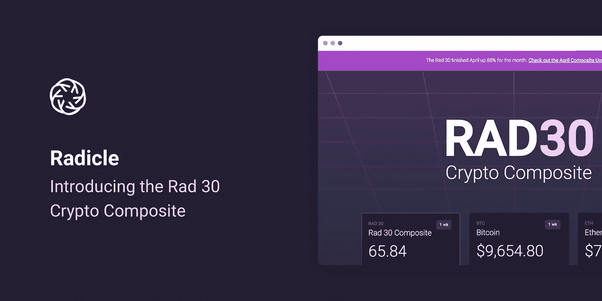
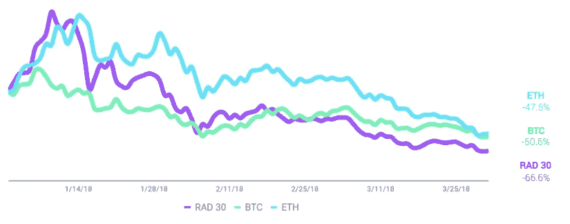
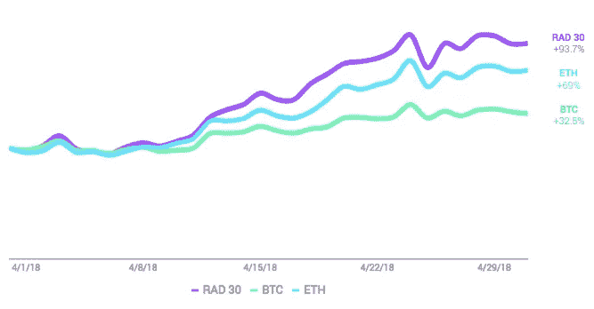

# 介绍 Rad 30 加密组合

> 原文：<https://medium.com/hackernoon/introducing-the-rad-30-crypto-composite-64cda215e891>

今天，我们发布了 Rad 30 加密组合的 alpha 版本。因此，我们认为我们应该勾画出是什么，为什么，以及如何。

**那个什么**

[Rad 30 Crypto Composite](https://rad.report/rad30)(Rad 30)跟踪 30 种加密资产，类似于标准普尔 500 指数和纳斯达克综合指数跟踪股票的方式。

在一个不断增长和滚雪球的加密领域，Rad 30 将帮助任何对分散经济感兴趣的人拓宽他们的视野，优先考虑他们的注意力，并获得衡量加密市场表现的第三个基准。

虽然整个加密市场与比特币和以太坊的相关性相对较高，但在 2018 年 Q1 奥运会上，Rad 30(不包括 BTC 和瑞士联邦理工学院)在 45%的时间里与 BTC 和瑞士联邦理工学院的走势相反。(你可以在这里找到我们的季度加权报告[以获得更多关于 Q1 的分析。)](https://rad.report/rad30)

Q1 2018 Performance: RAD 30, BTC, ETH

**为什么**

[Radicle](https://medium.com/radicle) 是一家颠覆性研究公司。我们研究并提供关于创造未来的创业公司和技术的见解。在那个行业中，或者任何一个行业中，不可能不面对去中心化、[区块链](https://hackernoon.com/tagged/blockchain)和加密资产这样的大主题。尤其是在过去的 24 个月里。

在讨论去中心化和加密的话题时，在与我们自己和我们的客户的交谈中，我们发现自己问了许多熟悉的问题:

*   我怎么知道要注意什么？
*   哪些加密资产是真实的，哪些是骗局？
*   在数字货币和价值储存之外，是否有加密的用例？
*   [去中心化 app](https://ethereum.stackexchange.com/questions/383/what-is-a-dapp?utm_medium=organic&utm_source=google_rich_qa&utm_campaign=google_rich_qa)的实际市场机会有多大？
*   什么市场最适合去中心化？

尤其是一个挑战，我们觉得是可以解决的:

*向我展示几个真实的加密资产，它们一起或单独将帮助我理解去中心化和“加密”的意义。进展如何？它会扰乱哪些市场？颠覆的机会有多大？*

Rad 30 加密组合将有助于解决这些问题。Rad 30 由 30 个代表更广泛的分散经济的加密资产组成。这些不仅仅是市值最高的加密资产。这些加密资产和平台正在解决数字货币和储值工具之外的去中心化机会。

我到底为什么要在乎？

关注 RAD 30 有很多原因。但我们会保持在三个:

**1。拓宽你的视野。**除了[比特币](https://hackernoon.com/tagged/bitcoin)，比特币模仿者，以太坊还有更多值得关注的。按市值排列的顶级加密资产代表了一种非常具体的去中心化观点。它们没有提供对加密如何影响其被部署和探索的各种行业的理解。

**2。优先考虑你的注意力。**一旦你决定拓宽视野，找到重要的加密资产将让你每周、每月、每季度跟踪实质性进展。了解 RAD 30 中包含哪些加密资产(以及*为什么包含*这些资产)将有助于所有类型的业务人员优先考虑他们对去中心化和加密的关注。

**3。第三个基准。**使用复合资产、其组成部门和组成加密资产作为彼此以及 ETH 和 BTC 的基准。复合材料将成为分析问题的透镜，例如:

*   *以太坊和建立在它上面的 dApps 是什么关系？*
*   *更广泛的去中心化生态系统的成功对比特币的成功有多重要？*

这些问题只是冰山一角。我们看到了分析师使用 RAD 30 构建新公式的潜力，这些公式提供了有益于加密社区的新分析。我们认为，消息灵通的商人应该了解分散经济是如何发展的，哪些市场正在被它扰乱，以及进一步扰乱的机会在哪里。为此，正如股票市场有标准普尔 500、道琼斯工业平均指数和纳斯达克综合指数一样，我们希望分散经济有 Rad 30 加密综合指数。

**该怎么做**

外面有 30 多种加密资产。那么，我们是如何选择 RAD 30 的呢？

仅在 2018 年 Q1 奥运会上就有 [159 个 ico](https://www.coinschedule.com/stats.html)的空间，分析每个新兴的加密平台并评估其可行性和潜力是不切实际的。因此，与其对每一项新的加密资产都作出*反应*，不如*积极主动*，寻找最佳机会。

为了解决这个问题，我们没有从具体的加密资产入手，而是采取了一种更广泛的方法，从行业角度提出问题。哪些*部门*最容易受到权力下放的影响？在这些行业中，哪个市场机会最大？

然后我们问自己:就激励结构和当前交易水平而言，这些领域的加密资产如何比较？我们自下而上和自上而下相结合的方法使我们能够优先考虑某些加密资产和部门。

然后根据组合的基本和定量分析对每个加密资产进行加权。类似于标准普尔 500，RAD 30 最终被计算为加权的 30 个加密资产的总分数。

我们相信 RAD 30 有潜力为无结构市场带来一点结构。我们很期待 RAD 30 能带来什么！

*在这里找到更多关于*[*Rad 30 Crypto Composite*](https://rad.report/rad30)*！*

April 2018 Indexed Performance: RAD 30, BTC, ETH

**更新:四月业绩**

在 4 月份，RAD 30 指数上涨了 93.7%，而 BTC 和 ETH 指数分别上涨了 32.5%和 69%。分散式社交媒体平台和分散式云计算是表现最好的两个板块，分别上涨了 146%和 139%。

*如果您想要访问我们的 RAD 30 数据，请发送电子邮件至 analyst @ RAD . report。*

[*Radicle*](https://rad.report/) *是一家建立在了解初创公司和新技术基础上的分类研究和信息公司。* [*拉德。Crypto*](https://rad.report/crypto) *是 Radicle 的密码研究部门。*

*免责声明:Radicle 不是投资顾问，并且 Radicle 不代表投资任何证券、资产、代币、基金或其他投资工具的合理性。拉迪奇不是税务顾问。radic e 在 radic e 复合材料或任何 radic e 分析中包含证券、资产或代币并不是 radic e 购买、出售或持有此类证券的建议，也不被视为投资建议。复合材料的过往表现并不代表或保证未来的结果。所有的胚根材料都是基于公众普遍可获得的信息和据信可靠的来源，仅为信息目的而准备的。所示的综合数据和分析并不代表可投资资产/证券的实际交易结果。Radicle 维护综合数据并计算显示或讨论的综合水平和绩效，但不管理实际资产。*