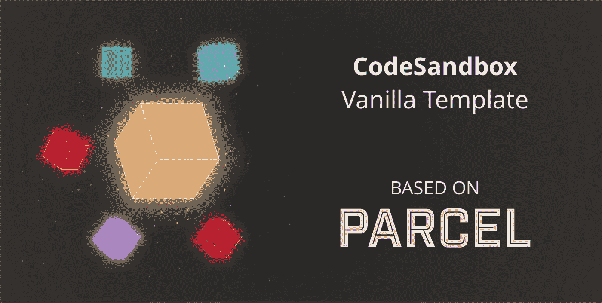
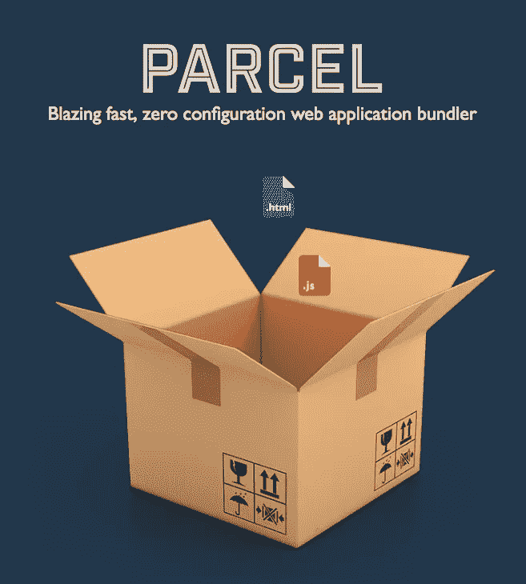
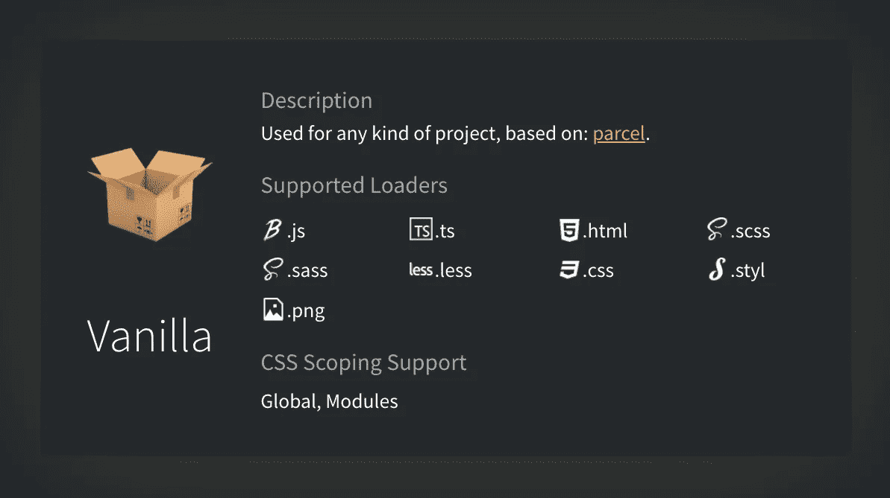

# 向 CodeSandbox 介绍 Vanilla 模板

> 原文：<https://medium.com/hackernoon/introducing-the-vanilla-template-to-codesandbox-32244b58acec>



从第一天起，我们就一直将模板与 CLI 绑定在一起。这样做的主要原因是我们希望保持沙箱简单，你不需要做任何配置就可以开始。我不想创建一个“香草”模板，因为没有配置就没有办法创建“香草”web 项目，直到最近。

# 包裹



去年 12 月， [devongovett](https://medium.com/u/fdafd09cb14a?source=post_page-----32244b58acec--------------------------------) 发布了名为[package](https://parceljs.org/)的新捆绑包。Parcel 是一个重视零配置的 web 应用程序捆绑器。他们重用经典的 web 概念，比如使用`index.html`作为应用程序的入口点，这使得开始一个新项目变得非常容易和直观。你只需要创建一个`index.html`并运行`parcel index.html`就可以得到一个可用的应用程序。它们会自动检测您正在运行的 web 应用程序的类型，如果没有特别设置，它们会调整配置。

这与 CodeSandbox 的价值观完全一致。几乎没有启动的摩擦，所有需要的配置都是自动检测和安装的。这就是为什么我决定**最终**构建一个香草模板，并使用 package 作为我们的配置。

# 普通模板



我们有一个名为`vanilla`的新沙盒，与其他沙盒不同，这个沙盒有`index.html`作为它的入口。从这个`index.html`你可以添加`script`和`link`标签到其他文件，它们将被添加到包中。我们支持包裹支持的所有加载器，因此我们支持:

*   巴比伦式的城市
*   以打字打的文件
*   SCSS/萨斯
*   较少的
*   唱针
*   CSS 模块

我们还认识到以下两者之间的区别:

```
import styles from './styles.css';
```

和

```
import './styles.css';
```

在第一个代码块中，我们将从`css`文件中生成 css 模块，在第二个代码块中，我们不会这样做。

您可以在这里尝试一下:

## 配置

像包裹一样，我们自动为您做配置。我们会自动检测您使用的是`react`还是`preact`，并为其调整我们的 Babel 配置。我们支持 Babel/TypeScript 配置，因此您也可以选择通过创建一个`tsconfig.json`或`.babelrc`来进行自己的配置。

## GitHub，Zip 解压缩和部署集成

像其他模板一样，您可以使用该模板创建 repos、提交和 PRs、下载和部署沙盒。而不离开浏览器。

# Beta 警告

这是我们第一个使用`html`作为入口点的模板，所以可能会有一些错误或者意想不到的行为需要解决。如果您发现任何问题，请在回购中告知我们！

[](https://github.com/CompuIves/codesandbox-client) [## 强制/代码沙盒-客户端

### codesandbox-client -一个为 web 应用程序开发定制的在线代码编辑器🏖️

github.com](https://github.com/CompuIves/codesandbox-client) 

## 谢谢

我要感谢 [devongovett](https://medium.com/u/fdafd09cb14a?source=post_page-----32244b58acec--------------------------------) 构建了这个漂亮的捆绑器，我能够毫不费力地在其中构建一个应用程序。干得好！

如果你喜欢我们正在做的事情，考虑成为[贡献者](https://github.com/CompuIves/codesandbox-client)或[赞助者](http://codesandbox.io/patron)！你可以在 [@CompuIves](https://twitter.com/CompuIves) 或 [@codesandboxapp](https://twitter.com/codesandboxapp) 上获得最新的 CodeSandbox 新闻。