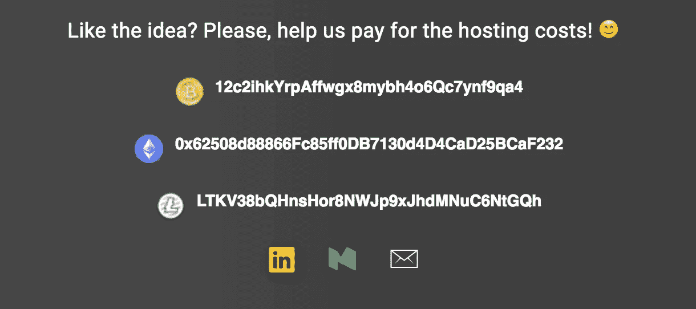

# Vaulty.io 简介—仅通过一个链接接受所有加密货币

> 原文：<https://medium.com/hackernoon/introducing-vaulty-io-e683aea93c89>

最近，出现了一股极具潜力的“山寨币”**热潮——但你怎么可能接受所有的“山寨币”？**

你可以在页脚的底部添加一个很大的公共地址列表，比如+ 50 多个地址。

我个人认为这是不够的，设计也不友好。

如何解决问题？如果我们可以用这样的东西来代替呢？

Vaulty demo

**这里的** [**金库**](https://www.vaulty.io/) **前来救援！**

https://vaulty.io

Vaulty 就像 altcoins 的 Patreon。每个人都可以使用它，但它更专注于接受加密货币捐赠/支付的内容创作者——现在我们也可以接受替代硬币了！

它是如何工作的？这个概念其实很简单。只需选择您接受的硬币/代币，插入公共地址，就可以了。

## 示范

Vaulty demo

在你选择了所有的硬币并插入了公共地址后，Vaulty 会生成一个链接，你可以和全世界分享。

Vaulty 是向 altcoins 献爱心的好方法。我要把这一切都免费送出去。我 100%依赖捐款。我没有将价值货币化的计划。

[***在这里创建你的金库链接***](https://www.vaulty.io/)

[***此处支持 vault***](https://www.vaulty.io/v/d4a096dd-6773-46f3-9272-4dc223ae1a5d)

# 让我们谈谈技术问题

## 问:安全吗？

答:它非常安全——请不要插入私钥，您应该可以放心使用了。Vaulty 只保存公共地址，无权访问硬币。你基本上插入公共信息，并以一种很好的格式显示它。很简单。

## 问:我打错了一个字

答:创建新的存储库链接。目前编辑功能被禁用，但我计划在未来增加编辑功能。

## 问:救命！不支持我最喜欢的硬币/代币！

答:在推特上给我发个消息，我会把它整理好的。😊

## 问:你用什么技术做前端？

答:我用了 React + Redux。对于样式，我使用了样式组件。在上面撒一些洛达什粉。

## 问:后端呢？

很高兴你问了。我选择了我个人最喜欢的后端堆栈——Laravel API 和 MySQL。我在考虑用 PostgreSQL 或者 MariaDB。

## 问:Vaulty 还会存在吗？

是的，那是当然的。Cloudflare 保护 Vaulty 免受 DDOS 攻击/黑客攻击。

**现在去和** [**一起玩吧**](https://www.vaulty.io/) **！**

感谢阅读，你太棒了！如果你喜欢这个，请给我一些掌声，让更多的人可以看到它！

如果你觉得这个有用，请给我买杯咖啡吧！😊