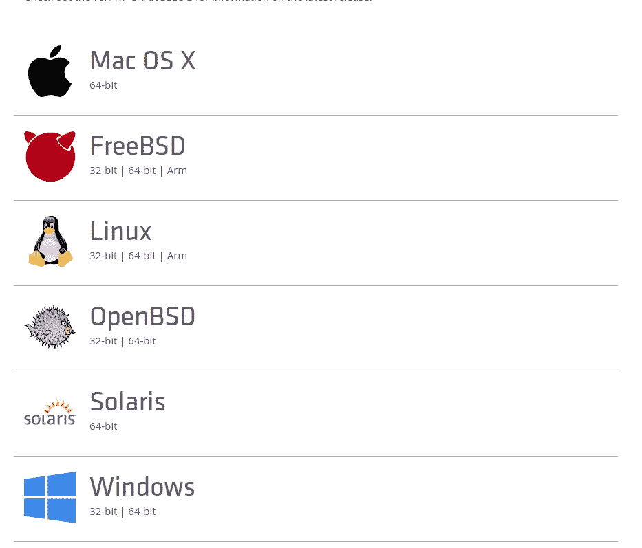
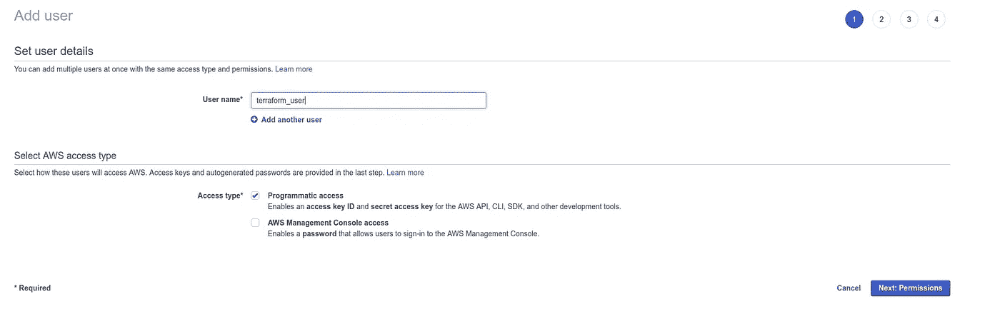
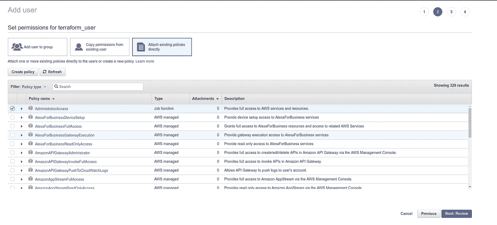
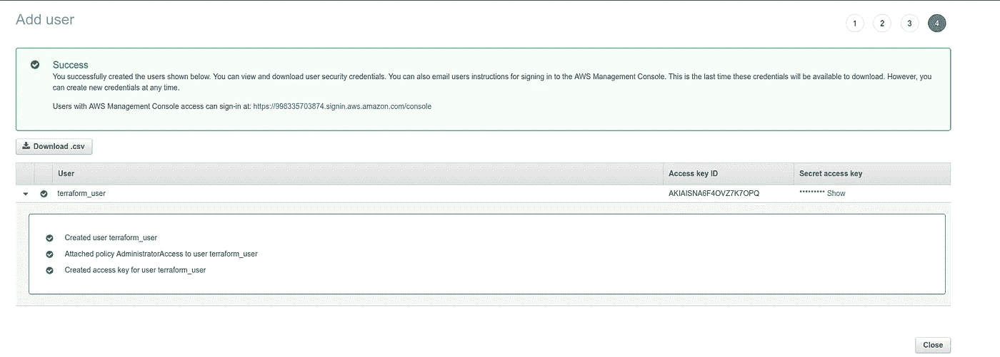
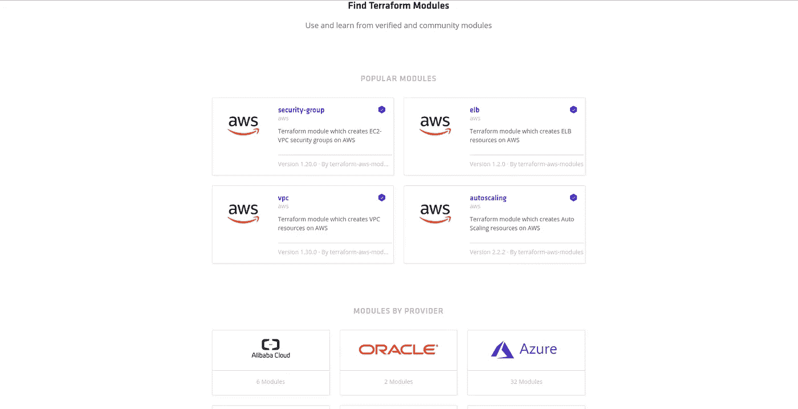

# Terraform 自动气象站简介

> 原文：<https://medium.com/hackernoon/introduction-to-aws-with-terraform-7a8daf261dc0>

## 放弃

此内容是我们在线课程/培训的一部分/灵感来源。在 2019 年**黑色星期五**期间，我们提供这些材料高达 80%的折扣。

你可以在这里得到你的折扣。

[](http://bf.eralabs.io)

大约一个月前，我发布了实用 AWS，这是一个关于 AWS 实际使用的培训，而不是理论和想法。

您可以观看[演示视频](https://www.youtube.com/watch?v=Z6UilbN8WEg&t=226s)，或者访问[培训网站](https://www.practicalaws.com/)。

[](http://practicalaws.com)

More information on [http://practicalaws.com](http://practicalaws.com)

即使培训发布了，但由于它将终身免费更新新内容，这篇博客文章是将添加到培训中的新课的原型。

这篇博文介绍了如何使用 Terraform 管理 AWS 基础设施。

# 下载和安装 Terraform

从官方下载页面的[下载 Terraform 开始。](https://www.terraform.io/downloads.html)



选择您的操作系统和 CPU 架构，并开始下载。
Terraform 是一个单独的二进制文件，你应该将它转移到`/usr/bin` 并使其可执行。

```
sudo mv terraform /usr/bin && sudo chmod +x
```

如果您正在使用另一个操作系统，请参考[文档](http://dome.readthedocs.io/en/latest/dmc/deployment/install-terra.html)。

# 配置 AWS

为了遵循最佳实践，让我们为 Terraform 创建一个用户。转到您的 AWS 控制台并创建`terraform_user` 用户:



给它好的权利。在我的例子中，我需要 Terraform 来管理我所有的 AWS 云资源:



不要忘记存储 AWS 访问密钥 id 和秘密访问密钥:



将它们复制到 AWS 凭据文件中:

```
.aws/credentials
```

你也可以执行`aws configure` 来添加一个新用户。

在这两种情况下，您的密钥都将存储在 AWS 凭证文件中:

```
**[terraform]**
aws_access_key_id = xxxxxxxxxxxxxxxxxxx
aws_secret_access_key = xxx/xxxxxxxxxxxxx/xxxx
```

# Terraform Hello World！

转到您的工作区，创建一个名为 terraform 的文件夹:

```
**mkdir** terraform
```

将这些行添加到`main.tf` :

```
**provider** "aws" {
  **region**                  = "eu-west-3"
  shared_credentials_file = "/home/eon01/.aws/credentials"
  profile                 = "terraform"
}
```

以上是 AWS 的配置，根据您自己的配置、概要文件名称以及区域来调整凭证文件路径。在我的例子中，我使用的是巴黎地区。

为了创建我们的第一台 AWS 机器，让我们添加以下代码行:

```
**resource** "aws_instance" "web" {
  **ami** = "ami-0e55e373"
  instance_type = "t1.micro"
  tags {
    **Name** = "eralabs"
  }
```

我们的文件`main.tf` 将是这样的:

```
**provider** "aws" {
  **region**                  = "eu-west-3"
  shared_credentials_file = "/home/eon01/.aws/credentials"
  profile                 = "terraform"
}resource "aws_instance" "web" {
  **ami** = "ami-0e55e373"
  instance_type = "t1.micro"
  tags {
    **Name** = "eralabs"
  }}
```

在上面的例子中，我使用配置文件“terraform”在区域“eu-west-3”上创建了一台机器。

我的机器大小是`t1.micro` ，它使用的是 AMI `ami-0e55e373` ，这是一个适用于“eu-west-3”地区的 Ubuntu 17.04 映像。

**注意** : Ubuntu 17.04 镜像在两个不同的地区没有相同的 AMI id。

如果你喜欢像这个例子中一样使用 Ubuntu，你可以访问[cloud-images.ubuntu.com](http://cloud-images.ubuntu.com)，在那里你可以找到你应该使用的 AMI 的 id。

您还可以使用 CLI 来描述 AWS IAMs:

*   例如:描述由 Amazon EBS 支持的 Windows AMIs。

```
**aws** ec2 describe-images --filters "Name=platform,Values=windows" "Name=root-device-type,Values=ebs"
```

*   例如:描述 Ubuntu AMIs

```
**aws** ec2 describe-images --filters "Name=name,Values=ubuntu*"
```

**注意:**查看本次培训附带的 AWS 备忘单，以获取更多示例。

选择 AMI 后，进入创建 main.tf 的文件夹并初始化 Terraform:

```
**terraform** init
```

您将看到与此类似的输出:

```
Initializing provider plugins...
- Checking for available provider plugins on https://releases.hashicorp.com...
- Downloading plugin for provider "aws" (1.13.0)...The following providers **do** **not** have **any** **version** **constraints** **in** configuration,
so the latest **version** was installed.**To** prevent automatic upgrades **to** new major versions that may contain breaking
changes, it **is** recommended **to** **add** **version** = "..." **constraints** **to** the
**corresponding** provider blocks **in** configuration, **with** the **constraint** strings
suggested below.* provider.aws: **version** = "~> 1.13"Terraform has been successfully initialized!You may **now** **begin** working **with** Terraform. Try running "terraform plan" **to** see
**any** changes that **are** required **for** your infrastructure. **All** Terraform commands
should **now** **work**.**If** you ever **set** **or** **change** modules **or** backend configuration **for** Terraform,
rerun this command **to** reinitialize your working directory. **If** you forget, other
commands will detect it **and** remind you **to** **do** so **if** necessary.
```

现在执行:

```
**terraform** plan
```

这个命令不会在您的 AWS 云上创建任何资源。它让你知道 Terraform 会做什么。

您将看到以下输出:

```
+ aws_instance.web
      id:                           <computed>
      ami:                          "ami-0e55e373"
      associate_public_ip_address:  <computed>
      availability_zone:            <computed>
      ebs_block_device.#:           <computed>
      ephemeral_block_device.#:     <computed>
      get_password_data:            "false"
      instance_state:               <computed>
      instance_type:                "t1.micro"
      ipv6_address_count:           <computed>
      ipv6_addresses.#:             <computed>
      key_name:                     <computed>
      network_interface.#:          <computed>
      network_interface_id:         <computed>
      password_data:                <computed>
      placement_group:              <computed>
      primary_network_interface_id: <computed>
      private_dns:                  <computed>
      private_ip:                   <computed>
      public_dns:                   <computed>
      public_ip:                    <computed>
      root_block_device.#:          <computed>
      security_groups.#:            <computed>
      source_dest_check:            "true"
      subnet_id:                    <computed>
      tags.%:                       "1"
      tags.Name:                    "eralabs"
      tenancy:                      <computed>
      volume_tags.%:                <computed>
      vpc_security_group_ids.#:     <computed>
```

请注意，加号(+)表示将创建一个资源。另一方面，当显示减号(-)时，Terraform 意味着资源将被删除。

# 使用变量

让我们来看看如何使用 Terraform 变量来编写一个更简洁的配置文件。

我们可以认为 AWS 区域是可变的，这就是为什么我们要将这段代码添加到 main.tf 文件中:

```
**variable** "region" {
  **default** = "eu-west-3"
}
```

现在，您可以使用以下命令从 Terraform 文件中调用它:

```
${var.region}
```

这就是我们 main.tf 的样子:

```
**variable** "region" {
  **default** = "eu-west-3"
}provider "aws" {
  **region**                  = "${var.region}"
  shared_credentials_file = "/home/eon01/.aws/credentials"
  profile                 = "terraform"
}resource "aws_instance" "web" {
  **ami** = "ami-0e55e373"
  instance_type = "t1.micro"
  tags {
    **Name** = "eralabs"
  }}
```

对！让我们对“shared_credentials_file”和“profile”做同样的事情:

```
**variable** "region" {
  **default** = "eu-west-3"
}variable "shared_credentials_file" {
  **default** = "/home/eon01/.aws/credentials"
} variable "profile" {
  **default** = "terraform"
} provider "aws" {
  **region**                  = "${var.region}"
  shared_credentials_file = "${var.shared_credentials_file}"
  profile                 = "${var.profile}"
}resource "aws_instance" "web" {
  **ami** = "ami-0e55e373"
  instance_type = "t1.micro"
  tags {
    **Name** = "eralabs"
  }}
```

# 使用地形图

在我的例子中，我使用的是巴黎地区(eu-west-3 ),但是如果我需要添加新的地区，比如都柏林(eu-west1 ),该怎么办呢？？

上面的代码将把 EC2 实例部署到一个区域。

为了解决这个问题，接下来的第一步是找到我们想要使用的 AMI(取决于地区)，然后创建一个“map”类型的变量:

```
variable "my_ami" {
  type = "map"
  default = {
    eu-west-1 = "ami-f90a4880"
    eu-west-3 = "ami-0e55e373"
  }
  description = "I added only 2 regions: Paris and Dublin. You can use as many regions as you want."
}
```

根据使用的区域，Terraform 应该创建一个具有不同 AMI 的 EC2 机器。

这是通过将`ami = "ami-0e55e373"` 更改为`ami = "${lookup(var.my_ami, var.region)}"` 来更改旧的 AMI 线来实现的。

要测试这一点，键入`terraform plan` ，您将得到以下输出:

```
+ aws_instance.web
      id:                           <computed>
      ami:                          "ami-0e55e373"
      associate_public_ip_address:  <computed>
      availability_zone:            <computed>
      ebs_block_device.#:           <computed>
      ephemeral_block_device.#:     <computed>
      get_password_data:            "false"
      instance_state:               <computed>
      instance_type:                "t1.micro"
      ipv6_address_count:           <computed>
      ipv6_addresses.#:             <computed>
      key_name:                     <computed>
      network_interface.#:          <computed>
      network_interface_id:         <computed>
      password_data:                <computed>
      placement_group:              <computed>
      primary_network_interface_id: <computed>
      private_dns:                  <computed>
      private_ip:                   <computed>
      public_dns:                   <computed>
      public_ip:                    <computed>
      root_block_device.#:          <computed>
      security_groups.#:            <computed>
      source_dest_check:            "true"
      subnet_id:                    <computed>
      tags.%:                       "1"
      tags.Name:                    "eralabs"
      tenancy:                      <computed>
      volume_tags.%:                <computed>
      vpc_security_group_ids.#:     <computed>
```

如果您手动将区域更改为`eu-west-1` ，您会注意到`terraform plan` 将使用另一个 AMI:

```
+ aws_instance.web
      id:                           <computed>
      ami:                          "ami-f90a4880"
      associate_public_ip_address:  <computed>
      availability_zone:            <computed>
      ebs_block_device.#:           <computed>
      ephemeral_block_device.#:     <computed>
      get_password_data:            "false"
      instance_state:               <computed>
      instance_type:                "t1.micro"
      ipv6_address_count:           <computed>
      ipv6_addresses.#:             <computed>
      key_name:                     <computed>
      network_interface.#:          <computed>
      network_interface_id:         <computed>
      password_data:                <computed>
      placement_group:              <computed>
      primary_network_interface_id: <computed>
      private_dns:                  <computed>
      private_ip:                   <computed>
      public_dns:                   <computed>
      public_ip:                    <computed>
      root_block_device.#:          <computed>
      security_groups.#:            <computed>
      source_dest_check:            "true"
      subnet_id:                    <computed>
      tags.%:                       "1"
      tags.Name:                    "eralabs"
      tenancy:                      <computed>
      volume_tags.%:                <computed>
      vpc_security_group_ids.#:     <computed>
```

# 使用输入参数

在最新的示例中，我们手动将区域值从“欧盟-西方-3”更改为“欧盟-西方-1”。目标是测试地图功能是否正常工作。

实际上，您不需要手动更改您的`main.tf` 文件，但是您可以通过使用一个新的区域作为参数来覆盖 region 的值:

尝试使用“eu-west-1”代替默认值“eu-west-3”:

```
terraform plan -var region=eu-west-1
```

可以在同一行中输入其他变量。例如，我们可以使用以下命令将使用的配置文件从“terraform”更改为“default”:

```
terraform plan -var region=eu-west-1 -var profile=default
```

# 使用变量文件

我们希望将配置与执行代码分开，这就是为什么我们要创建一个包含我们正在使用的变量的文件(variables.tfvars):

```
region = "eu-west-1"shared_credentials_file = "/home/eon01/.aws/credentials"
profile = "terraform"my_ami = {
    "eu-west-1" = "ami-f90a4880"
    "eu-west-3" = "ami-0e55e373"
  }
```

从`main.tf` 文件中删除变量后，它变成了:

```
**variable** "region" {}
**variable** "shared_credentials_file" {}
**variable** "profile" {}
**variable** "my_ami" {
  **type** = "map"
}
provider "aws" {
  **region**                  = "${var.region}"
  shared_credentials_file = "${var.shared_credentials_file}"
  profile                 = "${var.profile}"
} resource "aws_instance" "web" {
  **ami** = "${lookup(var.my_ami, var.region)}"
  instance_type = "t1.micro"
  tags {
    **Name** = "eralabs"
  }}
```

让我们执行 plan 命令，看看是否会创建 EC2 机器:

```
terraform plan -var-file=variables.tfvars
```

# 地形应用

为了执行创建我们的 EC2 机器，我们需要执行:`terraform apply` 。
因为我们使用文件来存储变量，所以我们需要执行:

```
terraform apply -var-file=variables.tfvars
```

执行上面的命令后，我们将得到与此类似的输出:

```
An execution plan has been generated and is shown below.
Resource actions are indicated with the following symbols:
  + createTerraform will perform the following actions: + aws_instance.web
      id:                           <computed>
      ami:                          "ami-f90a4880"
      associate_public_ip_address:  <computed>
      availability_zone:            <computed>
      ebs_block_device.#:           <computed>
      ephemeral_block_device.#:     <computed>
      get_password_data:            "false"
      instance_state:               <computed>
      instance_type:                "t1.micro"
      ipv6_address_count:           <computed>
      ipv6_addresses.#:             <computed>
      key_name:                     <computed>
      network_interface.#:          <computed>
      network_interface_id:         <computed>
      password_data:                <computed>
      placement_group:              <computed>
      primary_network_interface_id: <computed>
      private_dns:                  <computed>
      private_ip:                   <computed>
      public_dns:                   <computed>
      public_ip:                    <computed>
      root_block_device.#:          <computed>
      security_groups.#:            <computed>
      source_dest_check:            "true"
      subnet_id:                    <computed>
      tags.%:                       "1"
      tags.Name:                    "eralabs"
      tenancy:                      <computed>
      volume_tags.%:                <computed>
      vpc_security_group_ids.#:     <computed> Plan: 1 to add, 0 to change, 0 to destroy.Do you want to perform these actions?
  Terraform will perform the actions described above.
  Only 'yes' will be accepted to approve.
```

将要求您确认，请输入“是”:

```
Enter a value: yesaws_instance.web: Creating...
  ami:                          "" => "ami-f90a4880"
  associate_public_ip_address:  "" => "<computed>"
  availability_zone:            "" => "<computed>"
  ebs_block_device.*#:           "" => "<computed>"*
  ephemeral_block_device.*#:     "" => "<computed>"*
  get_password_data:            "" => "false"
  instance_state:               "" => "<computed>"
  instance_type:                "" => "t1.micro"
  ipv6_address_count:           "" => "<computed>"
  ipv6_addresses.*#:             "" => "<computed>"*
  key_name:                     "" => "<computed>"
  network_interface.*#:          "" => "<computed>"*
  network_interface_id:         "" => "<computed>"
  password_data:                "" => "<computed>"
  placement_group:              "" => "<computed>"
  primary_network_interface_id: "" => "<computed>"
  private_dns:                  "" => "<computed>"
  private_ip:                   "" => "<computed>"
  public_dns:                   "" => "<computed>"
  public_ip:                    "" => "<computed>"
  root_block_device.*#:          "" => "<computed>"*
  security_groups.*#:            "" => "<computed>"*
  source_dest_check:            "" => "true"
  subnet_id:                    "" => "<computed>"
  tags.%:                       "" => "1"
  tags.Name:                    "" => "eralabs"
  tenancy:                      "" => "<computed>"
  volume_tags.%:                "" => "<computed>"
  vpc_security_group_ids.*#:     "" => "<computed>"*
aws_instance.web: Still creating... (10s elapsed)
aws_instance.web: Creation complete after 19s (ID: i-055aaa2cab2436ab4)Apply complete! Resources: 1 added, 0 changed, 0 destroyed.
```

# 地形&不变的基础设施

简单地定义这个概念，对于每个部署，不可变的资源或组件被替换。例如，服务器在部署后从不修改。当需要更新时，应该使用新的更新从基本/公共映像创建新的服务器。

为了在实践中看到这一点，我明确地忘记将 SSH 密钥添加到 EC2 描述文件中，没有它，您可以创建 EC2 机器，但是您不能使用 SSH 访问它。现在让我们向 EC2 机器添加一个密钥对:

在 main.tf 文件中:

```
**resource** "aws_instance" "web" {
  **ami** = "${lookup(var.my_ami, var.region)}"
  instance_type = "t1.micro" key_name = "${var.key_name}"  tags {
    **Name** = "eralabs"
  }
```

在 variables.tfvs 文件中:

```
**key_name** = "my_key.kp"
```

现在，您可以执行 plan 命令，而不是 apply 命令，您会注意到 Terraform 不会更新机器以添加新密钥，而是会销毁它并使用新配置创建一个新密钥:

```
-/+ aws_instance.web (**new** resource required)
      id:                           "i-055aaa2cab2436ab4" => <computed> (forces **new** resource)
      ami:                          "ami-f90a4880" => "ami-f90a4880"
      associate_public_ip_address:  "true" => <computed>
      availability_zone:            "eu-west-1a" => <computed>
      ebs_block_device.*#:           "0" => <computed>*
      ephemeral_block_device.*#:     "0" => <computed>*
      get_password_data:            "false" => "false"
      instance_state:               "running" => <computed>
      instance_type:                "t1.micro" => "t1.micro"
      ipv6_address_count:           "" => <computed>
      ipv6_addresses.*#:             "0" => <computed>*
      key_name:                     "" => "my_key.kp" (forces **new** resource)
      network_interface.*#:          "0" => <computed>*
      network_interface_id:         "eni-ddcf2fd9" => <computed>
      password_data:                "" => <computed>
      placement_group:              "" => <computed>
      primary_network_interface_id: "eni-ddcf2fd9" => <computed>
      private_dns:                  "ip-172-31-43-75.eu-west-1.compute.internal" => <computed>
      private_ip:                   "172.31.43.75" => <computed>
      public_dns:                   "ec2-52-211-29-100.eu-west-1.compute.amazonaws.com" => <computed>
      public_ip:                    "52.211.29.100" => <computed>
      root_block_device.*#:          "1" => <computed>*
      security_groups.*#:            "1" => <computed>*
      source_dest_check:            "true" => "true"
      subnet_id:                    "subnet-7f510f27" => <computed>
      tags.%:                       "1" => "1"
      tags.Name:                    "eralabs" => "eralabs"
      tenancy:                      "default" => <computed>
      volume_tags.%:                "0" => <computed>
      vpc_security_group_ids.*#:     "1" => <computed>* Plan: 1 to add, 0 to change, 1 to destroy.
```

# 使用 Terraform 模块

Terraform hots [一个公共注册中心](https://registry.terraform.io/)，在那里你可以找到通用的可重用模块。



您可以在您的项目中使用这个注册模块。其中一些得到了 Terraform 背后的公司 HashiCorp 的验证。

为了将它付诸实践，我们将做同样的操作(创建一个 EC2 机器)，但是使用[这个模块](https://registry.terraform.io/modules/terraform-aws-modules/ec2-instance/aws/1.5.0)。

创建一个新文件(例如:main2.tf)并添加以下几行:

```
**module** "ec2_cluster" {
  **source** = "terraform-aws-modules/ec2-instance/aws" name           = "my-cluster"
  instance_count = 5 ami                    = "ami-ebd02392"
  instance_type          = "t2.micro"
  key_name               = "user1"
  monitoring             = true
  vpc_security_group_ids = ["sg-12345678"]
  subnet_id              = "subnet-eddcdzz4" tags = {
    **Terraform** = "true"
    Environment = "dev"
  }
}
```

现在输入`terraform init` ，模块文件将被下载。您可以先使用计划，然后使用应用命令。

# 连接更深

在本教程中，我们开始用 AWS 操作 Terraform，但这是一个介绍，它将在实际的 AWS 在线培训中扩展。

> 如果你对[实用 AWS 培训](https://practicalaws.com)感兴趣，可以[下单](http://practicalaws.com)马上开始学习 AWS。
> 
> 你也可以下载我的迷你电子书 [8 个学习 AWS 的好方法](https://app.getresponse.com/site2/practical_aws?u=hWKcs&webforms_id=BSioY)。