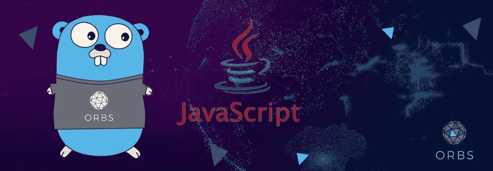

# JavaScript 开发人员入门

> 原文：<https://medium.com/hackernoon/introduction-to-go-for-javascript-developer-3e783b409e52>



Banner by Marina Rudinsky

从 [JavaScript](https://hackernoon.com/tagged/javascript) 到 Go，我遇到了几个“ *whaaat？！*“最终成为” *haaa，ok！*“瞬间。更确切地说，如果你是一名 JavaScript/TypeScript 开发人员，并且正在考虑尝试 Go，那么这篇文章就是为你准备的。

我在 [Orbs](https://www.orbs.com) 工作，这是一个面向消费者应用的[区块链](https://hackernoon.com/tagged/blockchain)，我参与了 TypeScript 中的参考实现——我从零开始实现了一个[共识算法](https://github.com/orbs-network/PBFT-Typescript)。最近，我们开始致力于 Go 语言的参考实现。我的任务是移植 consensus 算法——你可以在这里看到正在进行的转换代码。

# 类似

*   像 JavaScript 一样，Go 使用垃圾收集器。您不必进行任何内存分配/处置。
*   函数在你的日常开发中起着很大的作用。
*   变量和函数有作用域。
*   你可以在函数中使用闭包。
*   毕竟，它是一种非常简单的语言，就像 JavaScript 一样，你可以定义变量、结构、函数，执行`for`循环和`if`语句。我认为围棋介于 C 和 JavaScript 之间

# (大)差异

除了下面的列表之外，还有许多其他的差异，但是我发现这些对于来自 JavaScript 背景的开发人员来说是最有趣的。

*   Go 是静态类型的，将在编译时检测类型错误
*   我知道垃圾收集器是在“相似性”上面，但是在围棋上有很大的不同:GC 是*****快得惊人。*** 没有滞后！**
*   **JavaScript 基于一个运行代码的主线程(事件循环)和其他几个执行外部 IO 的线程。在围棋中，并发才是王道！准备好。一开始并不容易掌握，但是一旦你掌握了，你就会拥有巨大的力量。(世界正在向越来越多的核心发展)**
*   **编写 JavaScript 并运行它是如此有趣。JavaScript 被解释，代码在运行前被编译，但是谁会真的这么做呢？今天，JavaScript 工具链包括许多代码分析工具，甚至像 Babel 或 TypeScript 这样的编译工具。如上所述，Go 是编译的。**
*   **Go 正在使用指针。是啊！指针。但是等等！不要停止阅读。
    为了能够正确地执行 GC 并避免读取/写入内存，Go 指针不允许在指针上进行任何运算。你不能像在 c 语言中那样，在指针上做 p++来将它移动到数组中的下一项。但是你确实有指针(引用)的所有其他好处**
*   **Go 比 JavaScript 快*！根据你的测量，它甚至可以快 10 倍***
*   ***Go 更适合服务器，而 JavaScript 则无处不在***

# ***“哇！？哈哈，好吧”***

***你应该明白的一件关键事情是，围棋是非常固执己见的。例如关于语法，在 Go 中你**必须**将`{`放在你`if`语句中的同一行。否则将导致编译错误！***

## ***没有 OOP***

***Go 的构造方式使得类、继承和多态成为不可能(或者至少非常困难)。什么开始为"*我不喜欢这样！*“成了”*嗯，也许这样更好！*“当我明白 Go 是在逼你用构图而不是继承的时候。***

## **快捷指令**

**在围棋中，有很多捷径。感觉好像任何能用 Go 写的东西都用更少的字符。**

```
**// The long way
var age Int = 42// The short way
age := 42**
```

**这使得你的学习曲线更加陡峭，但是如果你坚持围棋，你最终会(很可能)喜欢它。**

## **映射/缩小**

**Go 是有类型的，但是[没有泛型](https://golang.org/doc/faq#generics)。这意味着您没有类似 lodash 的 map/reduce 函数。这场" *Whaaat* "并没有以"*阿哈 ok*"……
这是[计划好的](https://github.com/golang/go/issues/15292)未来版本的围棋。**

## **包装**

**当我第一次安装 Go 并想创建一个项目时，我想我应该创建一个文件夹并把我所有的代码放在那里，构建它并运行…不。围棋通常不是这样操作的。你所有的项目应该在同一个全局`src`文件夹下，在一个你的项目特有的文件夹下，通常是你的 Github 路径(例如:`~/go/src/github.com/gilamran/PBFT-Typescript`)**

**这种方法有很多问题，比如你的项目依赖于同一个`src`文件夹，版本成为一个大问题。**

**Golang 确实支持`vendor`文件夹(类似于 JavaScript 中的`node_modules`),但是它会提取`master`分支…**

**有很多尝试来解决这个问题，但要知道，目前对 Go 的依赖可能是痛苦的。**

## **试验**

**Golang 热爱测试，以至于当编译器检测到测试文件时(通过文件名 **_test.go** )，会在你构建时自动排除测试代码。**

# **句法**

**在您开始之前，让我简单介绍一下我们的工作方式:**

## **基本规则**

*   **行不以分号结尾。**
*   **数组中的最后一项必须在值后有`,`。**

```
**var arr = [3]int{
  1, 
  2, 
  3,
}**
```

*   **`if`的`{`一脉相承**
*   **public/private 分别由名称的第一个字母是否大写来定义。**

```
**var ThisIsPublic = "You can access this variable from outside"
var privateValue = "Accessible only inside the current package"**
```

## **基本类型**

```
**// common types
var num int = 5
var pi float32 = 3.14
var name string = "Gil"
var isActive bool = true // without initialisation
var num int       // value is 0
var pi float32    // value is 0
var name string   // value is ""
var isActive bool // value is false
var person Person // value is nil // one liner
var one, two, three bool
var a, b, c = true, "Hi", 0.5 // you got the point // short version with inference
num := 5 // `var` is omitted, and type is inffered**
```

## **环**

```
**// you should be familiar with this
for i := 0; i < 100; i++ {
  sum += i
}// while
for sum < 1000 {
  sum += sum
}// infinite loop
for {
}**
```

## **流控制**

```
**/// yep, no parenthesis
if age < 18 {
  return true
} else {
  return false
}// switch no need to add `break`
switch state {
  case "ACTIVE" :
    deactivate()
  case "INACTIVE":
    activate()
  default:
    fmt.Printf("Unknown state")
}**
```

## **功能**

```
**// simple function
func add(a int, b int) int {
 return a + b
}// multiple return values
func swap(a, b int) (int, int) {
 return b, a
}// named return values
func namedResult(input int) (output int) {
  output = 0
  .
  .
  .
  output = 42
  .
  .
  .
  return
}**
```

**当然，这只是冰山一角。还有许多其他高级的东西，比如通道、结构和接口，但是我将把它们留到以后的文章中。**

# **结论**

**围棋很有意思，速度很快，GC 也很惊人。当谈到并发性时，它真的闪闪发光，并且它对如何编写代码非常固执己见。不好的一面是，包管理并不引人注目，缺少泛型有点烦人。**

**所以，如果你想为服务器做点什么，并且希望它非常快地工作，Go 是个不错的选择。**

**喜欢你读的吗？查看我们的 GitHub 项目并加入社区:**

**[](https://github.com/orbs-network/orbs-network-go) [## orbs-网络/orbs-网络-go

### Go 中 Orbs 平台参考实现。为 orbs-network/orbs-network-go 开发做出贡献，创建一个…

github.com](https://github.com/orbs-network/orbs-network-go) [](https://github.com/orbs-network/orbs-spec) [## orbs-网络/orbs-规范

### Orbs 平台协议和服务规范。为 orbs-network/orbs-spec 开发做出贡献，创建一个…

github.com](https://github.com/orbs-network/orbs-spec) [](https://github.com/orbs-network/orbs-network-typescript) [## orbs-network/orbs-network-type script

### Monorepo for Orbs 平台参考实现—Orbs-network/Orbs-network-typescript

github.com](https://github.com/orbs-network/orbs-network-typescript) [](https://github.com/orbs-network/lean-helix-go) [## 球体-网络/精益-螺旋-go

### 精益螺旋一致性算法的 Go 实现- orbs-network/lean-helix-go

github.com](https://github.com/orbs-network/lean-helix-go) 

加入 Orbs 社区:

*   *GitHub:*T10*https://github.com/orbs-network*
*   *电报*:[https://t.me/orbs_network](https://t.me/orbs_network)
*   *推特*:[https://twitter.com/orbs_network](https://twitter.com/orbs_network)
*   *Reddit*:[https://www.reddit.com/r/ORBS_Network/](https://www.reddit.com/r/ORBS_Network/)
*   *阅读宝珠白皮书*:【https://www.orbs.com/white-papers **