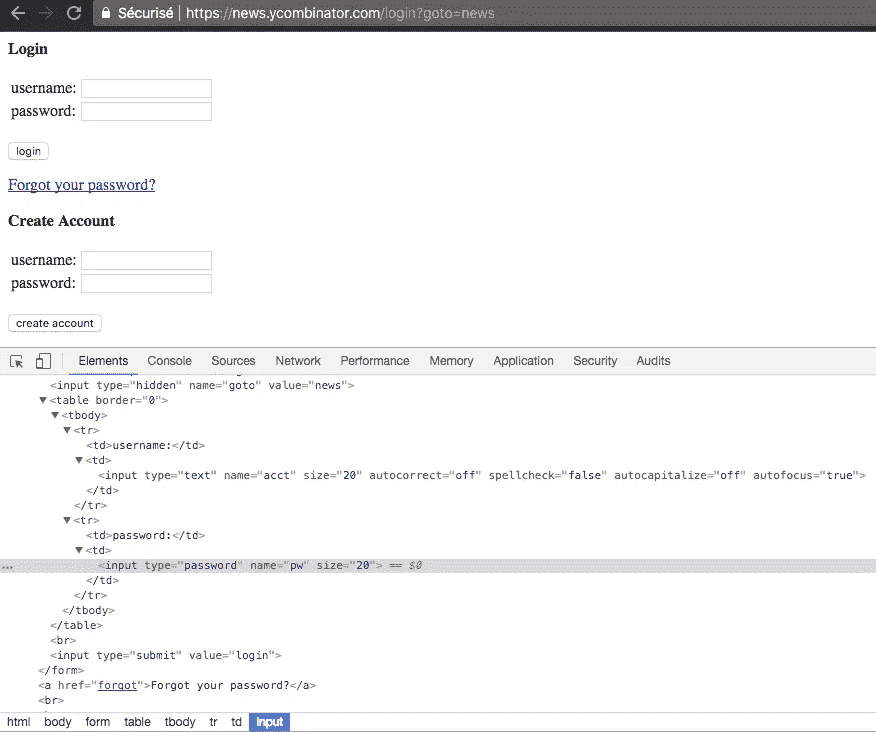

# Java 无头 Chrome 简介

> 原文：<https://medium.com/hackernoon/introduction-to-headless-chrome-with-java-b591bc4764a0>


在前面的文章中，我向您介绍了两种不同的[工具](https://hackernoon.com/tagged/tools)来用 Java 执行网页抓取。 [HtmlUnit](https://ksah.in/introduction-to-web-scraping-with-java/) 在第一篇文章中，而 [PhantomJS](https://ksah.in/web-scraping-handling-ajax-website/) 在关于处理 [Javascript](https://hackernoon.com/tagged/javascript) 的文章中沉甸甸的网站。

这次我们将从 [Chrome](https://hackernoon.com/tagged/chrome) 引入一个新特性，即 ***无头*** 模式。有一个谣言流传开来，说谷歌使用了一个特殊版本的 Chrome 来满足他们的爬行需求。我不知道这是不是真的，但谷歌几个月前推出了 Chrome 59 无头模式。

***本文节选自我的新书《Java Web scratching manual》******该书将教会你崇高的 Web scratching 艺术。从解析 HTML 到破解验证码，处理大量的 Javascript 网站等等。***

PhantomJS 是这个领域的领导者，它曾经(现在仍然)大量用于浏览器自动化和测试。听到无头 Chrome 的消息后，这位 PhantomJS 维护者说他将辞去维护者的职务，因为我引用了*“Google Chrome 比 PhantomJS[……]”*
更快更稳定。看起来无头 Chrome 正在成为浏览器自动化和处理大量 Javascript 网站的一种方式。

HtmlUnit、PhantomJS 和其他无头浏览器都是非常有用的工具，问题是它们没有 Chrome 稳定，有时您会遇到 Chrome 不会出现的 [Javascript](https://hackernoon.com/tagged/javascript) 错误。

# 先决条件

*   谷歌浏览器> 59
*   [镀铬工](https://sites.google.com/a/chromium.org/chromedriver/downloads)
*   硒
*   在您的 ***pom.xml*** 中添加最新版本的硒:

```
<dependency> <groupId>org.seleniumhq.selenium</groupId> <artifactId>selenium-java</artifactId> <version>3.8.1</version> </dependency>
```

如果您没有安装 Google Chrome，您可以在这里下载
要安装 Chromedriver，您可以在 MacOS 上使用 brew:

```
brew install chromedriver
```

或使用以下链接下载。
有很多版本，我建议你使用 Chrome 和 chromedriver 的最后一个版本。

在这一部分中，我们将登录 Hacker News，并在登录后拍摄一个屏幕快照。我们不需要 Chrome 无头来完成这个任务，但本文的目的只是向您展示如何使用 Selenium 来运行无头 Chrome。

我们要做的第一件事是创建一个 WebDriver 对象，并设置 chromedriver 路径和一些参数:

```
// Init chromedriver 
String chromeDriverPath = "/Path/To/Chromedriver" ; System.setProperty("webdriver.chrome.driver", chromeDriverPath); ChromeOptions options = new ChromeOptions(); options.addArguments("--headless", "--disable-gpu", "--window-size=1920,1200","--ignore-certificate-errors"); WebDriver driver = new ChromeDriver(options);
```

Windows 系统上需要`--disable-gpu`选项，根据[文档](https://developers.google.com/web/updates/2017/04/headless-chrome)
Chromedriver 应该会自动找到 Google Chrome 的可执行路径，如果你有一个特殊的安装，或者如果你想使用不同版本的 Chrome，你可以用:

```
options.setBinary("/Path/to/specific/version/of/Google Chrome");
```

如果你想进一步了解不同的选项，这里是 [Chromedriver 文档](https://sites.google.com/a/chromium.org/chromedriver/capabilities)

下一步是对 Hacker News 登录表单执行 GET 请求，选择用户名和密码字段，用我们的凭据填写该字段，然后单击登录按钮。然后，我们必须检查凭据错误，如果我们已经登录，那么可以采取一个屏幕截图。



我们在之前的一篇文章中已经这样做了，下面是完整的代码:

你现在应该有一个很好的屏幕截图，黑客新闻主页，而被认证。正如您所看到的，Chrome 无头确实很容易使用，它与 PhantomJS 没有什么不同，因为我们使用 Selenium 来运行它。

和往常一样，代码可以在这个 [Github 存储库](https://github.com/ksahin/introWebScraping)中获得

***本文节选自我的新书*** [***Java 刮网手册***](https://www.javawebscrapinghandbook.com/) ***这本书会教你刮网的高贵艺术。从解析 HTML 到破解 captchas，再到处理大量的 Javascript 网站等等。*** [***结账出书！***](https://www.javawebscrapinghandbook.com/)

*原载于*[*ksah . in*](https://ksah.in/introduction-to-chrome-headless/)*2018 年 1 月 18 日。*