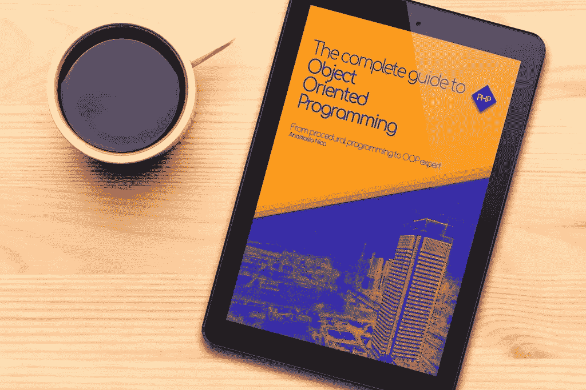

# 接口和多态性介绍

> 原文：<https://medium.com/hackernoon/introduction-to-interfaces-and-polymorphism-f9159b406013>


发现多态的秘密，面向对象编程的一个支柱

作为 Web 开发人员，你需要知道，一次又一次，你要重写、更新或删除一些你很久以前部署的代码的特性。

一旦脱离了过程范式，开始学习面向对象编程的基础知识，你会发现代码不仅要干净、可伸缩，还要易于管理。

而这对于 [PHP](https://hackernoon.com/tagged/php) 以及其他[编程](https://hackernoon.com/tagged/programming)语言来说都是值得的。

这些脚本必须易于使用，如果你的技术总监要求你重构或添加新的特性，你不会想换工作。

一些用于编写长期可靠代码的技术是接口的使用和对多态性的清晰理解。

如果你错过了，点击这里了解什么是接口，并查看 PHP 语言的第一个内置接口。

否则，下面你会发现列表的第二部分解释 PHP 接口(你不会每天都使用它们，但你必须知道它们的存在，并在需要时让它们成为你的瑞士刀的一部分)。

以及对多态性概念的简单而清晰的解释。

我们开始吧。

# 数组访问

**这个接口让对象作为数组被访问。**

这种行为的主要好处是结构性的

对象属性通常定义明确，类型各异。

如果你实现 ArrayAccess，你告诉脚本“*我的对象也可以像数组*一样运行”。

```
interface ArrayAccess { function offsetExists () { } function offsetGet () { } function offsetSet () { } function offsetUnset () { }}
```

# 可序列化

“序列化”动词，

把(某物)排成一系列。(牛津词典)。

有时，您可能需要一组数据以某种方式进行组合和排序。

**Serializable 接口允许你将数据转换成一个格式化的字符串**,这样更容易传输和导入到其他地方。

```
interface Serializable { function serialize () { }    function unserialize () { }}
```

在对象上实现这个接口会改变数据的格式，

让我们来看一个例子:

```
$obj = new obj;$obj->data = "My private data";$ser = serialize($obj);var_dump($ser);// the var_dump above will print: string(38) "C:3:"obj":23:{s:15:"My private data";}"
```

在本文的下一集，我将解释什么是魔法方法，但是现在，请记住:

如果一个类实现了这个接口，它将不再支持 __sleep()和 __wakeup()方法。

# 可数的

在类中实现它的原因是为了计数。

真的吗？

```
interface Countable { function count () { }}
```

在这个函数中，你可以计算对象的数量，
计算一个数组的元素，甚至只是返回一个数字。

[在 php.net 可数](http://php.net/manual/en/class.countable.php)

# 外部迭代器

我们之前已经接触过[迭代器](http://anastasionico.uk/blog/inheritance-and-interfaces-in-php)，

PHP 允许你遍历几种类型数据:数组、数据库、对象、目录结构等。

**有时你想迭代另一个迭代器，而这个迭代器正在迭代别的东西。**

PHP 通过使用 OuterIterator 接口来实现这一点。

它只有一个方法 getInnerIterator()和扩展迭代器接口

```
Interface OuterIterator extends Iterator { function getInnerIterator () { } // Methods inherited from Iterator function Iterator::current () { } function Iterator::key () { } function Iterator::next () { } function Iterator::rewind () { } function Iterator::valid () {    }}
```

外部迭代器需要扩展迭代器，这意味着您必须实现后面的所有方法。

[php.net 上的外部迭代器](http://php.net/manual/en/class.countable.php)

# 递归算子

这个界面和上一个很像。

事实上，

**实现 RecursiveIterator 的类简单地递归遍历迭代器**

它有两个自己的方法，并且扩展了迭代器接口。

```
Interface RecursiveIterator extends Iterator { function getChildren () { } function hasChildren () { } // Methods inherited from Iterator function Iterator::current () { } function Iterator::key () { } function Iterator::next () { }    function Iterator::rewind () { } function Iterator::valid () { }}
```

[php.net 上的递归生成器](http://php.net/manual/en/class.recursiveiterator.php)

# 可查找运算符

这个方法允许您研究迭代器，

```
Interface SeekableIterator extends Iterator { function seek () { } // Methods inherited from Iterator function Iterator::current () { } function Iterator::key () { } function Iterator::next () { } function Iterator::rewind () { } function Iterator::valid () { }}
```

方法 **seek** 允许查找到迭代器的位置

[php.net 上可查找的运营商](http://php.net/manual/en/class.seekableiterator.php)

# SplObserver 和 SplSubject

SplObserver 和 SplSubject 一起用于实现观察者设计模式

这是克里斯托弗·奥克拉维的 youtube 频道的视频教程

```
Interface SplObserver { function update () { }}
```

[php.net 观察家](http://php.net/manual/en/class.splobserver.php)

[php.net 事件](http://php.net/manual/en/class.splsubject.php)

# 多态性

在本文的前面，你发现了面向对象编程的基础之一是继承，

这是 OOP 的另一个支柱

为了简化这个非常刺耳的词，我可以用下面的句子:

如果类有不同的功能，但共享一个公共接口，这里就是你看到多态性的地方。

在一个实际的例子中，多态性是写同样的代码，给它同样的名字，但是允许它接受稍微不同类型的自变量变量或输入，然后根据这些参数输出稍微不同的结果。

```
Interface Building{ function evaluate () { }}class School implements Building{ ... function evaluate () { return $studentCount + $teachersCount; }}class Office implements Building{ ... function evaluate () { return $computersCount }}function getPrice( Building $building) { $interestRate = 0.2; return $building->evaluate() * $interestRate;}$school = new School();$office = new Office()echo getPrice($school);echo getPrice($office);
```

上面的例子以简单的方式(至少我希望如此)说明了多态性是如何工作的。

我们还有我们心爱的建筑，我们需要得到它们的价格。

复杂之处在于，即使我们需要计算同样的东西(在我们的例子中是价格),计算价格的评估有两种不同的方法。

一所学校通过学生人数加上在该校工作的教师人数得到这一估价。

取而代之的是，办公室从大楼内的计算机数量中获得评估。

通过创建 building 接口并在 getPrice()函数中声明它，我们可以在不损害安全性的情况下要求不同类型的建筑，如学校、办公室等。

多态的好处是代码可以处理多个类，并且不需要知道哪个类正在被使用，因为它们都以同样的方式被使用。

多态性主要用于使应用程序模块化。

您不需要使用创建不同操作的条件语句，而是创建可互换的对象，您可以根据当时的需要来选择这些对象。

多态的原则是保持组件的分离，这一点做得很好。

出于这个原因，您会在许多设计模式中发现它，

但这是另一个时代的故事…

# 第三部分的结论



[*一体化版的《面向对象编程完全指南》的完整版在亚马逊上以 Kindle 格式出售*](https://www.amazon.co.uk/dp/B07J47L6PB) *反正下面的部分很快就会出版。*

给你，

正如我所说的，PHP 中有大量的内置接口。

即使你很少使用它们，知道它们的存在也是很好的，当需要使用它们的时候，你将能够使用它们。

多态性也是一样，
这是一个在开始时很难理解的概念，但是一旦你理解了为什么它有助于提高你的代码质量，你就会想要在你看到程序中的漏洞时掌握它的实现。

[](http://eepurl.com/dIZqjf)

**现在轮到你了:**

请在下面的评论中告诉我哪个接口对您更有用，以及您希望如何将它插入代码中？

*如果你喜欢这个内容，并且你渴望更多的内容* [*加入脸书的社区*](https://www.facebook.com/anastasionico.uk/) *，在这里我们可以像这样分享信息和新闻！*