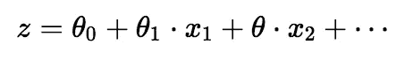
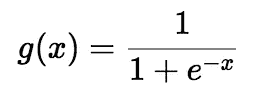
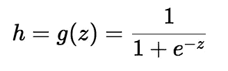
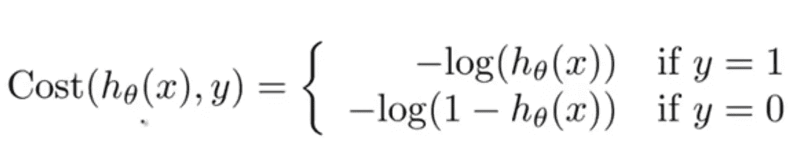
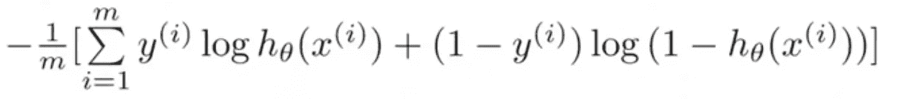
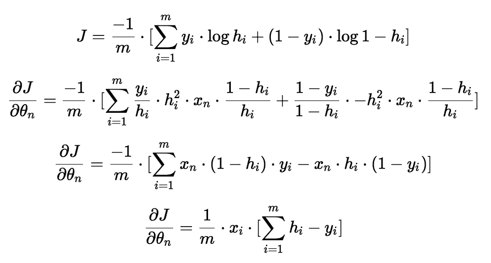
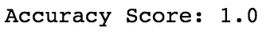
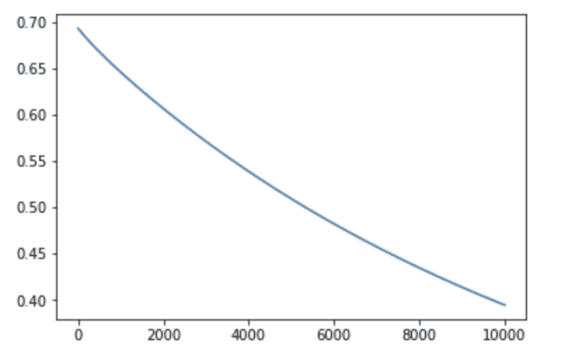

# 机器学习算法简介:逻辑回归

> 原文：<https://medium.com/hackernoon/introduction-to-machine-learning-algorithms-logistic-regression-cbdd82d81a36>

## 从头开始构建您的逻辑回归模型

Logistic 回归是线性回归之后最著名的[机器学习](https://hackernoon.com/tagged/machine-learning) [算法](https://hackernoon.com/tagged/algorithm)。在很多方面，线性回归和逻辑回归是相似的。但是，最大的区别在于它们是用来做什么的。线性回归算法用于预测/预报值，而逻辑回归用于分类任务。如果你对线性回归的概念不确定，[看看这个](https://towardsdatascience.com/introduction-to-machine-learning-algorithms-linear-regression-14c4e325882a)。人们通常会执行许多分类任务。例如，对电子邮件是否是垃圾邮件进行分类、对肿瘤是恶性还是良性进行分类、对网站是否是欺诈性的进行分类等。这些是机器学习算法可以让我们的生活变得容易得多的典型例子。一种真正简单、基本和有用的分类算法是逻辑回归算法。现在，让我们更深入地研究一下逻辑回归。

## Sigmoid 函数(逻辑函数)

逻辑回归算法也使用具有独立预测因子的线性方程来预测值。预测值可以是负无穷大到正无穷大之间的任何值。我们需要算法的输出是类变量，即 0-否，1-是。因此，我们将线性方程的输出压缩到范围[0，1]内。为了压缩 0 和 1 之间的预测值，我们使用 sigmoid 函数。

Linear Equation and Sigmoid Function

Squashed output-h

我们取线性方程的输出(z ),并给函数 g(x ),它返回一个压缩值 h，值 h 将在 0 到 1 的范围内。为了理解 sigmoid 函数如何压缩范围内的值，让我们来看一下 sigmoid 函数的图形。

Sigmoid Function graph

从图中可以看出，对于 x 的正值，sigmoid 函数渐近于 y=1，对于 x 的负值，sigmoid 函数渐近于 y=0。

## 价值函数

由于我们试图预测类值，因此不能使用线性回归算法中使用的相同成本函数。因此，我们使用对数损失函数来计算错误分类的成本。

上述成本函数可以重写如下，因为从上述方程计算梯度是困难的。

## 计算渐变

我们对每个参数(θ_ 0，θ_ 1，…)取成本函数的偏导数来获得梯度。在这些梯度的帮助下，我们可以更新θ_ 0，θ_ 1 的值…要理解下面的方程，你需要一些微积分。

Gradients

但是，如果你不能理解它们，你可以问我，或者你可以照原样接受它们。

## 密码

既然我们已经制定了必要的方程，让我们写代码。我们将只使用 numpy 库来从头构建模型。我相信这将有助于理解引擎盖下发生了什么。我们将使用[虹膜数据集](https://www.kaggle.com/jchen2186/machine-learning-with-iris-dataset/data)来训练和测试算法。

我们使用 pandas 库加载数据。Iris 数据集有三个目标值(“Iris-virginica”、“Iris-setosa”、“Iris-versicolor”)。因为我们想要实现一个二进制分类算法，所以我决定删除目标值为 Iris-virginica 的行。现在，我们只有两个目标类要预测。我们从数据集中提取自变量和因变量。现在，让我们继续准备培训和测试数据。

我们将数据混洗并分成训练和测试数据。我们的训练数据中有 90 个例子，测试数据中有 10 个例子。数据集中有四个预测值。因此，我们提取每个特征并将其存储在单独的向量中。

我们用 0 初始化参数(theta_0，theta_1，…)。在每个时期，我们使用线性方程计算值，在 0 到 1 的范围内挤压值，然后计算成本。根据成本函数，我们计算每个参数的梯度，并通过将梯度乘以 alpha 来更新它们的值。α是算法的学习速率。经过 10000 个纪元后，我们的算法会收敛到最小值。我们可以用测试数据来测试我们的算法。

我们准备的测试数据特征与训练数据相似。我们还将θ_ 0、θ_ 1、θ_ 2、θ_ 3 和θ_ 4 的值从 90x1 剪切到 10x1，因为测试示例的数量只有 10 个。我们计算测试类并检查模型的准确性。

Accuracy score of our model

我们的模型能够达到 100%的准确率。尽管逻辑回归是一个非常强大的算法，但我们使用的数据集并不复杂。因此，我们的模型能够达到 100%的准确率。当我们的模型被训练了 10000 个时期时，我们也可以将成本函数值可视化。

Cost Function

现在，您可能想知道实现一个简单的算法需要很多行代码。为了避免我们键入这么多行代码，我们可以使用 scikit 学习库。scikit 学习库有一个内置逻辑回归类，我们可以导入并使用它。

50 多行代码已经减少到 10 行以下。通过 scikit 学习库的逻辑回归类，我们也获得了 100%的准确率。

## 结论

逻辑回归是一种简单的算法，可用于二元/多元分类任务。我想现在你应该已经对逻辑回归算法的工作原理有了基本的了解。希望本文对您有所帮助:)