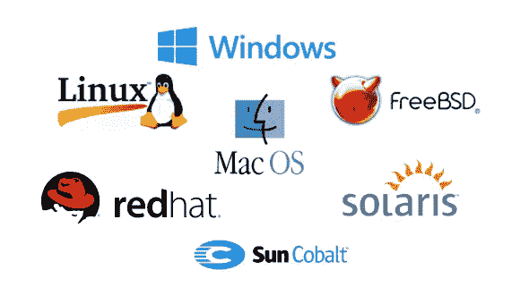
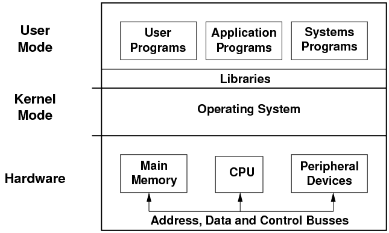

# 自学型 web 开发人员操作系统介绍

> 原文：<https://medium.com/hackernoon/introduction-to-operating-system-for-self-taught-web-developer-ba6d484398aa>

操作系统是计算机科学中的一个核心话题，也是每个软件开发人员必须对其工作有一个基本了解的话题之一。不幸的是，在 JavaScript 的世界里，这不是一件需要担心的事情，这就是为什么大多数自学的 web 开发人员会忘记学习它。在这篇文章中，我将解释操作系统的一些基本概念。

## 结构

photo credit: [http://minnie.tuhs.org](http://minnie.tuhs.org)

操作系统分为不同的抽象层。硬件、内核模式和用户模式。每一层都隐藏了自己的复杂性，并将 API 导出到上一层。

你所知道的硬件是计算机的物理部件或组件，如显示器、键盘、计算机数据存储器、显卡、声卡和主板。

## 核心态

这是操作系统工作的层，也称为特权模式。它对你的应用程序隐藏了硬件细节。用户应用程序不能访问内核层的代码和操作，这是为了实现协调，并允许操作系统有效地管理计算机资源。用户应用程序非法直接进入内核的任何尝试都会导致抛出一个可捕获的异常。大多数驱动程序在内核模式下运行。

操作系统为用户应用程序提供 API 来请求内核中的服务，这种请求称为系统调用。在 Linux 中包括:

*   fork() —用于创建新的子流程
*   execve() —执行由*文件名*指向的程序
*   open() —打开由路径名指定的文件。
*   read() —从文件描述符中读取
*   write() —写入文件描述符

## 用户状态

顾名思义，用户模式是所有用户应用程序，即 JavaScript 程序运行的地方。您的应用程序作为一个进程运行。

> 进程是执行程序的实例

每个进程都有一个私有的虚拟地址空间，这个虚拟地址包含堆栈、堆、文本和所有的应用程序状态。一个进程只能访问自己的虚拟地址，不能访问其他进程的虚拟地址。这允许每个应用程序独立运行，使得一个应用程序崩溃不会影响其他应用程序。

## 结论

操作系统是一个浩如烟海的话题，但是对于那些没有学习计算机科学的人来说，这些知识是值得的。

这只是对操作系统的一个简单介绍，为了更深入的了解，我建议你参加 Udacity 的这个课程。— [操作系统介绍](https://www.udacity.com/course/introduction-to-operating-systems--ud923)