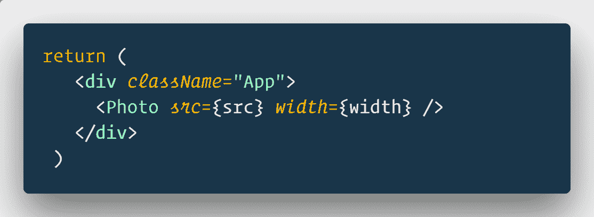
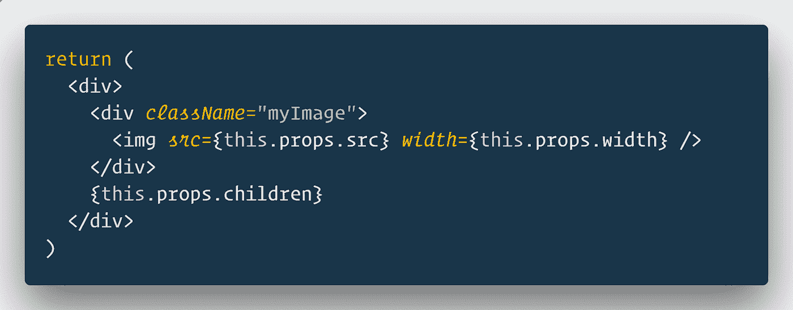
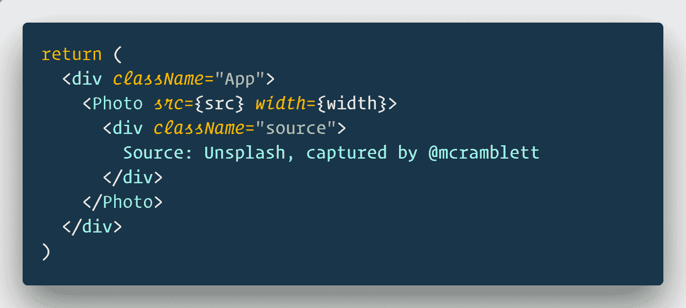

# 道具介绍. React 中的儿童

> 原文：<https://medium.com/hackernoon/introduction-to-props-children-in-react-661e1b6e45c3>

> `props.children`保存在之间传递的所有内容，它们都是按钮。所以它只是按原样呈现传递的按钮。

今天我们就来详细调查一下。你也可以在这里参考关于同一[的官方文档](https://reactjs.org/docs/composition-vs-inheritance.html)。

> `props.children`很少在实际项目中使用，因为与道具相比，它缺乏微观管理的必要性和难度，但可能有一些这样的情况会有意义，[看看我的计算器教程！](/@krissanawat/create-a-simple-calculator-app-in-react-1ec6a7bbe09d)

# 孩子是什么？

在 React 中，子组件指的是通用盒子，其内容在从父组件传递过来之前是未知的。

**这是什么意思？**这仅仅意味着在调用组件时，组件将显示开始和结束标记之间包含的任何内容。该组件通常会从应用程序组件中调用。

# 道具示例.儿童

我用`create-react-app`设置了一个基本的反应应用。我将创建另一个组件来呈现带有 img 标签的图像和其他所有内容。

photo 组件编写为自关闭等效于。如果我们没有孩子，我们可以使用自闭式的。你可以把它转换成打开和关闭，中间不加任何东西，效果是一样的。

在我的照片组件中，我试图看到`props.children`中有什么。

它显示的是图像，除此之外…什么都没有！

这是因为 App 中的照片组件没有子组件。

假设我想传递更多的组件，但是信息并不完整。我想要的只是在照片中为我的任何和所有组件的占位符。

让我们看一看。

对`Photo`组件不做任何更改。我刚刚在`Photo`中间过了一个`div`。

我们现在还能得到什么？

您可能想假设应用程序将在应用程序中呈现为 html，但它已经在另一个组件`Photo`中了。它不会渲染`App`中的任何内容。但是它知道它们是这个组件的子组件。

`Component
> Child
> AnotherChild`

所有这些孩子都可以作为`this.props.children`来访问。

孩子们的力量是它可以是任何东西。

可能的用法有:

*   将未知数量的相似元素分组到一个父元素中。
*   你不知道时间之前的元素。
*   需要包装的嵌套结构。

性能与传递道具和通过`props.children`获得道具是一样的，没什么好担心的。

如果有可能发送 props，避免使用`props.children`,因为随着应用程序的增长和需求的变化，管理作为子进程传递的数据会很困难。

如果多个组件需要相同的子组件，考虑将它们赋给 render 中的变量，然后作为子组件传递，我对上面的例子做了同样的处理。

*最初发表于* [**反应过来的忍者** *。*](https://reactninja.io/2018/06/30/introduction-to-react-props-children/)

# 特色 React JS 课程

## [React 16 —完整指南(包括 React 路由器 4 & Redux)](http://flyy.link/react-16-udemy)

4.7/5 星 **||** 33.5 小时视频**| |**61597 名学生

学习反应或深入研究。学习理论，解决作业，在演示项目中实践，并构建一个在整个课程中不断改进的大型应用程序:汉堡生成器！ [**了解更多。**](http://flyy.link/react-16-udemy)

 [## React 16 —完整指南(包括 React Router 4 和 Redux)

### 投身其中，从头开始学习 React！了解 Reactjs、Redux、React Routing、动画、Next.js 基础知识以及更多内容！

flyy.link](http://flyy.link/react-16-udemy) 

## [现代用 Redux 作出反应](http://flyy.link/modern-react-and-redux-on-udemy-32341)

4.6/5 星 **||** 26 小时视频 **||** 111，998 名学生|| 33，630 个评分在您使用 React 路由器、Webpack 和 ES6 [**开发应用程序时掌握 React v16.3.2 和 Redux 的基础知识了解更多**](http://flyy.link/modern-react-and-redux-on-udemy-32341) **。**

## 结束语:我在 [**React Ninja**](http://reactninja.io/) 上发表 React、React Native 以及其他一切与 web 开发相关的文章。一定要在 [**推特**](https://twitter.com/reactninjaio) 上关注我。

加入我们的 [**简讯**](https://reactninja.io/subscribe-our-newsletter/) 获取最新最棒的内容，让你成为更好的开发者。

## 如果这篇文章有帮助，请点击拍手👏按钮下面几下，以示支持！⬇⬇