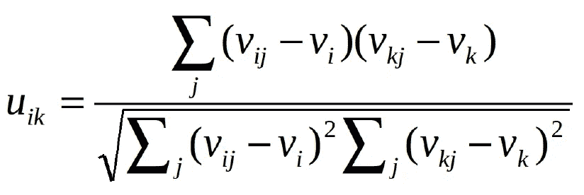
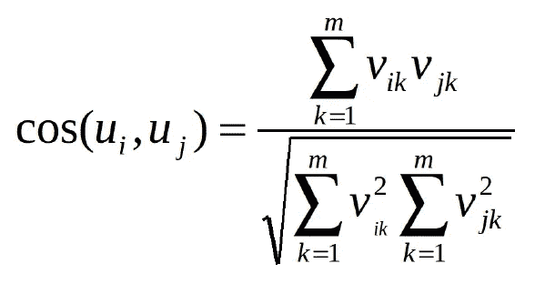
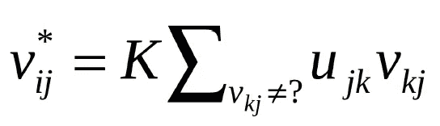
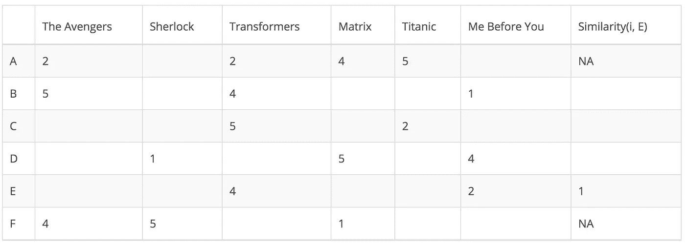
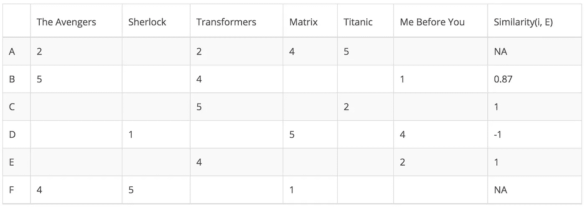
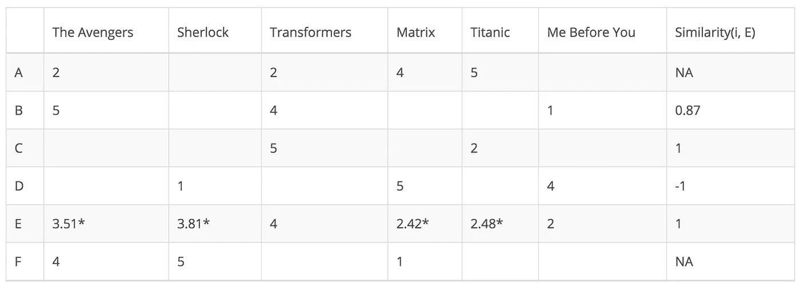
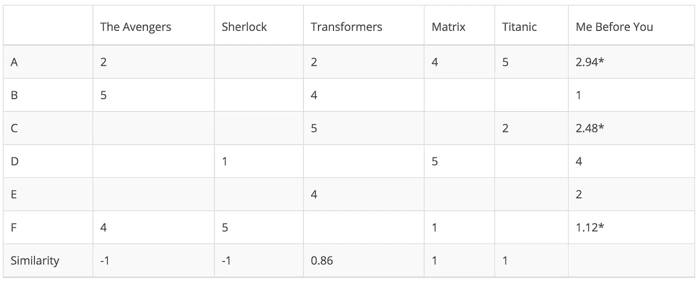
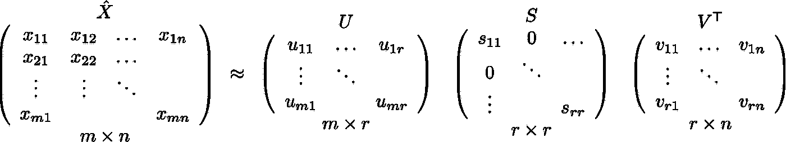
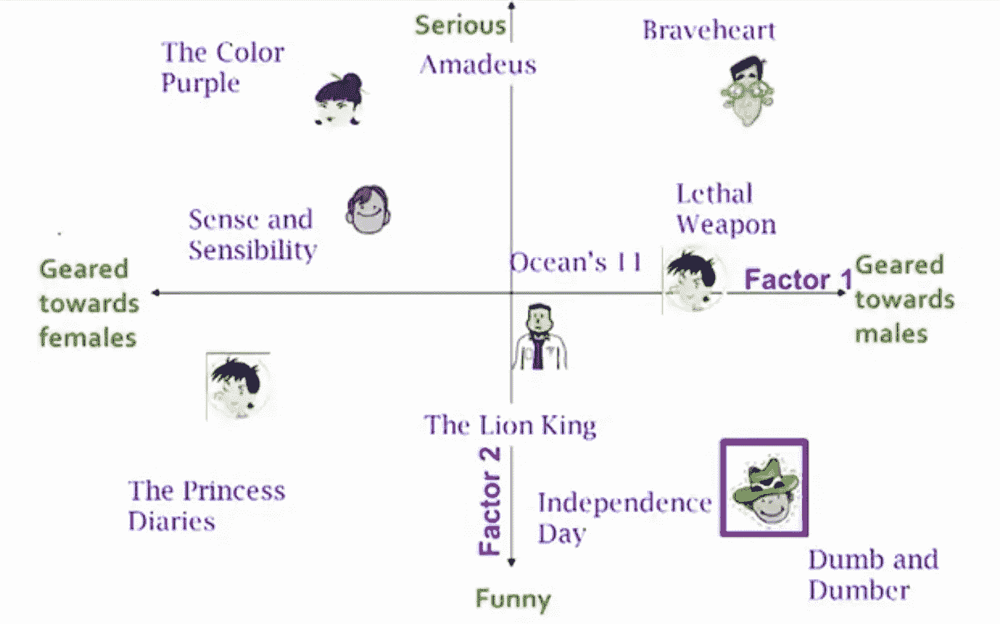
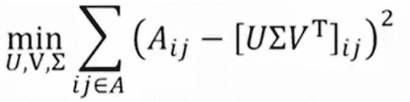

# 推荐系统介绍。第 1 部分(协同过滤，奇异值分解)

> 原文：<https://medium.com/hackernoon/introduction-to-recommender-system-part-1-collaborative-filtering-singular-value-decomposition-44c9659c5e75>


[https://goo.gl/ihju1k](https://goo.gl/ihju1k)

# 1.介绍

推荐系统是指能够预测用户对一组项目的未来偏好并推荐最佳项目的系统。现代社会需要推荐系统的一个重要原因是，由于互联网的普及，人们有太多的选择。过去，人们习惯在实体店购物，实体店的商品有限。例如，可以放在大片商店的电影数量取决于商店的大小。相比之下，如今，互联网允许人们在线访问丰富的资源。例如，网飞收藏了大量的电影。虽然可获得的信息量增加了，但新的问题出现了，因为人们很难选择他们真正想看的项目。这就是推荐系统的用武之地。本文将简要介绍构建推荐系统的两种典型方法，协同过滤和奇异值分解。

# 2.传统方法

传统上，有两种方法来构建推荐系统:

*   **基于内容的推荐**
*   **协同过滤**

第一个分析每个项目的性质。例如，通过对每个诗人的内容执行自然语言处理来向用户推荐诗人。另一方面，协同过滤不需要关于项目或用户本身的任何信息。它根据用户过去的行为推荐商品。我将在下面的段落中详细阐述协作过滤。

# 3.协同过滤

如上所述，协同过滤(CF)是一种基于用户过去行为的推荐方式。CF 分为两类:

*   **基于用户的**:衡量目标用户与其他用户的相似度
*   **基于项目的**:衡量目标用户评价/交互的项目与其他项目之间的相似性

CF 背后的关键思想是相似的用户分享相同的兴趣，并且相似的项目被用户喜欢。

假设有 *m* 个用户和 *n* 个物品，我们用一个大小为 *m*n* 的矩阵来表示用户过去的行为。矩阵中的每个单元代表用户持有的相关意见。例如，M_{i，j}表示用户 I 如何喜欢项目 j。这样的矩阵被称为**效用矩阵**。CF 就像是根据用户或物品之间的相似性，来填充效用矩阵中某个用户之前没有看过/评级过的空白(单元格)。意见有两种，**显性意见**和**隐性意见**和**意见**。前者直接显示用户如何评价该项目(将其视为对一个应用程序或电影的评价)，而后者仅作为一个代理，为我们提供关于用户如何喜欢某个项目的启发式信息(例如，喜欢、点击、访问的数量)。显性观点比隐性观点更直接，因为我们不需要猜测这个数字意味着什么。例如，可能有一首用户非常喜欢的歌曲，但是他只听了一次，因为他在听的时候很忙。没有明确的意见，我们不能确定用户是否不喜欢那个项目。然而，我们从用户那里收集的大多数反馈都是隐性的。因此，正确处理隐式反馈非常重要，但这超出了本文的范围。我将继续讨论 CF 是如何工作的。

## 基于用户的协同过滤

我们知道，在基于用户的 CF 中，我们需要计算用户之间的相似性。但是，我们如何度量相似性呢？有两个选项，皮尔逊相关或余弦相似。设 u_{i，k}表示用户 I 和用户 k 之间的相似度，v_{i，j}表示用户 I 给项目 j 的评级，其中 v_{i，j} =？如果用户没有对该项进行评级。这两种方法可以表示如下:



Pearson Correlation (https://goo.gl/y93CsC)



Cosine Similarity (https://goo.gl/y93CsC)

这两种方法都是常用的。不同之处在于，皮尔逊相关对于向所有元素添加常数是不变的。

现在，我们可以用下面的等式来预测用户对未评级项目的意见:



Unrated Item Prediction (https://goo.gl/y93CsC)

我用一个具体的[例子](http://technocalifornia.blogspot.tw/2014/08/introduction-to-recommender-systems-4.html?m=1&from=singlemessage&isappinstalled=0)来说明一下。在下面的矩阵中，每一行代表一个用户，而每一列对应于不同的电影，除了最后一个记录了该用户与目标用户之间的相似性。每个单元格代表用户对该电影的评价。假设用户 E 是目标。



由于用户 A 和 F 不与用户 E 共享任何共同的电影评级，所以他们与用户 E 的相似性没有在皮尔逊相关中定义。因此，我们只需要考虑用户 B、C 和 d。基于皮尔逊相关性，我们可以计算以下相似性。



从上表中可以看出，用户 D 与用户 E 非常不同，因为他们之间的皮尔逊相关是负的。他对你之前的我的评分高于他的平均评分，而用户 E 的情况正好相反。现在，我们可以开始根据其他用户来填补用户 E 没有评级的电影的空白。



尽管计算基于用户的 CF 非常简单，但它存在几个问题。一个主要问题是用户的偏好会随着时间而改变。这表明基于它们的相邻用户预先计算矩阵可能导致差的性能。为了解决这个问题，我们可以应用基于项目的 CF。

## 基于项目的协同过滤

基于项目的 CF 不是测量用户之间的相似性，而是基于项目与目标用户评价的项目的相似性来推荐项目。同样，相似性可以用皮尔逊相关或余弦相似性来计算。主要区别在于，使用基于项目的协作过滤，我们垂直地填补空白，而不是基于用户的 CF 的水平方式。下表显示了如何为电影《我在你面前的 T2》做到这一点。



它成功地避免了动态用户偏好带来的问题，因为基于项目的 CF 更加静态。然而，这种方法存在几个问题。首先，主要问题是可伸缩性。计算随着客户和产品的增长而增长。最坏情况的复杂度是 O(mn ),有 m 个用户和 n 个项目。此外，稀疏是另一个问题。再看一下上面的表格。虽然只有一个用户对*矩阵*和*泰坦尼克号*都进行了评级，但是它们之间的相似度是 1。在极端情况下，我们可以有数百万用户，两部完全不同的电影之间的相似性可能非常高，仅仅因为它们对于唯一对它们进行排名的用户来说具有相似的排名。

# 4.奇异值分解

处理 CF 产生的可伸缩性和稀疏性问题的一种方法是利用**潜在因素模型**来捕捉用户和项目之间的相似性。本质上，我们想把推荐问题变成一个优化问题。我们可以将其视为我们在预测给用户的项目评级方面有多好。一个常见的度量是**均方根误差** (RMSE)。RMSE 越低，性能越好。由于我们不知道看不见的项目的评级，我们将暂时忽略它们。也就是说，我们只是最小化效用矩阵中已知条目的 RMSE。为了实现最小 RMSE，采用如下公式所示的**奇异值分解** (SVD)。



Singular Matrix Decomposition([http://www.cs.carleton.edu/cs_comps/0607/recommend/recommender/images/svd2.png](http://www.cs.carleton.edu/cs_comps/0607/recommend/recommender/images/svd2.png))

x 表示效用矩阵，U 是左奇异矩阵，代表用户与**潜在因素的关系。** S 是描述各潜在因素强度的对角矩阵，V 转置是右奇异矩阵，表示项目与潜在因素的相似度。现在，你可能想知道我说的潜在因素是什么意思？这是一个宽泛的概念，描述了用户或项目所具有的属性或概念。例如，对于音乐来说，潜在因素可以指音乐所属的流派。奇异值分解通过提取潜在因子来降低效用矩阵的维数。本质上，我们将每个用户和每个项目映射到一个维度为 *r* 的潜在空间。因此，它有助于我们更好地理解用户和项目之间的关系，因为它们变得可以直接比较。下图说明了这个想法。



SVD Maps Users and Items Into Latent Space ([https://www.youtube.com/watch?v=E8aMcwmqsTg&list=PLLssT5z_DsK9JDLcT8T62VtzwyW9LNepV&index=55](https://www.youtube.com/watch?v=E8aMcwmqsTg&list=PLLssT5z_DsK9JDLcT8T62VtzwyW9LNepV&index=55))

奇异值分解有一个很好的性质，即它具有最小的重构平方和；因此也常用于降维。下面公式用 A 代替 X，用σ代替 S。



Sum of Square Error ([https://www.youtube.com/watch?v=E8aMcwmqsTg&list=PLLssT5z_DsK9JDLcT8T62VtzwyW9LNepV&index=55](https://www.youtube.com/watch?v=E8aMcwmqsTg&list=PLLssT5z_DsK9JDLcT8T62VtzwyW9LNepV&index=55))

但是这和我在本节开始提到的 RMSE 有什么关系呢？事实证明，RMSE 和上证指数是单调相关的。这意味着上证指数越低，RMSE 越低。利用 SVD 的便利特性，它可以最小化 SSE，我们知道它也可以最小化 RMSE。因此，SVD 是解决这个优化问题的一个很好的工具。要为用户预测看不见的项目，我们只需将 U、σ和 t 相乘。

Python Scipy 有一个很好的稀疏矩阵 SVD 实现。

```
**>>> from** **scipy.sparse** **import** csc_matrix
**>>> from** **scipy.sparse.linalg** **import** svds
**>>>** A = csc_matrix([[1, 0, 0], [5, 0, 2], [0, -1, 0], [0, 0, 3]], dtype=float)
**>>>** u, s, vt = svds(A, k=2) # k is the number of factors
**>>>** s
array([ 2.75193379,  5.6059665 ])
```

SVD 成功地解决了 CF 带来的可伸缩性和稀疏性问题。然而，SVD 并不是没有缺陷。SVD 的主要缺点是没有或很少解释我们向用户推荐一个项目的原因。如果用户急于知道为什么向他们推荐一个特定的项目，这可能是一个巨大的问题。我将在下一篇博文中对此进行更多的讨论。

# 5.结论

我已经讨论了构建推荐系统的两种典型方法，协同过滤和奇异值分解。在下一篇博文中，我将继续谈论一些更高级的构建推荐系统的算法。如果你对这篇文章有任何问题，请不要犹豫，在下面留下你的评论或者给我发电子邮件:khuangaf@connect.ust.hk。如果你喜欢这篇博文，请确保你在 [twitter](https://twitter.com/steeve__huang) 上关注我，以获得更多伟大的深度学习文章！