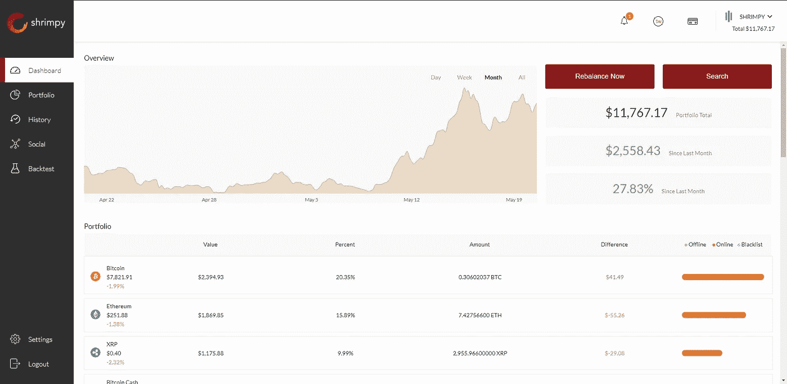
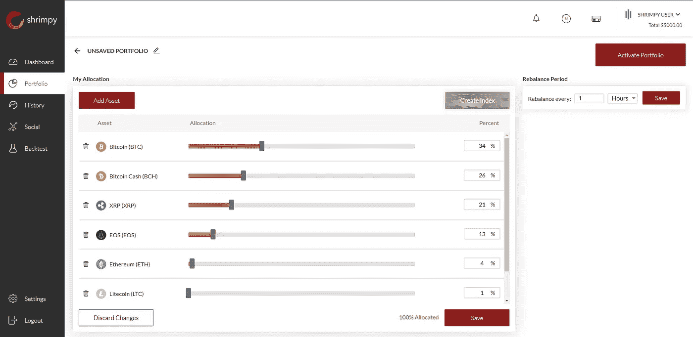

# Shrimpy 简介—投资加密的最简单方式

> 原文：<https://medium.com/hackernoon/introduction-to-shrimpy-the-easiest-way-to-invest-in-crypto-fbb546b5e649>

Choose the easy way to invest

Shrimpy 是为忙碌的人设计的简单的投资组合管理网站。Shrimpy 采用来自 crypto 之外的聪明投资者的想法，引入简单的自动化策略，帮助简化您的投资组合策略。我们创造了 Shrimpy 来解决我们面临的问题。我们浪费了无数时间来研究哪个交易所有哪个密码，跟踪我们在各个交易所的资产，并进行交易以保持我们的投资组合平衡。我们收到了如此多的问题和感兴趣的人，所以我们决定向公众提供 Shrimpy。

> 花时间和你的家人、朋友在一起，或者研究你的下一个资产选择，而不是管理你的投资组合，不断交易，并强调跟踪你的资产表现。

Keep track of your investments with simple statistics. Monitor your portfolios performance and easily adjust portfolio strategies based on various metrics. View how each coin has performed over the past 24 hours, how the percent allocations have drifted, and what are the current values of your holdings.

# 最简单的方法

Shrimpy 有两个主要优势:易于分散加密资产和自动[**重新平衡投资组合**](https://hackernoon.com/portfolio-rebalancing-for-cryptocurrency-7a129a968ff4) 。你决定你的分配，Shrimpy 负责剩下的。只需将 crypto 存放在交易所，使用简单的界面选择您的投资组合中需要的加密货币分配，并随时监控您的投资组合。

> 几分钟之内，任何人都可以从拥有一项加密资产变成拥有数百项——无需使用多次交换或令人困惑的界面。

例如，假设你拥有比特币，但你想拥有比特币、以太币、莱特币和 Monero。使用我们简单的界面，你可以输入你想要的百分比:例如 25%的比特币，45%的以太币，10%的莱特币和 20%的 Monero。Shrimpy 将自动计算汇率并执行交易，以创建您的投资组合。Shrimpy 然后自动重新平衡您的投资组合，以保持您选择的分配。

Select your allocations with a simple point and click interface, adjust the percent holdings of each coin, and schedule a continuous rebalance for your portfolio.

拥有超过 700 个受支持的加密资产和 16 个交易所，这意味着您拥有大量可用的最佳资产选项。除去追逐新的最热门的硬币而从一个交易所跳到另一个交易所的必要性，所有的东西都可以在一个地方买到。未来的预期是，随着平台的扩展，我们将能够支持数百种以上的加密资产。

你可以通过查看我们之前的文章阅读更多关于如何创建一个强大的投资组合的技巧:

 [## 创建黑仔加密货币投资组合的 10 个技巧

### 这篇文章的目的是帮助加密货币投资者涉过狂热，创造一个全面的…

blog.shrimpy.io](https://blog.shrimpy.io/blog/10-tips-for-creating-a-killer-cryptocurrency-portfolio) 

# 自动再平衡

Shrimpy 整合了投资组合再平衡，在我们的测试中，这可以将回报率提高 53%以上，同时降低波动性。这种策略经过了时间的考验，已经在股票和债券中使用了很多年——通常会增加投资者的回报，降低波动性。不幸的是，还没有人提出自动重新平衡加密资产的方法。进入 Shrimpy 自动再平衡。

Actual picture of the Shrimpy team trying to figure out how to manually rebalance our portfolios

再平衡利用了市场的周期性，将在此期间表现良好的硬币交易给表现不佳的硬币。基本上，它把高卖低买放在自动驾驶仪上。最终结果是，每枚硬币都代表了你在每次重新平衡后所选择的投资组合的百分比。由于这一切都是自动发生的，与买入并持有相比，不需要额外的努力。

如果你想了解更多关于再平衡的知识，请点击这里查看我们的其他文章:

 [## 加密货币的投资组合再平衡

### 投资组合再平衡是投资者使用了几十年的策略。首先，投资者必须确定如何…

blog.shrimpy.io](https://blog.shrimpy.io/blog/portfolio-rebalancing-for-cryptocurrency)  [## 再平衡与 HODL:技术分析

### 这项研究的目的是描绘一幅公平的画面，说明再平衡作为一种策略如何符合霍德林。为了…

blog.shrimpy.io](https://blog.shrimpy.io/blog/rebalance-vs-hodl-a-technical-analysis) 

# 组

我们是一个由工程师和产品经理组成的小团队，位于旧金山湾区。我们的成员来自脸书、亚马逊、美国宇航局、三星和波音公司。我们从 2012 年 12 月开始涉足加密货币。这始于我们定制钻机上的采矿 DOGE。最终，我们开始交易和开发定制软件来管理我们的投资。

 [## 虾米队游戏攻略

### 直到最近，Shrimpy 团队还没有发布太多关于幕后开发和工作人员的信息…

blog.shrimpy.io](https://blog.shrimpy.io/blog/shrimpy-team-introduction) 

# 我们的使命

我们相信加密资产将会扰乱世界，然而我们还没有到那一步。管理加密货币投资组合非常复杂。硬币的多样性增加了，投资的便利性却没有提高，从日常生活中采用硬币仍然是不切实际的。寻找接受菲亚特的交易所、将持股转移到加密交易所、分配余额以及维护投资组合的过程非常繁琐。这种复杂性已经成为最大的进入壁垒之一，阻止了数百万人进入市场。

通过关注新加密货币用户的易用性，Shrimpy 将改变人们管理加密货币的方式。我们应用程序的最终愿景是，您可以将法定货币直接存入我们的平台，在几分钟内分配多样化的投资组合，并实时监控您投资组合的各个方面。所有这些都将直接嵌入到 Shrimpy 平台中，因此永远不需要使用需要大量工作来维护的第三方工具。

我们相信加密应该适用于每个人。当前的硬币分发集中在那些早期采用该技术的用户手中。这不应该是加密货币的目标。我们应该努力把这些资产放在每个人的手中，不论其地位或环境如何。做到这一点的唯一方法是让它易于访问。Shrimpy 通过提供易于管理和分配的投资组合、不设置进入壁垒以及增加各种硬币的可用性来支持这一愿景。这将让更多的人利用这一不断增长的资产类别，造福于所有人。

# 我们的要求

Shrimpy 是一个免费的应用程序，任何人都可以注册试用。我们的要求是，如果你对管理投资组合的简单方法感兴趣，你[注册](https://www.shrimpy.io/)。试了一下之后，让我们知道你喜欢什么或者希望我们改变什么。我们收到的反馈越多，您对 Shrimpy 应用程序的体验就越好。

不要忘记查看 [Shrimpy 网站](https://www.shrimpy.io/)，关注我们的 [Twitter](https://twitter.com/ShrimpyApp) 和[脸书](https://www.facebook.com/ShrimpyApp)更新，并向我们在[Telegram](https://t.me/ShrimpyGroup)&[Discord](https://discord.gg/gXyy95y)上的令人惊叹的、活跃的社区提出任何问题。

留下你的评论，让我们知道你的平衡经验！

*捕虾队*