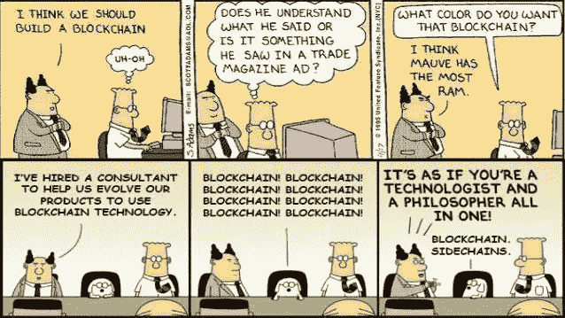
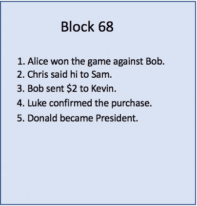
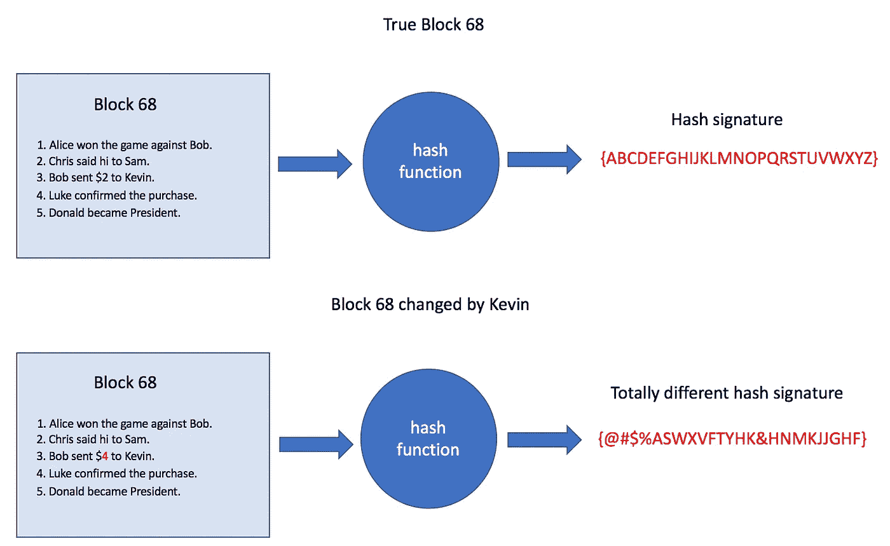
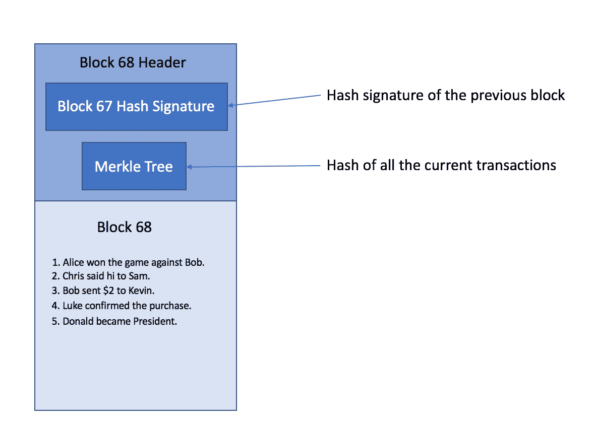
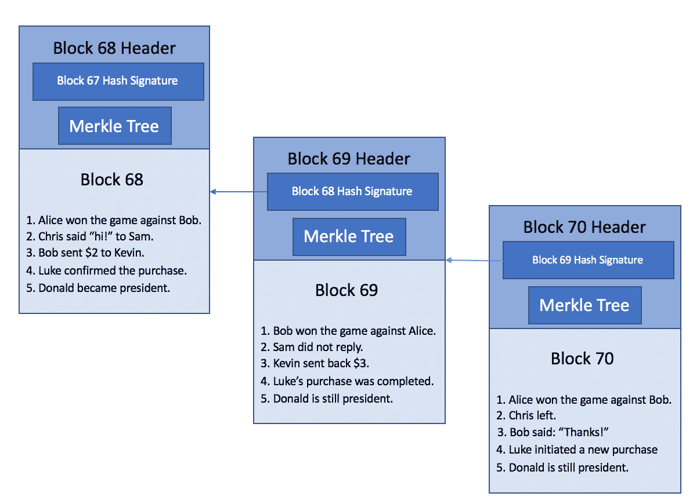
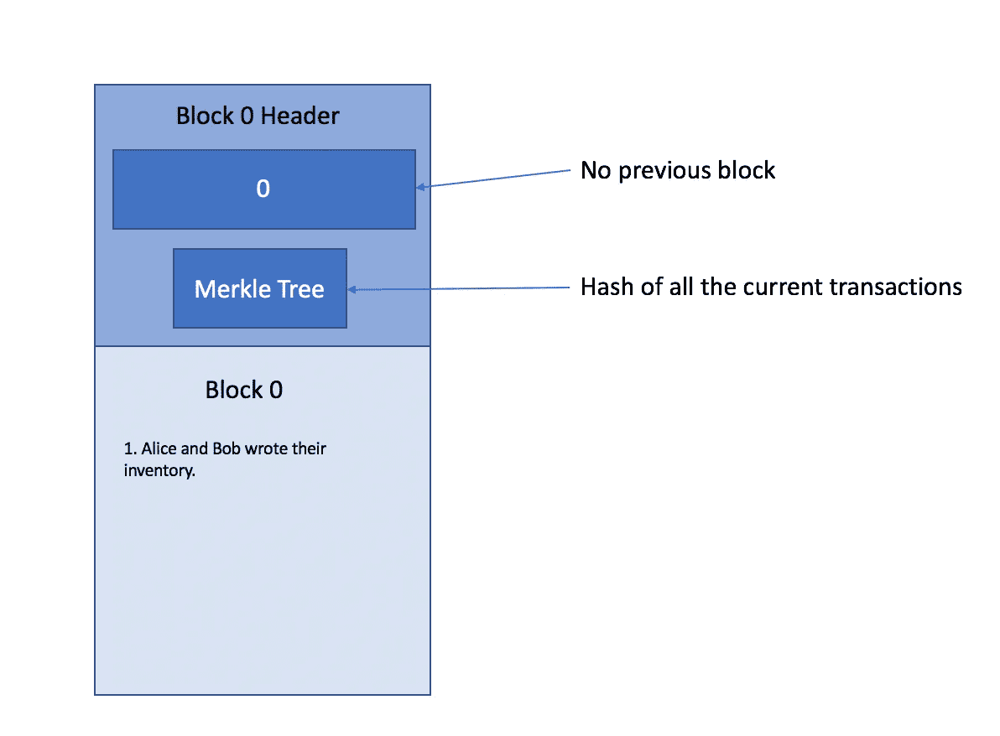
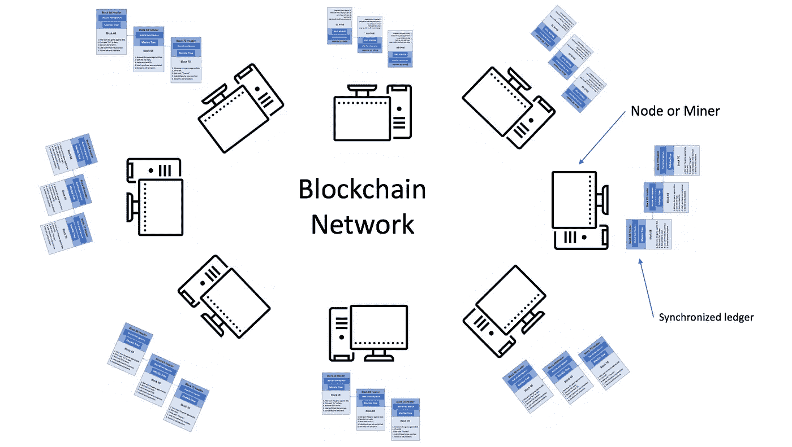

# 区块链简介:基础知识

> 原文：<https://medium.com/hackernoon/introduction-to-the-blockchain-the-basics-5e94a7194a02>

Source: [https://twitter.com/distledger/status/689893568278691840](https://twitter.com/distledger/status/689893568278691840)

你以前听说过区块链吗？你知道，那个每个人都在大谈特谈的新技术？虽然你可能仍然会忽略它在技术上的特别之处，但你知道这是另一项尖端技术，最终可能会改变你的生活。也许你是那些决定不花时间去弄清楚它实际上是如何工作的人之一。毕竟，很少有人会分解他们新买的 Phone，以了解它是如何制造的。区块链也是如此；直到它实际上有用或使用起来有趣，它才真正有意义。或者会吗？

区块链(尤其是公共区块链)被发明出来是为了在经济和社会上制造混乱。其存在的真正原因是通过抑制对昂贵和干涉性中介(或中间人)的需求来改变我们交易和交换价值的方式。如果它的目的成功并被广泛采用，它可能会对我们的社会产生深远的影响。专家们意识到了这一点([见我之前的文章](https://hackernoon.com/blockchain-buzzword-or-a-whole-new-world-38fd749d7135))，并称赞新的分权经济的好处。但是怀疑者也看到了它的使用可能导致的问题(见这篇[文章](https://hackernoon.com/ten-years-in-nobody-has-come-up-with-a-use-case-for-blockchain-ee98c180100))。

了解一点区块链可能对未来有所帮助。人们对区块链技术的兴趣持续上升，也许有一天我们不得不决定我们是否应该在日常生活中使用它。理解区块链可能很有挑战性，但是有一些资源可以帮助您了解这个主题。

我鼓励大家对这个话题进行自己的研究，了解一下这项技术是什么样子的。在本文中，我将重点介绍区块链的技术方面。

**基本要素**

世界上的每个区块链都将处理以下要素:

*   有**方**——个人，你，我，人，组织。
*   有**资产**——人们可以交换的东西。
*   有**交易**——个人之间的物品交换。
*   有**块**——一组新事务放在一起。
*   一个**链**——一系列积木。也被称为区块链。没有中央权力机构负责整个链条。相反，参与的每一方都将保留该链的准确副本。
*   人们经常达成共识——各方必须定期聚在一起，就链中接受什么样的新区块达成一致(这是区块链技术与众不同的地方之一)。
*   **密码哈希函数**——我认为是区块链技术的基础。更多细节见下文。

这些元素是区块链的基本特征。

**块和散列**

由于区块链是一串积木，掌握区块链的第一步是了解什么是积木。一般来说，**一个块是一组记录的事务**，意在添加到现有的链中。这是一个积木的例子。

Example of a block.

上述块包含许多不同类型的事务。交易可以指价值交换、确认、角色改变等。事实上，我们的区块可以包含您想要的任何信息。

但是，使用这个块可以使每个人在将它添加到链中后都可以使用和阅读它。任何有权访问该链的人都可以看到您的交易。尽管如此，没有人能够在不被发现的情况下更改数据。当一个简单的数据块可以被成千上万的个人以无人监管的方式访问时，这个数据块如何不容易受到攻击和破坏？感谢密码学(更确切的说是密码哈希函数)！

**密码哈希函数牛逼**！请随意阅读[加密哈希函数如何工作](https://blockgeeks.com/guides/what-is-hashing/)，但总结一下，它会将您的整个数据块压缩成一条名为**哈希签名**的短消息。每个块都有自己唯一的散列(冲突——两个不同的块具有相同的散列签名——是可能的但极其罕见)。**改变数据块中哪怕一丁点的数据都会自动导致其哈希签名显著不同**。例如，假设一个名为 Kevin 的人想要更改第 68 块上的交易。块 68 的真实散列签名将足以告知已经发生了改变。

加密哈希函数使区块链变得可靠。一个有效的散列函数是这样的:(1)当块被稍微修改时，它的结果会显著改变，(2)冲突的机会低，以及(3)时间效率高。一个好的区块链首先要有一个好的散列函数。例如，比特币使用 [SHA256](https://en.bitcoin.it/wiki/SHA-256) ，而以太坊使用 [Keccak-256](https://keccak.team/keccak.html) 。

**牢不可破的锁链**

以下是如何仅使用块和散列算法，就可以创建一个信息链，在与网络中的每个人共享的同时保持其完整性。让我们从上一段中取出这个块，并给它一个标题。

Block and block header

通常，数据块标题包含有关数据块的信息，但我们将重点关注 2 条关键信息:

*   前一个块的散列:每个块必须包含其前一个块的散列。
*   当前块的 Merkle 树:如果你有兴趣确切知道 Merkle 树是什么，我推荐[这篇文章](https://blockgeeks.com/guides/what-is-hashing/)。为了简洁起见，我将简单地声明它是当前块中每个事务的组合散列签名。Merkle 树允许您检查一个块中的事务是否确实属于该块。

这是区块链的样子:

A chain of blocks — Blockchain

**块标题帮助你了解两件事**:

*   如果 **链中的一个块已经被改变**:下一个块包含它的散列，下一个块包含那个块的散列，依此类推。如果该块被更改，其散列将不会与所有后续块匹配。
*   **如果一个新块中的一个事务已被更改**:Merkle 树允许您验证事务。

请注意，该链的第一个块称为块 0 或 Genesis 块，它不同于其他块，因为没有前面的块。这是它通常的样子。

**对等网络**

既然我们已经了解了区块链是什么——一个有效保持其完整性的交易分类账——我们需要解释它作为一项创新技术而与众不同的最后一个有价值的品质:它是一个**分布式**分类账。**一个典型的区块链是在一个由成百上千台计算机组成的大型对等网络**中共享的，这些计算机通常被称为节点或矿工，负责:

*   维护他们自己更新的分类账副本
*   当一个新的块将要被添加到链中时，一起协作以达成共识。这是网络的图片:

**结论**

我希望你现在可以看到，区块链允许任何交易以透明和安全的方式记录，而不需要银行或汇款机构的帮助。如果您想交易资产，您只需向区块链网络提交交易即可。一旦网络中的计算机同意将事务写入一个块并将该块添加到链中，该事务将永久保留在区块链中。成千上万台计算机是如何做到定期达成一致意见的？我将在下一篇文章中讨论这个问题。

有用的资源:

[https://blockgeeks.com/guides/what-is-hashing/](https://blockgeeks.com/guides/what-is-hashing/)

 [## 默克尔树游戏攻略

### 这篇文章的目的是提供一个基本的 Merkle 树数据结构的概述，并为更多的…

hackernoon.com](https://hackernoon.com/merkle-tree-introduction-4c44250e2da7)