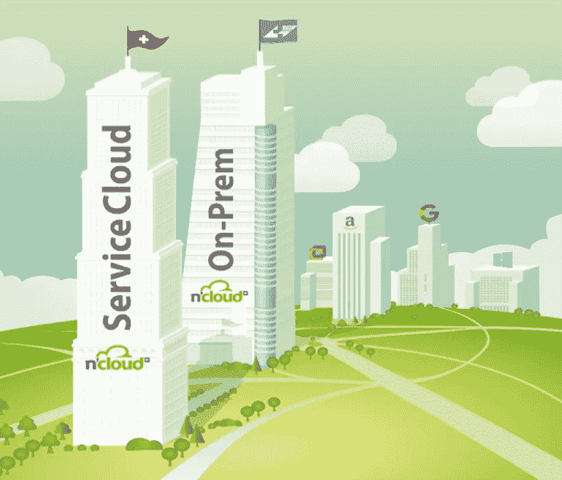
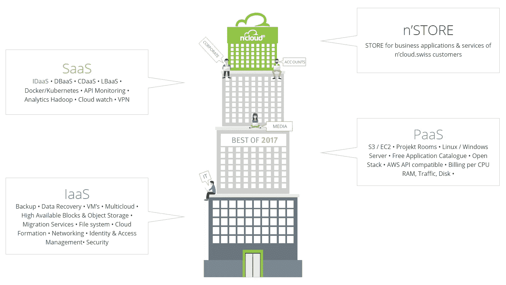

# 我们如何通过创新的云平台从租赁公寓转变为租赁整个虚拟摩天大楼

> 原文：<https://medium.com/hackernoon/introduction-to-the-features-of-the-cloud-platform-and-swiss-made-aws-alternative-ncloud-swiss-4ea74e6531d0>

## 介绍 n'cloud.swiss 的功能，也称为“瑞士制造”,是领先的云提供商亚马逊 AWS、微软 Azure 和谷歌云平台的替代产品。

Reaching the summIT of cloud innovation with n’cloud.swiss (Image: [www.beobachter.ch](http://www.beobachter.ch))

本文旨在向您提供关于 [n'cloud.swiss](https://www.ncloud.swiss) 能够做什么的介绍性信息。目标是向客户或经销商展示您的特性、功能和应用。我们将简要介绍其中的每一项功能，让您大致了解我们的云平台，我们的目标是将其打造为全球主要云提供商的“瑞士制造”替代产品。后者由亚马逊 AWS、微软 Azure 和谷歌云平台等公司领导。这三家都是美国的云提供商。出于这个原因，许多专家认为 n'cloud.swiss 有巨大的潜力，不仅预示着云计算的新时代，也让我们减少对美国巨头的依赖。事实上，在美国之外，真正的竞争只来自中国巨头阿里巴巴集团。

n’cloud.swiss and the world’s leading cloud providers Amazon AWS, Microsoft Azure, Google Cloud Platform & Co.

# **n ' cloud . Swiss 生态系统——虚拟摩天大楼**

当 n'cloud 于 2009 年作为欧洲首批云之一推出时，创始人兼董事长 André Matter 有一个想法，即创造一种在任何地方工作的自由。n'cloud 虚拟办公室就是这样诞生的。与人们可以在虚拟摩天大楼里租到的公寓相比，顾客可以要求他们想要多少房间就有多少房间。虚拟办公室为他们的工作环境提供了一切必要的东西。一个完美组织的工作空间，整合了他们所有的工作场所和员工，包括一个看管数据和设备的管理员，以及一个保持一切正常整洁的管家。一个安全部门将日夜守卫着办公室。

What exactly is n’cloud?

有了 n'cloud.swiss，我们从租赁公寓变成了租赁整个虚拟摩天大楼。与多层承重砖石建筑和结构的建筑相比，n'cloud.swiss 建筑的特点是四个倒退。建筑师会同意，挫折有助于降低建筑的质量中心。因此，建筑物变得更加稳定。稳定性和可靠性起着极其重要的作用。我们所有的产品在故障安全集群系统的设置和操作的安全性和可靠性方面都享有“瑞士制造”的高质量标准。

Image: [hdfootagestock.com](https://hdfootagestock.com/video/3451751/skyscrapers-rising-up-hd-1080)

# **一个创新的云平台，经历了四次不同的挫折**

n'cloud.swiss 的基础是基础设施即服务(IaaS)。最重要的是，平台即服务(PaaS)代表了第一个挫折。“软件即服务”经历了一个阶梯式的衰退，形成了我们云计算服务的第三个主要类别。该建筑由创新的内部 n'cloud.swiss 应用程序目录 n'STORE 完成。

n’cloud.swiss — “Swiss made” alternative to Amazon AWS, Microsoft Azure & Co.

**基础设施即服务——通过互联网提供虚拟化计算资源**

在基础架构方面，用户可以轻松启动虚拟机、运行备份或利用高可用数据块和对象存储。这里的想法是通过互联网提供虚拟化的计算资源，就像 n'cloud 虚拟办公室一样。

**n ' cloud . Swiss 的平台即服务——从其他主要云平台或向其他主要云平台轻松快速地转移现有开发**

平台端允许你运行所有的 EC2 实例。例如，如果您是 AWS 用户，并且正在寻找替代方案，那么只需几个步骤，您就可以将虚拟机从 EC2 导出到 n'cloud.swiss。这同样适用于 S3。请记住，我们为这些服务提供了完整的 AWS API 堆栈，这一点非常重要。换句话说，每当你在 AWS 上运行你的开发，并且你定期运行你的 API 调用，你可以简单地通过用 n'cloud.swiss 提供的 URL 替换这些 URL 来复制粘贴这些代码。因此，你可以在我们的平台上运行完全相同的代码和工作负载。

**软件即服务——持续开发即服务，革新云计算，让可能性变得无穷无尽**

在软件方面，n'cloud.swiss 提供了许多服务，其中包括 Docker 和 Kubernetes 即服务，以及 API 监控、分析 Hadoop、VPN 和 Cloud Watch。n'cloud.swiss 的一个独特功能是持续开发即服务(CDaaS)。这项屡获殊荣的服务使客户能够使用完整的 CI/CD 环境，同时减少开发过程中的时间和成本。这种经济高效的解决方案基于自动化的 n'cloud.swiss 工具，可以部署在任何开发或生产环境中，无需外部依赖。简而言之，有了 CDaaS，云正在发生变革，可能性变得无穷无尽。

**n ' store——商业应用和服务的市场**

在 n'STORE 中，我们提供了来自 30 个不同 IT 类别的超过 142 个“免费且随时可用”的应用程序，并提供了轻松上传其他开发应用程序和工具的机会。作为进一步的竞争优势和创新，这种类型的市场允许世界各地的客户在店中店的环境中提供他们的应用程序和服务，就像苹果或谷歌已经在他们的应用程序商店中做的那样。寻求新解决方案/服务的客户可以输入他们的需求(例如，新 CRM、新网站、开发案例等。)并接收供应商对即将到来的项目的报价。

[An innovative cloud platform characterized by four different setbacks](http://www.ncloud.swiss)

# **API 连接和云退出策略是解决供应商锁定问题的方法**

最后也是最重要的一点，关于 n'cloud.swiss，有两个重要的事情必须提及。API 连接可以轻松快速地将现有开发成果转移到其他主要云平台，如亚马逊 AWS、微软 Azure 或谷歌云平台，它考虑到了拥有云退出战略的重要性。如今，云客户经常面临供应商锁定。也被称为客户锁定，他们发现自己依赖于供应商的产品和服务。[因此，如果没有可观的转换成本，他们将无法使用另一家供应商](https://hackernoon.com/cloud-agnostic-architecture-is-a-myth-53eac80be85d)。这是我们不希望我们的客户容忍的事情。云作为下一个大事件和卓越的数字化工具，应该是一个真正的好处，而不会造成对云提供商的不信任。我们的客户应该留在我们身边，因为我们为他们提供了附加值，而不是因为我们通过锁定客户让他们违背自己的意愿留下来。

Image: [https://hackernoon.com/is-cloud-computing-insidious-without-a-cloud-exit-strategy-c53e61641209](https://hackernoon.com/is-cloud-computing-insidious-without-a-cloud-exit-strategy-c53e61641209)

# **在 n'cloud.swiss，最重要的是**在同一产品中根据每个客户的具体要求设计云

众所周知，实施云战略的公司会同时运行 4 个云。要么是因为它们独立于单一提供商，要么是因为法律原因，要么是因为服务更适合某些要求，要么是因为定价模式比其他模式更有吸引力。政府、能源或金融部门的公司，或者处理敏感数据的公司，都不允许将数据放在境外的云中。他们要么在 PREM 部署自己的云，要么在该地区的公共云中工作。

美国和中国超级云公司的规模及其影响引发了越来越多的各种担忧。即使在美国以外的任何其他国家运行“大数据云”，出现的主要问题是:[我的数据存储在哪里？谁能接触到它？](https://hackernoon.com/microsoft-announces-the-end-of-the-germany-cloud-431bbe407b94)

这些担忧是出于经济、商业、法律或保护的原因。尽管大多数云平台都是不受管理地运行，但客户越来越多地寻求建议和支持，并希望了解如何更快、更高效、更先进地使用云计算服务，以充分利用这些服务。关于这个问题，也许除了大客户之外，任何主要的云提供商都非常缺乏对中小型公司的帮助。最后但并非最不重要的一点是，客户希望能够自由决定在哪里运行他们的云(地理、安全角度)，以及作为公共、私有或混合版本或三种模式的组合来运行他们。出于这个原因，我们为 n'cloud.swiss 配备了多云特性。其理念是让客户能够根据自己的特定需求使用相同的产品设计云，既可以是服务模式(公共云)，也可以是现有 IT 环境中的本地版本(私有云)，还可以是融合了私有云和公共云优势的混合版本。

# [**趋势是从 X 即服务到一切即服务**](/nworld-publications/from-x-as-a-service-to-everything-as-a-service-1a5ae04082e6)

通过观察云行业，我们立即意识到，这个行业的技术，尤其是软件，很容易让你的创新迅速成为竞争对手的商品。智能手机行业也表现出同样的特征。通过难以复制的独特创新脱颖而出并超越竞争对手变得极其困难。谈到云市场，唯一的选择就是能够最大限度地满足客户需求和期望的产品或服务。现在，云提供商应该摆脱典型的“X 即服务”。客户应该享受灵活性，自由决定如何将云集成到他们的日常业务中。我们认为，云市场的竞争可能会发生显著变化。多云可能是即将到来的 USP，也是一种创新的差异化方式。

虽然美国国会最近批准了针对存储在海外的数据的[云法案](https://hackernoon.com/its-time-to-talk-about-the-cloud-act-95e7256b6854)，并且严格来说为联邦调查局、中央情报局和国家安全局打开了一个后门，可以在没有任何法院命令的情况下拦截几乎任何人，但对主要云提供商的替代方案的需求可能比以往任何时候都更大。一个由四家美国公司(亚马逊 AWS、微软 Azure、谷歌云平台和 IBM Softlayer)和一家中国公司(Alibabcloud)主导的市场，无疑为 n'cloud.swiss AG 提供了许多可能性。“瑞士制造”在故障安全集群系统的设置和操作的安全性和可靠性方面的高质量标准可能会为我们带来宝贵的竞争优势。