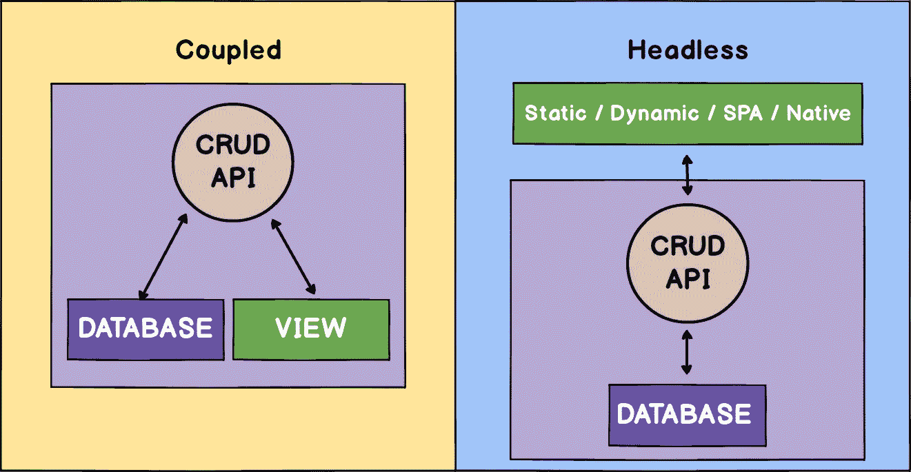

# 无头 CMS 简介

> 原文：<https://medium.com/hackernoon/introduction-to-the-headless-cms-1a8db3cb0c3d>

有某些类型的内容管理系统——耦合的**[**CMS**](https://hackernoon.com/tagged/cms)和分离的**CMS**。**耦合 CMS** 也被称为**传统**或**整体式**架构。在耦合 CMS 中，后端被绑定到前端。举个耦合 CMS 的例子——[**WordPress**](https://wordpress.org/)或者 [**Drupal**](https://www.drupal.org/) 。它允许用户创建内容，将其保存到后端并提供给前端。通常，耦合的 CMS 允许用户定制前端，但是这些改变通常是有限的。**

> **这篇博文最初发表在[我的博客](https://edvins.io/introduction-to-the-headless-cms/)**

**这就是**解耦 CMS** 发挥作用的原因。解耦的 CMS 也被称为****CMS**。headless CMS 是一个仅支持后端的内容管理系统，它提供了可用于构建任何前端的 RESTful API。就语言或框架而言，选项的数量是无限的。****

> ****“术语**无头**来源于将**头**(前端，即网站)从**体**(后端，即内容库)上砍掉的概念”——维基百科****

********

****Coupled vs Headless CMS****

# ****你能用无头 CMS 构建什么****

****有无限量的选择，你可以用后端的无头 CMS 来构建。****

*   ******静态网站**使用静态站点生成器构建，如— [GatsbyJS](https://www.gatsbyjs.org/) 或 [Hugo](https://gohugo.io/)****
*   ******动态** **应用**采用任何技术堆栈构建，如`PHP`、`JavaScript`、`HTML`和`CSS`****
*   ******单页面应用程序(SPA)** 内置`React`、`Angular`或`Vue`****
*   ******原生应用**内置`iOS`、`Android`、`React Native`、`NativeScript`****

# ****您可以使用的无头 CMS****

****现在市场上的无头 CMS 数量有限。有些解决方案是开源的，有些不是。我试着强调了你可以选择的不同选项。****

*   ********
*   ******[**Strapi**](https://strapi.io/)******
*   ********
*   ******[**庞祖**](https://github.com/ponzu-cms/ponzu)******
*   ****[**心满意足**](https://www.contentful.com/)****

> *****要查看您可以使用的选项的完整列表，请参见—***。******

# *****行动呼吁*****

*****我的名字是[**Edvins Antonovs**](https://edvins.io/)我写的是关于**反应**、**角度**、**打字稿**、 **JavaScript** 和**前端开发**的一般内容。*****

*****如果你喜欢这个帖子并且想要支持我，请在 [**媒体**](/@edvinsantonovs) 和/或 [**推特**](https://twitter.com/edvinsantonovs) 上关注我。我热衷于每隔一周发布新的博客帖子。*****