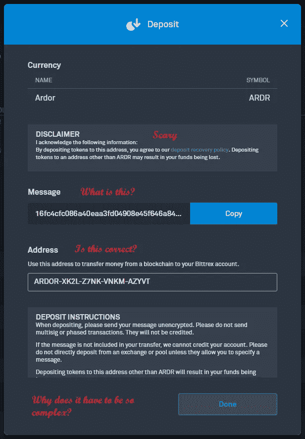
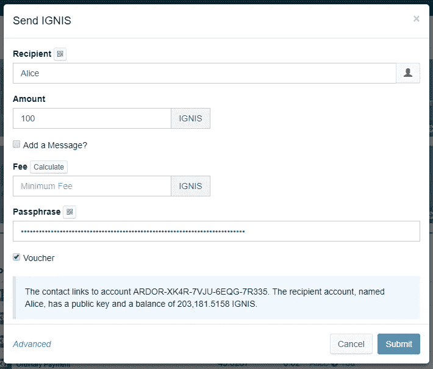
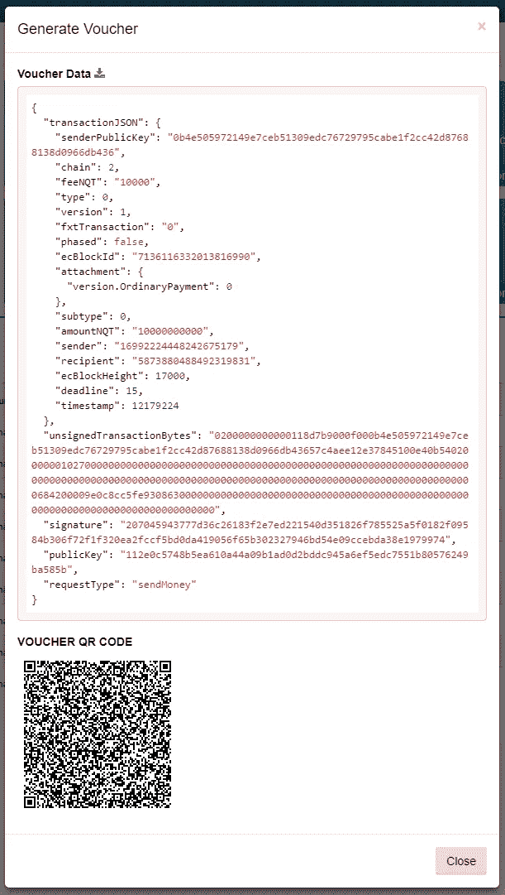
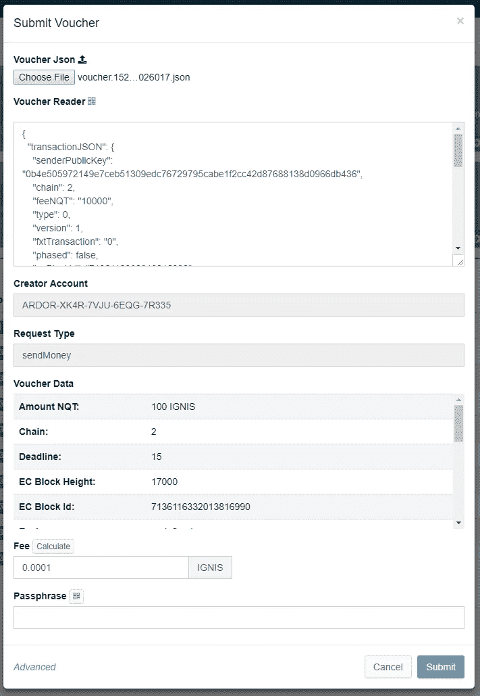

# 交易凭证介绍

> 原文：<https://medium.com/hackernoon/introduction-to-transaction-vouchers-8e7f42bbd0cb>

加密交易最令人讨厌和容易出错的一个方面是在交易所存款和取款的过程。

看看这个 Bittrex 存款对话框

让我们一起想想，当您从自己的帐户向 Bittrex 发送珍贵的热情令牌时，可能会出现的所有问题。

1.  您可能会输入错误的帐户地址，但这并不是真正的风险，因为帐户地址具有内部纠错功能。
2.  您可能会忘记包含邮件或键入错误。您的资金仍将进入 Bittrex，但 Bittrex 将无法贷记您的帐户，因此请期待与他们的客户支持团队进行长时间的讨论。
3.  你可能会错误地将热情存入伊格尼丝地址，反之亦然。再次，期待一个漫长的资金回收过程。
4.  从另一个交易所到 Bittrex 的存款或从 Bittrex 到另一个交易所的存款可能不指定消息，因此它也会丢失。
5.  即使您的存款确实指定了一条消息，一些交易所期望纯文本消息，而您可以加密发送，反之亦然。

但是事情可能会变得更糟…

6.如果你没有连接到 Bittrex.com，而是被骗连接到，比如说，Bitrex.com？让我们暂时假设这是一个旨在窃取你的资金的钓鱼网站，如果你没有注意到差异，你会很高兴地将钱存入他们提供给你的地址，失去你所有的代币。

兑换取款过程也存在类似的问题。例如，如果您将资金提取到一个新创建的账户，然后忘记了密码，该怎么办？向你珍贵的信物说再见吧。

但即使只是在朋友或企业之间发送密码也是有风险的。当你在没有任何认证的情况下通过电子邮件发送你的帐户地址和金额时，如果有人拦截了这封电子邮件并更改了地址或金额，该怎么办？我们能做得更好吗？是的，我们可以！

## 我们的解决方案—交易凭证

把交易凭证想象成发票。向特定地址支付特定金额的请求，由接收者的私钥签名。这个想法是基于[比特币支付请求](https://en.bitcoin.it/wiki/Payment_Request)提案，但使用 Ardor/伊格尼丝的丰富功能，我们可以做得更多。

[凭证](https://hackernoon.com/tagged/voucher)本身是一种 [JSON](https://hackernoon.com/tagged/json) 格式，由交易 JSON、交易字节和交易字节的数字签名组成。

比如说，爱丽丝想让鲍勃付给她 100 伊格尼斯。她使用 Bob 的帐户登录 Ardor wallet，并像 Bob 一样付款。当然，她没有 Bob 的密码，所以她不能提交交易。相反，她使用自己的密码对 Bob 的付款进行了签名，并生成了一张凭证。

Notice the Voucher checkbox

然后，Alice 下载优惠券并通过电子邮件发送给 Bob。

The Voucher Generated by Alice

Bob 收到优惠券并将其放入 Ardor 钱包。Ardor 钱包会自动验证凭证签名是否有效，以及凭证字节是否正确表示了凭证交易 JSON。验证成功后，钱包向 Bob 显示请求，它显示作为接收者的 Alice 的地址、她希望他支付的金额、任何附加的消息和任何其他交易参数。

Bob loads the voucher into his wallet

Bob 需要做的只是验证数据、签名，并使用他的密码提交交易。

Bob 确信凭证是真实的，因为攻击者可能对其进行的任何更改都会阻止钱包对其进行验证。Bob 还确信 Alice 知道她的帐户密码，否则她不可能首先生成凭证。最后，Alice 和 Bob 现在都有了一个用于记账的文档，向彼此和其他任何人证明已经请求了付款。

你可以在这个视频中观看我演示的概念[，这个视频来自我 2018 年 3 月在挪威举办的一个研讨会。](https://youtu.be/vZpmvVoUFFA)

现在想想 Bittrex 交易所的存款流程。Bittrex 可以生成一个凭证文件，您可以将该凭证文件导入到钱包中，其中包含他们的存款地址和他们希望您发送的消息，而不是要求您将令牌发送到附有消息的地址。或许他们还会让你用这些数据扫描一个二维码。你所需要做的，就是把这个凭证放入你的钱包，用众所周知的 Bittrex 帐户仔细检查接收者地址，签名，然后提交交易。

但是代金券不仅限于支付。它们可用于伊格尼丝支持的任何交易类型。例如，Bob 想委托 Alice 进行投票。Alice 以 Bob 的身份登录并生成一张投票凭证，然后通过电子邮件将其发送给 Bob，请他签名并提交。

或者，作为另一个例子，Charlie，一个伪造的游泳池经营者，想要 Bob 将他的余额出租给他的游泳池。他再次代表 Bob 执行租赁请求，然后发送 Bob 需要签名并提交的凭证。

然而，需要注意的是，代金券并不依赖于钱包。Alice 和 Dave 可以使用 API 生成凭证，Bob 也可以使用 API 对凭证进行验证和签名。所有的处理甚至可以卸载给轻量级契约，因为凭证可以用来触发轻量级契约，而轻量级契约可以生成凭证。在我的下一篇文章中会有更多的介绍。