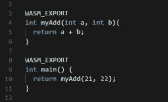
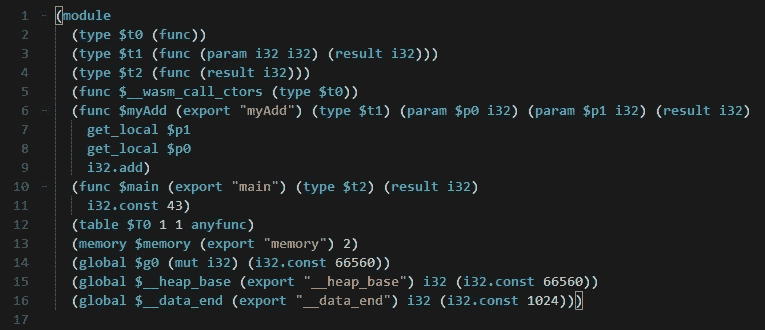

# Uno 平台的 WebAssembly 介绍(第 1 部分)

> 原文：<https://medium.com/hackernoon/introduction-to-webassembly-for-the-uno-platform-part-1-61c0db29de28>

WebAssembly，或简称 Wasm，是近来的热门话题，理由很充分。它有很多承诺，对于 Uno 平台，它承诺向其他语言和框架开放 Web。

# 什么是 WebAssembly？

WebAssembly 是一个低级的 web 字节码，旨在用作任何语言的编译目标，就像 ARM 或 x86 一样。它是由一个 W3C 小组在过去几年中建立起来的，该小组主要由来自浏览器、框架和硬件供应商的不同人员组成。他们有一个简单而具体的目标，那就是能够[安全地运行任意二进制代码，并具有接近本机的性能](https://webassembly.org/docs/high-level-goals/)。

目前所有主流浏览器都支持它，这使得它成为一个可行的目标。

WebAssembly 的定义是不可知的。尽管它的名字包含“Web ”,但它被设计成一种通用的字节码。这就是允许像[以太坊](https://github.com/ewasm/design)、[生命](/perlin-network/life-a-secure-blazing-fast-cross-platform-webassembly-vm-in-go-ea3b31fa6e09)、[星云](https://github.com/nebulet/nebulet)或 [WebAssembly 的项目。NET](https://github.com/RyanLamansky/dotnet-webassembly) 在没有任何浏览器的情况下运行。正如 [Jay Phelps 经常提到的](https://twitter.com/_jayphelps/status/1034663875839504384)，WebAssembly 既不是 Web 也不是 Assembly，可以适用于很多场景。它有潜力最终成为真正的通用二进制格式，适用于任何类型的编程。

其他好的资源可以在 Matteo Basso 的 Awesome Wasm 策划列表中找到。

# WebAssembly 是什么样子的？

WebAssembly 是一种二进制格式，它不是人类可读的，但它有一个文本表示，这使得推理更容易。

[WebAssembly Studio](http://webassembly.studio/) 是一个窥视生成的 WebAssembly 内部的好方法，在那里构建这个 C 代码:

变成这个 WebAssembly 文字代码:

它不像任何类似的汇编代码那样容易阅读，但是它给出了一个基于堆栈的虚拟机语言是如何工作的概念。

WebAssembly 是大多数开发人员永远不必直接与之交互的目标，同样，大多数开发人员永远不必直接与 x86_64 或 ARM64 交互。它在很大程度上仍然是一个构建目标，是 x86 和 ARM64 旁边的下拉列表中的一个元素。

消费一个 WebAssembly 模块一般由一个`.wasm`文件和一个 JS *glue* 文件组成，可以在 [WebAssembly Studio](http://webassembly.studio/) 的默认`main.js`示例中找到。JS 文件用于使用 [WebAssembly.instantiate](https://developer.mozilla.org/en-US/docs/Web/JavaScript/Reference/Global_Objects/WebAssembly/instantiate) 方法加载 WebAssembly 代码。

# 为什么选择 WebAssembly？

WebAssembly 主要试图解决使大型应用程序难以优化性能的问题，提供对二进制语言的访问，并提高运行结果代码的安全性。

WebAssembly 模块被定义为字节码的自包含单元。可以使用[流编译](https://webassembly.github.io/spec/web-api/index.html#streaming-modules)在下载字节码的同时处理字节码，不像 Javascript 需要对源文件进行完全解析才能有意义。

它还为任何语言提供了一种针对 Web 的编译后端(如 LLVM 和 [Emscripten](http://emscripten.org/) )的方式。这就为 C，C++，Rust，[打开了一条路。基于. NET 的语言通过 Mono](https://github.com/mono/mono/tree/master/sdks/wasm) 、Java、Go 和许多其他语言最终到达 web。它为以 Web 为目标的开发人员提供了选择，无论他们是否需要完整的类型安全，都可以重用复杂的 C++库，而事实证明这是很难移植到 Javascript 的。这种可移植性也使得运行时和框架能够跟上，例如 [QT-Wasm](https://wiki.qt.io/Qt_for_WebAssembly) ，以及 Mono 和。网络生态系统。

在安全性方面，WebAssembly 与以前在浏览器中运行任意二进制代码的尝试有很大不同，例如 Flash、Java 小程序、VBA、Silverlight、ActiveX 等等，这些都有(并将继续有)安全性和可移植性问题。例如，安全特性包括不能执行任意内存位置。虽然这使得可选的 JIT 语言(例如 NET 为基础的语言)是一个困难的目标，它承诺一个比类似的基于插件的前辈更安全的执行环境。

# WebAssembly 和。网

微软已经在 Mono 运行时的 WebAssembly [端口上工作了一段时间](https://www.mono-project.com/news/2017/08/09/hello-webassembly/)，自 2018 年初以来[进展一直](https://www.mono-project.com/news/2018/01/16/mono-static-webassembly-compilation/)稳定。使用 [Uno 平台](https://github.com/nventive/Uno)作为参考点，运行时看起来像在 iOS 和 Android 上一样稳定，这是相当大的成就。

还有。NET 核心运行时(CoreRT)团队，他们正在。NET 原生引擎，并且也取得了重大进展。

WebAssembly 的安全性方面，由于[无法执行内存](https://webassembly.org/docs/modules/#function-index-space)的数据段，使得运行 IL 代码变得困难。通常，实时(JIT)编译用于使用底层平台的指令在数据内存段中发出代码，然后 CPU 将数据作为代码执行。WebAssembly 中的安全约束类似于 iOS 和 watchOS 中的约束，它们不允许这样的编译技术。Mono 团队已经在这些限制下工作，WebAssembly 支持需要同样的处理来绕过这个限制。

对此显而易见的答案是使用*提前编译* (AOT)，采用与 iOS 和 watchOS 相同的技术。[由于技术上的考虑](https://gitter.im/aspnet/Blazor?at=5b1ab670dd54362753f8a168)，比如 [Emscripten](https://kripken.github.io/emscripten-site/index.html) 的集成及其在 Javascript 上的`libc`实现，AOT 还不可用。而 [AOT 集成目前正由微软在](https://github.com/mono/mono/issues/10222)上进行，目前的运行路径。WebAssembly 环境中的. NET 代码是通过复活的 Mono 解释器实现的。

Mono 解释器类似于一段已经存在了很长时间的代码( [mint](https://www.mono-project.com/news/2017/11/13/mono-interpreter/) )，在 Mono 的早期使用，当时 JIT 引擎(mini)还不可用。它的作用是逐个获取 IL 指令，并在本机编译的运行时之上执行它们。它允许 IL 代码立即在适当的环境中运行，代价是执行性能。

虽然这是一个很好的启动解决方案，但这样的实现包含一个用于 IL 规范中每个可用操作码的 [*巨型开关*](https://github.com/mono/mono/blob/7c19f9d443136cd76bd50bde3e13c4b43c98000f/mono/mini/interp/interp.c#L2686) 。这是[在经历这个热执行路径时给浏览器一个艰难的时刻](https://bugs.chromium.org/p/v8/issues/detail?id=7838)。它也不能很好地处理 CPU 数据缓存，例如 i5 或更低 CPU 的设备，其 L2 缓存大小有限。

幸运的是，这种情况只是暂时的。当 Mono 的 AOT 可用时，代码将立即快得多，尽管快多少还有待观察。生成的 WASM 二进制文件的大小也是一个未知的变量，而且也很难从其他看起来相似的 AOT 目标 CPU 架构中推断出来。

解释器模式将作为混合执行模式留在 Mono 中。这将允许使用罗斯林的动态代码生成的[场景在非 JIT 友好的环境中是可行的，并使诸如](https://github.com/jeromelaban/Wasm.Samples/blob/master/RoslynTests/RoslynTests/Program.cs)[表达式编译](https://docs.microsoft.com/en-us/dotnet/api/system.linq.expressions.expression-1.compile?redirectedfrom=MSDN&view=netframework-4.7.2#System_Linq_Expressions_Expression_1_Compile)之类的 BCL 片段能够正常工作。

# 引导 mono-wasm SDK

使用 mono-wasm SDK 的当前挑战是它的进入壁垒。仍然有很多东西需要修改，而且它没有以任何方式集成到 Visual Studio 或 VS 代码中。

基于 Frank A. Krueger 在 OOui 上的工作，我们构建了 [Uno。Wasm.Bootstrap](https://github.com/nventive/Uno.Wasm.Bootstrap) ，一个简单的 NuGet 包，除了 mono-wasm 之外，与任何框架(甚至 Uno 平台)都没有关系。这允许用户采取简单的。NET Standard 2.0 库，并在浏览器中运行，使用`Console.WriteLine`将文本写入浏览器的调试控制台。任何与浏览器交互的更高级的东西都需要通过 Javascript 评估 API。

我们预计这一方案在不久的将来会有重大改变。这包括添加新的 Mono 特性(如 AOT 和调试器支持)，Nuget 集成，VS 集成等…

前往 Uno。Wasm.Bootstrap readme 创建自己的应用程序，并在几分钟内在浏览器中体验 C#。关于使用 Json.NET 和罗斯林的其他场景，请参见这两个[示例。](https://github.com/jeromelaban/Wasm.Samples)

# 接下来…

在本文的第二部分，我们将触及更多关于 Mono 在 WebAssembly 中的集成和即将推出的特性的高级主题。

