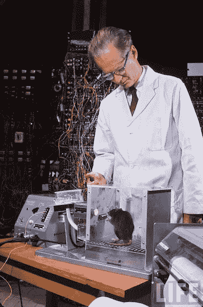
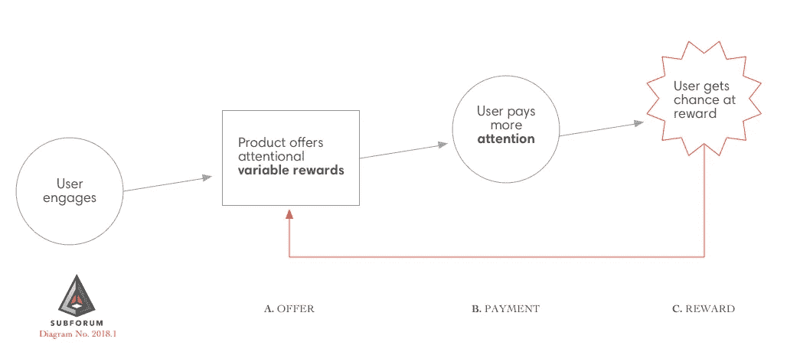
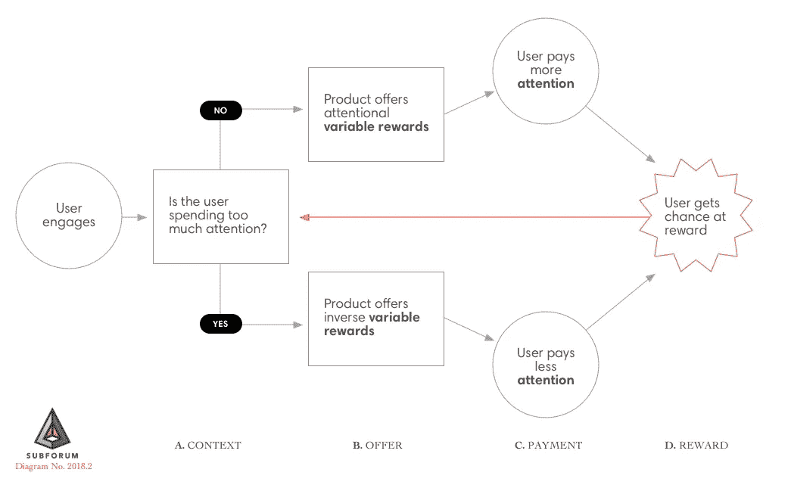

# 反向可变奖励

> 原文：<https://medium.com/hackernoon/inverse-variable-rewards-1e6a101790bf>

我们可以利用设计师最初用来让产品上瘾的相同模式来对抗智能手机上瘾。在本文中，我将描述一种方法，我称之为**反向可变奖励。**

[可变奖励](https://www.nirandfar.com/2012/03/want-to-hook-your-users-drive-them-crazy.html)是大量‘上瘾’消费品的基础，[被设计师们用来吸引用户注意力](https://www.1843magazine.com/features/the-scientists-who-make-apps-addictive)。他们寻求这种关注不一定是因为他们认为这符合用户的最佳利益，而是因为他们可以通过广告来赚钱，这反过来使产品能够生存和发展。

# 背景:什么是可变奖励？

为了理解可变奖励，想象一个老虎机。你投入一枚硬币。你拉杠杆。三种形状都匹配吗？没有吗？好，再拉。这次怎么样？

有时候拉杠杆会给你奖励。有时候什么都没有。(两次都花了你 25 美分。)你对是否获得奖励没有真正的控制权，你只有对是否付费玩的控制权。[看数据](http://gaming.nv.gov/modules/showdocument.aspx?documentid=11031)，老虎机很赚钱。

事实证明，我们动物对可变的、不固定的奖励特别敏感。早在 20 世纪 30 年代，心理学家 B. F .斯金纳就在一项著名的研究中发现了这一点，这项研究包括将动物放入有奖励机制的盒子中。对获得奖励的预期(不管我们是否真的获得了奖励)增加了我们大脑中的多巴胺水平，这迫使我们继续做之前让我们获得奖励的事情。基于可变时间表的不可预测的奖励会导致更高水平的多巴胺。可变奖励也倾向于导致期望的行为更频繁地重复。

B. F. Skinner & Rat — photo from Life Magazine ca. 1960

# 注意力经济中的可变回报

仔细看看你的手机或社交媒体。偷偷摸摸的可变奖励系统几乎无处不在；有许多流行的和经常被复制的[设计](https://hackernoon.com/tagged/design)模式使用了它们。这里有几个例子:

*   在 Twitter 上向下滚动脸书无止境的新闻推送/拉至刷新:*接下来会有什么新闻；会是什么好笑的事吗？还是有意思？*
*   在 Tinder /任何交友 app 上滑动:*下一个人会是你吗？*
*   在社交网站上发帖或评论:*它会给我带来多少赞/回复？*
*   查看你的信息、邮件或通知:*我的朋友给我回信了吗？*
*   iPhone 应用程序网格上的通知标记。*里面有什么新内容？*

上述特征都有一个共同的特点:它们没有停止点，因此会永远分散注意力。这是他们设计中有意的一面。在互联网上，你并不总是用钱来支付，但你总是会用更稀缺、更珍贵的东西来支付:你的注意力。

多亏了像 Nir Eyal 这样的营销人员，可变奖励在 Web 2.0 时代成为了一个流行的营销和产品设计概念。脸书、Instagram 和 Twitter 等引人注目的消费者服务通过将令人上瘾的可变奖励设计到核心使用模式中，实现了规模和市场主导地位:

**Figure 1\.** Variable rewards as commonly used by consumer websites and apps to capture attention

这些服务都有一定的价值，但它们没有像谷歌或苹果最初那样扩大价值。他们用多巴胺挂钩来衡量。今天，许多用户都在质疑所有这些注意力陷阱到底有多重要，但不管怎样，大多数(如果不是全部的话)消费者平台都使用可变奖励来“吸引”你的注意力。

事实上，注意力是在线可变奖励商业模式的默认货币。这是一种糟糕的情况，因为它会导致用户分心、紧张或沮丧。当用户被要求付出注意力时，可变奖励是不健康和不可持续的。这样使用它们是不道德的。顶多偷偷摸摸的；最坏的情况是邪恶的。

# 反向可变奖励

好消息是:可变奖励非常强大，但本质上并不邪恶。我们可以用它们来“回馈”用户的注意力，就像它们被用来吸引注意力一样。通过改变可变奖励的“支付模式”,我们可以将它们作为健康行为改变的工具。

不要让用户在注意的情况下付费，而是让他们在停止使用的情况下付费。用户可以因为*而不是*做了那些事情而获得奖励，而不是因为他们看了、点了或者发布了什么而获得奖励。

你觉得这不可能吗？疯狂的设计师对话？只是愚蠢？考虑几个例子:

*   开始新的日常生活。如果你的手机能够让你描述深思熟虑的意图，并使用可变奖励来强化你在指定时间内有意不用的行为，会怎么样？也许你想更好地在早上 7 点去健身房。如果你去了健身房，并且手机关机，你就有机会获得奖励。如果你早上 7:07 正坐在床上浏览 Twitter，你不会。奖励可以是健身房积分，或者任何东西，从奖励表情符号到你下次手机/数据使用账单上的几美元，或者在应用商店消费的积分，或者类似的东西。
*   **安全驾驶。**如果你的汽车保险公司为你开车时保持手机关闭提供不同的奖励会怎么样？想象一下，在一次不受干扰的驾驶后到达目的地，看看你是否得到了奖励——也许是保险信用，或者随着时间的推移，你的保险费率降低，以反映为你投保的风险降低。
*   **更加均衡的媒体消费。**想象一下[脸书](https://hackernoon.com/tagged/facebook)新闻供稿有底。用户会在一定量的滚动或滑动后发现这个底部，然后他们会看到一个消息，更多的内容将很快加载。脸书可以在这种模式中实现一种可变的奖励:当新内容被加载时获得奖励的可能性。用户等待更多内容的时间越长，他们就越有可能获得奖励。

在正确的情况下，反向可变奖励一点也不可笑；事实上，它们似乎是常识。它们是在使用系统中创造平衡并使其可持续的一种方式。相比之下，当我正在高速驾驶一辆 2 吨重的汽车时，一个电话唠叨着要我看着它，这本身就是可笑的。如果我在车祸中过早死亡，苹果和谷歌都不会受益。

**Figure 2\.** Balancing a system using inverse variable rewards

上面的例子证明了一个简单的事实，即*上下文很重要*。你的手机和应用程序不应该总是奖励脱离，而是以一种有关联的方式来促进平衡、健康和安全。类似地，像脸书这样的社交媒体平台可能会开始引入反向可变奖励来抑制他们认为是滥用的使用行为。凭借他们收集的个人用户的所有使用数据，他们当然拥有强大的参与度指标和用户特征。也许他们可以从刺激 5-10%最上瘾的用户脱离开始。

像脸书这样的注意力资本家/广告平台究竟为什么要这么做？因为随着时间的推移，这有助于他们的平台变得更加可持续，减少剥削。这对他们来说可能听起来很不错[现在](https://www.nytimes.com/2018/03/17/us/politics/cambridge-analytica-trump-campaign.html)。