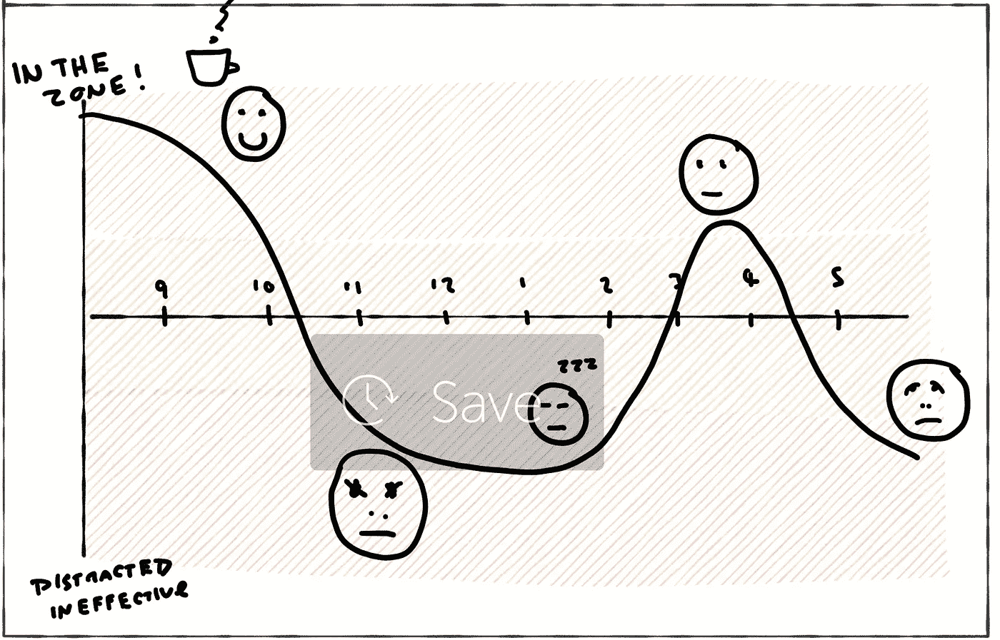

# 投入精力和注意力，而不是时间

> 原文：<https://medium.com/hackernoon/invest-energy-and-focus-not-time-af51e8ce17f6>

这是一个众所周知的自助/生产力概念，但在产品开发的背景下值得重复。

您经常会发现经理会问一些类似以下的问题:

> 我们如何投资我们的时间？

考虑…

*   当你处于“最佳状态”时，你的效率有多高
*   频繁的计划外中断的影响(例如生产问题)
*   消耗认知的会议的成本
*   在无组织的时间里实现“创作高峰”
*   努力让一个复杂、臃肿的系统“留在你的头脑中”
*   运送有直接影响的东西，或围绕一个强大的任务动员团队，都会带来士气的提升
*   当你在组织不良的代码中工作时，你所体验到的拖拉感
*   午餐时间在跑步机上解决问题
*   切换到新任务或返回任务时的“启动时间”
*   “把事情从你的脑海中抹去”的价值(GTD 风格)
*   当一个团队正在努力寻找最佳状态时和当事情“一拍即合”时在效率上的差异

考虑投资时间要容易得多。《‪"Energy 与焦点》很乱。时间感觉非常具体，值得电子表格，直观。然而，至少 n=1，我认为我最有效率的日子比我最没效率的日子至少有 10 倍的效率……它们都是 8 小时。

我的经验告诉我团队也是如此。这些影响是复合的。低能具有传染性，并引发连锁反应。专注的自由是催化剂。午餐后的会议——既充实又沉闷——变得乏味。

所以这里有一个很好的练习。尝试一个实验。作为一个团队，讨论什么时候你想有一个“动力时间”。你将如何使它不受干扰？一天中的什么时候能量和注意力水平会变高？关闭 Slack。先理清思路。不要吃得过饱。咖啡？也许远离你办公室的噪音。决定*你想在哪里*集中精力…一个单一的，强大的目标。还有…曲柄！

现在比较一下你的工作时间。有什么不同？结果如何？有了这个经验，现在寻找其他的方法把心流投入到重要的事情上，而不是原始的时间。如果你像大多数人一样，你的团队每天只有 1-3 次这样的“机会”……所以要明智地使用它们。

不，你不能一整天都这样(你不会有焦点)。但是你会学到更多关于投入精力、专注和时间的区别。