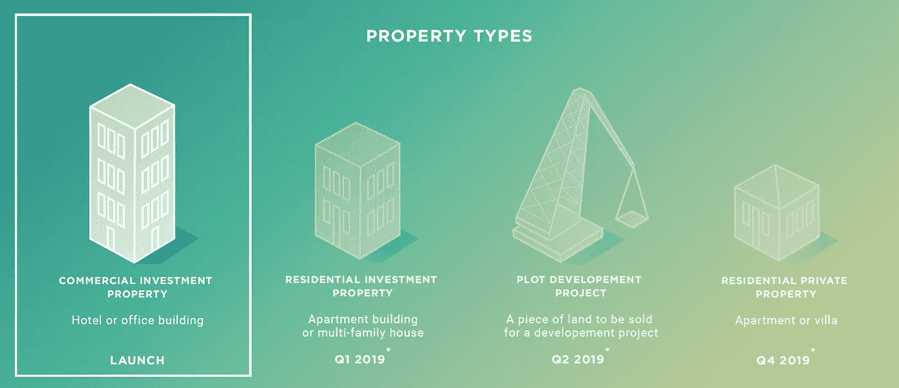
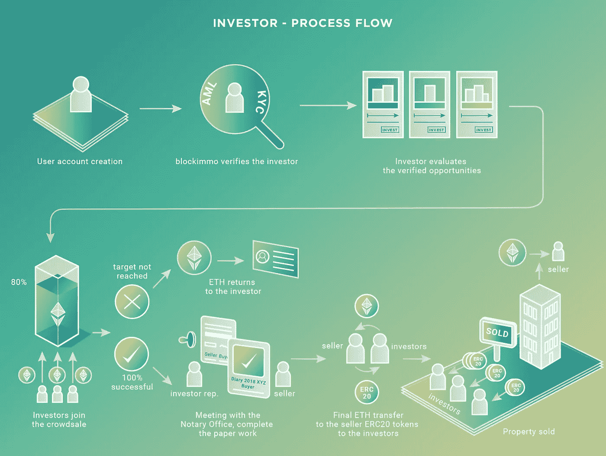
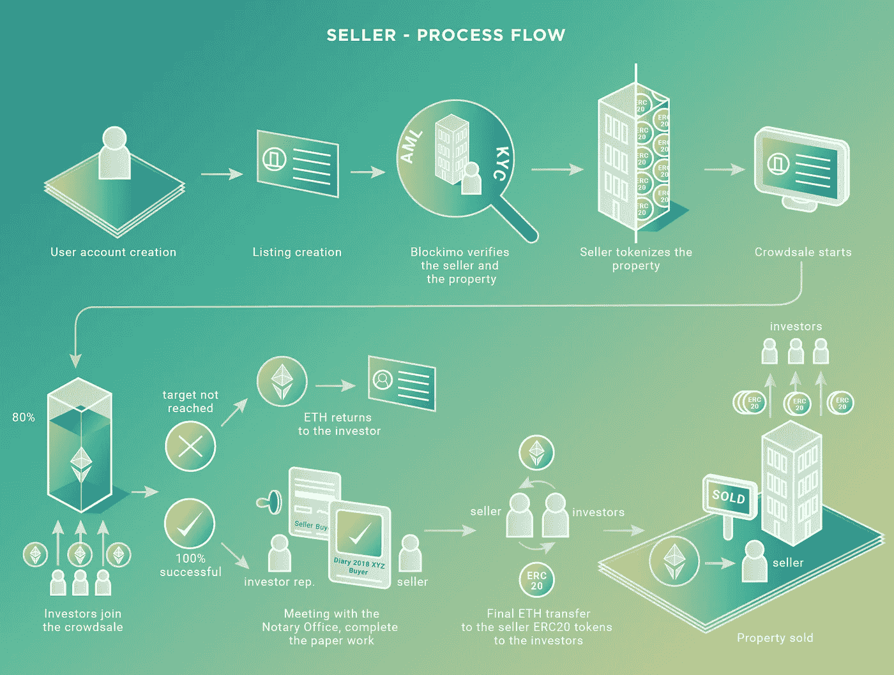

# 用 blockimmo 投资商业地产

> 原文：<https://medium.com/hackernoon/investing-in-commercial-real-estate-with-blockimmo-4420ad96f759>

(商业)房地产市场有一个光明而令人兴奋的未来。目前，这个市场由少数几个有能力承担大额、大量、非流动性投资的投资者主导。将这些资产令牌化将创造一个更容易进入、更高效的市场。商业房地产的未来是一个投资具有流动性、可能以少量股份进行且易于管理(即投资者可以更有效地管理风险)的领域——来源:EEA/Real Estate SIG——案例研究(即将链接)。

在 blockimmo，我们正在帮助投资者和房产所有者(卖家)向这种新的房地产投资方式迈出第一步。

首先，我们探索了瑞士🇨🇭土地注册处的内部运作，了解了土地注册处和地籍测量员如何合作，为一个运营良好的市场奠定基础。当我们基于这个市场建模一个系统时，我们在这个高效、透明的系统中发现了一个瓶颈——**交易。**

 [## 启用链上数字资产🏘在现实世界中

### 通过移动交易链，我们建立了(瑞士)房地产行业的主要优势，最大限度地提高效率，同时最小化系统的整体变化。

medium.com](/blockimmo/enabling-on-chain-digital-assets-in-the-real-world-456d80aed0b0) 

有了大量的中介(代理人、银行、法律实体、公证人)来促成这些交易，买卖双方之间的价值流动就部分丧失或重新流向这些方。我们意识到这个瓶颈可以通过在链上移动事务(换句话说，自动化事务)来缓解，因此我们开发了智能契约([第 1 部分](/blockimmo/the-smart-contracts-powering-blockimmo-fc16e1bbee09) / [第 2 部分](/blockimmo/real-estate-backed-security-tokens-deploying-and-open-sourcing-the-blockimmo-platform-smart-50fecbf9a360))来实现这个瓶颈，并且[实现了一个简单的层](/blockimmo/a-simple-layer-enabling-a-smart-contract-based-web-app-691f0b64c475)，将这个区块链功能包装到我们的[应用](https://blockimmo.ch/)中。

我们达成了一个最小、简单的解决方案，解决了系统的瓶颈，同时与其他组件(如土地注册员和地籍测量员)无缝集成。我们的智能合同构成了我们解决方案的核心，实现了房地产交易的自动化，减少了对中间商的依赖。我们的软件堆栈建立在这些合同之上，在交付其价值的同时为我们的用户抽象区块链。

 [## 支持 blockimmo 的无服务器⚡️架构

### 我们平台的安全性和稳健性至关重要，因为它使我们能够确保为…提供安全可靠的环境

medium.com](/blockimmo/the-serverless-architecture-powering-blockimmo-dc2df3e64b57)  [## 支持基于智能合约的 web 应用程序的简单层

### 在之前的帖子中，我介绍了 blockimmo 的核心/基础层——我们的智能合约。关键任务状态…

medium.com](/blockimmo/a-simple-layer-enabling-a-smart-contract-based-web-app-691f0b64c475)  [## 房地产支持的安全令牌—部署🚀并且开源 blockimmo 平台 smart…

### 还有…我们的黑客🐛赏金现在公开了！

medium.com](/blockimmo/real-estate-backed-security-tokens-deploying-and-open-sourcing-the-blockimmo-platform-smart-50fecbf9a360) 

我们的框架与我们的软件协同工作，以确保交易合法合规，简化与房地产交易相关的[法律流程](/blockimmo/real-estate-laws-regulations-in-switzerland-95dc72220fd9)，并为我们的用户抽象出这种复杂性。其结果是一个无障碍和简化的房地产市场。

完成繁重的工作后💪在本帖中，我们将深入探讨[**blockimo**的](https://www.blockimmo.ch/)焦点用例——投资和销售*商业投资物业*。

## 为什么是商业地产？

我们的平台和智能合约足够通用，任何类型的房地产都可以通过 blockimmo 进行交易。我们将重点缩小到**投资**市场，因为这是我们(最初)为用户提供最大价值的地方。

我们使我们的用户能够用在二级市场上自由交易的流动代币，对一小部分商业地产进行小额投资。

我们将关注点进一步缩小到商业投资市场，因为瑞士的法律法规相对简单和宽松。这简化了我们的法律框架，并允许外国投资者或所有者参与进来。考虑到(瑞士)商业投资市场极其难以进入，这种专注让我们能够触及尚未开发的投资者的巨大目标市场。

从运营的角度来看，商业地产比住宅地产贵得多，这使得我们可以彻底审查卖家和地产，直到我们完全自动化这些过程。从商业模式的角度来看，我们的用户比私人住宅交易更频繁地进行投资，这意味着更活跃的用户和经常性收入。

最后但并非最不重要的是，投资焦点允许我们的用户慢慢开始，随着他们对 blockimmo 越来越熟悉，扩大他们的投资。开始投资只需要几千瑞士法郎(CHF)(从技术上讲，从 1 ETH 开始投资是可能的)。期望买家立即购买公寓或房子是不现实的(尤其是考虑到我们正处于用户尚不熟悉的新技术的前沿)。

## 我如何开始投资/销售？

任何人都可以自由浏览 blockimmo。当你准备好第一笔交易(投资或出售)时，你需要用 [blockimmo](https://blockimmo.ch/#/profile) 创建一个账户。这是一个简单的过程，我们会识别并验证您的身份( [KYC /反洗钱](https://intercom.help/blockimmo/investor/what-is-aml-kyc))，并将这些信息绑定到您由 [blockID](https://blockid.ch/) 支持的钱包中(在此之前，您需要下载并设置[元掩码](https://metamask.io/))。一旦通过验证，您就可以开始投资和销售了！

# 我如何投资房产？

用 blockimmo 投资房地产很容易。你可以浏览列表，直到找到你感兴趣的房产。所有列表都已经过 blockimmo 的审核和批准。您可以查看与该房产及其财务状况相关的一般信息，如独立估价、预期年收入和估计年升值。您可以看到与代币销售相关的信息，如进度、开始/结束日期、目标和参与投资者的数量。

您可以通过指定您想要投资的金额来下达投资订单。销售完成后，乙醚/代币将转入您的钱包。

你可以通过投资者仪表板监控你的投资。您将收到与您正在参与的代币销售相关的通知(如目标达成、完成等)，并看到与这些销售相关的信息。您的交易历史和当前持有量(投资组合)也显示在这里。您也可以在这里监控和管理您的资产(即管理您的资产产生的收入)。

## 一套房产如何在 blockimmo 上挂牌出售？

一个属性可以通过几个简单的步骤在 blockimmo 上列出。第一步是标记您的属性。这需要地产的*电子网格*(全球唯一标识符) *Grundstück 号(土地登记号)*和*T5*Grundbuchauszug(地产登记摘要)*。下一步是为潜在投资者提供相关信息，如描述、专题视频、图片、规格等。此时，您的上市将*等待 blockimmo 的审核和批准*，以确保其正确性和合法性。*

列表获得批准后，您就可以配置和启动代币销售(众包销售)。这是向投资者分发代币以换取以太的机制。您将指定财产的价格(必须在 blockimmo 的独立估价范围内)、销售的开始和结束日期、销售目标(销售成功所需的售出代币总数的百分比)以及销售完成后以太/代币将被转移到的您的(硬件)钱包地址。

代币销售上线后，您可以在卖家面板中监控其进度。您将在代币购买时收到通知，并看到与销售相关的信息。

销售成功完成后，您需要与投资者代表一起在公证处审查并签署双方准备的文件。在这一点上，你会收到你的乙醚(或菲亚特，如果首选)和投资者将收到他们的代币。*如果销售目标未能在截止日期前达成，乙醚将被转移回投资者，财产的代币将被转移回您的(硬件)钱包。*

*要在 blockimmo 上出售房产，您需要* [*联系我们*](mailto:hello@blockimmo.ch) *。最初，我们会亲自挑选房产，进行彻底的尽职调查，并与卖家密切合作。*

# 谁负责管理这块地产？

投资物业的完整管理将外包给活跃在物业所在区域的专业合作伙伴。这确保了大楼保持良好的状态，租户得到优质的服务，会计和财务由值得信赖的一方完成。

财务报告也将外包，但由 blockimmo 管理。这些定期(我们的目标是季度)报告将通过投资者仪表板访问。

blockimmo 的运营团队将与物业管理和财务报告合作伙伴密切合作，以确保最高的服务质量。投资者通过附属于每个(商业)物业的[股东道](https://intercom.help/blockimmo/investor/as-a-real-estate-token-holder-do-i-have-any-voting-rights)拥有决策权。

## 听起来不错，但是我想先看看引擎盖下面，试一试

我们采取非常开放的方式来构建我们的平台。透明度是我们文化不可或缺的一部分，有助于我们与客户(投资者和卖家)建立信任。在研发阶段，我们一直用技术和非技术博客文章解释我们的架构、设计决策和平台。随着 blockimmo 的推出，我们已经让[开源我们的智能合同](https://gitlab.com/blockimmo-ch)，并参与[公共独立审计](/new-alchemy/blockimmo-security-audit-b09232370e06)和[漏洞奖金](https://hackerone.com/blockimmo)。同样，我们将在获得金融监管机构的批准后公布我们的法律框架/文件。

[Phoenix Property](https://blockimmo.ch/listing/CH123456789012) — on blockimmo.ch — [Try our platform!](https://blockimmo.ch/listing/CH123456789012)

你想试试我们的产品吗？我们欢迎您在[**https://block immo . ch**](https://blockimmo.ch/)**——我们刚刚启用了一个虚拟财产，您可以在其中投资(没有直接价值，如[在此](https://intercom.help/blockimmo/investor/why-are-there-2-dummy-properties)所解释的)。所以你可以了解我们的流程，看看我们的产品是如何运作的。我们欢迎任何关于 **hello@blockimmo.ch.** 的反馈**

**我们引起你的兴趣了吗？您想了解更多关于我们平台、技术的信息，或者与我们见面吗？我们很高兴邀请您到我们在克罗博谷楚格的办公室。让我们保持联系吧！[*https://block immo . ch*](https://blockimmo.ch/)**