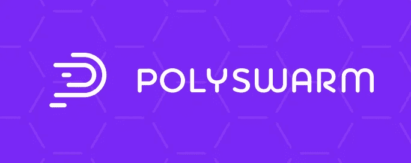
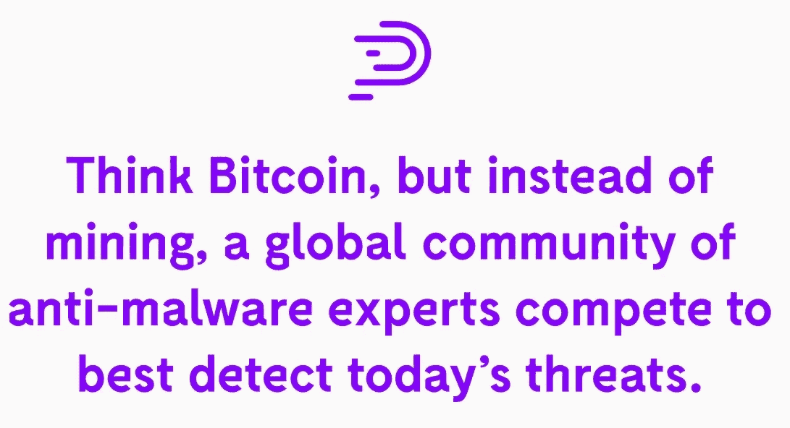
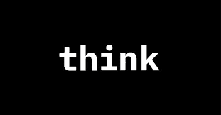
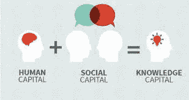

# 投资 Crypto 赚钱？一个强大的团队是你必须投资的。

> 原文：<https://medium.com/hackernoon/investing-in-crypto-to-make-money-a-strong-team-is-what-you-must-invest-in-3ef4b47ac28d>

## 透视 Polyswarm

在哪里可以找到世界上最投入、最兴奋的团队？

在谷歌总部？在会议室？在一家科技初创公司里？

不…

只需在周六早上去当地的公园，观察有动力和积极性的团队行动。他们为了一个共同的目标一起工作，一路上庆祝小小的胜利。他们从错误中学习，了解每个成员如何在下一轮中改进。他们由一位自信、有魅力的领导者领导，这位领导者帮助他们了解各自的角色，并沟通和维护团队愿景。当球队打出全垒打时，每个人都欢呼并击掌，因为他们知道他们已经一起取得了成功。

paloaltoonline.com

使建筑物坚固的不仅仅是砖块，而是砂浆。

在这种情况下，砂浆是社会资本:相互依赖，一种建立信任的潜在联系感。

团队工作的理念**产生于对社区的研究，以及是什么让他们在压力下生存和繁荣。**

但是，当应用于现在经常被变化、意外和模糊所困扰的组织时，这个概念变得至关重要。

在工作中，不亚于在社区中，**核心团队**在让个人和公司更有弹性、更能处理好冲突方面发挥着关键作用。

如果你一直在关注我的文章，你就会知道我有多重视研究。铁杆研究。技术和团队。

虽然我从未与任何团队有过近距离接触，但最近我有机会**与 Polyswarm** 的团队建立了联系，Polyswarm 是一家位于区块链的威胁情报初创公司，它依靠由企业、消费者、供应商和地理上分散的安全专家组成的分散生态系统来实时解决安全问题。

聚…什么？

Polyswarm。

该公司在以太坊智能合约平台上运作，旨在激励开发人员、企业、安全专家，以及几乎所有对其界面上发布的安全问题提供准时、快速威胁情报的人

这个无缝的、基于区块链的系统是业内第一个，这给了它坚实的先发优势，有效地为定制的威胁检测解决方案创造了市场。

## 为什么经验在密码市场很重要？

**区块链是一种技术工具**——而且非常复杂——团队需要**一流的开发者**来帮助你建立它。

如果他们手头没有区块链大师。

**致命。对吗？**

不完全是。这是一个相当新的领域，专家仍然是一个罕见的品种，但大多数伟大的开发人员可以学习诀窍和正确的语言。

请注意，这可能需要几个月的时间，以及许多挫折。

不止于此:团队需要面向业务的人参与整个项目。请记住，区块链不是一项独立的技术，而是一项服务于您的运营和底线的技术。

很明显， **Polyswarm 团队**似乎意识到了这一事实，并组建了一个由**经验丰富的**技术人员、安全极客、营销人员和金融中坚分子组成的团队。

## **团队研究 101。也就是如何在投资前仔细研究一个团队。**

我在以前的文章中提倡挖掘一个团队创始人的过去，就像你挖掘你初恋的过去一样。或者是前妻。

毕竟，这是一项你用真金白银进行的投资。对**人的投资。**

Polyswarm 的团队由在政府和行业拥有数十年经验的 InfoSec 资深人士组成。

> *“我们致力于为我们自己、我们的客户和整个行业改善威胁情报状况。”—* [*PolySwarm。*](https://polyswarm.io/the_team/index.html)

在浏览了一下 Polyswarm 的网站后，我发现 Polyswarm 的所有创始成员都直接参与了之前一家名为 Narf Industries 的公司。

Yes. That is the NARF LOGO.

出于好奇，我在网上搜索 Narf 是什么，以及**它是否与 Polyswarm 有任何关系。**

令我满意的是，Narf 是一家精品信息安全公司，专门为政府和大型企业量身定制解决方案。自 2011 年起投入使用。

这正是我想看到的。一家区块链公司，其创始人已经入行多年。这对我来说是唯一最重要的因素。

一个团队的经验=一个认可的印记。

Narf 在信息安全、区块链和密码研究领域处于领先地位。[据网站](https://narfindustries.com/)称，它最近为国土安全部(DHS)完成了一个基于区块链的身份管理项目，并代表 DARPA 完成了几个尖端的部分同态加密项目。

作为信任票，Narf 计划开发服务于 PolySwarm 市场的产品和服务。该团队预计该领域会有激烈的竞争，并准备好迎接挑战！

在过去的经验被证实后，让我们单独讨论那些强大的，令人印象深刻的，威胁情报神童

## Polyswarm 团队。也就是你投资的人

## [**CEO——史蒂夫·巴斯**](https://www.linkedin.com/in/sbassijr/)

在创办信息安全研究公司 Narf 后，**史蒂夫**为 Polyswarm 带来了**在信息安全领域超过 20 年的经验。有趣的是，他以前曾与业内的全明星客户合作过。**从 DARPA 到财富 500 强企业。****

Steve 还参与了政府项目，涉及事件响应的高级开发、身份管理以及 DARPA CGC 的分析工具。

此前，他作为 R00t 的 Sk3wl 成员参加了几场 DEF CON“夺旗”比赛。

**brain food——想象一下他利用所有这些关系来使用 Polyswarm 平台。**

## [**CTO —保罗·马考斯基**](https://www.linkedin.com/in/paul-makowski-b98703b9)

保罗带来了在现代软件开发、程序分析、漏洞研究、逆向工程、密码学和低级开发方面的 10 年经验。

当保罗发现他所在大学的身份证系统存在缺陷时，他开始认真考虑安全问题。他没有回头。

在共同创立 PolySwarm 之前，Paul 为财富 100 强客户进行逆向工程并编写定制的恶意软件杀毒工具。与史蒂夫相似，保罗为美国国土安全部的身份管理政府项目工作。

该死的国土安全部！

他在信息安全方面的研究技能被定义为尖端技术，在与 CERT 合作期间，他在识别网络使用的防御工具中的缺陷方面发挥了核心作用。

## [**产品安全—本·施密特**](https://www.linkedin.com/in/ben-schmidt-6a7246102)

就像史蒂夫和保罗一样，本将**在信息安全领域的** **十年经验带到了董事会。他领导了自动化程序分析、恶意软件逆向工程、安全软件开发、密码学、加密货币和漏洞分析方面的研究。**

在他的职业生涯中，Ben 发现了数百个**安全漏洞，跨越了多个领域和部门。他创作了许多源代码和二进制分析工具来帮助他的研究，确保可以快速有效地发现未来的 bug。**

***你看出趋势了吗？***

*问问你自己，你在***上投钱的代币团队是否真的有这方面的经验？**

**他们是主修* ***历史*** *，从事过* ***销售*** *，现在正在谈论* ***供应链*** *的人吗？**

**是有* ***10000 度*** *和证书* ***没有工作经验*** *的人吗？**

**或者他们是主修* ***软件*** *的人，曾在* ***软件*** *工作过，并且现在正在初创一家* ***软件*** *公司？**

*聪明点，做正确的事。*

**

*我们现在来看看核心小组的其他成员-*

## *[**首席运营官—尼克·戴维斯**](https://www.linkedin.com/in/nick-davis-655a667)*

*Nick 从 2009 年开始在海军担任威胁分析和网络取证主管，带来了丰富的经验。这已经超过了 8 年的顶级经验，包括在国防部队的工作！*

**

*他还与该团队的其他成员共同创建了 Narf，并管理和实施信息安全审计。根据他的 LinkedIn- Nick 审计了**数千行代码的安全漏洞**，并创建了各种定制设计的二进制应用程序，每个应用程序都有故意的漏洞，用于测试自动化程序分析工具的功效。*

*据报道，尼克经常在一个自然采光的房间里度过他的日子，看着树木，*编码风暴*和消灭虫子。*

## *[**CMO —阿德里安·埃斯库德**](https://www.linkedin.com/in/adrianescude/en)*

*Adrian 拥有 **10** **年的数据驱动营销**、产品管理和市场研究经验，为财富 100 强公司、专业服务公司和不同行业的初创企业提供服务和咨询。*

**

*Adrian **领导**市场情报部门，与通用电气、惠普、西门子、联想和霍尼韦尔等公司开展营销分析咨询业务。*

*Adrian 最近被 SDX 授予**“年度专业代理人”，这是加州圣地亚哥历史最悠久的营销协会。***

*他被派往拉丁美洲的索尼电子公司，在那里他管理了 **5 年**的平板电脑和电脑业务，增加了销售额和利润。*

## *[**首席经济学家——伊芙琳·海托普洛斯**](https://www.linkedin.com/in/evelynhytop)*

*Evelyn 在多个领域拥有 **5 年的经验**，并且拥有使用高级分析和**大数据来破译信息**并提供可操作情报的良好记录。*

**

*通过数据驱动的决策，Evelyn 使用技术上严格的计量经济学评估来实现业务增长和流程优化，同时增加资金价值。*

## *[**VP 增长—账单费用**](https://www.linkedin.com/in/williamfehr)*

*比尔有 23 年帮助初创企业快速发展的经验。他是一名业务开发和营销专家，擅长设计以用户为中心的采用策略，向大型和小型公司销售技术服务，以及建立和领导有效的营销和销售团队。*

**

*最近，比尔是数字心灵感应公司(Digital Telepathy)的增长与合作总监，该公司已被 ServiceNow 收购。*

*比尔有着从 1 万到 100 多万的成交记录。他共同创立、建立和管理了一个 42 人的 UX 互动机构，为客户如思科、罗技、Cartus、Adaptec 和 KPMG 运行主要的开发程序。*

## *[**社区副总裁——杰西卡·蒂菲尔斯**](https://www.linkedin.com/in/jessicathiefels)*

*在数字营销、社区管理和内容领域工作了 10 年之后，杰西卡·蒂菲尔斯在咨询数字产业的参与者方面有着丰富的经验。她的工作经历包括初创企业和大公司。*

**

*她的咒语？使用数据驱动的方法进行内容营销，并为客户提供真正有用的东西。在一个名为 Learn2Earn 的品牌中，杰西卡是孤独的营销之狼，其月访问量从 0 激增至 18 万。她的努力也反映在社交媒体渠道上，在她加入后，社交媒体渠道增长了数倍。*

## *寓意呢？*

*Polyswarm 不仅仅是另一家普通的麻省理工学院毕业生领导的区块链初创公司，它出售承诺，随时都有可能退出骗局。我为什么这样说呢？*

***因为整个核心团队的平均经验为 12 年。***

***同域。***

*可以很有把握地说，Polyswarm 是由一群经验丰富的安全工程师领导的，他们正在利用另一种工具来做他们最擅长的事情。*

*我更希望在这个地方看到这样的企业家，**视区块链为另一个工具，** *而不是一个神奇的互联网金钱精灵。**

*你可以说他们在这个房间里很有头脑——事实也的确如此。*

*但是他们还有更重要的东西。创始人们基本上相互认识并共事多年。他们拥有信任、知识、互惠和共同的准则，这些创造了生活质量，使一个群体富有弹性。*

*他们拥有我所谓的社会资本。*

*在任何一家公司，你都可以拥有一群才华横溢的个人——但促使他们分享想法和关注点，为彼此的想法献计献策，并及早就潜在风险向团队发出警告的是他们之间的联系。*

*社会资本是公正文化的核心:这是他们所依赖的——也是他们所创造的。*

*很多人经常问“crypto 是靠什么支撑的？”答案大多是——嗯，什么都没有？*

*我个人不受欢迎的观点是 ***Cryptos 是由团队自己支持的。****

*一个经验丰富和成功的团队会不遗余力地实现他们在区块链的愿景。他们不会退出骗局，不会给出高不可攀的承诺，当然也不会有让你挠头的产品。*

*这就是我们所说的真正的人的价值。*

**

*因此，在投资之前对一个团队进行彻底的研究可以让你变得非常富有。如果 ICO 被说成是微型 VC，那么就做一个 VC 做的事情，在团队成员中寻找价值，而不是 Reddit 会告诉你的一堆技术谎言。*

*在我结束之前的最后一件事——与经验丰富的行业专家(他们的角色从国防合同到教育博客)一起，Polyswarm 的团队引人注目地支持了它的 NCT(甘露令牌)。*

******************************************************************

*鼓掌 1 次或 50 次。它帮助我获得曝光率。谢谢大家！*

*_*

*阐述我多年来的想法，并超级热衷于写区块链、交易、加密货币和生活。*

*我的目标是以一种精致、易懂的方式将加密货币带给大众。复杂无助于任何人，有偏见的媒体也是如此。*

*是的，我认为这个系统是一个巨大的谎言，是时候改变它了。*

*_*

*#longlivecrypto。*

*****************************************************************