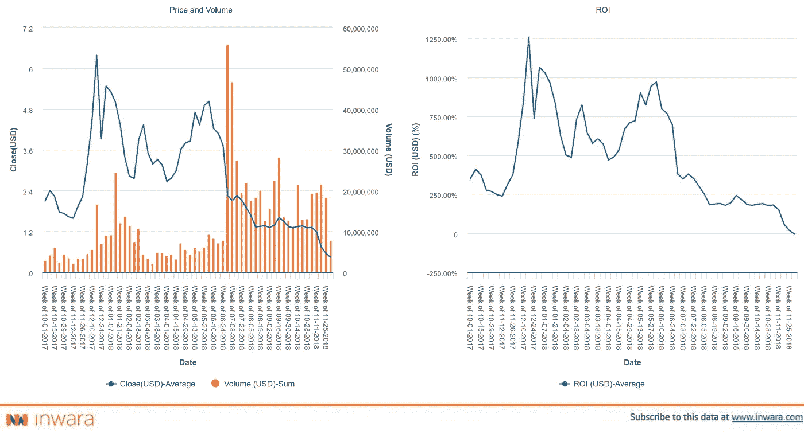
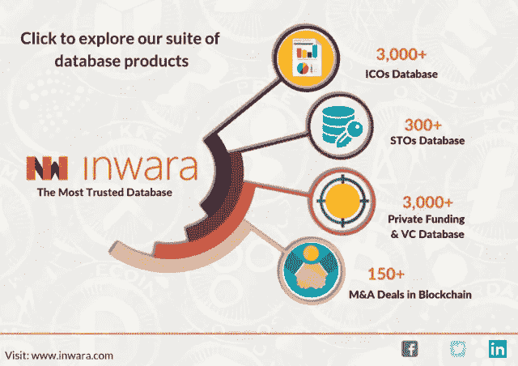

# InWara 对 Tezos 的市值、投资回报率等的见解。

> 原文：<https://medium.com/hackernoon/inwara-insights-on-tezos-complete-analysis-on-price-market-cap-roi-and-other-metrics-efd415a01713>

## Tezos ICO:完成对其过山车旅程的分析，从筹集 2.32 亿美元到看到最大的下跌趋势之一。

Tezos 是 Arthur 和 Kathleen Breitman 的创意，其目标是成为世界上最后一种加密货币(来源: [Tezos 白皮书](https://tezos.com/static/papers/position_paper.pdf))。这个项目的组成部分是链上治理和自我修正，这是比特币近年来面临的一些关键问题。

Tezos 项目通过让利益攸关方参与平台的决策和治理来增强他们的能力。为了进一步简化，利益相关者将有权批准或否决 Tezos 协议中的更改。

由于其用户群无法达成共识，现有的区块链网络很容易出现分叉，Tezos 认为可以通过启动一个分散的自治区块链网络来解决这一问题，该网络采用了利益相关证明协议。

Tezos 声称是唯一一种不会有任何治理问题的现有加密货币。这个项目获得了如此多的关注，因为它筹集的资金超过了创始人预期的 10 倍，当然，有[蒂姆·德雷珀](https://en.wikipedia.org/wiki/Tim_Draper)作为投资者，每个人都认为泰佐斯做得很好。

然而，Tezos 现在被视为最具争议的项目，它的受欢迎程度随着每一起针对它们的集体诉讼而下降！

> 他们似乎哪里出了问题？

Arthur Breitman 在未能通过在美国特拉华州注册的名为[动态总账解决方案](https://www.bloomberg.com/research//stocks/private/snapshot.asp?privcapId=429996999)，Inc. (DLS)的公司从银行和投资者处筹集资金后，决定通过 ICO 筹集资金。然后他在瑞士的楚格创办了一个 Tezos 基金会，而源代码仍然是由美国的 DLS 控制的知识产权。

然而，布莱特曼一家本身并不是这个基金会的一部分，因为瑞士的法律要求基金会及其董事会成员是独立的。于是他们任命[加密谷协会创始人](https://twitter.com/johanngevers?lang=en)Johann ge vers 为董事会负责人。瑞士法规还规定，谁控制了董事会，谁就控制了基金会本身。

> ICO 结束后，疯狂开始了！

这个想法是通过 Tezos 基金会收购 DLS，通过 ICO 成功筹集资金。一切都在按计划进行，直到 Tezos 筹集到比预期多 10 倍的资金。Tezos ICO 筹集了超过 2.3 亿美元的资金，由于它是通过一个由 Gevers 先生负责的基金会筹集的，所有筹集的资金都由 Gevers 先生和董事会的另外两名成员控制。

没过多久，布莱特曼夫妇和盖弗斯先生就产生了意见分歧，他们的关系也受到了影响，这导致了他们最初版本的发布推迟了几个月。

理想情况下，在计划的合并后，该协议计划作为自由软件许可证发布，3 个月后，DLS 的股东(布雷特曼夫妇和蒂姆·德雷珀)应该获得总筹款收益的 8.5%的现金，此外还有泰佐斯基金会发行的 10%的代币。

但是随着 Brietmans 和 Gevers 先生的影响，形势完全改变了，这也影响了期待已久的 Tezos 平台的发布。这些行为确实让投资者感到不安，也引来了很多对 Tezos 项目的批评。

因此，愤怒的投资者对全 DLS 公司、布雷特曼公司和特佐斯基金会提起集体诉讼，指控他们销售未注册证券，歪曲项目路线图，根据州法律虚假广告，并遵循欺骗性的贸易做法。

然而，在经历了所有这些戏剧和发射延迟之后，Tezos 终于在 2018 年 6 月 30 日发布了他们的测试版网络，据说这是项目时间表中的‘拐点’。

## Tezos 是如何运作的？

Tezos 中的 3 个关键层是网络层、事务层和共识层。这些模块化组件通过无缝交换模块使升级变得容易。

Tezos 运行了一个股权证明模型，允许 XTZ 所有者投票决定区块链的方向，因此理论上，没有必要硬分叉区块链。

在 7 月 23 日周一的一份官方公告中，Tezos 自称是“第一个接受普华永道审计的大规模区块链组织”。

瑞士普华永道会计师事务所(PwC)将对 Tezos 的财务和运营进行外部审计。普华永道的这份审计报告有可能修复诉讼造成的损害，所有的猜测都将被搁置。

# 投资回报(ROI)

Source: [InWara’s database](http://www.inwara.com/?utm_source=tezhack&utm_medium=tezhack&utm_campaign=tezhack)

在 2017 年 12 月的第三周，在比特币热潮期间，Tezos 的回报率达到了 1256%，创下了历史新高。然而，到了 2017 年 12 月的最后一周，回报率下降到了 1064%。2018 年，在 2018 年 6 月发布其测试版后，Tezos 以 969%的投资回报率再次达到峰值。然而，自那以后，Tezos 一直处于熊市趋势。

Tezos 仍然是总市值排名前 30 位的 altcoins 之一，价值超过 2.4 亿美元，回报率超过 100%(截至 2018 年 12 月 2 日)。

集体诉讼极大地影响了 Tezos 的市场趋势。当市场明显波动，趋势依赖于新闻时，你最不想受到的就是贬低。

# Tezos 是从 ICOs 迁移到 STOs 的催化剂吗？

Tezos ICO 是一个经典的例子，说明如果你希望在加密领域长期经营，保持市场声誉是多么重要。Tezos 做对的事情很少，但做错的事情很多，这就是为什么它被称为密码界有争议的 ICO。

具有讽刺意味的是，以解决区块链治理问题为目标的加密货币也因同样的原因而崩溃。

像 Tezos 这样的 ico 已经点燃了向 sto 的转变，因为它们在大多数司法管辖区以法规和合规的形式提供基础资产支持，并让项目背后的公司对其投资者负责。

*声明:文章来源于* [*InWara*](http://www.inwara.com/?utm_source=tezhack&utm_medium=tezhack&utm_campaign=tezhack) *。这不是财务建议。InWara 不提升/降级任何公司/ICO。本信息或其他媒体中的观点、陈述、估计和预测仅属于作者个人。它们不一定反映 Inwara 或其任何附属公司(“Inwara”)的意见。Inwara 没有义务更新、修改或修正此消息或其他媒体，或以其他方式通知其接收者，如果此处陈述的任何事项或此处陈述的任何意见、预测、预测或估计发生变化或随后变得不准确。本邮件或其他媒体中提供的任何内容、信息和材料均按“原样”提供。Inwara 对其准确性、完整性或及时性，或收件人获得的结果不做任何明示或暗示的保证，并且不对任何收件人在此的任何不准确、错误或遗漏承担任何责任。在不限制上述规定的情况下，Inwara 对任何消息或媒体的接收方不承担任何责任，无论是在合同、侵权行为(包括疏忽)、担保、法规或其他方面，对于此类接收方因其或任何第三方决定的任何行动、意见、建议、预测、判决或任何其他结论或任何行动过程而遭受的任何损失或损害，无论是否基于此处包含的内容、信息或材料。***