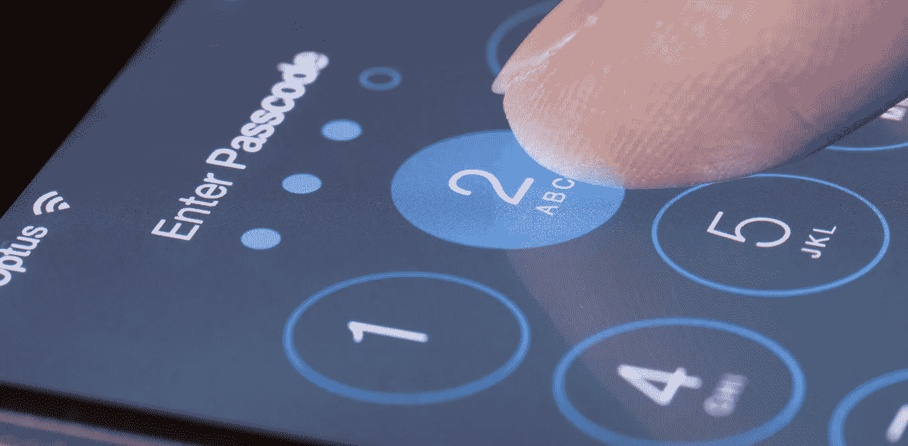

# iOS 11 密码问题

> 原文：<https://medium.com/hackernoon/ios-11-password-problems-a92829df76f4>

人们欣赏苹果解决安全问题的方式。几十年来，该公司一直在构建多层生态系统，以保护其客户的安全，并保护其软件和硬件系统免受大多数在线威胁。苹果产品确实有[一些瑕疵](http://macsecurity.net/)(谁没有？)但总体而言，其移动系统是所有竞争对手中最安全的。

事情已经变了。虽然 iOS 11 给我们带来了很棒的 SOS 功能，并且需要输入密码才能与新电脑建立信任，但它也引入了一些有问题的变化，本文将对此进行描述。

这些变化的最终目标是让用户更容易操作他们的设备，但每个新的小变化都会导致整体安全性的折衷。

综上所述，这些权衡剥夺了曾经安全的生态系统的所有保护层。iOS 11 中唯一剩下的安全层就是密码。如果有人拿到你的 iPhone 并设法找到你的密码，你最终会失去你的 Apple ID、你的数据文件、第三方网络帐户的所有密码，以及使用该 ID 注册的其他 Apple 设备的访问权限。由于苹果在 iOS 11 中取消了所有以前的保护级别，只留下了密码，因此可能会做更多的坏事。

*关键问题:*

*在敏感的环境中，仅保护建筑的前门而不检查所有内部房间是不够的。可悲，但这正是 iOS 的遭遇。如果你有密码，你可以得到其他一切。*

下面，你将会看到如果攻击者可以访问设备和密码，他们可以对用户的数据做什么。

**iTunes 备份密码**

在 iTunes 的帮助下进行的 iPhone 备份可以用密码来保护。随着每个新版本的推出，苹果成功地增加了备份密码的安全性，解决了来自破解密码的骗子的日益增长的威胁。

突然，在 iOS 11 中，苹果允许重置那个极其安全的密码。有了设备和密码，没有必要再打破你的头创造复杂的攻击，你可以只删除备份密码。

在我告诉你为什么它如此重要之前，让我解释一下它是如何实现的。在 iOS 8、9 和 10 中，您可以在 iTunes 中创建密码来保护您的备份。你只需这样做一次，以后在你众多设备上的所有备份都将受到密码保护。

重要的是，此密码属于您的 Apple 设备，而不是电脑或 iTunes。你可以将一部 iPhone 连接到另一台装有 iTunes 新版本和备份的电脑上。该备份将受到您之前设置的备份密码的保护，可能是很久以前。

iOS 控制所有密码更改和删除尝试。首先需要提供您的旧密码。忘记密码的人会继续使用他们的密码，或者将设备重置为出厂设置，从而丢失所有数据。

这确实是一种处理密码的安全方式。但是用户哭了，警察开始哭了，联邦调查局开始抱怨。苹果决定放弃。

**iOS 11 中掠夺备份密码**

虽然你仍然可以去 iTunes 获得一个备份密码，没有原始密码就不能更改，但这一切都没有意义，因为从 iOS 中完全删除备份密码是可能的。

苹果知识库说:

*没有密码，您不能恢复加密的备份。您将不能使用以前的加密备份，但是您可以使用 iTunes 并设置新的备份密码来备份您当前的数据。*

现在，对于骗子来说，从设备中提取敏感信息，他们只需要做一个新的备份。例如，他们可以为新的备份创建临时密码 1234。一旦准备就绪，他们可能会提取用户数据，如信用卡信息，密码，健康数据等。将这些信息转换成可读格式需要一些取证工具，但这些工具在市场上随处可见。

在获得所有这些密码的同时，你很可能偶然发现了谷歌账户密码。有了它，你就可以访问大量的个人数据。如果谷歌账户有多因素认证，你手里的 iPhone(通常)就包括绑定的 SIM 卡。

想象一下，黑客控制了一台装有早期版本 iOS 的 iPhone。这又是一个胜利，因为将 iOS 升级到版本 11 不成问题。是的，iPhone 5 不能运行 iOS 11，但 32 位设备的新旧越狱仍然允许获得完全的物理控制。

同样，这篇文章暗示骗子知道密码。但是，如果你拿了你老板的 iPhone，你可以借助目前常见的许多工具相对容易地暴力破解密码。

综上所述，有了 iPhone 和密码，就有可能获得:

应用数据

本地图像和视频

来自本地钥匙串的密码

只是位于本地备份中的所有内容

这是巨大的吗？等等，这只是乞讨。接下来是更改 Apple ID 密码，禁用 iCloud lock，以及远程锁定或擦除其他用户的设备。

**苹果 ID 密码**

对于我使用的所有其他服务，要更改帐户密码，我需要提供我的旧密码。苹果对此有不同的看法。若要重置 Apple ID 密码(使用设备)，您只需确认设备密码。它适用于多因素认证帐户，但同样最有可能的是，您的设备有必要的 SIM 卡。

继续我们的列表，现在您还可以:

更改 Apple ID 密码

停用 iCloud lock，然后使用不同的帐户重置 iPhone

访问储存在 iCloud 帐户中的所有内容

在地图上查看使用相同帐户注册的其他 I-设备的实际位置，并远程删除或锁定这些 I-设备

更改电话号码，并开始接收多因子代码到您的 SIM 卡

因此，为了重置 Apple 帐户和 iCloud 密码，您需要前往“设置”>“Apple ID”>“密码与安全”>“更改密码”。您现在必须输入密码，然后才能更改 Apple ID 和 iCloud 的密码。就这么简单。

接下来，您可以更改受信任的电话号码。只需添加并确认一个新号码，然后删除旧号码。

**进入 iCloud**

重置受害者的 iCloud 密码并添加您自己的电话号码以接收 2FA 代码后，我们可以访问受害者苹果账户上的所有内容。这些是通话记录、联系人列表、iCloud 钥匙串、用所有其他 I-device 拍摄的照片、iCloud 备份等。ICloud 备份可能包含大量信息，因为苹果允许在一个苹果 ID 上注册的每台设备上保留三个最近的备份。

**同步数据**

此外，iCloud 允许骗子访问所有 i-devices 上同步的信息，如浏览器密码、书签、浏览历史(但不是 [VPN](https://www.bestvpn.com/) 数据)、笔记等。如果用户也有一台 Mac，你可以获取他的桌面文件和文档。

**iCloud 钥匙扣**

为了同步 Safari 密码、支付信息和授权令牌，Apple 使用云服务 cold iCloud 钥匙串。更改 iCloud 密码后，您可以下载所有钥匙串数据。现在你甚至可以看到旧的(原始的)受害者的苹果账户密码。此外，你还可以获得电子邮件账户密码和无线网络密码，实际上还有受害者在浏览器中输入的所有密码。

**底线**

iOS 11 打破了便利性和安全性之间微妙的平衡，向用户便利性方面转移。

如果攻击者窃取了您的 iPhone 并找回了密码，将永远不会有任何额外的保护层来保护您的数据。你会完全暴露。

由于密码是唯一的保护措施，请确保使用所有允许的六位数字。

希望苹果修复这个安全问题。